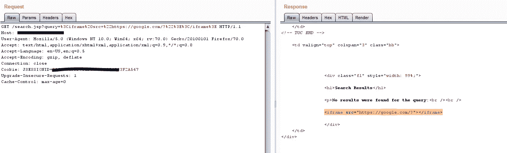
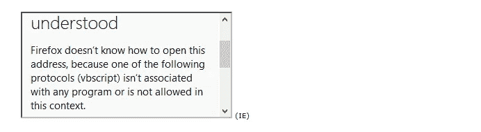

# 当我发现 iframe 注入和非法重定向(基于 dom)时

> 原文：<https://infosecwriteups.com/when-i-found-iframe-injection-and-illegal-redirect-dom-based-cfbbcec21a7?source=collection_archive---------0----------------------->

iFrame 注入是一种非常常见的跨站点脚本(或 XSS)攻击。它由一个或多个插入到页面或帖子内容中的 iFrame 标记组成，通常会下载可执行程序或执行其他危及网站访问者计算机安全的操作。在最好的情况下，谷歌可能会给这个网站贴上“恶意”的标签。最糟糕的情况是网站所有者和访问者最终拥有被恶意软件感染的计算机。

框架注入，当易受攻击的网页上的框架通过用户可控制的输入显示另一个网页时发生。

GET /search.jsp？query = % 3c iframe % 20 src = % 22 https://Google . com/？%22%3E%3C/iframe%3E HTTP/1.1
主机:***。网



```
</iframe><iframe src="vbscript:msgbox(1)"></iframe> (IE)<iframe src="data:text/html,<script>alert(0)</script>"></iframe> (Firefox, Chrome, Safari)
```



```
<iframe src="vbscript:msgbox(1)"></iframe> (IE) <iframe src="javascript:alert(1)"></iframe><iframe src="vbscript:msgbox(1)"></iframe> (IE)<iframe src="data:text/html,<script>alert(0)</script>"></iframe> (Firefox, Chrome, Safari)<iframe src="data:text/html;base64,PHNjcmlwdD5hbGVydCgxKTwvc2NyaXB0Pg=="></iframe> (Firefox, Chrome, Safari)http://target.com/something.jsp?query=<script>eval(location.hash.slice(1))</script>#alert(1)
```

接受用户提供的数据作为 iframe 源 URL 可能会导致在 Visualforce 页面中加载恶意内容。

在以下情况下会出现帧欺骗漏洞:

1.数据通过不可信的来源进入 web 应用程序。

2.数据未经验证就被用作`iframe` URL。

这样，如果攻击者向受害者提供设置为恶意网站的`iframesrc`参数，该帧将呈现恶意网站的内容。

```
<iframe src="http://evildomain.com/">
```

(2)重定向(基于 DOM)

基于 DOM 的开放重定向漏洞。当网页通过用户控制的输入被重定向到另一个域中的另一个 URL 时，发生开放重定向。

网址:https://*******。net/index.htm？url=http://evil.com/？original _ URL/
参数名称:url
参数类型:GET
模式:http://evil.com/？original _ URL/

影响
攻击者可以利用该漏洞将用户重定向到其他恶意网站，这些网站可用于网络钓鱼和类似的攻击。

额外:
在可能的情况下，不要使用用户输入的 URL。如果你确实需要动态 URL，使用白名单。列出有效的、可接受的网址，不接受其他网址。
确保您只接受位于受信任域的 URL。
外部引用。

http 参数可能包含 URL 值，并可能导致 web 应用程序将请求重定向到指定的 URL。通过修改恶意站点的 URL 值，攻击者可以成功发起网络钓鱼诈骗并窃取用户凭据。因为修改后的链接中的服务器名称与原始站点相同，所以网络钓鱼企图看起来更可信。

*关注* [*Infosec 报道*](https://medium.com/bugbountywriteup) *获取更多此类精彩报道。*

[](https://medium.com/bugbountywriteup) [## 信息安全报道

### 收集了世界上最好的黑客的文章，主题从 bug 奖金和 CTF 到 vulnhub…

medium.com](https://medium.com/bugbountywriteup)