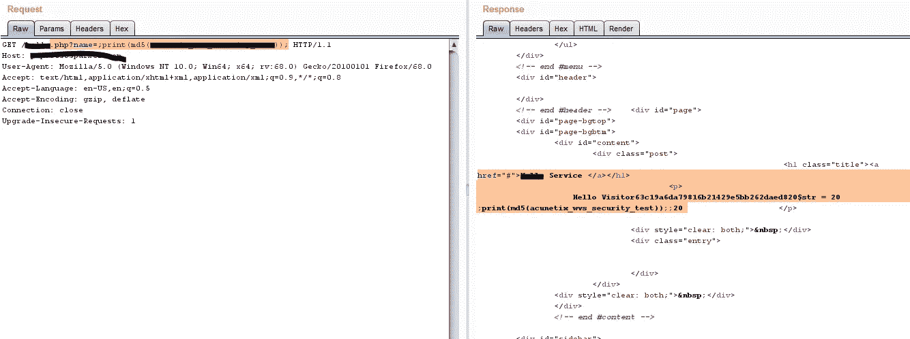

# 当我发现 php 代码注入时

> 原文：<https://infosecwriteups.com/when-i-found-php-code-injection-87e8e30afe59?source=collection_archive---------0----------------------->

大家好，

php php 代码注入是 php 应用中**动态评估漏洞的一部分。**

描述

*   该脚本容易受到 PHP 代码注入的攻击。
*   PHP 代码注入是一个漏洞，允许攻击者将自定义代码注入服务器端脚本引擎。当攻击者可以控制输入 eval()函数调用的全部或部分输入字符串时，就会出现此漏洞。Eval 将参数作为代码执行。

以下易受攻击的代码:

… html 标题…

include (‘$page’);

?>

… html footer …

```
Terminology note: this term is not common, but it is used in CVE.  As
of this writing, there is no commonly used alternative.

An eval injection vulnerability occurs when an attacker can control
all or part of an input string that is fed into an eval() function
call.  Eval will execute the argument as code.  The security
implications for this are obvious.  This issue has been known for
years [2], but it is still under-researched.

Example:

  $myvar = "varname";
  $x = $_GET['arg'];
  eval("\$myvar = \$x;")
```

Lets talk how i found …. ?

i found some php page and they seems like they allow me print something…

xyz.php=print(“msg”)

but …


迈克尔·盖格在 [Unsplash](https://unsplash.com?utm_source=medium&utm_medium=referral) 上的照片

然后我尝试一些不同的函数字符串

那我试试。php？name =；print(MD5(msg))；

我在等待回应和我的收获..

href = " # " > Service
<p>
Hello visitor 63 c 19 a6 da 79816 b 21429 E5 bb 262 daed 820 $ str = 20；print(MD5(msg))；；20



# 哈克曼


由 [vipul uthaiah](https://unsplash.com/@vipul_uthaiah?utm_source=medium&utm_medium=referral) 在 [Unsplash](https://unsplash.com?utm_source=medium&utm_medium=referral) 上拍摄的照片

## 影响

攻击者可以在您的服务器上执行任何 PHP 代码。

## 建议

您的脚本应该适当地净化用户输入。

# 缓解措施:

*   正确的输入变量验证。
*   使用严格符合规范的可接受输入的白名单。
*   执行输入验证时，请考虑所有潜在的相关属性，包括长度、输入类型、可接受值的全部范围、缺少或额外的输入、语法、相关字段的一致性以及对业务规则的遵从性。
*   检查无效字符，并将所有页面文件设置在单独的目录中。
*   使用库调用而不是外部进程来重新创建所需的功能。

*关注* [*Infosec 报道*](https://medium.com/bugbountywriteup) *获取更多此类精彩报道。*

[](https://medium.com/bugbountywriteup) [## 信息安全报道

### 收集了世界上最好的黑客的文章，主题从 bug 奖金和 CTF 到 vulnhub…

medium.com](https://medium.com/bugbountywriteup)