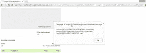

# 当预览变得危险时

> 原文：<https://infosecwriteups.com/when-previewing-becomes-dangerous-bf852558e249?source=collection_archive---------0----------------------->

*注:以下文章发表于 2015 年 11 月 29 日 https://FogMarks.com*

鸣谢:谷歌照片

P
温习淡然。许多网站和服务提供“发布前预览”或“购买前预览”选项。但是有时候预览变成了一件肮脏的事情。就像你将要听到的这个案例一样。

# 特征拉伸

在你通过网络(或通过电子邮件)向其他用户发送发票请求之前，Blinksale.com 提供“发票预览”功能。你在一个简单的小文本框中输入发票信息。当消息被发送时，HTML 和 Javascript 代码被禁止和转义。
在发送发票之前，您可以预览将要发送给客户的信息。点击预览按钮打开一个弹出窗口，显示发票的一个例子。

当我点击“preview”时，我注意到我插入的“Enter”字符被翻译成 GET message body 参数(在 URL 中)上的“
”文本。我把输入改成 没用。那是我开始思考的阶段。

# 有趣的部分

我决定分析请求中的每个 GET 参数，并注意到其中一个参数引用了一个模板 id。
模板 id 用一个漂亮的 css 和一些图片包装消息。它改变输入的背景色、前景色和**字体。然后我想:“嗯，模板决定了输入的字体。也许它也读取输入，并且**上有 XSS 滤波器？。****

我想知道:如果模板 id 是一个不存在的模板怎么办？我把 id 改成一个随机数，再次输入 XSS 的有效载荷，然后**砰！成功了。**

XSS 过滤器是针对每个模板设置的**，这意味着它仅在提供了现有模板 id 时才工作。当我提供一个不存在的模板 id 时——没有 XSS 过滤器，没有漂亮的 css 或图像，但仍然生成了有效载荷，这导致了漂亮的反射 XSS。**

# 结论

只允许请求的某些参数影响输出可能会有风险。时刻注意你使用的任何参数的影响和重要性，即使是最小的参数。

Blinksale 修补了这个问题，并亲自通过电子邮件向我表示感谢。