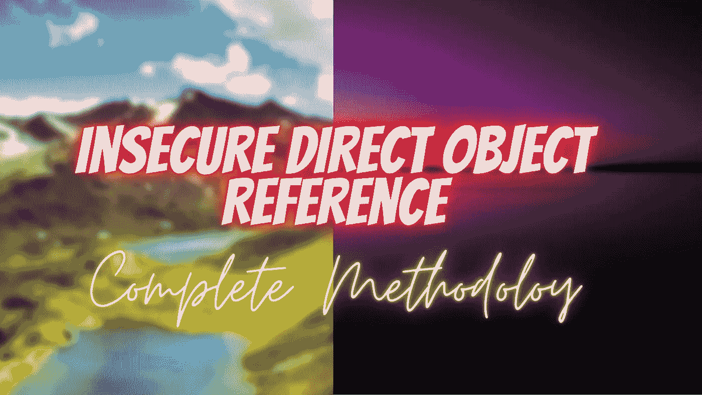
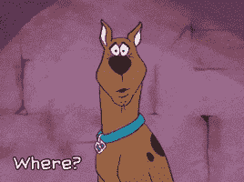

# 你可以在哪里寻找:伊多

> 原文：<https://infosecwriteups.com/where-you-can-lookout-for-idors-644fbed6ee09?source=collection_archive---------0----------------------->

嘿，赛博朋克们，我希望你们都过得很好。既然你在这里，你一定会了解**一个寻找伊多的**的新视角。保持动力，让自己与我的话保持联系&我保证我们会涵盖几乎**你需要知道的关于这个漏洞的一切**。

> **注:**我会尽量让题目简单，尽量用通俗易懂的语言解释。因此，您将能够抓住漏洞的根源，并在您的目标中找到这些漏洞，使它们更加安全，并获得奖金。
> 
> 我将用**的缩写**表示**不安全的直接对象引用**作为 **IDOR** 。

# IDOR 到底是什么？

这是你可以在 Web 应用程序中发现的最简单的错误之一，现在你也在寻找同样的错误。**用外行人的话来说**IDOR 指的是我们无权或无意提及的某个其他对象。你不安全地获取某人数据的过程基本上被称为 **IDOR** 。此漏洞存在的最重要条件是需要两个帐户。

现在你会像:-哈哈😂我们知道 kap！！！只有这样你才能推荐别人的账户。

[道德 kap](https://medium.com/u/b8b1b3ca3831?source=post_page-----644fbed6ee09--------------------------------):好的！好吧！但是我必须照顾每个人。😜

是的！！！！这就是伊多。我不会给你任何正式的定义，因为它在网上随处可见。我希望你理解这个概念，并使它变得更强。

理论到此为止！！！！！！！！让我们直接开始行动吧。😍

让我们举一个简单的例子来更清楚地理解这一点。假设您正在访问任何类似于以下内容的 URL:

这里我注意到了我感兴趣的 uuid 参数。但似乎以某种形式加密了。所以，我试着解密它，我知道它是用 Base64 加密的。所以 uuid 的**值**为 **10002。Booommm！！！！现在，当我试图用其他随机数来操纵 uuid 时。我获得了其他人的个人信息。😍**

> ***我的亲身经历:-*** *我猎杀这个 bug 的时候，和其中一个开发者发生了口角，询问状态。你会惊讶于他是如何修补的😂。他真的只是把纯文本编码成 Base64，然后说我已经修补了漏洞。您会惊讶地发现，许多开发人员仍然认为 Base64 是一种很好的加密算法。但是作为一名黑客，我们知道这就像用我们的小手指开门一样。🤣*
> 
> 注意:-这是最容易的错误之一，也是影响最大的错误之一(甚至是致命的)。视情况而定。这就是为什么他们被认为是初学者的宝石。

# 在哪里寻找伊多？

1.  找到 **ID 的** **参数**。在今天的场景中，大多数 web 应用程序都在使用 **UUID 参数**。它可能包含一些编码值。不要灰心，如果可以的话，寻找解密的方法。
2.  **找到 API 的**。他们是伊多的潜在客户。
3.  **寻找层级**。我的意思是，存在包含不同角色的特定范围，例如管理员、用户、经理、经销商等。它们也给了我们一个寻找伊多的好提示。
4.  **查找 CRUD 功能**。我的意思是，某些应用程序具有创建、读取、更新、删除功能，&对于不同的用户，他们可能有不同的相关角色。试图操纵每一个选项。不要错过这些。**检查每一个端点黑客的我重复检查每一个端点。收到。！！！**
5.  **查找论坛。不要忘记探索你可以利用的每一个选项。而不仅仅是寻找创建、删除、修改等。留意邀请、聊天室、机器人功能、分享按钮等选项。**
6.  **查找 PUT 方法是否启用**？如果是，则检查污染参数。你具体怎么做呢？尽查查看 [**HTTP 参数污染**](/behind-the-scene-http-parameter-pollution-534b4fa2449c) 文章。你可以把这个概念合并到这里，然后找出这个错误。

# 打猎时有什么建议吗？

假设有两个账户。**账户 A** & **账户 b .检查所有****端点**，其中这两个账户相互**链接**。可能是他们的 id、权限、访问级别等。可能是任何东西。**这里的**是指**检查每一个点。**

**休息，全靠你的创意**。我从不认为应该用一些要点来限制一个人。可能还有我没有列出的其他方式，这取决于你。运用逻辑，尝试创新。

所以，这就是这篇文章的内容，希望你喜欢。我会带着另一只漂亮的虫子回来。在那之前，小心点，继续狩猎。 **不断挖掘和学习新东西。😎🤞**

如果你喜欢这些内容，你可以在这里支持我:-**@**[**【buymeacoffee.com/ethicalkaps】**](http://buymeacoffee.com/ethicalkaps)

下一篇文章再见。在那之前珍惜你的生命。和平！❤

> *你可以在*[***Twitter***](https://twitter.com/EthicalKaps)*上关注我，在*[***Spotify***](https://open.spotify.com/show/49AHAyFgIy7E2NDjuGRaMm?si=lVPL_DBGRkGIC8DzfTXNbw)**上收听我的评论，在*[***insta gram***](https://www.instagram.com/iam_kapilchoudhary/)*。**

## *如果你喜欢这个故事，请点击👏想按多少次就按多少次，并分享来帮助其他人找到它！欢迎在下方留言评论。*