# 怀特哈特大奖赛 2018 Quals 报道—第 1 部分

> 原文：<https://infosecwriteups.com/whitehat-grand-prix-2018-quals-writeup-part-1-f299f9126bbb?source=collection_archive---------0----------------------->

世界协调时+2 时间 2018 年 8 月 19 日上午 04 时 46 分

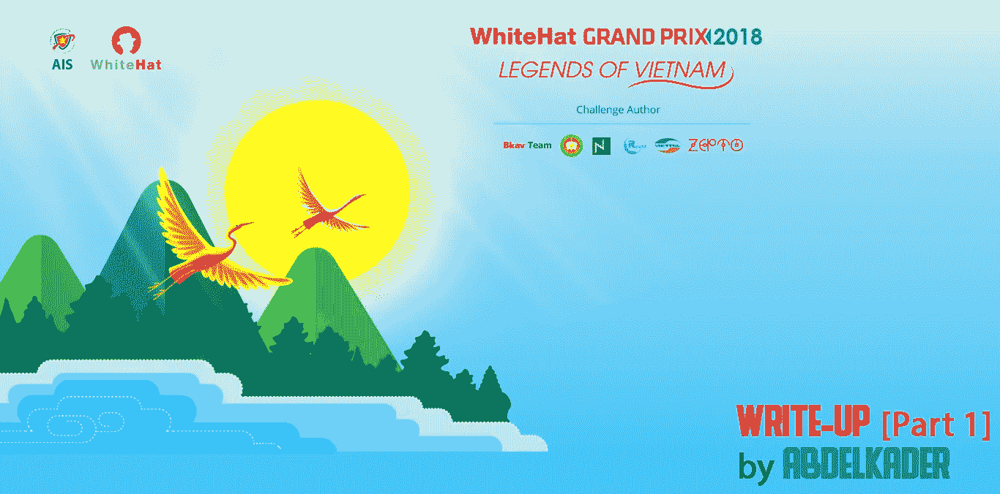

怀特哈特大奖赛 2018 Quals 报道—第 1 部分

我刚刚玩完 CTF 2018 年怀特哈特大奖赛，我非常兴奋地与你分享我解决的任务，一些未解决的任务太接近了，无法解决，但也理解挑战的想法。

我和 [*HackXore*](https://ctftime.org/team/19216) 团队一起玩，一起解决了一系列问题，当然我们一起享受了一些挑战，因为这很有趣。最后我们以 950 分获得了第 24 名。

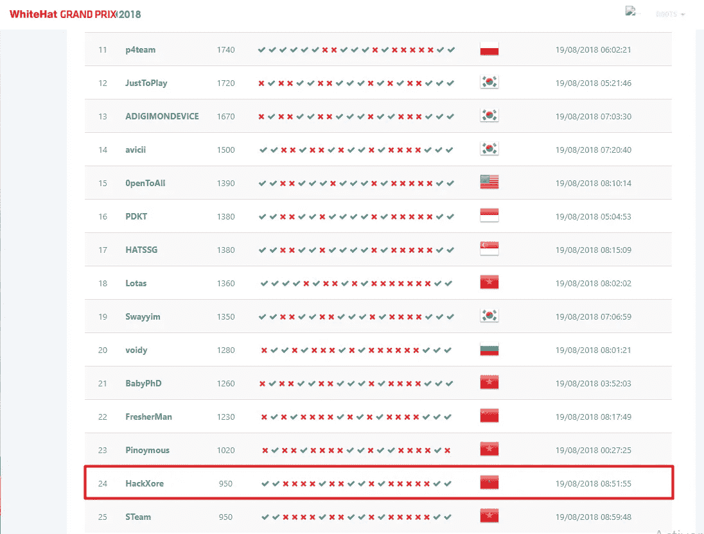

怀特哈特大奖赛 2018 Quals 记分牌

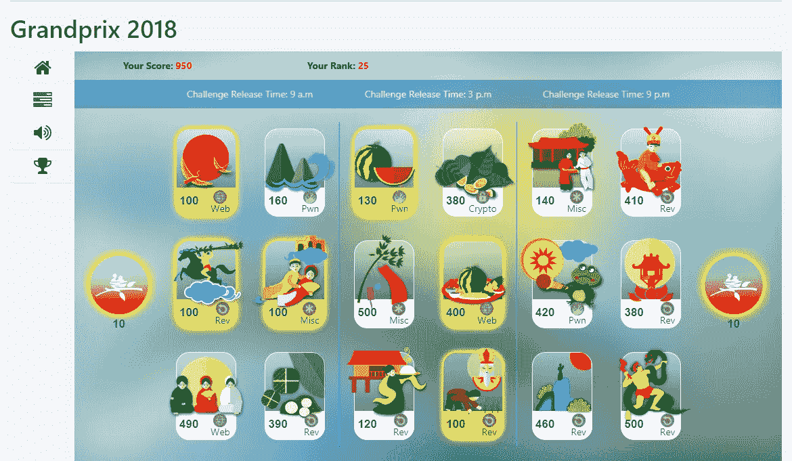

怀特哈特大奖赛 2018 Quals 挑战

# misc02

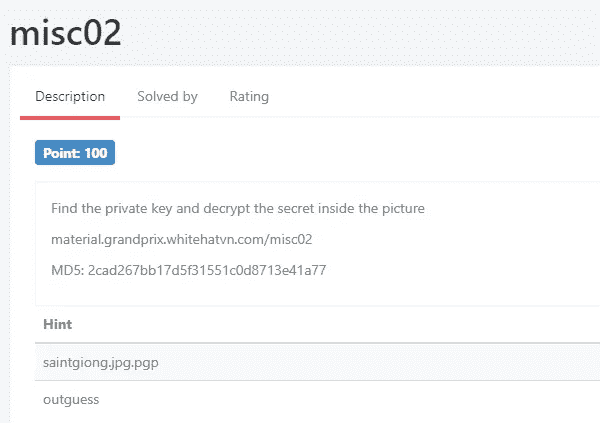

misc02 挑战

> **挑战:**[material.grandprix.whitehatvn.com/misc02](https://github.com/Abdelkad3r/CTF/blob/master/WhiteHat%20Grand%20Prix%202018%20-%20Quals/misc02/challenge/challenge)

这是一个相当酷的挑战，我在所有的提示都被释放后解决了它。这是。iso 档案，试图字符串，然后我先提取它。

challenge 的目标是找到私钥，我们知道私钥的格式，所以我只是将归档文件连接起来以直接获得它，但这很难，因为它太长了，无法找到它，但我能够看到一些证书。

无论如何，我认为我必须提取它和浏览文件，直到找到一些东西。经过长时间的研究，我发现了私钥: [*PRIVATE。ASC*](https://github.com/Abdelkad3r/CTF/blob/master/WhiteHat%20Grand%20Prix%202018%20-%20Quals/misc02/PRIVATE.ASC)

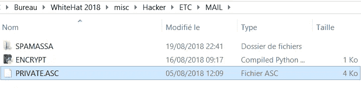

/ETC/MAIL/PRIVATE。美国安全委员会(American Security Council)

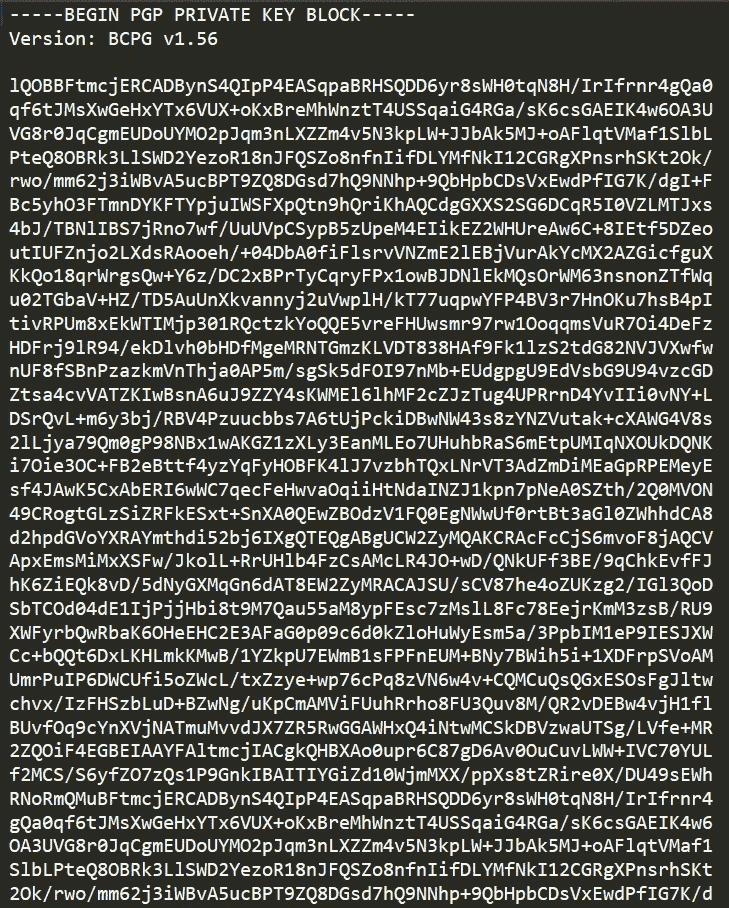

PGP 私钥(私有。ASC)

第一部分完成了，现在让我们解密图片里面的秘密，这意味着我们将解密 PGP，我搜索了一下它的一些小片段，发现了一篇很酷的文章，[其中一篇](https://github.com/ctfs/write-ups-2014/tree/master/defkthon-ctf/recon-250)很有帮助。我刚得到消息，我们需要私钥和密码来解密 PGP。

为了找到 passphrase，我在 Hacker.iso 字符串中搜索，没有找到任何关于 passphrase 的内容，然后我试图再次浏览提取的文件，直到我找到一个有趣的编译 python 脚本。PYC！

这就像一个笑话，我只是错过了这个脚本，当它在同一个文件夹与*私人。发现它很容易，但是我让事情变得很困难，错过了时间😔！*

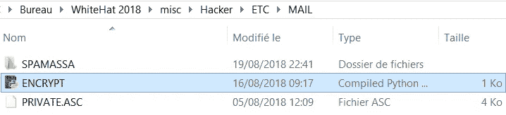

反正我只是反编译 [*加密。PYC* 使用](https://github.com/Abdelkad3r/CTF/blob/master/WhiteHat%20Grand%20Prix%202018%20-%20Quals/misc02/ENCRYPT.PYC)[的](https://github.com/wibiti/uncompyle2)反编译器 2 反编译器:

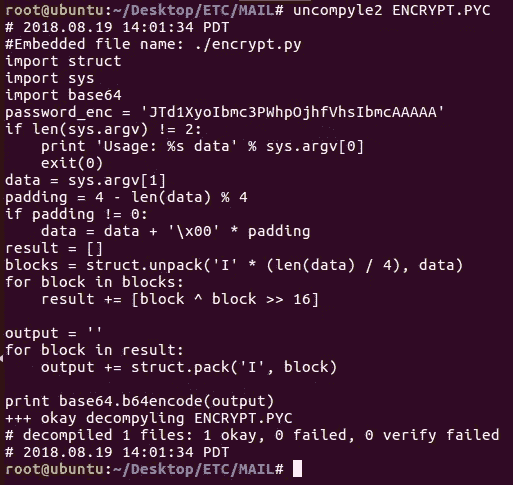

解压缩 2 加密。PYC

有一句有趣的台词:

> **password _ enc = ' jtd 1 xyoibmc 3 pwhpojhfvhsibmcaaaaa '**

似乎这是我们的密码，但加密了。为了解密它，我们必须反转上面显示的反编译脚本。

这里是我的 [*ENCRYPT 的反向版本。PYC*](https://github.com/Abdelkad3r/CTF/blob/master/WhiteHat%20Grand%20Prix%202018%20-%20Quals/misc02/ENCRYPT.PYC) ，取名 [DECRYPT.py](https://github.com/Abdelkad3r/CTF/blob/master/WhiteHat%20Grand%20Prix%202018%20-%20Quals/misc02/DECRYPT.py) :

DECRYPT.py

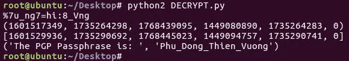

解密. py 的结果

最后，我们解密了密码:

> **pass phrase = " Phu _ Dong _ Thien _ Vuong "**

直到现在，我们有解密 PGP 的所有要求；私钥和密码。所以让我们分步骤解密:

**1。找到加密的 PGP 文件:**

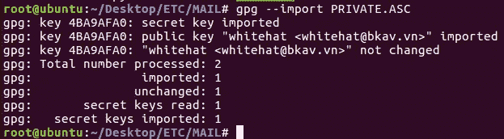

导入私钥

**2。提取加密的 PGP 文件:**

当我试图解决另一个任务(misc03)时，我的队友@f33lm3 给我发了一条消息，告诉我他希望我在这个任务(misc02)中提供帮助，并且他发现了一件有趣的事情，就是关于加密的 PGP 文件存储在***/MAILDIR/CUR/***中来解密它。

这是一个很好的点，开始解决这个任务，直到到达这一步，他的进展帮助我找到加密的 PGP 文件。

在我阅读了 Hacker.iso 的字符串和其他。我刚刚注意到这段对话的消息是通过 Mozilla [Thunderbird](https://www.thunderbird.net/fr/) 发送的，加密的 PGP 文件是:

> [/MAILDIR/CUR/15334499。COM](https://github.com/Abdelkad3r/CTF/blob/master/WhiteHat%20Grand%20Prix%202018%20-%20Quals/misc02/15334499.COM)

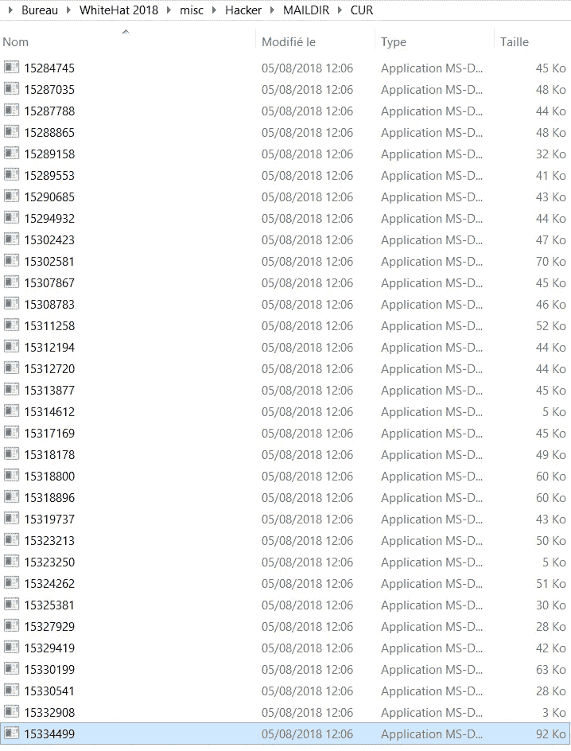

让我们通过 Mozilla Thunderbird 打开它，然后提取它:

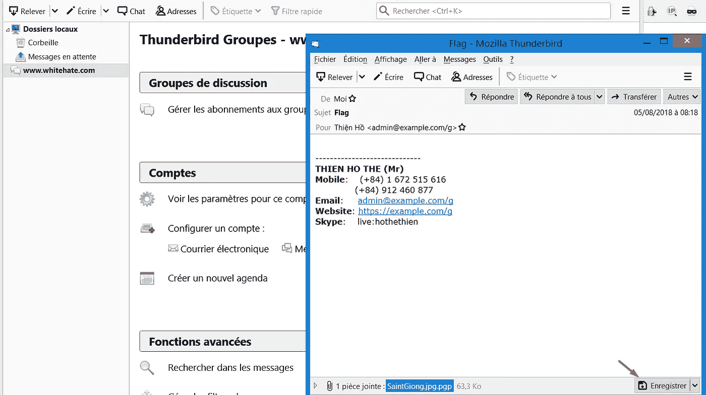

Mozilla 雷鸟

这是加密的 PGP 文件:

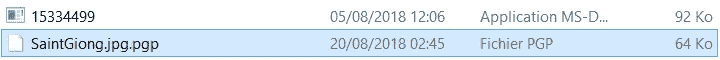

加密的 PGP 文件(SaintGiong.jpg.pgp)

**3。解密加密的 PGP 文件(SaintGiong.jpg.pgp):**

我们用导入的私钥( *PRIVATE)来解密吧。ASC* )和密码短语:

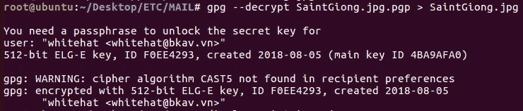

加密的 PGP 文件(SaintGiong.jpg.pgp)的解密

而这里是这次解密的结果:[*SaintGiong.jpg*](https://github.com/Abdelkad3r/CTF/blob/master/WhiteHat%20Grand%20Prix%202018%20-%20Quals/misc02/SaintGiong.jpg)

嗯，我看到组织者在第二个提示中提到了[*out guess*](http://manpages.ubuntu.com/manpages/xenial/man1/outguess.1.html)*(S*teganographic tool，可用于隐藏或检索图像中的文本)。刚刚安装它，并检索隐藏的文字从*SaintGiong.jpg*图像。

要安装它，您必须键入以下命令:

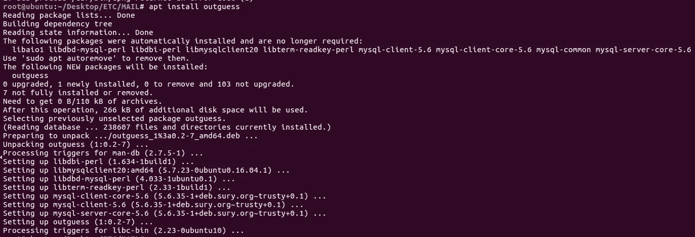

安装猜测工具

从*SaintGiong.jpg*中检索隐藏消息:

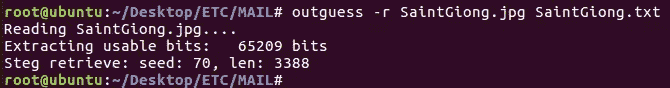

从 SaintGiong.jpg 那里找回隐藏的信息

下面是检索到的消息:[*saint giong . txt*](https://github.com/Abdelkad3r/CTF/blob/master/WhiteHat%20Grand%20Prix%202018%20-%20Quals/misc02/SaintGiong.txt)

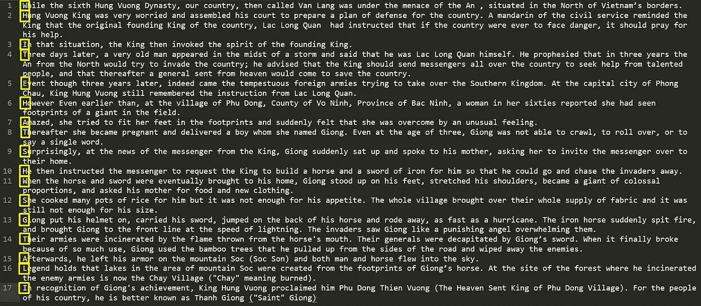

并且通过看每个段落的第一个字母会收集到这个单词:

> **怀特哈什瓦格塔利**

有 WHITEHAT 关键字；看起来像旗子！

而且我们知道旗帜的格式是:**怀特哈特{sha1}**

所以，我们把它散列成 sha1，做正确的标志！

> 标志为:**怀特哈特{ 05cc 532353023d 5954 da 9507 e 189 a 55296 F6 db 97 }**

这是一个有趣的任务在这个 CTF，我花了很长时间来解决它。这是我的文章的第一部分，其他部分将很快出现。

我要感谢 [BTeam](https://ctftime.org/team/16789) ，Nightstorm， [PSA](https://ctftime.org/team/25642) ， [ReUTD](https://ctftime.org/team/11755) ， [Viettel](https://ctftime.org/team/31555) ， [Zepto](https://ctftime.org/team/47704) 是他们创造了这个比赛，并做出了如此好的挑战。