# 怀特哈特大奖赛 2018 年质量报告-第 2 部分

> 原文：<https://infosecwriteups.com/whitehat-grand-prix-2018-quals-writeup-part-2-4da3c66526cc?source=collection_archive---------0----------------------->

世界协调时+2 时间 2018 年 8 月 23 日下午 14:34

怀特哈特大奖赛 2018 年质量报告-第 2 部分

在这个故事中，我将讲述我是如何在怀特哈特大奖赛 CTF 站解决我的第一个任务的。虽然我花了很长时间去分析和理解它，但这是一个简单的任务。

基于动态评分，因为来不及解出，我最后才得了 100 分。

# re01

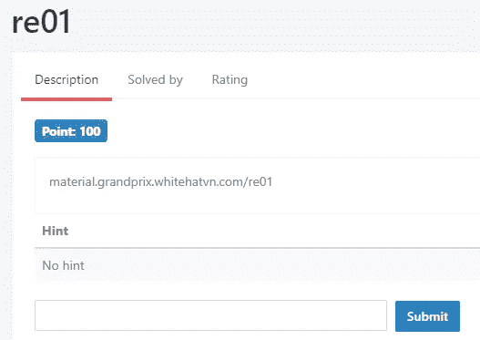

re01 挑战赛

> **挑战:**【material.grandprix.whitehatvn.com/re01】T2

这是逆向工程的挑战；为了找到隐藏的标志，我们必须反转二进制:

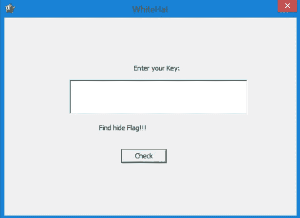

WhiteHat.exe

二进制文件是 win32 GUI (PE ),其中有许多二进制文件；让我们使用[资源提取](https://www.nirsoft.net/utils/resources_extract.html)来提取它们:

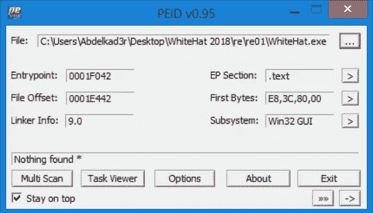

PEiD—WhiteHat.exe

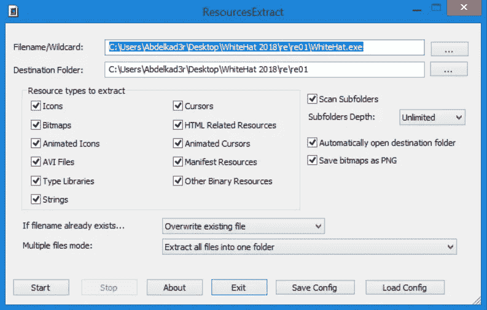

资源提取—WhiteHat.exe

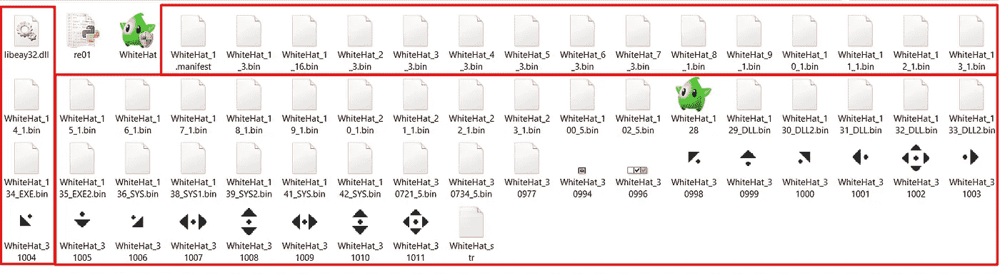

从 WhiteHat.exe 提取的文件

经过长时间使用 ida pro 分析，似乎主要功能是 [*sub_40111D*](https://github.com/Abdelkad3r/CTF/blob/master/WhiteHat%20Grand%20Prix%202018%20-%20Quals/re01/sub_40111D.c) :

[*sub _ 40111d*](https://github.com/Abdelkad3r/CTF/blob/master/WhiteHat%20Grand%20Prix%202018%20-%20Quals/re01/sub_40111D.c)*。c*

有两个有趣的文件，b.dll 和 There，加载并保存到 There 的第一个 SYS 资源。第二个系统资源已加载并存储到 b.dll 中。然后在最后一步，2.exe 被处决了。

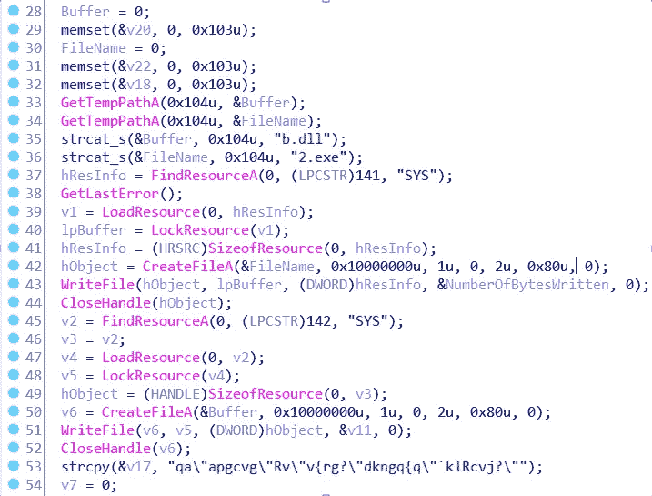

IDA Pro 中[*sub _ 40111d*](https://github.com/Abdelkad3r/CTF/blob/master/WhiteHat%20Grand%20Prix%202018%20-%20Quals/re01/sub_40111D.c)*功能的一部分*

那么在这两个过程中都有一个 XOR 运算:

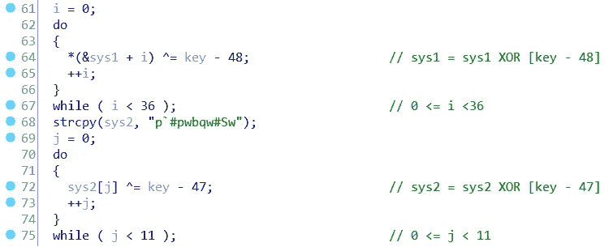

因此，我们在这里的目标是找到隐藏的标志，它将在文件和密钥之间的 xor 结果中，文件是 SYS 资源，而密钥是一个未知的字节。我们从给定的二进制文件中提取了系统资源:

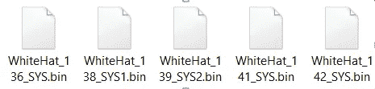

系统资源文件

现在，让我们找到用于对系统资源进行 XOR 运算的确切密钥，我们必须知道字节的范围(可能性),以使用该范围的值对系统资源进行强制 XOR 运算。

> (1) => *(&sys1 + i) ^=键—48；用 0 <= i < 36
> 
> So: key = i + 48 then: 48 <= key < 84
> 
> (2) => sys2[j] ^=键—47；其中 0 <= j < 11
> 
> 所以:key = i + 47 那么:47 <= key < 58
> 
> *** *** *** *** *** *** *** *** *** *** *** ***
> 
> 从(1)和(2)我们得到:
> 
> 48 <=键< 58

让我们使用这个范围来强制执行 xor 密钥，并用这个密钥对系统资源进行 XOR 运算:

re01.py

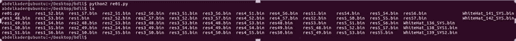

re01.py 输出(结果)

让我们把这些文件归档:

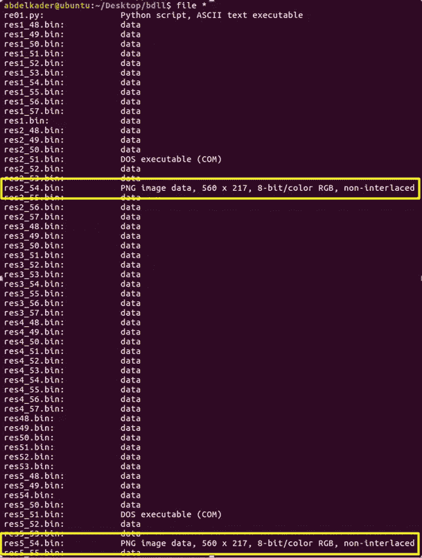

文件*

如您所见，有两个有趣的 PNG 文件:

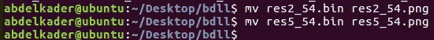

PNG 文件

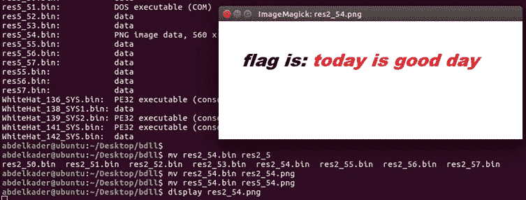

显示 res2_54.png(第一个 png 文件)

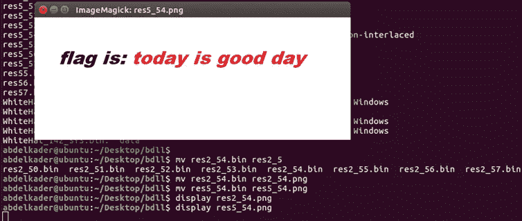

显示 res5_54.png(第二个 png 文件)

[res2_54.png](https://github.com/Abdelkad3r/CTF/blob/master/WhiteHat%20Grand%20Prix%202018%20-%20Quals/re01/res2_54.png) 和[res5 _ 54 . png](https://github.com/Abdelkad3r/CTF/blob/master/WhiteHat%20Grand%20Prix%202018%20-%20Quals/re01/res5_54.png)；key 和 SYS 文件之间 xor 运算的两个结果，SYS 文件是我们的 SYS 文件列表中的第[第 2](https://github.com/Abdelkad3r/CTF/blob/master/WhiteHat%20Grand%20Prix%202018%20-%20Quals/re01/WhiteHat_138_SYS1.bin)和第[第 5](https://github.com/Abdelkad3r/CTF/blob/master/WhiteHat%20Grand%20Prix%202018%20-%20Quals/re01/WhiteHat_30721_5.bin)个文件:

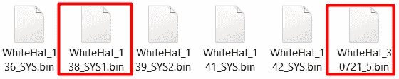

系统资源文件，该文件在与键异或后给出 PNG 文件

> **旗是:今天是好日子**

让我们制作正确的提交标志: **WhiteHat{sha1(flag)}**

> 标志为:**怀特哈特{ 9e 9453 a 6 ad 4 c 8 c 31 c 599 C4 a 4233027 b 6d 43 CDA 17 }**

这个挑战是一个很好的逆向工程挑战，展示了我们如何使用 XOR 隐藏文件。查看我的最后一篇文章 [**怀特哈特大奖赛 2018 Quals Writeup —第 1 部分**](https://medium.com/@Abdelkad3r/whitehat-grand-prix-2018-quals-writeup-part-1-f299f9126bbb) 并享受阅读。