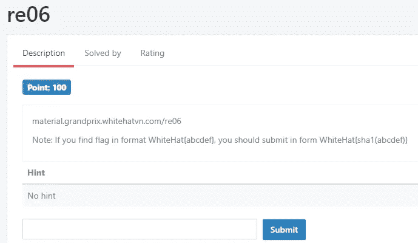
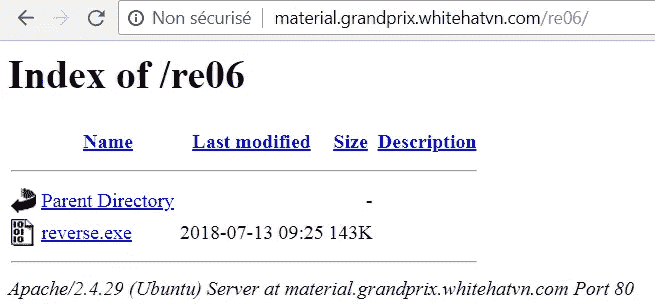
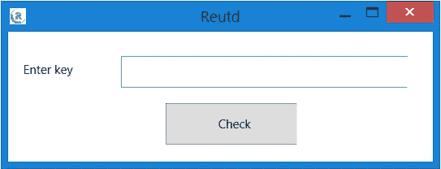
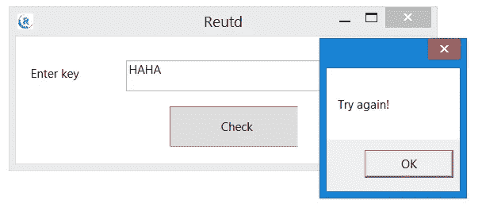
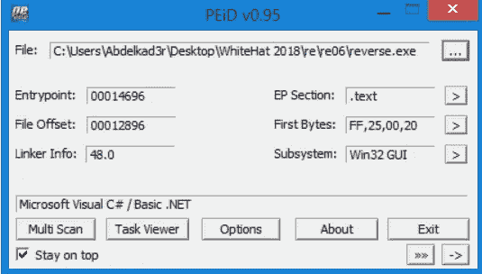
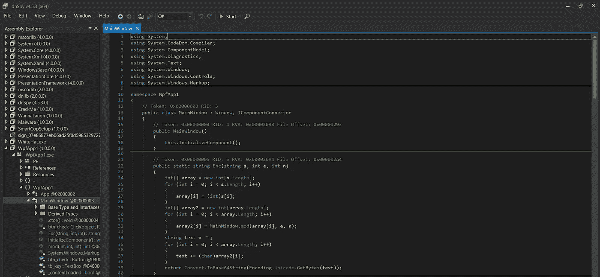
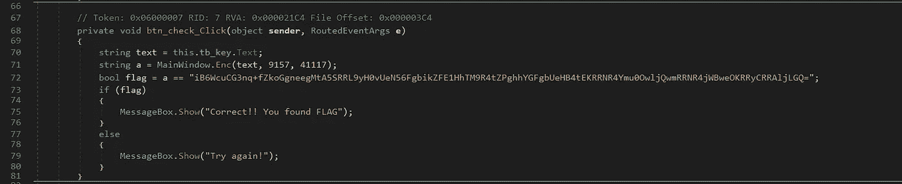
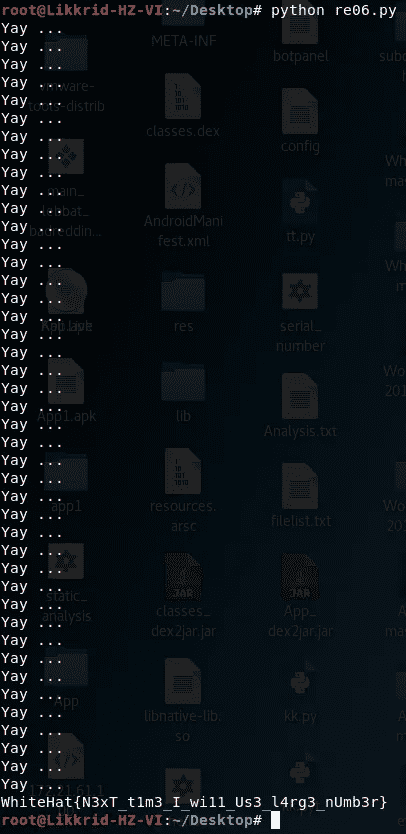
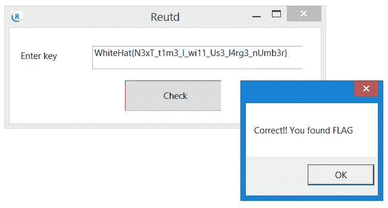

# 怀特哈特大奖赛 2018 年质量报告-第 3 部分

> 原文：<https://infosecwriteups.com/whitehat-grand-prix-2018-quals-writeup-part-3-54a500ddda0e?source=collection_archive---------0----------------------->

世界协调时+2 时间 2018 年 8 月 27 日下午 13:14

怀特哈特大奖赛 2018 年质量报告-第 3 部分

这是一个很好的反向挑战，只是我们必须在理解加密函数的工作原理后反向它。

# re06

re06 挑战赛

re06 文件(reverse.exe)

> **挑战:**【material.grandprix.whitehatvn.com/re06/】T2

这是 win32 GUI(。Net)二进制，我们用 [**来读取分析一下吧。净反射器**](https://www.red-gate.com/products/dotnet-development/reflector/index) 或 [**DNSpy**](https://github.com/0xd4d/dnSpy/releases) :

reverse.exe 接口

reverse.exe 接口(错误的键)

PEiD(reverse.exe)

## 反编译:

DNSpy(主窗口—reverse.exe)

这里是 [*主窗口*](https://github.com/Abdelkad3r/CTF/blob/master/WhiteHat%20Grand%20Prix%202018%20-%20Quals/re06/MainWindow.cs) :

如你所见，我用 [**DNSpy**](https://github.com/0xd4d/dnSpy/releases) 反编译了二进制，找到了 main 函数(MainWindow)。

## 分析:

btn _ 检查 _ 点击

我们的输入使用 [*Enc*](https://github.com/Abdelkad3r/CTF/blob/master/WhiteHat%20Grand%20Prix%202018%20-%20Quals/re06/Enc.cs) 函数加密，带 3 个自变量 **(text，e，n)** 带 **text** 和 **e = 9157** 和 **n = 41117** 。然后是检查条件，检查加密输入**(标志)**是否正确。

如您在[中看到的 *Enc* 中的](https://github.com/Abdelkad3r/CTF/blob/master/WhiteHat%20Grand%20Prix%202018%20-%20Quals/re06/Enc.cs)功能；文本中的每个字母都有迭代，并通过具有 3 个参数(m，e，n)的 [*mod*](https://github.com/Abdelkad3r/CTF/blob/master/WhiteHat%20Grand%20Prix%202018%20-%20Quals/re06/mod.cs) 函数传递，该函数计算幂，然后给我们加密文本 **c** :

> **pow(m，e，n) = c**

而且看起来是这样的 [**RSA 加密**](https://en.wikipedia.org/wiki/RSA_(cryptosystem)) *的每个字母*由使用 [*Enc*](https://github.com/Abdelkad3r/CTF/blob/master/WhiteHat%20Grand%20Prix%202018%20-%20Quals/re06/Enc.cs) 函数。

> m: text = >消息(text = FLAG =？？？？？？？？？？？？？？？？？？？？？？？？？？？？？？？？？？)
> 
> **e: 9157 = >公共指数**
> 
> **n: 41117 = >模数**
> 
> **c: flag = >加密文本**
> 
> **d:？？？？= >私人指数**

## 解密:

为了解密，我们必须找到**私钥(d，n)** 。我们有 **n** 和 **e** ，这意味着我们有**公钥(e，n)** 。因此，让我们计算 **d** 以便找到私钥，然后解密 **c** 。

第一次，我试图将[****n****](http://www.factordb.com/index.php?query=41117)**因式分解，但我做不到，后来又试图强行分解 **d** ，但很难。**

**于是，我用 [*mod*](https://github.com/Abdelkad3r/CTF/blob/master/WhiteHat%20Grand%20Prix%202018%20-%20Quals/re06/mod.cs) 函数生成 **num2** 并反转 [*enc*](https://github.com/Abdelkad3r/CTF/blob/master/WhiteHat%20Grand%20Prix%202018%20-%20Quals/re06/Enc.cs) 函数，在 **mod(m，e，n) = num2** 时通过暴力破解 **c** 。但是我在很长时间后找到了这个解决方案… 0ops！！！😔**

**下面是我的[脚本](https://github.com/Abdelkad3r/CTF/blob/master/WhiteHat%20Grand%20Prix%202018%20-%20Quals/re06/re06.py)解密 **c** :**

****

**re06.py 输出(结果)**

**输出:**怀特哈特{ N3xT _ t1 m3 _ I _ wi11 _ Us3 _ l4rg 3 _ nUmb3r }****

**让我们来试试:**

****

**reverse.exe 接口(正确的键)**

**SHA1 把它做成正确的旗帜。**

> **标志是:**怀特哈特{ be 1 f 21d 22 D6 ca 5854 be 238772 C7 AC 594 EAD C5 ab 0 }****

**这是一个很好的挑战，但我讨厌用*加密*反转部分来制造好的*解密*函数，因为我浪费了很长时间寻找 **d** 并试图用 **RSA** 直接解密，这似乎是不可能的，但我仍然在想，有一些方法可以让我们通过直接使用 RSA 来解决这个挑战。**

**如果你有兴趣阅读更多关于这篇文章的内容，请查看 [**第一部分**](https://medium.com/bugbountywriteup/whitehat-grand-prix-2018-quals-writeup-part-1-f299f9126bbb) 和 [**第二部分**](https://medium.com/bugbountywriteup/whitehat-grand-prix-2018-quals-writeup-part-2-4da3c66526cc) 。**