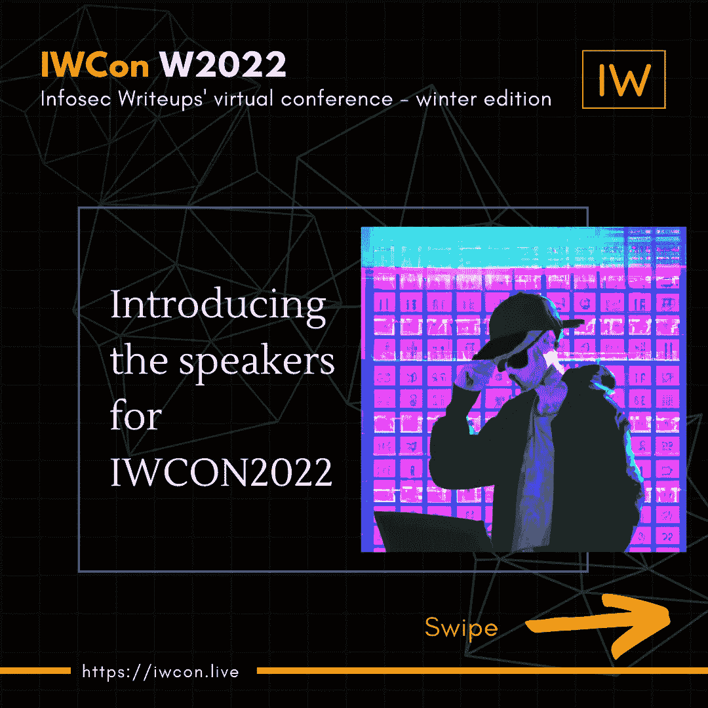

# 在 IWCON2022 上你会向谁学习？

> 原文：<https://infosecwriteups.com/who-will-you-learn-from-at-iwcon2022-451c238822cc?source=collection_archive---------5----------------------->

## 看看众星云集的演讲者阵容，期待已久的网络安全会议。

你好黑客

我们很高兴分享由 InfoSec WriteUps Publication 组织的虚拟网络安全会议和网络活动 [**IWCON2022**](https://iwcon.live/) 的超值演讲阵容。

有很棒的演讲者，比如-

1.  [**加布里埃尔·亨佩尔**](https://www.linkedin.com/in/ACoAAAzkH3YBQ5ZAEIs8A-3y7-JVmKD1RCPFfkE) 谈“云环境中的威胁追踪”🌩️
2.  卢克·史蒂芬斯 “我如何使用侦查技术来识别一个多产的骗子。”👊
3.  [**Inti De Ceukelaire**](https://www.linkedin.com/in/ACoAAAt-ZUoBBCX0J4-Pl7WCcOvl4ME74Y4rCRg)**关于“读取 RFC 进行黑客攻击”🔥**
4.  **[**菲利普·怀利**](https://www.linkedin.com/in/ACoAAAC83qsBY7Bg0BcjiVQUYHj6TbW_8CYqd1s) 谈“通过外部攻击实现 API 安全表面管理”😍**
5.  **[**Dhiyaneshwaran b .**](https://www.linkedin.com/in/ACoAACBIe_0BL8bJJu9xFIlcnBaZrmLaWFq1P0g)论《黑客云:为了乐趣和利益》😁**
6.  **[**Ahsan Khan**](https://www.linkedin.com/in/ACoAACJtp7UBxCZMZhHrf0cCx0EJGIoyWZzyL1s) 关于“我访问管理面板的方法”💪**
7.  **Florian Hansemann 🔥🔥**
8.  ****Blake McDermott** 谈“IIS 模块的好、坏、丑”👊**
9.  ****John O.** 关于“大规模影响安全性”💪🏻**
10.  ****Mohammed Diaa** (工作流主管， [Trickest](https://www.linkedin.com/company/trickest/) )关于“方法与疯狂——开发灵活的自动化工作流。”🔥**
11.  **[**沙尚克**。](https://www.linkedin.com/in/ACoAABT0gDUBq047uyzov2eicn0gC5wrb5b5kes)(首席执行官， [CredShields](https://www.linkedin.com/company/credshields/) )关于“智能合同安全入门”🤩**
12.  **[**Jonathan Leitschuh**](https://www.linkedin.com/in/ACoAAA0SLMUBScBUspIv0-LQ1ecAwsqt5l81eG4)**关于“缩放安全研究员以一劳永逸地消除 OSS 漏洞”😍****
13.  ****[**Youssef Sammouda**](https://www.linkedin.com/in/ACoAADNRVM4BNawdtQP-EPsUA0mHHY8doD_gfFk)**论“以 OAuth 和 javascript 为特征的账户劫持”🤩******
14.  ******[**Majd Aldeen Atiyat**](https://www.linkedin.com/in/ACoAAAS6JjEBZNAdQqkzkm3z9bzlo7chYAhqYPg)(又名 Th3G3nt3lman)谈“我在 bug bounty &的旅程中的独特发现”******
15.  ****[**Orwa Atiyat**](https://www.linkedin.com/in/ACoAAC5koR0B7lTV3JSlKCfwG4XmaDAzoVf20Ds) 关于“侦查技巧和提示”🙌****
16.  ******关于“研究者的工具箱”🔥******

******[**查看全部演讲者阵容，并预订您今天的座位**](https://iwcon.live/)(12 月 17 日至 18 日，IST 时间下午 6 点起现场直播)。******

****在评论中标记信息安全爱好者、漏洞赏金猎人和网络安全研究人员/专业人士。****

****很多爱，****

****编辑团队，
Infosec 报道****