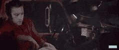

# 谁在那个 Whatsapp 后面！

> 原文：<https://infosecwriteups.com/whos-behind-that-whatsapp-8e34b7b8a536?source=collection_archive---------0----------------------->

H **你们有没有人遇到过可疑的情况，除了他们在你面前描绘的虚拟人格，你对这个人一无所知**？在这篇文章中，我将尝试通过 WhatsApp 找到一个人的下落，以及任何人如何揭示隐藏在“虚拟媒体”下的人。

# 本文分为四个部分:

1.  发生了什么
2.  准备战斗

*   找到静香的位置
*   找到她大学的名字
*   检查她的 Whatsapp DP

3.我们学到了什么

*4。第二部*一瞥

# 发生了什么事？

这一切都是从我参加完一个技术研讨会回来，收到一个女孩发来的 whats app 信息开始的。她说，她是研讨会的组织者之一，需要同样的反馈。我愉快地回答了她所有的问题。当她问我的兴趣和个人生活时，事情开始变得可疑，比如关系状况等等。我在网上搜索了她的所有信息，寻找她的数字足迹(比如 insta、FB、Linkedin)，但哪里都找不到她。我问了另一个组织者关于她的情况，他们说队里没有这个号码或名字的人。

现在，我知道有人想惹我。我有两个选择，要么阻止她继续前进，要么用黑客的方式找出幕后黑手。众所周知，现在是隔离时间，我们一整天都没什么事可做。所以我决定并开始对她进行社会改造。为了记录，让我们把她命名为**静香。**

# 战斗准备

> 让我们穿上帽衫，调暗灯光，找出这一切的幕后黑手。

第一步:我们聊了两天，以获得一些信任。我们都有很多时间可以浪费。😂

第二步:记下给她的每一个详细信息(比如我的名字、学院、地点和工作)

# 战斗开始了

有一点要注意，我只会执行被动侦察(没有黑客)。

# 1.找到静香的位置

我问她对什么感兴趣，其中之一是 java。所以我开始通过截图问她一些简单的问题。

**武器一**:有一个网站[**【https://iplogger.org/】**](https://iplogger.org/)**给你提供一个图片网址，可以粘贴在任何论坛的帖子里，只要有人看到那个帖子，他/她的 IP 就会被登录到网站的数据库里，以后可以查看。**

**我做了同样的事情，我拿了一个不太被访问的 [hackerank 的](https://www.hackerrank.com/)论坛页面，把图片贴在评论区，然后把链接发给静香，请她解决这个问题。**

****

**我得到了什么:IP 地址，**位置**，她的手机信息，以及她访问该网站的时间。**

# **2.找到静香的大学**

**她分享了一些她的自助餐厅和宠物的随机图片，这些图片不能用于任何事情，因为它们被压缩了，并且它们的位置标记(EXEF 数据)被删除了，所以我让她在 Whatsapp 上发送一张图片作为**文档**。**

****武器 2**:https://www.pic2map.com/有一个网站**给你那张图片被点击的位置。****

****所以，有了这个，我知道了她大学的名字。我陷得更深(*她就是这么说的*🤣)并下载了学院的时间表(“TT”)，问她今天学了哪些科目。****

********

****正如所料，他们和 TT 中提到的不一样，所以她在大学的问题上撒谎了。****

# ****3.检查她的 Whatsapp DP****

****她曾经像其他女孩一样每天更新她的 Whatsapp 照片😅。她公然撒谎，这让我觉得她是否在使用自己的 Whatsapp DP。她可能在用 Instagram 上某人的照片。现在，是时候为这项任务准备另一件**武器**了。****

****有两种方法可以做到这一点，一种更简单，用户友好，但效率较低，另一种有点技术含量，需要 Linux。我将向你简要介绍这两者。😎****

******更简单的**:这是一些获取图像和输入，并将其来源作为输出的网站。****

1.  ****[https://images.google.com/](https://images.google.com/)(有一个按图片搜索的选项见)****
2.  ****[https://www.prepostseo.com/reverse-image-search](https://www.prepostseo.com/reverse-image-search)****
3.  ****[https://www.labnol.org/reverse/](https://www.labnol.org/reverse/)****
4.  ****[https://tineye.com/](https://tineye.com/)****

****你可以上传某人的照片，它会在除社交媒体平台以外的任何地方搜索，但会尝试搜索熟悉的面孔。****

******更难**:这个工具可以搜索 Instagram(不是私人账户)、Youtube、脸书和 Twitter 寻找这个人。它只需要一张图片和人名。是不是很棒？但这是有代价的，你需要在机器上设置它，并给一些时间来搜索。****

****[https://github.com/ThoughtfulDev/EagleEye](https://github.com/ThoughtfulDev/EagleEye)****

****这是工具链接，所有的设置说明和使用方法都在链接里。所以我就拿了 whats app DP 和 name。我得到了一个黑幕 [**Blogspot**](https://www.google.com/search?newwindow=1&ei=ftG-XvXYOdffz7sP9bCjuA4&q=site%3A*blogspot.com&oq=site%3A*blogspot.com&gs_lcp=CgZwc3ktYWIQAzoECAAQDToHCAAQChCRAjoFCAAQgwE6AggAOgUIABCRAjoHCAAQRhD_AToECAAQClDpPVjEZ2D2aGgAcAB4AIABngKIAZobkgEGMC4xMi42mAEAoAEBqgEHZ3dzLXdpeg&sclient=psy-ab&ved=0ahUKEwj1j53BsrbpAhXX73MBHXXYCOcQ4dUDCAw&uact=5) **网站**的链接，里面有一些她用过的图片。网站所有者有一个 Instagram 账户。****

# ****我们学到了什么****

*   ****论坛在侦查中非常有用。****
*   ****图像可以说很多。****
*   ****如果您想使用某人的图像，请从私人帐户获取😎。****

# ****第二部分一瞥****

*   ****[**********](https://www.youtube.com/watch?v=ZHdPuF7TvtY) 工具给你这个人的电子邮件，这个邮件可以在**里搜索到它的主人****

****第一部分到此结束。****

*****感谢阅读！如果你喜欢这个故事，请点击**👏 ***按钮，分享*** *它帮助别人！欢迎随时发表评论*💬*下图。有反馈？******

# *****鳍！*****