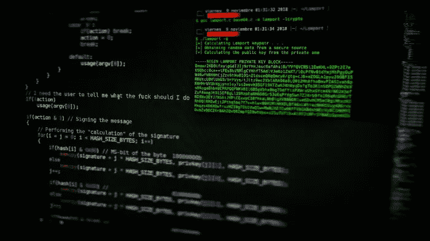
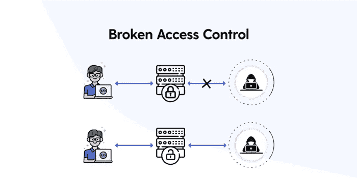
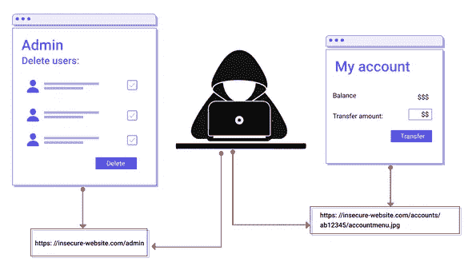

# 为什么破坏访问控制是最严重的漏洞

> 原文：<https://infosecwriteups.com/why-broken-access-control-is-the-most-severe-vulnerability-2223baf9bb48?source=collection_archive---------0----------------------->



[目标](https://unsplash.com/@arget?utm_source=unsplash&utm_medium=referral&utm_content=creditCopyText)在[上不飞溅](https://unsplash.com/@arget?utm_source=unsplash&utm_medium=referral&utm_content=creditCopyText)

# 介绍

想象一下，你的朋友鲍勃创建了一个网站，你和爱丽丝出于对朋友的爱和关心，在网站上创建了一个账户。该网站实现了基于角色的功能，这意味着 Bob 是管理员，可以添加、删除、修改产品和删除恶意用户。另一方面，您和 Alice 有一个用户角色，只能查看产品并将它们添加到您的购物车以便进一步结帐。

但是，在修补 web 应用程序时，您意识到您可以查看 Alice 的购物车。

因为我可以查看 Alice 的购物车，尽管我没有访问权限，这被称为破坏访问控制。

在我们继续讨论漏洞之前，让我们讨论一下什么是访问控制以及为什么使用它们。

访问控制，也称为授权，对谁可以执行什么操作施加约束或限制。这些可以是基于角色的或基于资源的。例如，在我们假设的网站中，Alice 和您都不能删除对方的帐户或查看对方的购物车。

但是因为您可以查看 Alice 的购物车，所以这是一个破坏访问控制的实例。

# 为什么会发生访问控制中断？



[来源](https://medium.com/purplebox/broken-access-control-f82235ddf888)

各种原因都可能导致访问控制中断。其中一些是:

1.  当应用程序配置错误时。

如今，开发人员不再从头开始设计应用程序，而是依靠框架来帮助他们减少工作量，提高工作效率。然而，经常出现的情况是，开发人员没有完全理解框架的动态性，因此在整个部署过程中错误地配置了框架。如果你不清楚用户角色，那么在配置网站时，框架是被使用还是出错是很容易的。如果没有正确定义用户角色，或者用户拥有过多的权限，无论用户界面上显示什么，都会出现这种情况。这将导致应用程序的访问控制问题，因为角色配置错误，一些用户可能能够访问他们不应该访问的资源。

2.未受保护的功能

应该始终限制用户对管理功能的访问。应用程序的默认功能或错误配置问题有时可能会导致用户能够模糊 URL 端点来获得对管理功能的访问。然而，情况并非总是如此。当管理端点没有配置访问控制时，通常会发生这种情况，它们向每个用户授予访问权限，而不完成对其访问请求的任何授权检查。

3.在隐藏字段、cookies 和参数中存储用户信息。

用户登录帐户后，web 服务器会向用户提供一个独一无二的值。这个独一无二的值可以用来访问用户的帐户。这些信息可能存储在几个地方，包括网页上的一个不可见字段、一个 cookie，甚至是 URL 参数。例子包括特定的应用程序在用于检索资源的 cookie 或隐藏字段中分配用户名或数字用户 id，导致没有对材料的适当授权，并且仅基于应用程序分配的用户名或用户 id 提供访问。

因为它们在客户端，所以默认情况下是不防篡改的。任何具有足够专业知识的用户都可以篡改这些值，并通过更改这些值来访问任何其他用户的帐户。他可以强行使用用户 id 来找出应用程序分配了多少个用户 id，或者他可以模糊用户名端点来找出分配了多少个有效的用户名。



[来源](https://www.prplbx.com/static/8bb484dcae53b3b7f1e53276cc08292b/fcda8/Figure3-Different-Privileges-Different-Allowed-Actions.png)

当应用程序甚至在运行权限检查之前就提供对对象的直接访问时，就会发生这种类型的中断访问。因此，我们可以考虑同样的电子商务应用程序。您被分配了用户 id 121，而 Alice 被分配了用户 id 122。一旦您登录到应用程序，您就会被重定向到仪表板，具有以下 URL:【https://myhopytheticalsite.com/user/dashboard/?id=121.

注意，id 参数。它被设置为 121，映射到你。出于好奇，您尝试将它更改为 122，然后嗖的一声，您看到了 Alice 的仪表板。这通常被称为不安全的直接对象引用，属于破坏访问控制的范畴。

这也可以通过使用 cookies 和隐藏字段来实现。

# 为什么它被视为严重漏洞？

电子商务 web 应用程序只是作为一个例子。当涉及到现实世界的后果时，它们可能比理论上严重得多。访问控制系统损坏的一些最普遍的影响因应用程序类型而异:

1.  横向权限提升

此时，您可以查看或修改其他用户的敏感信息。我们讨论的场景是横向特权升级。个人敏感信息可能包含 PII 数据，如姓名、电子邮件地址、信用卡号和其他敏感信息，如 API 密钥。因此，这被认为是一个严重的漏洞。

2.垂直权限提升

当成员能够承担管理员角色时，就会出现这种情况。例如，普通用户可以直接执行通常由管理员执行的操作，如添加用户、更改他们的权限等。因此，他有能力删除管理员或窃取重要信息，如计费信息等。

示例案例场景

```
pstmt.setString(1, request.getParameter("4231"));
 ResultSet results = pstmt.executeQuery( );
```

应用程序在尝试检索帐户信息的 SQL 请求中使用以下数据:

攻击者只需要修改浏览器的“acct”值，就可以发送他们喜欢的任何帐号。如果攻击者的凭据未经充分检查，他或她就可以访问任何用户的帐户。

[https://example.com/app/accountInfo?acct=4244](https://example.com/app/accountInfo?acct=4244)

补救

在实现基于角色的功能的 web 应用程序中，破坏访问控制是非常常见的。它如此普遍，以至于在 2021 年的 OWASP 十大榜单中占据第一的位置。

开发人员可以采取的一些步骤有:

1.  模型访问控制应强制实施记录所有权，而不是接受用户可以创建、读取、更新或删除任何记录。
2.  默认情况下拒绝敏感资源，直到要求公众可以访问该资源。
3.  记录访问控制失败，无论任何用户在何处进行尝试。
4.  对所有 API 端点应用速率限制。
5.  正确实施 CORS。
6.  尝试实现一个单一的机制来实现访问控制。

## 来自 Infosec 的报道:Infosec 每天都有很多内容，很难跟上。[加入我们的每周简讯](https://weekly.infosecwriteups.com/)以 5 篇文章、4 个线程、3 个视频、2 个 Github Repos 和工具以及 1 个工作提醒的形式免费获取所有最新的 Infosec 趋势！