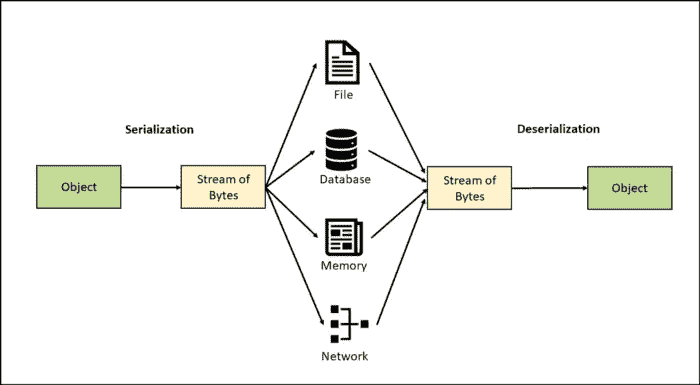
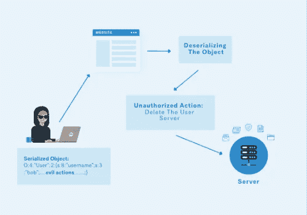

# 为什么会出现反序列化漏洞？

> 原文：<https://infosecwriteups.com/why-do-deserialization-vulnerabilities-occur-577aafd39785?source=collection_archive---------0----------------------->

在 [Unsplash](https://unsplash.com/s/photos/hacking?utm_source=unsplash&utm_medium=referral&utm_content=creditCopyText) 上由[Towfiqu barb huya](https://unsplash.com/@towfiqu999999?utm_source=unsplash&utm_medium=referral&utm_content=creditCopyText)拍摄的照片

**简介**

网络应用不再是 21 世纪初的样子了。它们进化成了完全不同的东西。此外，它们有能力存储和分析复杂的数据结构。虽然这增加了复杂性，但如果处理不当，也增加了不可想象的后果的可能性。

这将最终导致权限升级，这几乎总是会危及用户数据，导致组织的声誉和财务资源的损失。我们将要讨论的漏洞之一是不安全的反序列化。

不安全的反序列化曾经在 OWASP 十大漏洞中排名第八，现在已经与其他漏洞并列，并被重命名为软件和数据完整性故障。

**什么是反序列化漏洞，为什么会出现？**

[来源](https://medium.com/tech-learnings/serialization-filtering-deserialization-vulnerability-protection-in-java-349c37f6f416)

你认为 web 应用程序如何处理、存储和传输数据对象？

例如，考虑这样一个场景，其中应用程序有许多不同的角色，并且应用程序希望在同一个会话 cookie 或参数中管理身份验证和授权，以同时解决两个难题。这意味着不需要进行耗时的操作，例如从颁发给用户的会话 ID 中检索权限；相反，您可以简单地从 cookie 或 header 中检索角色，然后将特定的权限分配给用户，这样用户跟踪也会很容易？

下面详细讨论一下。

有许多不同的属性将被分配给具有会话 id 的用户，例如

1.  用户名
2.  个人资料 _ 图片
3.  作用

当您登录到应用程序时，在磁盘上传输或保存的是该对象的序列化形式。

**什么是序列化？**

将对象转换成字节流或平面结构称为序列化。这个“字节流”也是对象的一个扁平版本。现在可以通过网络发送，并保存在磁盘、文件和数据库中。但是，这个字节流如何转换回对象，以便我们以相同的权限再次访问应用程序呢？

**反序列化**

在编程语言中，反序列化是指将数据流转换为对象。现在它已经恢复到了原来的状态，您可以在方便的时候继续使用这个应用程序。

但是这怎么会是一个漏洞呢？

如果攻击者篡改字节流，而应用程序直接对其进行反序列化，这可能是一个漏洞。这可能导致权限升级、信息泄露，甚至远程执行代码。

**剥削场景**

[来源](https://medium.com/@bdemir/the-anatomy-of-deserialization-attacks-b90b56328766)

考虑一个定义了用户角色的动态 web 应用程序。默认情况下，如果任何用户注册了一个帐户，他将获得一个非管理员用户帐户。假设您用用户名 ronald 注册了一个帐户。web 应用程序生成一个序列化的对象，然后将其作为 cookie 分配给用户。此内容是 base64 编码的。

**tzo 0 oijvc 2 vyijoyontzog6 invzzxjuyw 1 Li jtzojy 6 injvbmfszci 7 czo 2 oijzdgf 0 dx mio 3m 6 oto IBM 90 igfkbwluijt 9cg = =**

由于这是 base64 编码，在解码时，我们得到:

**O:4:“用户”:2:{s:8:“用户名”；生:6:“罗纳德”；s:6:“地位”；s:9:“非 admin”；}**

仔细查看 cookie 会发现对象的名称是“User ”,它有两个字段，用户名和状态，因为我们可以看到我们的用户名是 ronald，状态是**而不是 admin** 。(s:9 指“not admin”是一个字符串，长度为 9)。

如果我们将 **not admin 改为 admin** ，将 s:9 改为 s:5(因为 admin 的长度是 5 个字符)，我们会得到以下结果:

**O:4:“用户”:2:{s:8:“用户名”；生:6:“罗纳德”；s:6:“地位”；s:5:“admin”；}**

对它进行 Base64 编码，我们得到:

**tzo 0 oijvc 2 vyijoyontzog6 invzzxjuyw 1 Li jtzojy 6 injvbmfszci 7 czo 2 oijzdgf 0 dx mio 3m 6 ntoiyywrtaw 4 io 30k**

一旦我们用被篡改的 cookie 替换了 cookie，web 应用程序将对它进行反序列化，并最终授予我们管理员访问权限。

**补救**

这些漏洞的出现是因为服务器直接执行或解析来自客户端的输入。攻击者可以轻易地利用服务器对客户端和用户的信任。

可以应用的一些补救机制有:

1.  除非必要，否则应避免用户输入。
2.  Cookies 和其他序列化对象必须经过签名，以防止它们被篡改。

**结论**

为了数据存储和传输，复杂数据结构的串行化是必要的。这有助于减少带宽，使存储和传输容易，并防止错误。但是，如果服务器反序列化提供给它的所有内容，而不验证输入是否被篡改，这可能会导致服务器受到影响。不安全的反序列化问题在 php、python 和 Java 中很常见。开发人员应该确保使用安全的函数，并采取必要的预防措施来防止不安全的反序列化。

## 来自 Infosec 的报道:Infosec 每天都有很多内容，很难跟上。[加入我们的每周简讯](https://weekly.infosecwriteups.com/)以 5 篇文章、4 条线索、3 个视频、2 个 GitHub Repos 和工具以及 1 个工作提醒的形式免费获取所有最新的 Infosec 趋势！