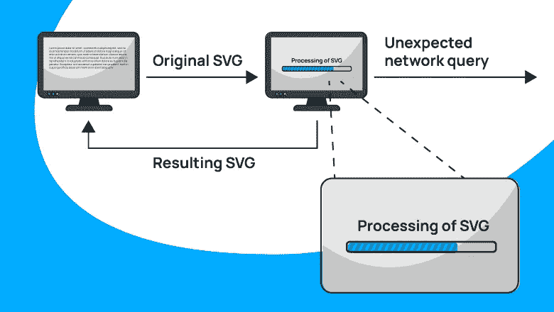
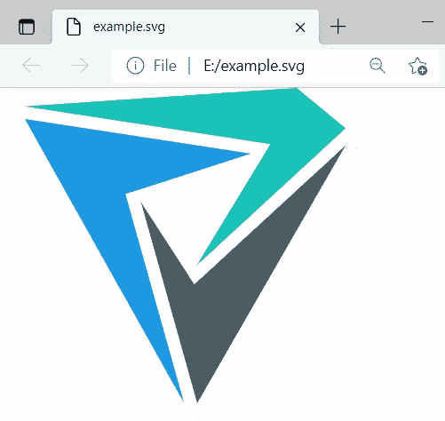
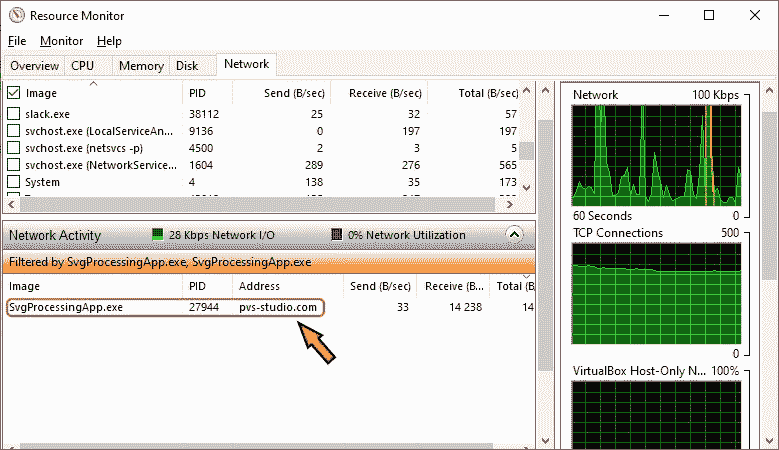
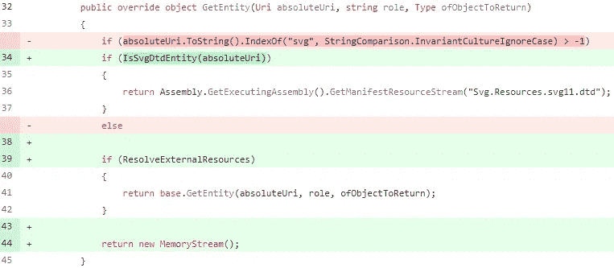

# 当我打开 SVG 文件时，为什么我的应用程序会发送网络请求？

> 原文：<https://infosecwriteups.com/why-does-my-app-send-network-requests-when-i-open-an-svg-file-760d8bd51fea?source=collection_archive---------2----------------------->



你决定开发一个支持 SVG 的应用程序。在热情的鼓舞下，你收集了图书馆并成功地提出了申请。但是突然你发现 app 在发奇怪的网络请求。数据从主机中泄漏。为什么

在当今世界，你可以在任何场合拥有一个图书馆。因此，让我们不要为我们的应用程序重新发明轮子，并采取现成的解决方案。例如，SVG.NET 图书馆。该项目的源代码是 GitHub 上的[。NuGet 是作为一个 NuGet 包分发的，如果您想将库添加到项目中，这个包会很方便。顺便说一下，根据 NuGet Gallery](https://github.com/svg-net/SVG) 中[项目的页面，该图书馆有 250 万次下载——令人印象深刻！](https://www.nuget.org/packages/svg)

让我们看看前面描述的应用程序的合成代码示例:

程序的逻辑很简单:

*   我们从用户那里得到一张照片。我们如何得到照片并不重要。
*   创建了 *SvgDocument* 类型的实例。此外，某些操作是通过该实例执行的。比如一些变换。
*   应用程序将修改后的图片发送回用户。

在这种情况下， *GetSvgFromUser* 和 *SendSvgToUser* 方法的实现并不重要。我们假设第一种方法通过网络接收图片，第二种方法发送回来。

「SVG 文档处理…」背后隐藏着什么？同样，隐藏什么对我们来说并不重要，所以…应用程序不会执行任何操作。

实际上，我们只是上传图像，然后取回它。好像没什么复杂的。但这足以让奇怪的事情开始发生。:)

对于我们的实验，让我们取一个特别准备的 SVG 文件。它看起来像 PVS-Studio 分析仪的标志。让我们看看徽标在浏览器中的样子，以确保一切正常。



所以，商标没有问题。接下来，我们把它上传到 app 上。应用程序不执行任何操作(让我提醒您，上面代码中的注释后面没有隐藏任何东西)。应用程序只是把 SVG 文件发回给我们。

之后，我们打开收到的文件，并期待看到相同的图片。


最有趣的事情发生在幕后(在 *SvgDocument 期间。打开<T>方法调用)*

首先，应用程序向[pvs-studio.com](https://pvs-studio.com/)发送了一个计划外的请求。例如，通过监控应用程序的网络活动，您可以看到这一点。



其次，应用程序的用户从打开 SVG 的机器上接收到了 [hosts](https://en.wikipedia.org/wiki/Hosts_(file)) 文件。

怎么会？主机文件在哪里？让我们看看从应用程序接收的 SVG 文件的文本表示。让我去掉不必要的部分，这样它们就不会分散我们的注意力。

```
<?xml version="1.0" encoding="utf-8"?>
<!DOCTYPE svg .... >
<svg ....>
  <style type="text/css">
    ....
  </style>
  <polygon .... />
  <polygon .... />
  <polygon .... />
  <polygon .... />
  <polygon># Copyright (c) 1993-2009 Microsoft Corp.
#
# This is a sample HOSTS file used by Microsoft TCP/IP **for** Windows.
#
# This file contains the mappings of IP addresses to host names. Each
**# entry should be kept on an individual line. The IP address should**
**# be placed in the first column followed by the corresponding host name.**
# The IP address **and** the host name should be separated by at least one
**# space.**
#
# Additionally, comments (such as these) may be inserted on individual
**# lines or following the machine name denoted by a '#' symbol.**
#
# For example:
#
#      102.54.94.97     rhino.acme.com          **# source server**
#       38.25.63.10     x.acme.com              **# x client host**
#
**# localhost name resolution is handled within DNS itself.**
#   127.0.0.1       localhost
#   ::1             localhost
#
# A special comment indicating that XXE attack was performed successfully.
#</polygon>
</svg>
```

这是机器上的 hosts 文件——小心地隐藏在 SVG 文件中，没有任何外部表现。

主机内容来自哪里？额外的网络请求来自哪里？好吧，让我们弄清楚。

# 关于 XXE 袭击事件

那些知道 XXE[袭击](https://pvs-studio.com/en/blog/terms/6546/)的人可能已经弄清楚发生了什么。如果你没有听说过 XXE 或者已经忘记了它是什么，我强烈推荐你阅读下面这篇文章:“[由于 XML 文件处理带来的漏洞:理论和实践中 C#应用中的 XXE](https://pvs-studio.com/en/blog/posts/csharp/0918/)”。在文章中，我谈了什么是 XXE，攻击的原因和后果。理解本文的其余部分需要这些信息。

让我提醒你，执行 XXE 攻击你需要:

*   可能受到危害的用户数据；
*   具有不安全配置的 XML 分析器。

如果 XML 解析器处理的受损数据以某种形式返回给攻击者，攻击者也会受益。

在这种情况下，“所有的星星都对齐了”:

*   受损数据是用户发送给应用程序的 SVG 文件；
*   不安全配置的 XML 解析器——我们在 SVG 处理库中有它；
*   解析器的工作结果以“处理过的”SVG 文件的形式返回给用户。

# 受损数据

首先，记住 [SVG 格式是基于 XML](https://en.wikipedia.org/wiki/Scalable_Vector_Graphics) 的。这意味着我们可以在 SVG 文件中定义和使用 XML 实体。这些是 XXE 所需要的实体。

尽管“虚拟”SVG 文件在浏览器中看起来很正常，但它包含两个实体的声明:

```
<?xml version="1.0" encoding="utf-8"?>
<!DOCTYPE polygon [
  <!ENTITY queryEntity 
   SYSTEM "https://files.pvs-studio.com/rules/ccr.xml">
  <!ENTITY hostsEntity 
   SYSTEM "file:///C:/Windows/System32/drivers/etc/hosts">
]>
<svg id="Layer_1" 
     data-name="Layer 1" 

     viewBox="0 0 1967 1933.8">
  <style type="text/css">
    ....
  </style>
  ....
  <polygon>&queryEntity;</polygon>
  <polygon>&hostsEntity;</polygon>
</svg>
```

如果 XML 解析器使用外部实体，那么:

*   当处理 *queryEntity* 时，它会向 files.pvs-studio.com 发送一个网络请求；
*   当处理 *hostsEntity* 时，它将替换 hosts 文件的内容，而不是实体。

这被证明是一种 SVG 陷阱:在渲染时，文件看起来很正常，但在内部——它有一些棘手的东西。

# 配置不安全的 XML 解析器

记住，使用外部库是要付出代价的。如果您已经列出了可能的负面后果，那么还有一件事—潜在的安全缺陷。

为了创建 *SvgDocument* 实例，我们使用了*Open<T>方法。它的源代码如下所示:*

```
**public** **static** T Open<T>(Stream stream) where T : SvgDocument, **new**()
{
  **return** Open<T>(stream, null);
}
```

这个方法又会调用另一个重载:

```
**public** **static** T Open<T>(Stream stream, 
                        Dictionary<string, string> entities) 
  where T : SvgDocument, **new**()
{
  **if** (stream == null)
  {
    **throw** **new** ArgumentNullException("stream");
  } *// Don't close the stream via a dispose: that is the client's job.*
  var reader = **new** SvgTextReader(stream, entities)
  {
    XmlResolver = **new** SvgDtdResolver(),
    WhitespaceHandling = WhitespaceHandling.Significant,
    DtdProcessing = 
      SvgDocument.DisableDtdProcessing ? DtdProcessing.Ignore 
                                       : DtdProcessing.Parse,
  };
  **return** Open<T>(reader);
}
```

展望未来，我想说的是在*打开< T >(阅读器)*中，读取 SVG 文件并创建 *SvgDocument* 的实例。

```
**private** **static** T Open<T>(XmlReader reader) where T : 
  SvgDocument, **new**()
{
  ....
  T svgDocument = null;
  .... **while** (reader.Read())
  {
    **try**
    {
      **switch** (reader.NodeType)
      {
        ....
      }
    }
    **catch** (Exception exc)
    {
      ....
    }
  }
  ....
  **return** svgDocument;
}
```

*虽然(读者。Read())* 和*switch(reader . nodetype)*构造应该是每个使用过 *XmlReader* 的人都熟悉的。这是一种典型的 XML 读取代码，让我们不要纠缠于此，而是回到创建 XML 解析器。

```
var reader = **new** SvgTextReader(stream, entities)
{
  XmlResolver = **new** SvgDtdResolver(),
  WhitespaceHandling = WhitespaceHandling.Significant,
  DtdProcessing = 
    SvgDocument.DisableDtdProcessing ? DtdProcessing.Ignore 
                                     : DtdProcessing.Parse,
};
```

要了解解析器配置是否不安全，您需要澄清以下几点:

*   SvgDtdResolver 实例是什么；
*   是否启用 DTD 处理。

在这里我想再说一次——向开源致敬！这是一种难以言喻的快乐——有机会修改代码并理解某些东西是如何工作的。

让我们从依赖于 *SvgDocument 的 *DtdProcessing* 属性开始。禁用处理*:

```
*/// <summary>*
*/// Skip the Dtd Processing for faster loading of*
*/// svgs that have a DTD specified.*
*/// For Example Adobe Illustrator svgs.*
*/// </summary>*
**public** **static** **bool** DisableDtdProcessing { get; set; }
```

这里有一个静态属性，它的值没有改变。属性也不会出现在类型构造函数中。其默认值为*假*。相应地， *DtdProcessing* 采用 *DtdProcessing。解析*值。

让我们继续讨论 *XmlResolver* 属性。让我们看看 *SvgDtdResolver* 类型是什么样的:

```
internal **class** **SvgDtdResolver** : XmlUrlResolver
{
  */// ....*
  **public** **override** object **GetEntity**(Uri absoluteUri, 
                                   string role, 
                                   Type ofObjectToReturn)
  {
    **if** (absoluteUri.ToString()
                   .IndexOf("svg", 
                            StringComparison
                             .InvariantCultureIgnoreCase) > -1)
    {
      **return** 
        Assembly
         .GetExecutingAssembly()                          
         .GetManifestResourceStream("Svg.Resources.svg11.dtd");
    }
    **else**
    {
      **return** base.GetEntity(absoluteUri, role, ofObjectToReturn);
    }
  }
}
```

其实 *SvgDtdResolver* 还是那个 *XmlUrlResolver* 。对于 *absoluteURI* 包含*“SVG”*子串的情况，逻辑略有不同。从关于 XXE 的[文章中，我们记得使用 *XmlUrlResolver* 实例来处理外部实体充满了安全问题。原来同样的情况发生在 *SvgDtdResolver* 上。](https://pvs-studio.com/en/blog/posts/csharp/0918/)

所以，所有必要的条件都满足了:

*   启用 DTD 处理( *DtdProcessing* 属性具有 *DtdProcessing。解析*值)；
*   解析器使用了一个不安全的解析器( *XmlResolver* 属性引用了一个不安全的 *SvgDtdResolver* 的实例)。

因此，创建的 *SvgTextReader* 对象可能容易受到 XXE 攻击(正如我们在实践中看到的，它实际上是易受攻击的)。

# 问题修复

在 GitHub 的项目页面上就这个问题开了一个问题——“[安全:易受 XXE 攻击](https://github.com/svg-net/SVG/issues/869)”。一周后，[又开了一期](https://github.com/svg-net/SVG/issues/872)。每期都制作了一个 PR:第一个[的](https://github.com/svg-net/SVG/pull/870)拉动请求，第二个[的](https://github.com/svg-net/SVG/pull/873)拉动请求。

简而言之，修复方法如下:默认情况下，外部实体的处理是关闭的。

在第一个 PR 中，添加了 *ResolveExternalResources* 选项。该选项负责 *SvgDtdResolver* 是否处理外部实体。默认情况下，处理是禁用的。



在第二个 PR 中，贡献者添加了更多代码，布尔标志被替换为枚举。默认情况下，仍然禁止解析外部实体。代码中有更多的变化。如果你有兴趣，你可以在这里查看它们[。](https://github.com/svg-net/SVG/pull/873/files)

如果我们将“SVG”包更新为安全版本，在相同的应用程序中使用相同的输入数据(即，使用虚拟 Svg 文件)运行它，我们将得到不同的结果。

应用程序不再执行网络请求，也不再“窃取”文件。如果您查看生成的 SVG 文件，您可能会注意到这些实体根本没有经过处理:

```
<?xml version="1.0" encoding="utf-8"?>
<!DOCTYPE svg ...>
<svg version="1.1"
     ....>
  <style type="text/css">
    ....
  </style>
  ....
  <polygon />
  <polygon />
</svg>
```

# 如何保护自己？

看谁想保险起见。:)

至少，您应该了解 XXE，以便在处理 XML 文件时更加小心。当然，这些知识并不能防止所有的危险情况(老实说，没有什么能防止它们)。但是，它会让你对可能的后果有所认识。

SAST 解决方案可以帮助在代码中找到类似的问题。事实上，SAST 可以抓住的东西很多。XXE 很可能就在这个名单上。

如果您使用外部库，而不是使用源代码，情况会有所不同。例如，在我们的应用程序中，当 SVG 库作为 NuGet 包添加时。在这里，SAST 不会提供帮助，因为该工具无法访问库的源代码。尽管如果静态分析器处理中间代码(例如 IL)，它仍然可以检测到问题。

然而，单独的工具——SCA 解决方案——用于检查项目依赖性。你可以阅读下面的[文章](https://pvs-studio.com/en/blog/posts/csharp/0876/)来了解 SCA 工具。此类工具监控具有已知漏洞的依赖项的使用，并发出警告。当然，在这种情况下，这些易损部件的底座起着重要的作用。基数越大越好。

当然，记得更新软件组件。毕竟除了新功能和 bug 修复，新版本中还修复了安全缺陷。例如，在 SVG.NET，本文中处理的安全缺陷在 [3.3.0](https://www.nuget.org/packages/Svg/3.3.0) 版本中被关闭。

# 结论

我已经说过，XXE 是一件相当棘手的事情。本文中描述的实例非常复杂。它不仅隐藏在处理 SVG 文件的背后，还通过 NuGet 包“潜入”应用程序。谁知道还有多少其他漏洞隐藏在不同的组件中并被成功利用？

遵循一个好的传统，我邀请你在 Twitter 上关注[我](https://twitter.com/_SergVasiliev_)，以免错过有趣的出版物。

# 🔈 🔈Infosec Writeups 正在组织其首次虚拟会议和网络活动。如果你对信息安全感兴趣，这是最酷的地方，有 16 个令人难以置信的演讲者和 10 多个小时充满力量的讨论会议。[查看更多详情并在此注册。](https://iwcon.live/)

[](https://iwcon.live/) [## IWCon2022 - Infosec 书面报告虚拟会议

### 与世界上最优秀的信息安全专家建立联系。了解网络安全专家如何取得成功。将新技能添加到您的…

iwcon.live](https://iwcon.live/)