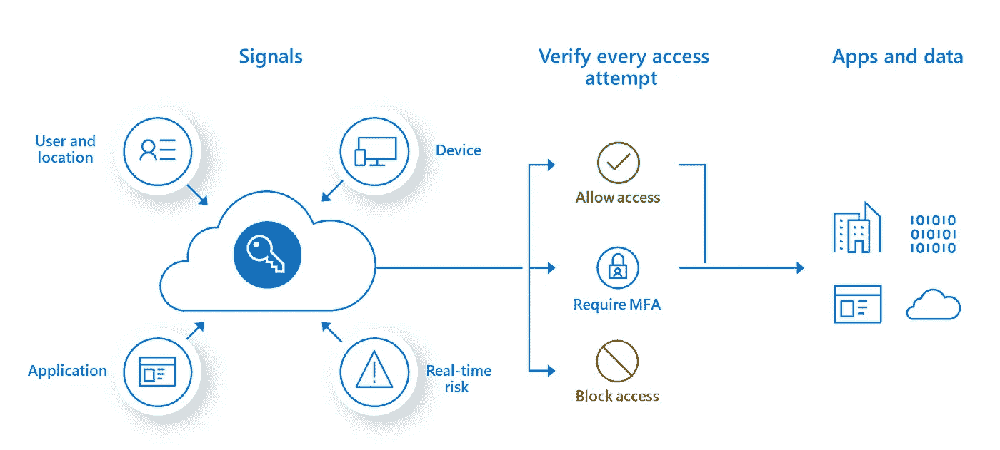
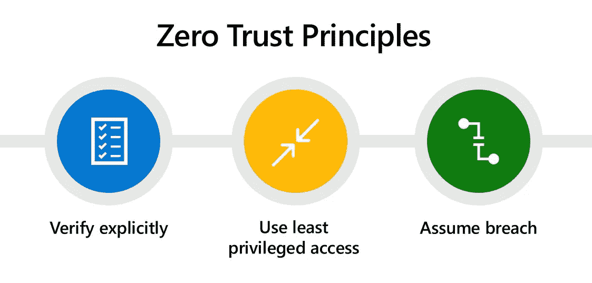
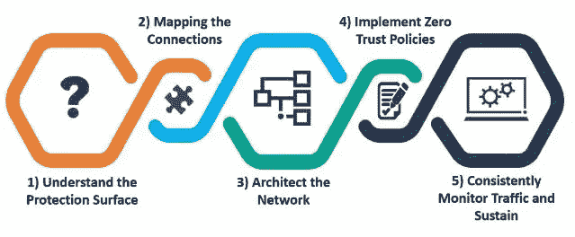

# Gartner:“到 2023 年，60%的企业将使用零信任安全模式”

> 原文：<https://infosecwriteups.com/why-is-the-zero-trust-security-model-effective-93e853bee9c5?source=collection_archive---------2----------------------->

研究公司 Gartner 在其现状报告*零信任架构和解决方案*、[中预测了](https://www.gartner.com/teamsiteanalytics/servePDF?g=/imagesrv/media-products/pdf/Qi-An-Xin/Qi-An-Xin-1-1OKONUN2.pdf)ZTA 的未来。到 2023 年，60%的组织将使用零信任安全模型，而不是虚拟专用网络。这是因为企业的网络基础设施越来越复杂，许多员工远程工作。黑客侵入企业网络窃取数据的漏洞更多了。网络安全的零信任方法旨在保护企业免受当今的威胁。让我们仔细看看它是如何工作的。

# 为什么需要新的保护方法

传统的安全方法是基于登录和密码进入公司网络。防火墙防止未经授权的人进入系统。IT 部门控制的虚拟专用网(VPN)加强了保护。

当员工开始使用平板电脑和智能手机远程工作时，安全形势发生了变化。现在，只允许通过公司电脑访问公司信息变得更加困难。

向云基础设施的过渡是另一个挑战:新的但并不总是可靠的数据交换方式已经出现。IT 专业人员通常会阻止任何可疑的流量，从而阻止远程工作。

有时黑客通过员工自己获取数据。犯罪分子发送钓鱼邮件，获取登录信息和密码，并访问公司网络。

意识到威胁不仅可能来自外部，也可能来自系统本身，导致了网络弹性零信任概念的出现。

# 零信任:加强企业安全的一种方式

如今，各公司正从零信任原则出发，重新思考企业网络的安全性。

零信任不是一个系统或程序，而是一套关于如何保护公司网络的规则和指导方针。这个概念的本质是“信任但核实”。而更准确的说是“先查，再双查，一直查，直到达到零信任”。

当人们第一次实施网络安全时，他们创建了一个边界，在这个边界内，每个人都相互信任并共享对资源的访问。相反，零信任的概念是基于对网络边界内外的所有人和事的不信任。

零信任安全供应商评估任何试图连接到系统的人，无论是本地、云、组合还是混合系统。

资料来源:microsoft.com

# 零信任模型哲学

零信任模型用户遵循以下原则:

1.  ***永久访问控制。***零信任模型中没有可靠来源，全部被质疑。每个访问系统的请求都经过身份验证、授权和加密。
2.  ***预防性的保护方法。*** 为了阻止或减轻入侵，零信任安全厂商使用以下几种防护方式的组合:

*   多因素认证，
*   最低权限访问，
*   微分段，
*   电子邮件保护，
*   编排，
*   加密，
*   云接入安全经纪人等。

***3。定期监控威胁。***

这对缩短“突破时间”很重要，突破时间是指黑客侵入第一个系统和他们转移到网络上其他系统之间的时间间隔。持续的监控有助于在威胁的规模仍然很小时击退威胁。

***4。与安全策略的一致性。***

零信任安全模式是全面的网络弹性战略的一部分，涉及监控和应对威胁。公司还检查和更新旧的身份验证协议，并在发现关键漏洞后立即修复和更新所有设备、程序和固件。

资料来源:xylos.com

# 零信任作为安全由设计代表

零信任的概念代表内置的安全性(设计的安全性)。

设计安全性意味着从开发之初就实施安全性，以使产品尽可能抵御漏洞。为此，开发人员使用 DevOps、CI/CD 管道、持续测试、安全认证和其他实践。

使用零信任方法，结果是在一个安全的系统中，受信任的应用程序[被默认创建](https://andersenlab.com/blueprint/mobile-application-development-timeframes)。这样的保护很难破解。

# 实施零信任模型的 4 个步骤

由于各公司有不同的 IT 基础设施，因此没有实现零信任的标准方法。每个公司都必须评估其能力和威胁风险，以了解哪些方法和工具可以保护公司系统。

以下是零信任入门的一些通用指南:

1.  ***评估你目前的安全系统。***审核所有公司凭证，删除无关条目，并检查访问权限。分析现有的安全工具和基础设施弱点。
2.  ***创建数据目录，比较信息的接收和传输流。*** 确定公司信息位于何处，哪些用户需要访问这些信息，您有多少个服务帐户，以及将它们连接到何处。
    您应该检查认证协议并解决遗留系统的连接问题。列出所有云服务的清单，开放低风险资源的访问。删除过期的帐户，并确保定期更改密码。
3.  ***执行预防性维护。*** 实施多因素认证，给予用户尽可能低的访问级别。如果黑客访问网络，他们将无法超越既定的特权。
    微分段也是有效的:网络周界被划分成区域，用户需要访问每个区域。
4.  ***提供对网络的持续监控。*** 定期检查、分析、记录流量和数据。注意身份验证日志中的异常活动和可疑流量。

资料来源:protiviti.com

# 零信任的障碍

实现零信任模型的这些步骤看似合理且可以理解，但在实践中，公司面临以下困难:

***技术债*** 。当一个公司用自己过时的程序工作时，它就陷入了技术债务的境地，这阻碍了零信任的实施。

***遗留系统*** 不能授予最低可能访问级别。这样的系统更难监控:您可以注册请求协议和网络流量，但是响应它们的能力是有限的。

***P2P 技术*。**为了不减少带宽，Windows 10 的开发者创造了点对点技术，用于在点对点系统之间共享更新。这种数据移动不受控制，这与零信任模型相矛盾。因此，如果组织拥有 P2P 或 mesh 网络，则实施零信任模型将更加困难。

***财务限制*。**光靠云、DevOps、物联网都不支持零信任安全模式，需要额外的技术。

***常规思维*。转向零信任的另一个挑战是让员工以新的方式思考。IT 专业人员信任成熟的技术。在零信任模式下运作时，他们需要改变思维模式，质疑公司网络的所有成员。**

# 结论

加强 IT 基础设施对用户来说可能是一项挑战。为了实现安全性和便利性的平衡，需要灵活的保护方法。零信任可以让公司免受网络威胁。

如果你想增强你公司的网络安全，联系一个可靠的软件开发公司，它会为你的业务提供最好的保护。