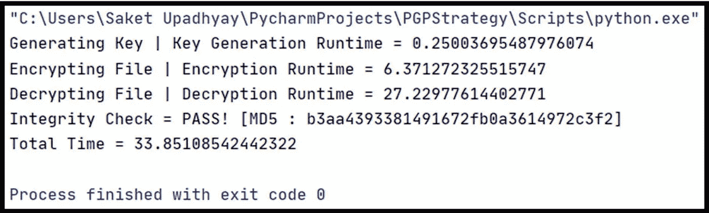
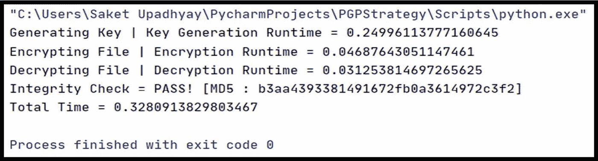
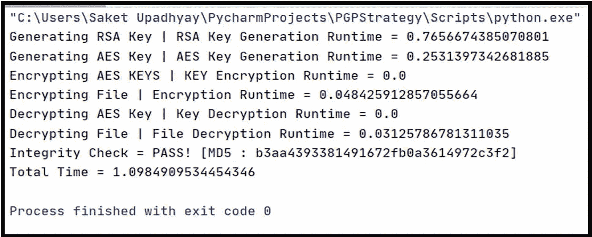
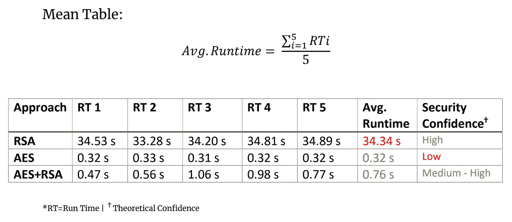

# 为什么不用 RSA 加密大文件？

> 原文：<https://infosecwriteups.com/why-rsa-is-not-used-to-encrypt-large-files-d3172d83febd?source=collection_archive---------0----------------------->

对基于公钥的加密策略及其效率的实际理解。

B 但是为什么 PGP / GPG 等加密工具有`"encrypt with RSA"`选项呢？

如果我们不能用它来加密大文件，这又有什么用呢？

你是说 RSA 没用吗？如果不是，那么在哪里使用？

…在本文中，我们将尝试理解上述所有问题以及更多问题，并用一个实验和一些基本理论来支持它。

# 基本先决条件

假设您对 RSA 和公钥密码学以及一般的密码学有一些初步的了解…或者至少您以前听说过这些术语…无论如何，这里有一个超级简短的参考。

## 公钥加密(非对称加密)

> *公钥加密，或称非对称加密，是一种加密方案，它使用两种数学上相关但不相同的密钥——公钥和私钥。与依赖一个密钥进行加密和解密的对称密钥算法不同，每个密钥执行一个独特的功能。公钥用于加密，私钥用于解密。~*[globalsign.com](https://www.globalsign.com/en-in/ssl-information-center/what-is-public-key-cryptography)

## 什么是 RSA？

> ***RSA****(****Rivest–sha mir–ad leman****)是一种广泛用于安全数据传输的公钥密码系统。它也是最古老的之一。缩写****RSA****来源于罗恩·里维斯特、阿迪·萨莫尔和伦纳德·阿德曼的姓氏，他们在 1977 年公开描述了该算法*。~ [维基百科](https://en.wikipedia.org/wiki/RSA_(cryptosystem))

图片来源:[尼古拉斯·凯奇](https://www.google.com/search?q=nicolas+cage)

为了理解这一点，我在 python3 中准备了一个小而简单又可爱的实验。

这是我们要做的，

1.  为这个演示创建一个文件(相对较小，725 KB。)和“随机”可打印的 ASCII 单行数据。(本演示 741600 字。)
2.  对`AES`、`RSA` 和`AES+RSA`做如下程序(现在刚看完，后面会解释`AES+RSA`是什么意思):-

`**|(i)** Generate Keys for Encryption **|(ii)** Encrypt File **|(iii)** Decrypt File **|(iv)** Check MD5 hash of Original File v/s Decrypted file (should match)`

3.记录上述每个步骤和整个程序的运行时间= RT

4.取平均值。每个加密程序连续运行 5 次，然后进行比较。

5.提供结果和一些理论依据。

# 实验

## 加密参数详细信息

`RSA: Key_Length = 1024 bits **|**Mode = PKCS1_v1_5 **|**Encoding = base64`

`AES: checksum = SHA256 **|**Length = 32 **|**Salted = Yes **|**Iteration = 1,00,000 **|**Mode=Cipher Block Chaining (CBC)`

## 密码

如果你想在你的电脑上做这个实验(你应该这样做)，这是我的 GitHub Repo，包含所有的代码和一个学术实验记录，这是我为了评分而总结的👀

 [## saket-Upadhyay/RSA-大文件-效率-比较

### 简单的 Python3 实验，观察 RSA 对大文件的效率，以及为什么 PGP/GPG 的方法更高效…

github.com](https://github.com/Saket-Upadhyay/RSA-Large-File-Efficiency-Compare) 

## 结果

仅 RSA

RSA only 批量加密的结果计时为 **33.85 秒！**

仅 AES

仅 AES 文件加密的结果时钟为 **0.32 秒！**

## 对这场混乱的解释？是的。

最后，RSA 中的大部分东西归结为一件事，SDMDPN…

图片来源:[擎天柱](https://www.google.com/search?q=Optimus+Prime)(汽车机器人公司团队负责人)

简单地说，RSA 是一种非常耗费资源的算法，它需要时间来生成 RSA 密钥并对这些巨大的素数进行运算。

随着数据量的增加，处理负载也会增加，整个过程最终会花费太多时间来完成。

> *同样，“根据经验，你只能加密***和* ***RSA 密钥*** *一样长的数据。所以，如果你有一个 4096 位的* ***RSA 密钥*** *，你就只能* ***加密最长 4096 位的*** *消息“~**

*另一方面，AES 是一种简单的对称加密算法。它不玩这么大的素数，最终快速加密数据。*

*而是 AES 或任何其他对称密钥加密。与 RSA 的安全性和它的反暴力立场相比是超级弱的。*

# *速度和安全性的平衡(AES+RSA)*

**

*画面中:已故先生[灭霸](https://www.google.com/search?q=thanos)*

*嗯，PKC 从来没有打算加密大文件，相反，我们用它来加密 AES 的加密密钥。因此，我们使用良好的对称加密来加密大型数据文件，然后使用强公钥加密来加密用于加密大型文件的对称加密密钥，我们共享这个加密的对称密钥，以及可以用接收者的私钥解密的加密文件。*

*这就是所有加密工具所说的`"Encrypt with RSA"`*

*这是我们实验中同样的表现:*

**

*AES+RSA 批量+密钥加密的结果 **1.09 秒！***

## *平均运行时间观察*

**

*图片 Src:我的大学作业文档:-)*

# *结论*

*我们可以从上面的 Mean RT 表中看出为什么标准方法更好，RSA 处理大文件的性能有多差。*

*这就是我们不直接在大文件上使用 RSA 的原因。*

## ***奖励内容***

**

## *国际纸业公司*

*但是如果你说 RSA 不能加密超过密钥大小的数据，那么我们如何用它加密文件呢？*

*嗯，我没有加密整个文件，而是将文件划分为`**86** **char**acters`个块，然后逐行存储在加密文件中，然后解密，我们逐行读取文件，然后解密并连接结果以获得原始数据。😬*