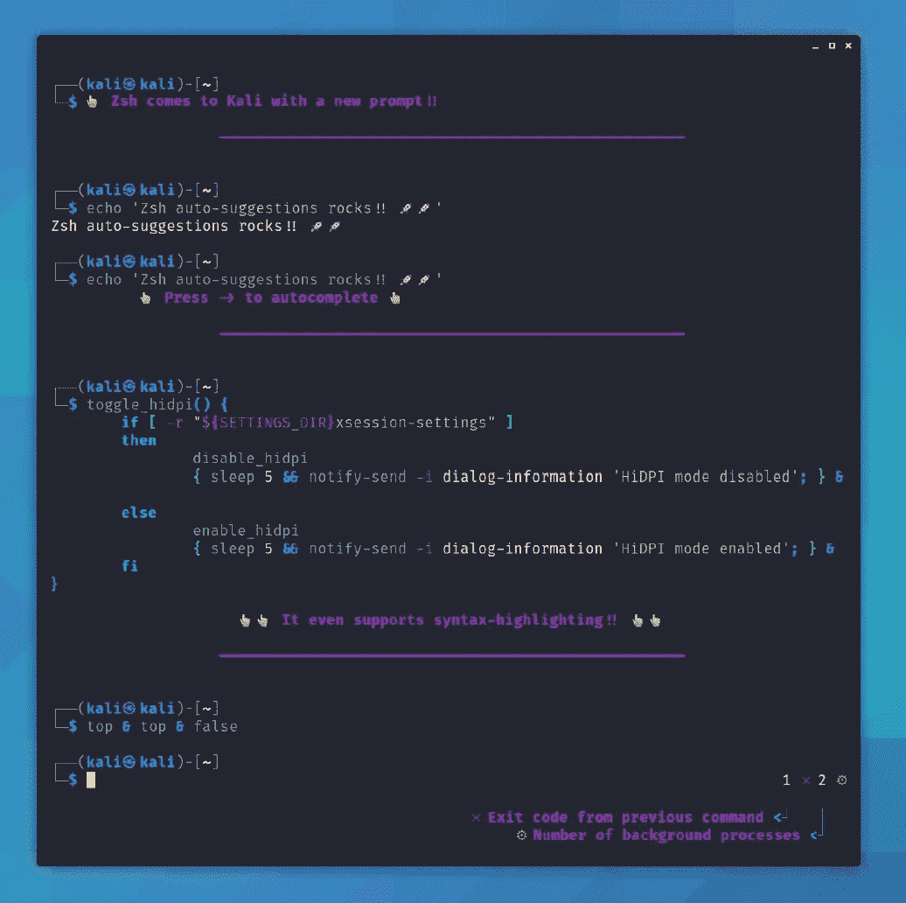
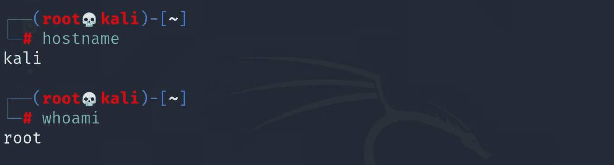
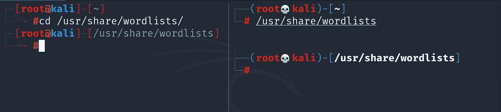
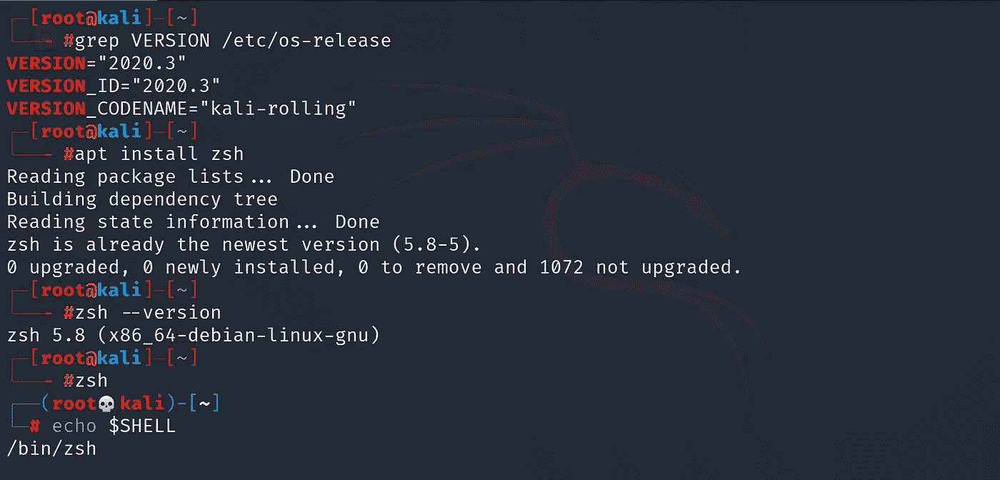
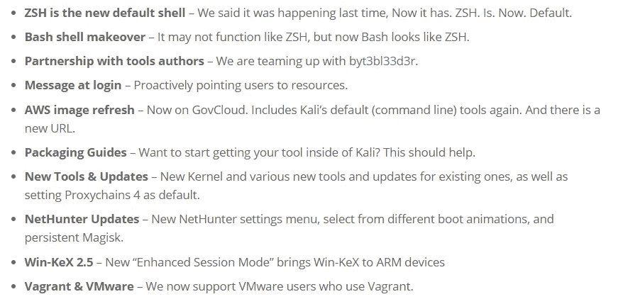

# 为什么在 Kali Linux 中从 BASH shell 切换到 KSH？

> 原文：<https://infosecwriteups.com/why-switch-from-bash-shell-to-ksh-in-kali-linux-72cd18b5dd1b?source=collection_archive---------4----------------------->

## 你会喜欢 ZSH 的！！！

**简介:**

进攻安全拥有 Kali Linux 是最著名的开源渗透测试平台的安全专业人士。它包括用于道德黑客或渗透测试的各种包和工具的综合集合。

当 Kali Linux 2020.3 在 2020 年第三季度发布时，KSH 已经预装，但 BASH 仍然是他们的默认 shell。它给每个人提了个醒，他们将在即将发布的版本中从默认的 Bash shell 切换到 ZSH。

在考虑了 Kali Linux 最终用户的积极反馈并成功测试了 shell 特性之后，这种转变现在已经发生在他们最新发布的 2020.4 中

来源:https://www.bleepingcomputer.com/

> 再见，欢迎来到 ZSH 家庭。

如果你是 Kali 的最终用户或打算使用它，请务必阅读整个帖子，以便更好地了解 ZSH。如果你喜欢这篇文章，请点击拍手按钮，关注我更多这样有趣的文章。

**过渡到 ZSH** :

GNU Bash 或简称 Bash 代表 Bourne Again Shell，而 ZSH 代表 Z Shell，发音为 Zee Shell。最大的原因是，它提供了许多插件，主题，和一些额外的功能，如路径扩展，自动目录改变，和自动建议。不仅仅是这些功能，还有很多。

目前，对于 x64 和 x86 体系结构，ZSH 部署将仅作为桌面映像的默认外壳。对于 AEM 这样的平台，container、NEThunter 和 WSL 仍然会使用 BASH。

ZSH 第一眼看去

以下是 ZSH 的显著特征，它会给你一个使用它的理由:

i) **不需要更改目录命令(cd)**:在 KSH，用户可以简单地使用路径更改目录，甚至不需要在前面键入或使用 CD。

不使用 cd 命令更改目录

ii) **对插件的支持&主题**:一些常用的插件有 zsh-syntax-highlighting、zsh-auto suggestion、powerline、fonts-powerlinein。当与开源框架如 oh-my-zsh 结合时，ZSH 提供了对各种插件的支持。下图是一个小列表。

ZSH 插件示例

iii) **路径展开** : ZSH 使用缩写形式自动展开目录。例如，ls /u/sh/wo/与 ls /usr/share/wordlist/相同

iv) **自动更正和自动完成**:如果在输入一些命令时出现错误，我也会自动更正命令。

法术修正:Z shell 自动修正法术。
颜色定制:在这里我们可以定制外壳的颜色。

**我喜欢它，我如何升级或安装 ZSH？**

不幸的是，ZSH 在 2020.3 中默认不可用，但是的，我们可以安装或升级到 ZSH。如果您正在升级，每个用户都必须切换到 ZSH，否则对于新的安装，默认情况下将是 ZSH。使用镜像中的以下命令安装 ZSH。它也适用于另一个 Linux 发行版和 mac os。

在较旧的 kali Linux 中安装 ZSH

我不喜欢 ZSH，我该怎么办？

如果您出于某种原因不想使用 ZSH，可以使用下面的命令进行恢复。

*   apt 清除 zsh
*   chsh -s /bin/sh
*   重新启动

**奖金更新:**

我们完全知道我们可以用 bash shell 做什么，我们可以根据需要定制，也就是说，我们可以比以前做得更多。你会喜欢使用 ZSH。希望你也把它设为默认。但不仅仅是这个，2020.4 可能是未来最大的卖点。此外，他们对该版本的完整更新在下图中列出。

来源:https://www.kali.org/news/kali-linux-2020-4-release/

感谢您的阅读。

 [## 漏洞利用报告

### CTF 玩家、安全专家、Bug 赏金猎人、白帽黑客和渗透测试者的博客你好，我是…

www.youtube.com](https://www.youtube.com/@Exploit-Writeup/)