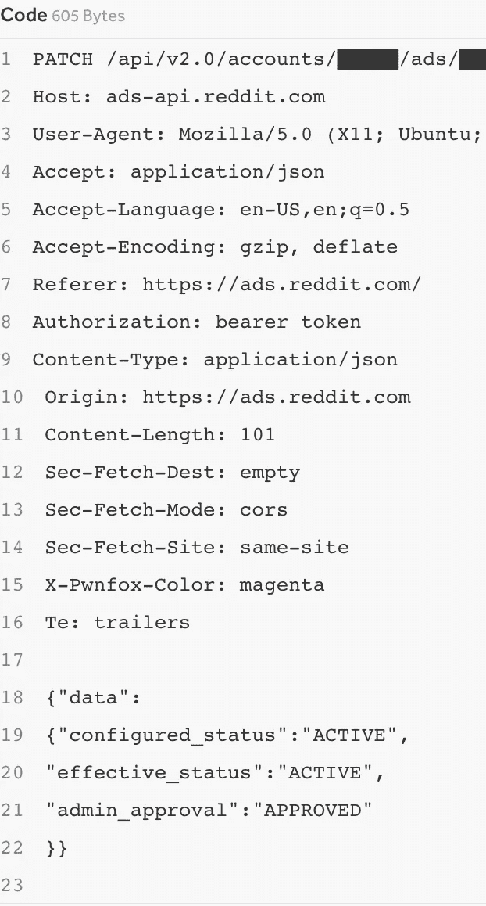

# 为什么这个简单的错误从 Reddit 获得了 5000 美元的 bug 奖金

> 原文：<https://infosecwriteups.com/why-this-simple-mistake-earned-a-5000-bug-bounty-from-reddit-d906cb46c60e?source=collection_archive---------1----------------------->

## 故事的寓意——重构代码时要小心

# 摘要

重构代码是常见的，尤其是随着代码库的增长，现有的功能会增加更多的复杂性，并且会引入新的技术来提高性能。重构通常是一件痛苦的事情，因为你必须确保所有曾经有效的东西在新的格式下仍然有效。任何错误都可能引入新的 bug，在 Reddit 的案例中，这个 bug 让他们损失了 5000 美元。

人工智能在 craiyon.com“Reddit 皱眉插画”上生成的图像

# 利用

HackerOne 用户`bisesh` [向 Reddit 提交了一份报告](https://hackerone.com/reports/1543159)，描述了对`https://ads.reddit.com`域的访问控制被破坏。在 OWASP 的 2021 年十大安全列表中，访问控制漏洞被列为“最严重的 web 应用安全风险”。本质上，导致这种类型的缺陷的错误允许用户获得他们不应该获得的权限。这可能包括查看/编辑您没有权限的数据(即访问其他用户的敏感信息)、绕过某些检查，或者在您不是实际管理员时充当管理员。

这正是`bisesh`所发现的。基本上，`bisesh`注意到在 Reddit 的网站上创建了一个广告活动后，需要 Reddit 管理员的批准来验证一笔付款是否被验证。然而，通过发送关于广告的某个`PATCH`请求，`bisesh`能够绕过管理员的批准，简单地激活团队自己的广告活动。这两个步骤的过程打破了标准的访问控制。

根据 Reddit 团队的说法，API 最初具有检查发送`PATCH`请求的用户权限的功能。如果不是管理员，则请求被阻止。然而，在代码重构过程中，这项功能被移到了别处，没有被团队或者之前设置的单元测试注意到。

`bisesh`报告摘要:

> 在[https://ads.reddit.com/](https://ads.reddit.com/)您可以创建广告活动，在该活动下您可以创建广告，一旦您创建了新的活动，它将处于待定阶段，除非您添加付款细节，并根据此处的内容由管理员审核和批准[https://advertising . reddithelp . com/en/categories/ad-review/about-reddits-ad-review-process](https://advertising.reddithelp.com/en/categories/ad-review/about-reddits-ad-review-process)。但是将 admin_approval 的值更改为 APPROVED，将 effective_status 的值更改为 ACTIVE，则广告被批准，因此我们会收到来自 reddit ads 的确认电子邮件，表明我们的广告被批准。(来源: [HackerOne 报道](https://hackerone.com/reports/1543159))

`bisesh`提供了可重复的步骤，包括 1)创建活动 2)发送以下补丁请求以将值更新为已批准。

修改广告活动的补丁请求

# 为什么这笔赏金值 5000 美元？

这个 bug 非常简单:只需发送一个`PATCH`请求，你就可以批准你自己的广告活动，而无需付费。因此，这对 Reddit 有着巨大的商业意义。Reddit Ads 产生了数百万美元的收入(根据本，2021 年第二季度超过 1 亿美元)。能否绕过核心利润来源将是 Reddit 面临的一个主要问题。结合这是一个非常容易和可行的利用这一巨大的影响，在商业方面使这一价值 5000 美元的赏金。正如 Reddit 的工作人员所说，“这是一个好主意”。

再次由`bisesh`难以置信的工作，祝贺你的 5000 美元奖金。感谢您通读，请在下面留下任何建设性的反馈、建议或问题！如果你喜欢，请考虑跟随我或[请我喝杯咖啡](https://www.buymeacoffee.com/robertocyberkid)。在 roberto.cyberkid@gmail.com 联系我，在 twitter 上关注我，在 LinkedIn 上联系我！

来自 Infosec 的报道:Infosec 上每天都会出现很多难以跟上的内容。 [***加入我们的每周简讯***](https://weekly.infosecwriteups.com/) *以 5 篇文章、4 个线程、3 个视频、2 个 Github Repos 和工具以及 1 个工作提醒的形式免费获取所有最新的 Infosec 趋势！*