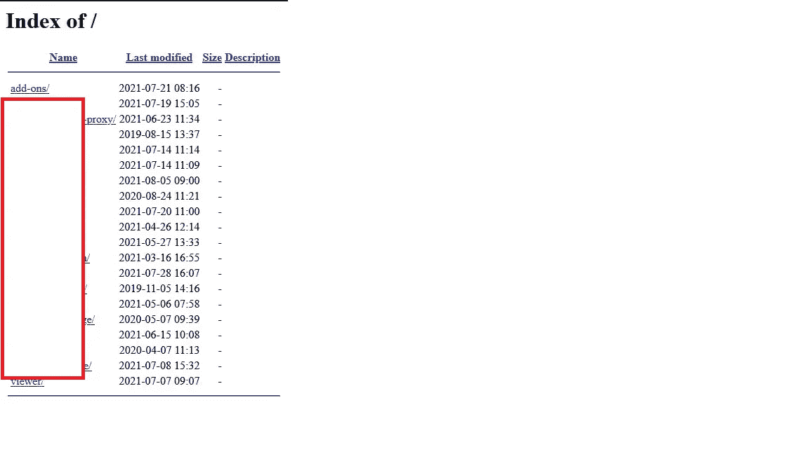
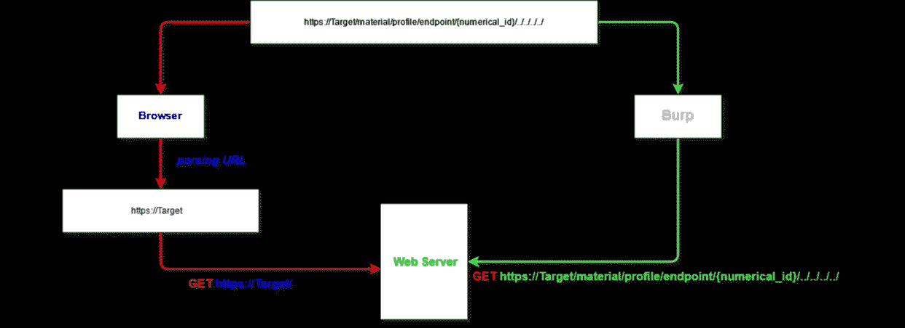
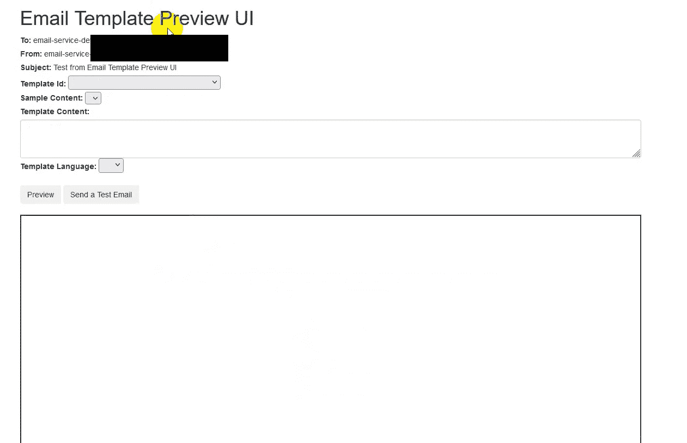
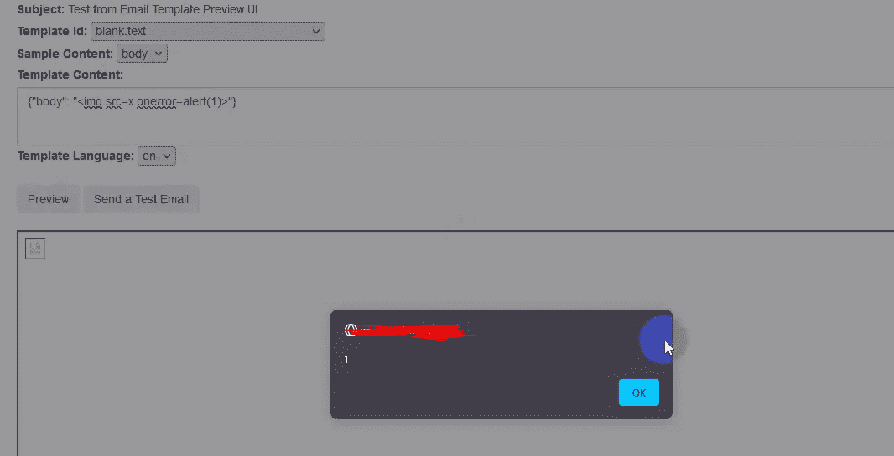
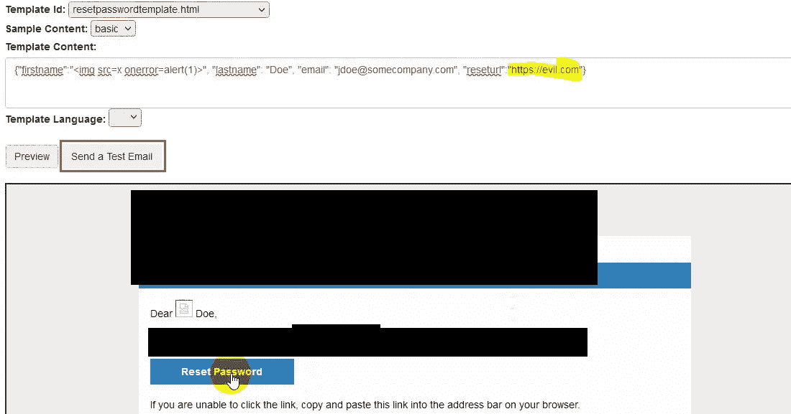
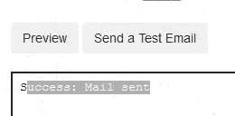
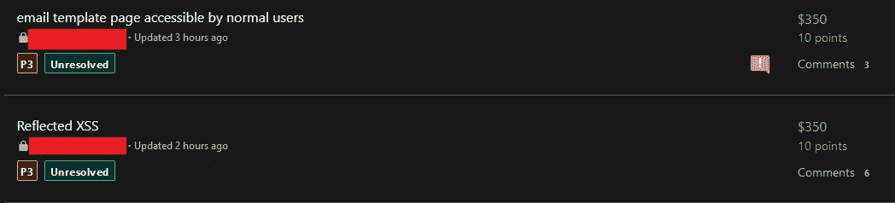

# 为什么您应该使用 burp 来测试路径遍历漏洞并获得 RXSS

> 原文：<https://infosecwriteups.com/why-u-should-use-burp-to-test-path-traversal-vulnerability-and-also-get-rxss-2743cbb16a3c?source=collection_archive---------0----------------------->

大家好，我又是亚瑟(又名尼禄里)
我告诉过你们我和我的兄弟(他 16 岁)正在做一些 bugbounty，我们发现了那些很酷的 bug。

# 接近目标

一如既往，我选择了一个有趣的目标，因为它有很多功能，而且很容易使用，我没有做很多侦察，所以我们只是开始瞄准主域，

我的兄弟开始做随机动作来了解一切是如何工作的，
经过一些点击现在是时候做一些疯狂的事情了 XD，

我们开始做一些目录蛮力，以获得一些端点，
在这样做的同时，我的兄弟开始发送随机有效载荷的路径遍历，我也写了小脚本，采取屏幕拍摄每个网址，
，但我们没有得到任何东西

直到我哥哥开始检查打嗝反应，

在这一点上，我的兄弟尝试了这个网址:

[https://Target/material/profile/endpoint/](https://www.mathworks.com/matlabcentral/profile/authors/23398683?s_tid=gn_comm/../../../){ numeric _ id }

所以他开始将路径遍历有效负载附加到 id:

我们知道，我们需要后退 4 次才能进入主目录，所以他尝试这样做:

[https://Target/material/profile/endpoint/](https://www.mathworks.com/matlabcentral/profile/authors/23398683?s_tid=gn_comm/../../../){ numeric _ id }/../../../../

通常这个请求会把我们带到主域: [https://target](https://target)
当我们在 brower 中加载这个 url 时会发生这种情况，但是在 burp 中我们得到了另一个响应！

点击`show response in browser`我们得到了这个

目录列表

我的假设是，网站正在处理易受目录列表攻击的内部 api，当浏览器发送请求时，流程如下

打嗝 vs 浏览器

这就是为什么我们使用打嗝时会得到不同的结果。

# 查找 RXSS

从这里，我开始深入研究这个问题，浏览每个发现的端点，我发现了一个负责正式电子邮件模板的内部端点

电子邮件模板预览界面

选择模板

插入一个简单的 xss 有效负载，并按下预览我得到和警报:)

XSS

嗯，但是你可以看到这是一个自我 xss，所以我们不能做太多。

# 经由 CSRF 的 RXSS

我截取了负责 xss 的请求，并创建了一个简单的 csrf poc 来模拟请求，只要我们打开页面，xss 就被执行

RXSS

# 接管管理员帐户

如您所见，有一个`Send a test Email`似乎从公司电子邮件向公司电子邮件发送了一封测试电子邮件，因此员工很有可能将其作为普通电子邮件打开:
我发现我没有模板，我可以插入一个 url，因此我插入了 RXSS url，这样一旦管理员打开电子邮件并单击按钮，他将被重定向到 RXSS 链接，我们就可以获得他的 cookies:)

重置密码测试电子邮件

请注意，有许多模板，所以它不仅是重置密码电子邮件，我们可以发送。

发送测试电子邮件后

这些 bug 首先像往常一样不适用 XD，
然后在小争论之后我展示了影响并进行分类，我们得到了**$ 700:】**

我要感谢我的朋友 [Abdulrhman Adel](https://medium.com/u/fb76f1a8b652?source=post_page-----2743cbb16a3c--------------------------------) 在我向他询问路径遍历问题时提供的帮助，遗憾的是我们无法提出影响，但他向我解释了路径遍历发生的原因。

莫尼

我和我哥哥告诉对方我们将在 fb XD 工作

我希望你喜欢这篇文章，并等待我的关于新 bug 赏金猎人的**提示**帖子。