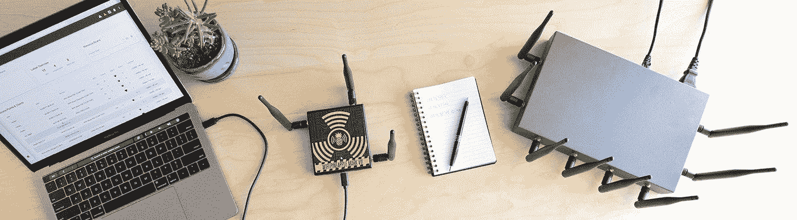
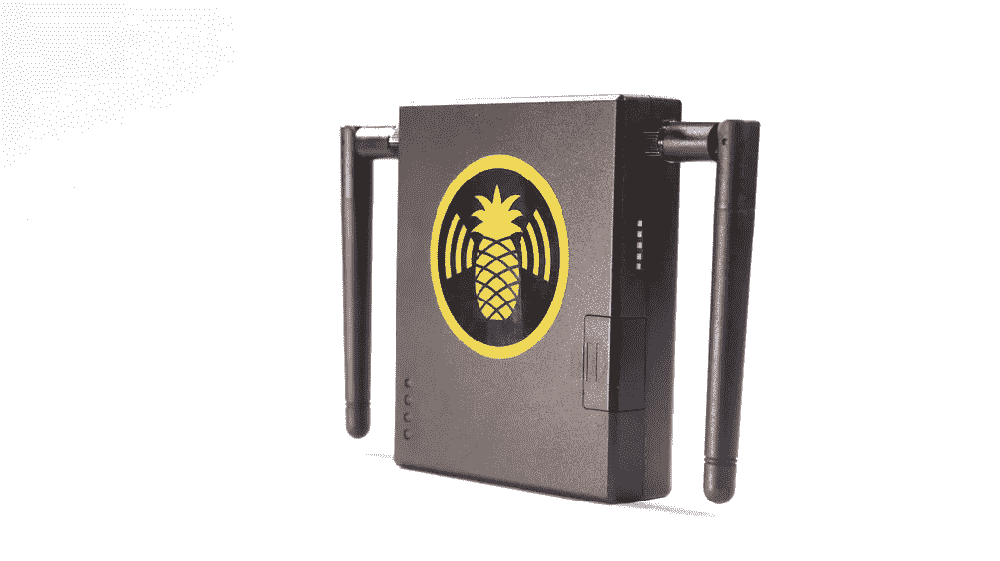
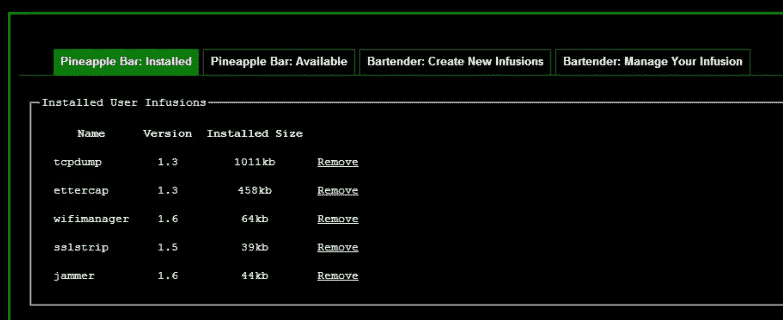
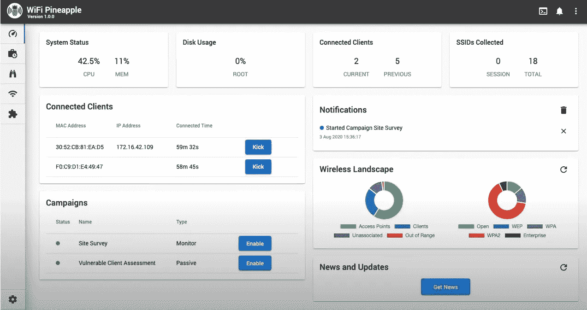
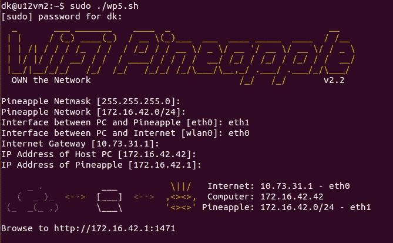
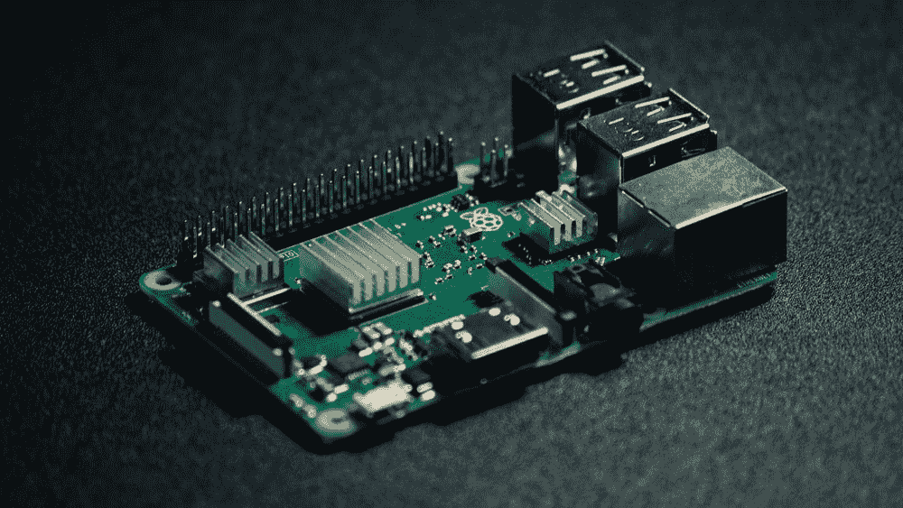
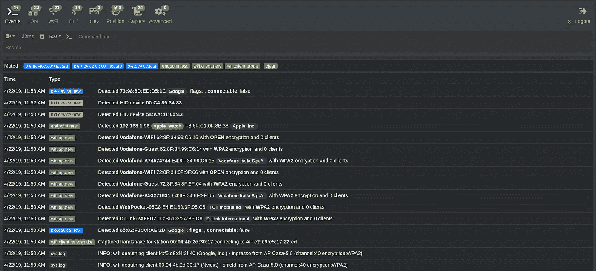
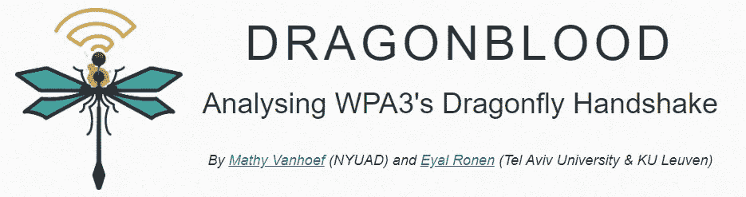
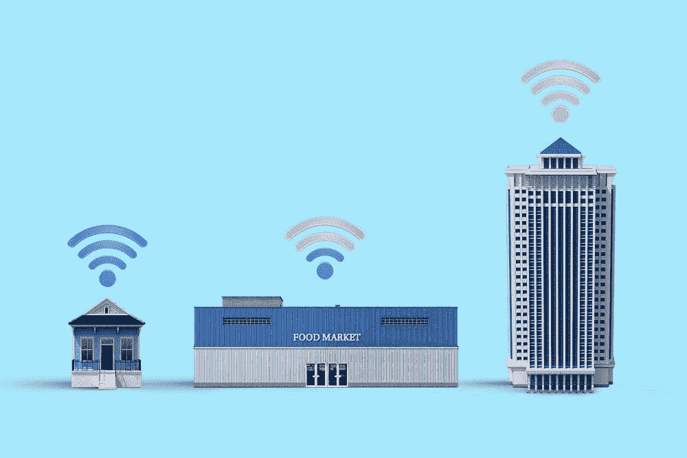

# 为什么你不应该购买新的无线菠萝马克七

> 原文：<https://infosecwriteups.com/why-you-should-not-buy-the-new-wifi-pineapple-mark-vii-f388544528c9?source=collection_archive---------0----------------------->

在我看来，现在有更好更便宜的选择

今年 9 月 9 日，新款[菠萝 Mark VII 亮相](https://www.youtube.com/watch?v=7v3JR4Wlw4Q&ab_channel=Hak5)。现在在 Hak5 网站上可以从[以 99.99 美元买到。不过首先我们来解释一下什么是 WiFi 菠萝。](https://shop.hak5.org/products/wifi-pineapple?variant=81044992)

菠萝标志 VII |图片来自 www.hak5.org

# 介绍

2008 年，Hak5 推出了第一款 WiFi 菠萝，此后每隔几年都会推出连续型号。Hak5 创造了第一批专门为 WiFi 黑客设计的设备之一。我测试和玩的第一个是 WiFi 菠萝 Mark V。

WiFi 菠萝标 V |图片来自[www.hak5.org](https://www.hak5.org/)

如前所述，WiFi 菠萝是一款专注于 WiFi 黑客/审计的产品。它真的很容易使用，因为它有一个网络仪表板，你可以控制所有的选项，由于这个原因，它变得非常受欢迎。只需点击一个网站，您就可以执行 deauth、MiTM 或 WPS 攻击。

马克 V 网络仪表板|图片由我的朋友提供[阿尔贝托·单面山·帕雷乔](https://www.linkedin.com/in/alberto-cuesta-parejo/)

> 我第一次连接到 Mark V 时，我记得看到了控制台，并思考它看起来如何像 [OpenWRT](https://openwrt.org/) 。问题是它看起来不像 OpenWRT，而是 OpenWRT

如果你考虑到这一点，拥有一个用于启动、配置和控制 WiFi 攻击的 web 仪表板是非常棒的。此外，新的马克七网络仪表板看起来很酷，他们使用了新的现代设计。

Mark VII 网络仪表盘|图片来自[www.hak5.org](http://www.hak5.org)

但是除了他们的网络控制仪表板，什么是 WiFi 菠萝？。和其他硬件设备一样，WiFi 菠萝是一个路由器，你可以通过 SSH 连接到它。我第一次连接到 Mark V 时，我记得看到了控制台，并思考它看起来如何像 [OpenWRT](https://openwrt.org/) 。问题是它看起来不像 OpenWRT，而是 OpenWRT。说到底，WiFi 菠萝就是一个安装了 [OpenWRT](https://openwrt.org/) 的路由器，一些脚本和一个 web dashboard。

> 菠萝是很酷的黑客产品，但它们的时代已经过去了。我们不再是 2008 年或 2013 年。

马克 V 壳连接|图片来自[www.hack5.org](http://www.hack5.org)

但是 WiFi 菠萝它不是普通的路由器，它是改装的路由器，有几根天线。事实上，他们一直在增加新型号的天线数量，第一款只有一个天线。

菠萝是很酷的黑客产品，但它们的时代已经过去了。我们不再是 2008 年或 2013 年。

# 不买 WiFi 菠萝的理由

## 1.替代品和价格

就像我之前提到的，时间已经改变了，现在我们有了令人难以置信的、更便宜的、更好的电脑，命名为[树莓派](https://www.raspberrypi.org/)。此外，Raspberry Pi 设备可用于以多种方式执行 pentesting。GitHub 上有很多使用覆盆子的黑客项目，也有一本关于覆盆子在测试中的用途的[书。](https://www.amazon.es/Penetration-Testing-Raspberry-Pi-English-ebook/dp/B01LWYFX8Y)

斯蒂芬·科斯马在 [Unsplash](https://unsplash.com/s/photos/raspberry-pi?utm_source=unsplash&utm_medium=referral&utm_content=creditCopyText) 上拍摄的照片

好吧，Raspberry Pi 模型很酷，但 WiFi 天线和 WiFi 攻击怎么办？。现代的 Raspberry Pi 版本带有 WiFi 天线，您可以随时添加更多天线。你可以购买或使用类似 [Alpha AWUS036NHA](https://www.amazon.com/Alfa-AWUS036NHA-Wireless-USB-Adaptor/dp/B004Y6MIXS/ref=sr_1_3?dchild=1&keywords=Alfa+network+AWUS036NHA&qid=1600709346&s=electronics&sr=1-3) 的可靠黑客天线，然后在你的树莓上使用它。

不到 70 美元，你可以买一个[树莓 Pi 3](https://www.amazon.com/Raspberry-Pi-MS-004-00000024-Model-Board/dp/B01LPLPBS8) 和一个 [Alpha AWUS036NHA](https://www.amazon.com/Alfa-AWUS036NHA-Wireless-USB-Adaptor/dp/B004Y6MIXS/ref=sr_1_3?dchild=1&keywords=Alfa+network+AWUS036NHA&qid=1600709346&s=electronics&sr=1-3) 。但这有一个问题，WiFi 菠萝 Mark VII 有三根天线，一个网络仪表盘和 WiFi 审计软件。所以最好是马克七型？嗯，不，继续读。

## 2.WiFi 审计软件和可用性

我有几年审计 WiFi 网络的经验，最流行和最好的工具是开源的。我只能在一个不免费而且真的有用的工具上思考，[丙烯酸 Wi-Fi 热图](https://www.acrylicwifi.com/en/wlan-wifi-wireless-network-software-tools/wifi-site-survey-software-acrylic-heat-maps/)。有一些令人难以置信的项目，如 [Bettercap](https://www.bettercap.org/) 、 [Berate_ap](https://github.com/sensepost/berate_ap) 和 [mitmproxy](https://mitmproxy.org/) 等等。

Hak5 只需下载这些程序，安装它们，然后放一个漂亮的网络仪表盘，让你可以启动和配置攻击。有人可能会说，从网站上发布东西很容易。这可能是真的，bettercap 已经有了一个漂亮的 web 仪表板，允许控制和执行许多攻击。

来自 https://www.bettercap.org/usage/[的 bettercap Web UI](https://www.bettercap.org/usage/)

也有一些尝试使用树莓 Pi 复制菠萝 WiFi 界面，如[水果 WiFi](https://github.com/xtr4nge/FruityWifi) 。但是 bettercap web 界面得到了更好的维护，并且有了更多的功能。

不管怎样，我坚信，如果你打算从事网络安全工作，你需要学会使用没有图形界面的程序。大多数黑客程序缺乏 UI 界面和基本知识，或者如果你从事网络安全工作，应该知道如何从命令行启动程序。此外，您将了解更多信息，并更好地控制从 shell 启动它的每个工具。

## 3.更新和开放性

新软件和新奇的攻击不会在 WiFi 菠萝上设计和实现。看看最近的攻击，像[马提·万霍夫](https://twitter.com/vanhoefm)发现的[克拉克](https://www.krackattacks.com/)，和[龙骑士](https://wpa3.mathyvanhoef.com/)，马提·万霍夫和[埃亚尔·龙恩](https://eyalro.net/)发现的。用于执行 [Krack](https://github.com/vanhoefm/krackattacks-scripts) 和[dragon blood](https://wpa3.mathyvanhoef.com/#tools)攻击的工具已经在 GitHub 上发布，并在 Kali Linux 上开发。

来自 https://wpa3.mathyvanhoef.com/[的龙骑士标志](https://wpa3.mathyvanhoef.com/)

如果你买了一个菠萝 WiFi，你会收到这些攻击，以防你的硬件支持这些攻击，Hak5 或其他人决定移植这些工具。也许这将是一个简单的过程，但你需要等待或执行一些额外的工作来发起新的攻击。另一方面，你只需要在你的 Raspberry Pi 上下载并运行这个新工具。

另一点要提到的是，在某个时候你的 WiFi 菠萝它将被停止，所以忘记更新。你的树莓皮会比那个活得更久更省力。

## 4.天线

首先，想一想，三根 WiFi 天线真的有必要吗？让我们回顾一下可能的攻击场景和所需的天线数量。如果你要执行 WPA/WPA2 网络握手捕获或 WPS 攻击，你只需要一个天线。

[晨酿](https://unsplash.com/@morningbrew?utm_source=unsplash&utm_medium=referral&utm_content=creditCopyText)在 [Unsplash](https://unsplash.com/s/photos/wifi-hack?utm_source=unsplash&utm_medium=referral&utm_content=creditCopyText) 上拍摄的照片

需要两个或更多天线的一种情况是执行 RogueAP 攻击+ MiTM 攻击。例如，一个天线将创建恶意接入点，而另一个将用于互联网连接。然后，在某些情况下，将需要第三个天线来执行解除认证攻击。

但是你不需要三个天线来执行这个场景。你可以进行死亡攻击并切换到互联网连接。或者考虑一个真实的场景，4G/5G 连接会更好。如果我跟随某人或去他们的公司，很可能我没有 WiFi 连接。所以我把手机拴在电脑上，或者购买并使用 SIM USB 调制解调器。

“我的选项”中的 SIM USB 调制解调器选项是最好的选项，因为它还允许您将设备隐藏在有互联网连接的地方。您可以让恶意的 Raspberry Pi 捕获流量，然后回家通过 SSH 控制它。最重要的是，你可以将一个电源连接到你的覆盆子上，以避免寻找电源插头。想想[live overflow Raspberry Pi Zero](https://www.youtube.com/watch?v=UeAKTjx_eKA&ab_channel=LiveOverflow)视频，但带有恶意或测试目的。

因此，总的来说，在 WiFi 菠萝中，你将有三个天线，你不会总是同时使用。另一方面，你可以在 Raspberry Pi 上连接三个或更多天线，但最重要的是，你可以使用 SIM USB 调制解调器来上网。

# 结论

总之，你可以用更便宜的产品进行更高级的攻击。此外，这些产品将比 WiFi 菠萝马克七长寿命。你不需要考虑新的 Raspberry Pi 模型什么时候发布，因为 Rapsbian 仍然会工作。

此外，您需要考虑每个产品为您提供的开放性和功能。你可以用树莓做成千上万的事情，当你审计完一个无线网络，你可以用你的树莓做其他事情。菠萝 WiFi 不提供这种多功能性。

因此，总之，如果你想要，买一个菠萝 WiFi 菠萝马克七，但在我看来，最好是花这笔钱在一个树莓派，一些阿尔法天线和学习一些 WiFi 黑客。