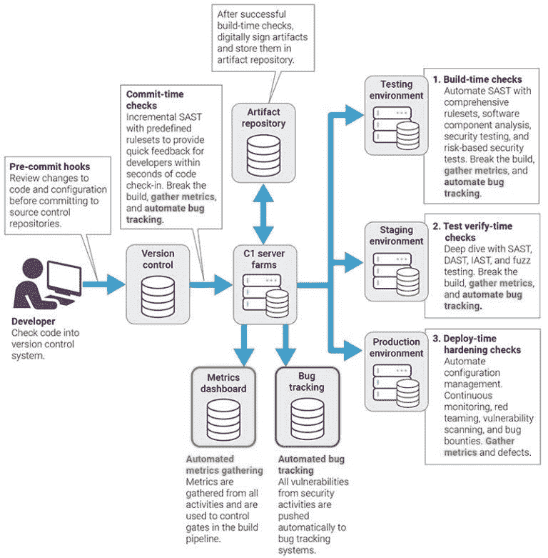

# 为什么您的 DevOps 渠道应该包括 SAST

> 原文：<https://infosecwriteups.com/why-your-devops-pipeline-should-include-sast-87a0e06b8292?source=collection_archive---------5----------------------->

网络安全是当今时代的主要关切之一。潜在黑客或病毒入侵我们的系统或个人数据的风险达到了有史以来的最高点。因此，我们需要近乎完美的安全测试措施来防止这些情况发生。除了防病毒安装等预防措施之外，我们还拥有某些工具和软件来验证程序和应用程序的安全性。

一种这样的测试方法是静态应用安全测试(SAST)。

# 什么是 SAST？

[SAST](https://www.perforce.com/blog/kw/what-is-sast#what-is-sast) 也就是通常所说的静态代码分析。它是一种白盒测试方法，甚至在代码编译之前就扫描应用程序的工作情况。SAST 甚至可以在编译过程之前实现，因为它不需要工作应用程序。

SAST 是一种重要的测试方法，它利用源代码来发现潜在的威胁和安全漏洞，这些威胁和漏洞会使您组织的应用程序容易受到攻击。

[图片来源](https://aws.amazon.com/devops/what-is-devops/)

DevOps 是两个词的组合，即开发和运营。甚至这个词的发音也是“开发”和“运营”的组合。

# DevOps 到底是什么意思？

理解 DevOps 有几个定义和术语。然而，理解 DevOps 的一个简单的逻辑方法是将有效的实践和高效的工具相结合，以在解决问题时产生处理任何情境问题的最佳结果。这些包括哲学观点、文化接受、测试方法、实践和工具，它们有助于组织快速交付高质量项目和最佳结果的能力。

这一过程还包括产品的高速改进和发展，以获得可能的最佳结果。这种提高的速度将使组织能够更好地服务于他们的客户，使他们能够获得较高的客户满意度。

在 DevOps 的帮助下，开发和运营团队可以利用他们的综合知识，所有工程师在整个[系统开发生命周期](https://en.wikipedia.org/wiki/Systems_development_life_cycle)内工作，以产生最佳结果，因为他们每个人都不局限于单一功能。一些主要的好处是工作的高节奏、产品的快速开发、高可靠性、大规模生产的更高的操作利润、改进的协作和改进的安全性。

尽管有这些好处，但可能仍然存在一些对安全和潜在威胁的担忧，这些威胁可能会给组织带来风险。因此，采用一些技术或安全措施来检测安全漏洞，以最大限度地降低公司重要信息丢失或被盗的风险总是好的。因此，将 SAST 及其工具集成到 DevOps 中是提高组织安全性的最有效方法之一。

[图像来源](https://www.synopsys.com/blogs/software-security/wp-content/uploads/2018/05/workflow-sast-768x781.jpg)

上图展示了将 SAST 集成到 DevOps 的工作流程。

# SAST 和 DevOps 的优势

让我们了解这一操作程序，以及组织如何在以下步骤中利用这些方法来获益:

1.  **启动应用程序:**启动应用程序的过程是将 SAST 集成到 DevOps 中最重要的方面。我们必须审计和扫描以前的结果和当前的结果来合并这些实体。我们需要确保在应用程序的启动过程中几乎没有误报。一旦我们确保几乎没有误报，我们就可以将 SAST 工具自动化到 DevOps 管道中。
2.  **配置规则集和测试:**下一步是拥有一个高度配置的规则集，以确保您的特定应用程序的性能是一流的。我们必须启用一些基本的测试和规则集来获得最佳性能。一些初始测试措施包括 [SQL 注入测试](https://owasp.org/www-community/attacks/SQL_Injection)，跨站点脚本，资源泄漏，硬编码凭证，以及其他类似的测试。
3.  **解决客户的 10 大问题:**下一个关注点是处理任何可能自然发生的与客户相关的问题。其中一些客户问题可以通过将 SAST 全面整合到 DevOps 管道中来解决。因此，每个开发人员都应该注意到客户的基本特性和问题，并努力提供最佳解决方案。一些例子包括会话管理和应用概述。
4.  **解决 OWASP 十大问题:**开放 Web 应用安全项目( [OWASP](https://owasp.org/) )有一个每年都要评估和分析的十大漏洞列表。这个列表有助于大多数安全开发工具的测试和开发。这个列表是每个开发人员必须记录的，因为这些是必须满足的基本需求。一旦这些问题得到解决，相应地，程序员就可以继续处理其他类似的问题。
5.  **执行全面的规则集:**最后，我们正处于整合过程的最后阶段。在这一阶段，我们将处理信息，并使用复杂的压缩规则集执行高级扫描。一些例子是 XML 注入、XPath 注入、XML 外部实体、开放重定向、DOM XSS、cookie 注入和其他复杂的规则集。完成这一步后，您就成功地将 SAST 集成到了 DevOps 中。

# 结论

随着安全在现代社会中的重要性日益增加，每个公司都必须寻求将最有效的安全措施应用到他们的工作模式中，以实现最佳的安全功能，并最终实现客户满意度。实现这一点的最佳方式之一是将 SAST 工具集成到 DevOps 中，以获得具有顶级安全性的高质量产品结果。