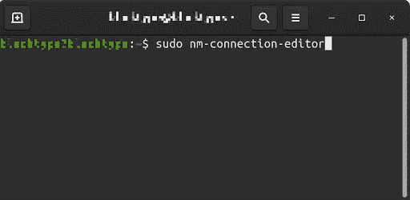
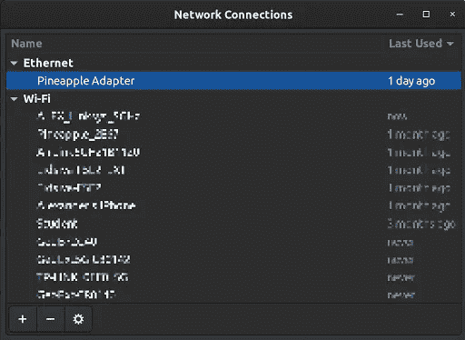
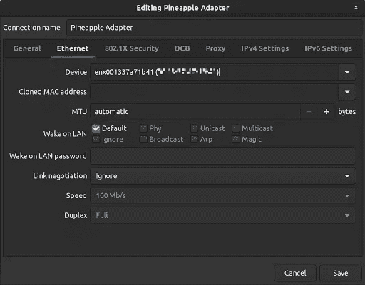
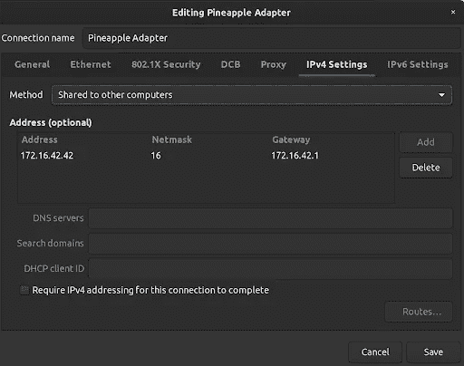

# Wifi 菠萝:如何在 Linux 上设置互联网连接共享(ICS)

> 原文：<https://infosecwriteups.com/wifi-pineapple-how-to-setup-internet-connection-sharing-ics-on-linux-e5a544345738?source=collection_archive---------0----------------------->

如何在 Linux 上设置互联网连接共享(ICS)。使用网络管理器连接编辑器，我可以通过运行 Ubuntu 20 的笔记本电脑路由互联网流量。

Wifi 菠萝|[www.hak5.org](http://www.hak5.org)

我最近买了一台 [hak5](http://www.hak5.org) wifi 菠萝 mark VII，并试图用运行 Ubuntu 20.04 的笔记本电脑设置互联网连接共享(ICS)。这是一次漫长的互联网之旅。

[Hak5](http://www.hak5.org) 确实提供了一个应该自动设置 ICS 的脚本。好得难以置信？是啊！至少对我来说是这样。每次运行脚本时，我都会失去 wifi 连接，不得不重启笔记本电脑。经过无数次尝试，我意识到我的笔记本电脑上的网络管理器在干扰，我必须自己解决这个问题。

你可能会问:为什么我真的要为此烦恼呢？或者为什么不直接用菠萝自带的 wifi 连接呢？原因是我需要通过我的笔记本电脑传送菠萝的所有数据。例如，通过这样做，我可以看到 Wireshark 中的所有数据。

当你想在 Ubuntu 20 上设置 ICS 时，首先要做的是打开一个终端并运行命令“sudo nm-connection-editor”

打开网络管理器连接编辑器的命令

这将显示所有的网络连接。选择代表您的 wifi 菠萝的连接。在我的例子中，我有一个已经重命名为“菠萝适配器”的概要文件。

查看以选择所需的网络连接

转到“以太网”选项卡，将您的设备设置为菠萝。

查看以编辑当前连接。选项卡:以太网

转到“IPv4 设置”选项卡，将方法更改为“共享给其他计算机”并添加地址。默认情况下，菠萝使用 IP 地址“172.16.42.42”和网关“172.16.42.1”。网络掩码是 16。

查看以编辑当前连接。选项卡:IPv4 设置

单击保存并关闭网络管理器连接编辑器。你应该重新连接菠萝，它应该工作。

您现在可以通过 [http://172.16.42.1:1471](http://172.16.42.1:1471) 访问菠萝管理

> 当我通过菠萝管理界面检查互联网连接时，我得到一个指示没有互联网的响应。这是不对的！我有互联网，可以为连接的设备提供互联网。