# 基于 Windows 的攻击—VulnServer TRUN 命令缓冲区溢出

> 原文：<https://infosecwriteups.com/windows-based-exploitation-vulnserver-trun-command-buffer-overflow-707faa669b4c?source=collection_archive---------0----------------------->

## 使用 IDA Pro 反转并用 Python 注入外壳代码

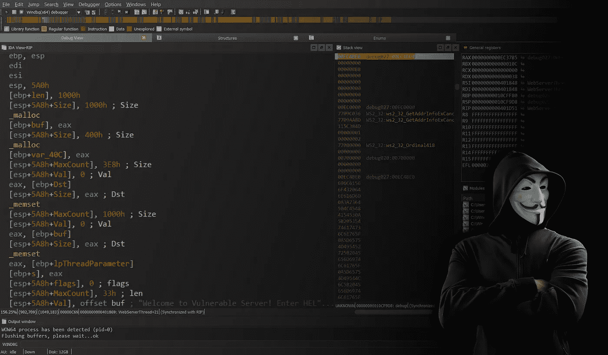

嘿伙计们！随着我越来越多地参与漏洞开发，我在各种默认易受攻击的软件上进行练习，其中之一就是 [VulnServer](https://github.com/stephenbradshaw/vulnserver) 。

简而言之，VulnServer 是一个很小的服务器，它暴露了一组到处都有漏洞的命令，随时可以被利用。

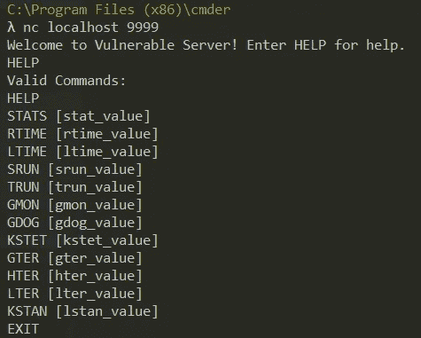

VulnServer 命令概述

它的一个漏洞存在于 TRUN 命令逻辑中，这也正是我在这篇博文中要针对的。

由于这是一个 Windows x86 软件，我将为该漏洞利用工作的环境是 Windows 10，带有 IDA Pro、WinDbg 调试器和 Python 2，用于构建该漏洞利用。

我会试着边走边解释，所以你可以随意跟着走。

# 回动的

虽然我有服务器的完整源代码，但我将反转 TRUN 命令的逻辑，因为这样更有趣！(我们了解更多..对吗？)我在这里的唯一假设是 TRUN 命令中存在漏洞。漏洞的类型和位置将是未知的！

在 IDA I 中打开 vulnserver.exe 可以快速跟踪套接字的创建和连接处理。然而，所有这些现在都无关紧要，所以我浏览了二进制文件的字符串以找到“TRUN”

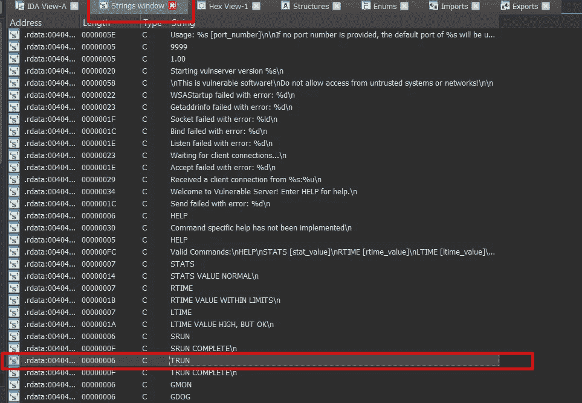

如果跟随，按 ENTER 键，然后按 Ctrl+X 显示对该字符串的所有引用。

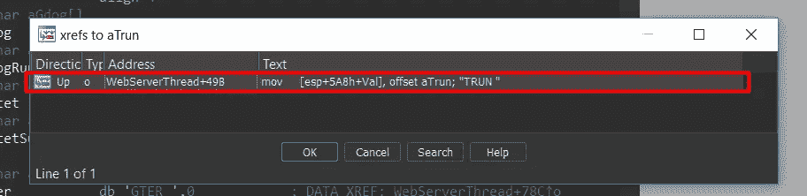

现在再次按回车键跳转到代码中唯一的引用。

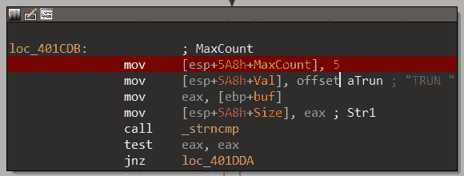

从反汇编的代码来看，程序似乎通过调用 *_strncmp 来检查缓冲区(可能是输入)是否等于“TRUN”。*为了方便起见，IDA 自己为 *_strncmp* 调用做了一些智能参数命名。

但是，让我们通过按 F2 键在代码块的开头放置一个断点，并调试代码，以检查测试值实际上在做什么。确保您已经安装了 WinDbg 并选择它作为 IDA 中的调试器，然后单击 Run。


服务器启动了，现在我们需要向套接字发送数据。由于 Windows OS 默认没有安装 netcat，所以从[这里](https://joncraton.org/files/nc111nt_safe.zip)下载，解压 zip(密码:nc) 复制到你的 System32 文件夹。

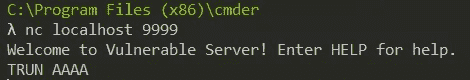

使用 netcat 向服务器发送带有一些测试数据的 TRUN 命令。(默认端口是 9999)

使用 F8 遍历前几行，我们可以看到程序确实检查了输入的前 5 个字符是否等于“TRUN”。如果是，它将向堆分配 3000 个字节，并将它们设置为 0。

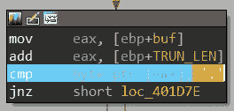

然后有一个有趣的行，它检查剩余输入的第一个字符是否是 2E，如果转换为 ASCII，则是“.”性格。而一个“.”字符，程序将在缓冲区中循环，如果没有找到，程序将退出。让我们再次调试，但现在输入以“.”开头。

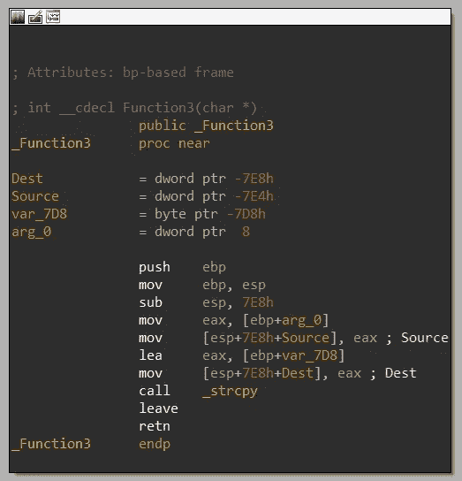

现在第一次检查通过了，程序将输入复制到之前分配的堆空间中。再往前走一点，会调用一个有趣的函数，名为“_Function3”。使用 F7 单步执行该函数，我们可以看到，该函数将堆空间的内容复制到堆栈中的缓冲区，但没有任何缓冲区边界检查，因此，理论上，应该可以覆盖缓冲区，从而覆盖返回地址！(注意，堆中分配的空间是 3000 字节，Function3 中的整个堆栈缓冲区是 2024 (7E8h)字节。)

# 剥削

既然我们已经走了这么远，并且颠倒了程序，让我们更勇敢一点，不模糊地执行溢出，而是通过计算找到偏移量。假设传递给 *_strcpy* 的目的地址是$EBP-7D8h (7D8 是 2008 字节)，我们需要 2012 (+4 字节来填充目的地当前指向的地址)字节来填充堆栈，直到 EBP，然后，下一个字(4 字节)是返回地址！

让我们试试吧！使用以下 python 代码将有效负载发送到服务器:

回到艾达，这是正确的观点！RIP 已被 0x42424242 覆盖！

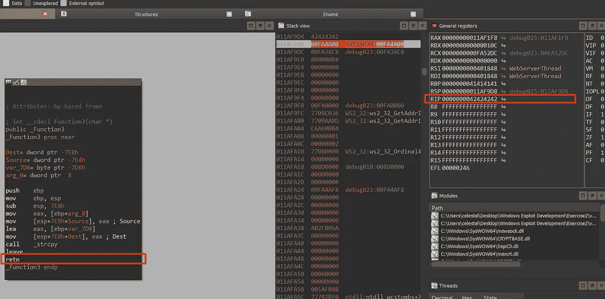

现在的下一个任务是创建一些外壳代码，将它作为有效载荷的一部分注入堆栈，并跳转到它。然而，我们不能在 EIP 直接硬编码堆栈地址，因为每次都不一样。因此，需要找到一个可靠的小工具，允许我们跳转到外壳代码。“jmp esp”指令正是我们所需要的，因为它直接指向我们覆盖的返回地址之后。

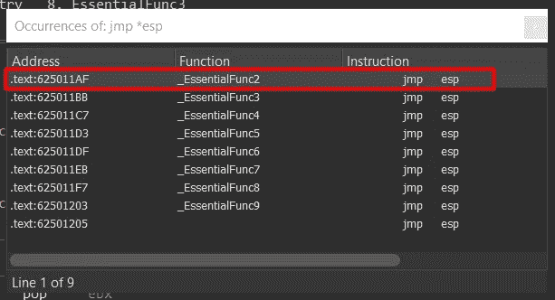

在 esfunc.dll 搜索“jmp esp”指令

IDA 可以用来搜索指令，就像它可以用来搜索文本一样。按 Alt+T，输入“jmp *esp”。不幸的是，vulnserver.exe 没有这样的指令，但是它附带的库(esfunc.dll)呢？事实上，esfunc.dll 在 0x625011AF 中有一个“jmp esp”指令。

最后，让我们制作一个弹出计算器的外壳代码(太经典了！)用作概念证明。由于我们将为此使用 *msfvenom* ，请确保您已经安装了 [metasploit 框架](https://www.metasploit.com/)。运行以下命令获取外壳代码。

```
msfvenom -p windows/exec CMD='calc.exe' exitfunc=thread -a x86 -f python -b '\x00'
```

请注意-b 参数，它设置了不良字符。考虑到输入缓冲区是使用 *strcpy* 和 *strncpy* 复制的，我们不希望我们的 shell 代码包含任何空字节，因为它们会中途终止复制。

最后，有了这些，我们就有了构建我们的概念利用证明所需的所有部分。

尽管返回到“jmp esp”会直接跳到我们的外壳代码上，但是如果你没有包含足够大的 NOP sled，它就不会工作。比如一个 8 字节的 NOP sled 就不行。这是因为外壳代码需要一些填充来编码，因此你需要通过 NOPs 给它一些空间。

表演时间到了！运行服务器，然后利用 python 漏洞。

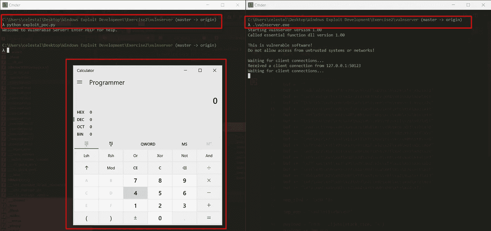

嘣！我们的恶意计算器弹出来了！😈

下次见，伙计们。