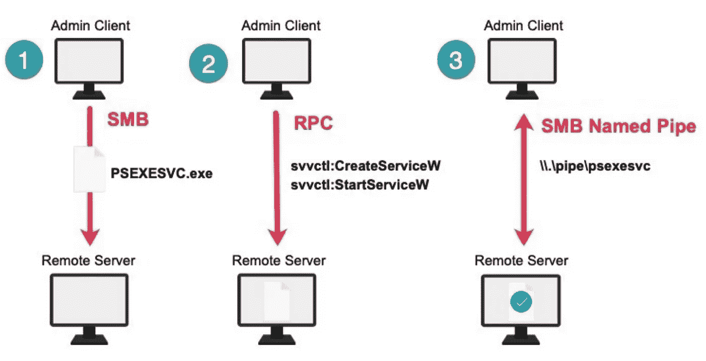

# Windows 威胁追踪:感兴趣的进程(第 2 部分)

> 原文：<https://infosecwriteups.com/windows-threat-hunting-processes-of-interest-part-2-b45d6fcd4e9?source=collection_archive---------0----------------------->

## 常见 Windows 进程以及黑客如何恶意使用它们的列表


(来源: [1920 × 1080](https://www.google.co.in/url?sa=i&url=https%3A%2F%2Fwww.pinterest.com%2Fpin%2F516647388497512938%2F&psig=AOvVaw1zSt8fwysjPo-IOj3uVsV_&ust=1632730140732000&source=images&cd=vfe&ved=0CAsQjRxqFwoTCMj42vSXnPMCFQAAAAAdAAAAABAz) )

我们将继续我们在 [***第 1 部分***](https://inf0spec.medium.com/windows-threat-hunting-processes-of-interest-4577fe35d32f) 中列出的进程，并讨论一些更合法的 Windows 进程及其恶意用例，以及一些有助于侦察的替代方法和进程。

## [vssadmin](https://docs.microsoft.com/en-us/windows-server/administration/windows-commands/vssadmin)

vssadmin 是一个内置的 Windows 实用程序，用于管理计算机上存储文件的卷影副本。这些卷影副本用作备份，有助于在数据丢失的情况下恢复损坏的文件。勒索软件攻击旨在通过加密系统上的数据和文件，然后索要赎金来释放对数据的控制，从而劫持对这些数据和文件的访问。拥有文件和数据的最新备份会阻碍攻击者的目标，因为数据很容易恢复。这就是为什么在勒索病毒活动中，攻击者试图使用 vssadmin 删除这些备份和卷影副本，以便受害者无法恢复文件。

**检测方法:**监控`vssadmin delete shadows`等卷影副本删除命令有助于检测勒索软件攻击。

## [psexec](https://docs.microsoft.com/en-us/sysinternals/downloads/psexec)

psexec 是一个独立的 Windows 实用程序，允许在远程系统上执行进程，并提供对远程主机上程序的交互式访问。对手经常滥用 *psexec* 在网络内进行横向移动，并在网络上的其他机器上执行命令。下面是 *psexec 的用法示例。*

```
psexec \\192.168.0.26 ipconfig /all *(Run command on remote host)*
```



工作流-启动 psexec 服务(来源:[工作流-启动-psexec](https://assets.extrahop.com/images/blogart/psexec/workflow-launching-psexec.jpg) )

**检测方法:**监控远程服务创建的 Sysmon 事件和系统日志— psexesvc 事件(代码:7045)

## [施塔克斯](https://docs.microsoft.com/en-us/windows-server/administration/windows-commands/schtasks)和[在](https://docs.microsoft.com/en-us/windows-server/administration/windows-commands/at)

*位于*的 schtasks 和*是 Windows 命令行实用程序，用于在 Windows 系统上创建和管理计划任务。对手可以使用计划任务来保持持久性，并可以通过执行计划任务来保持访问。任务计划程序还允许在特定用户环境下创建任务，并可用于权限提升。计划任务是 Windows 操作系统不可或缺的一部分，不能关闭或阻止。由于这个原因，恶意任务通常会与各种其他必要的合法计划任务混合在一起。*

**检测方法:**通过 Windows 事件日志监控计划任务的创建、修改、删除和使用。*PowerShell Get-scheduled task*可用于使用 PS remoting 从多个远程主机收集和检查计划任务列表。

## [wmic](https://docs.microsoft.com/en-us/windows/win32/wmisdk/wmic)

*wmic* 代表 Windows 管理规范命令，为 WMI 提供命令行界面，用于管理本地和远程 Windows 机器。它的功能包括显示系统设置、控制进程和执行脚本。它可以用于提取有关计算机的信息，也可以进行配置更改。它的特征可以被威胁者滥用于横向移动、发现和持续。

**检测方法:**监控 WMI 活动日志(事件 ID 5861)

## 尤蒂尔曼

*当点击登录屏幕上的“轻松访问”按钮时，utilman.exe*启动。默认情况下，utilman 以完全管理员权限执行。攻击者可以利用这一点，将 System32 文件夹中的 utilman.exe 可执行文件替换为 cmd.exe，这将允许攻击者只需单击锁定屏幕上的轻松访问按钮，就可以使用管理员权限启动 *cmd* 。通过这种访问，可以更改密码、创建新用户并赋予管理员权限等。这对 Windows 系统构成了严重威胁，并允许绕过身份验证。可以看一个 [**攻击模拟**](https://www.eventsentry.com/videos/Final.mp4) 更好的了解。

**检测方法:**监控 System32 文件夹中文件的更改以及对*utilman.exe*的任何修改

# 其他代码执行替代方案:

## [脚本](https://docs.microsoft.com/en-us/windows-server/administration/windows-commands/wscript)和[脚本](https://docs.microsoft.com/en-us/windows-server/administration/windows-commands/cscript)

*wscript* 是 Windows 脚本宿主。它可以用来执行各种语言的脚本。
*cscript* 是一个命令行工具，可以用来触发脚本，它有许多脚本参数，可以指定这些参数来定义脚本将如何执行。cscript 和 wscript 的不同之处在于，cscript 是一个纯命令行工具，而 wscript 也可以提供交互式输出。它们主要被攻击者用来运行恶意的 Javascript 或 VBscript，因为它们是内置的合法工具，如果目标环境中的检测方法不考虑它们的使用，它们可能会被规避。

## [csc.exe](https://docs.microsoft.com/en-us/dotnet/csharp/language-reference/compiler-options/)

*csc* 是一个内置的命令行工具，可以用来编译 C#代码，然后作为*执行。exe* 或*。dll* 文件。攻击者可以利用它来绕过原本不允许代码执行的防范措施。下面是一些使用方法的例子。

```
**csc -out:code.exe filename.cs** (Compile filename.cs and output to an executable)**csc -target:library filename.cs** (Compile filename.cs and output to a dll file)
```

# 有助于侦查的流程:

## [whoami](https://docs.microsoft.com/en-us/windows-server/administration/windows-commands/whoami)

whoami 命令返回关于当前登录到系统的用户及其权限的信息。攻击者通常使用 whoami 来发现用户和验证提升的权限。

## 系统信息

systeminfo 命令显示关于系统的许多信息，如 IP 地址、操作系统名称和版本、域名等。这对于攻击者收集信息和枚举以计划横向移动是有用的。

## [csvde](https://docs.microsoft.com/en-us/previous-versions/windows/it-pro/windows-server-2012-r2-and-2012/cc732101(v=ws.11))

*csvde* 是一个命令行实用程序，允许从活动目录服务导入和导出数据。这对于信息收集以及用户和域发现来说是一个有用的工具。

有太多这样的合法程序可以被伪装成恶意程序使用。了解这些可以帮助我们更好地识别威胁，拥有一个描述这些威胁的列表可以证明是有帮助的。请提供反馈，并让我知道是否有更多的流程可以添加到此列表中。

## 感谢阅读！:)