# 温贾·CTF 2020:报道

> 原文：<https://infosecwriteups.com/winja-ctf-write-up-f33db5ee7afe?source=collection_archive---------2----------------------->

今天我参加了 Winja CTF，这是一次非常棒的经历。

我能够解决 7 个挑战，所以我在这里分享我解决它们的方法。

# 1.骗子骗子

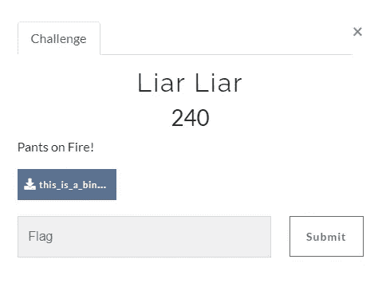

我做的第一件事是检查“文件”命令本身。

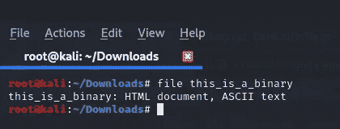

文件

所以它是 ASCII 文本文件。

所以我试着用二进制

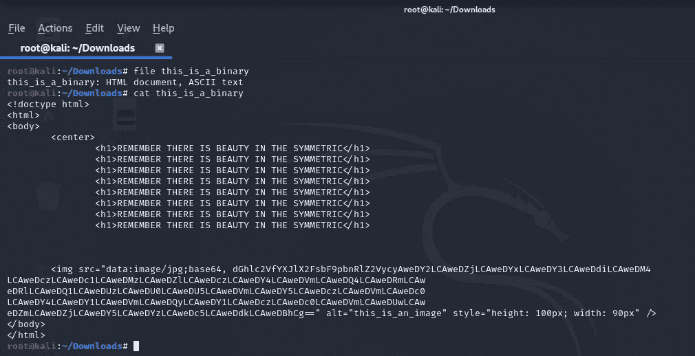

卡特彼勒文件

在 img src 中，我们可以看到有一个 base64 字符串。所以接下来我做的是用 base64 解码

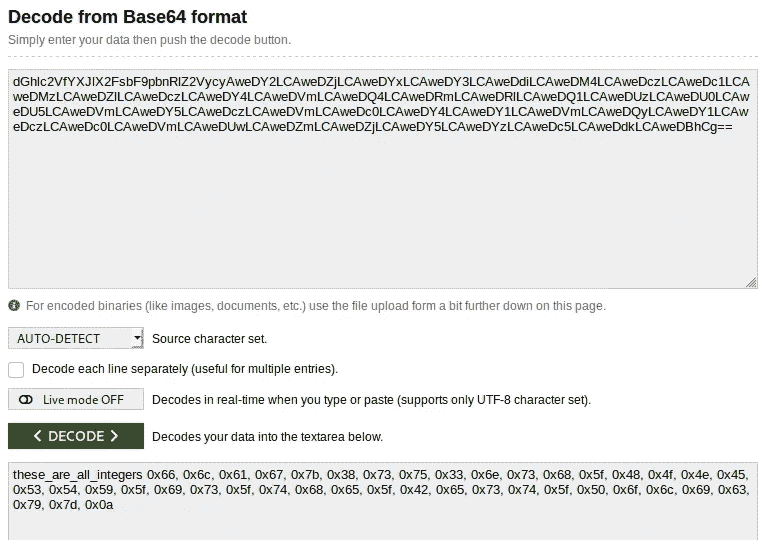

base64

所以我们得到了十六进制值。

所以我做的下一件事是“十六进制到 ASCII”

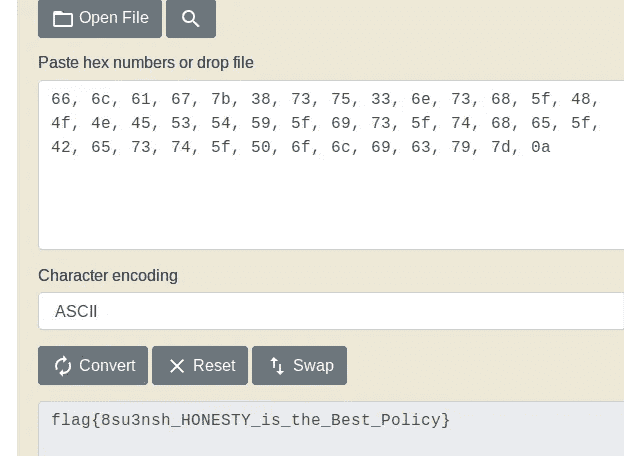

十六进制到 ascii

> **Flag:Flag { 8su 3 nsh _ honest _ is _ the _ Best _ Policy }**

# 2.拉链炸弹

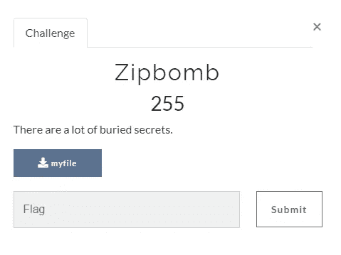

所以我下载了附件，

这是一个 zip 文件，所以我在提取第二个 zip 文件时一个接一个地提取它。我们需要给出一个密码，所以我猜测密码是“pass123 ”,我的猜测是正确的。否则，我会使用“ilostmypass.com”在线破解 zip 密码

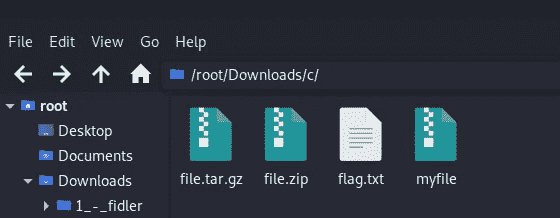

下一步是打开 flag.txt 文件

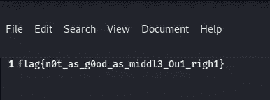

> **Flag:Flag { n0t _ as _ g0od _ as _ middle L3 _ 0u 1 _ rig h1 }**

# 3.F@#$你的思想

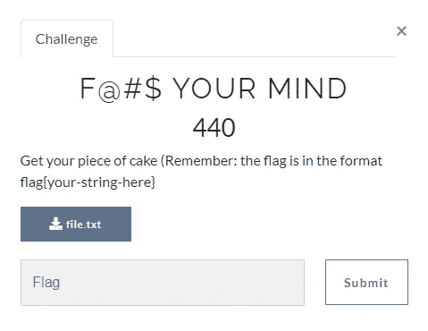

我们得到了一个 txt 文件。它看起来像这样

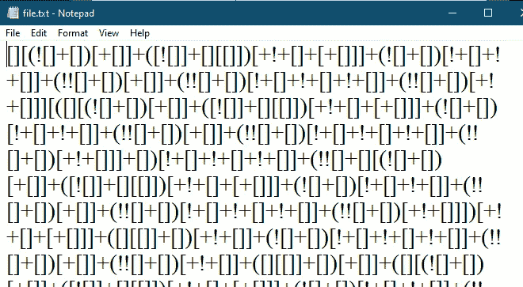

乍一看，我知道这是 javascript 混淆代码(当你玩更多的 CTF 游戏时，你可以通过观察来预测事情)

所以我用 https://lelinhtinh.github.io/de4js/[去泡沫。](https://lelinhtinh.github.io/de4js/)

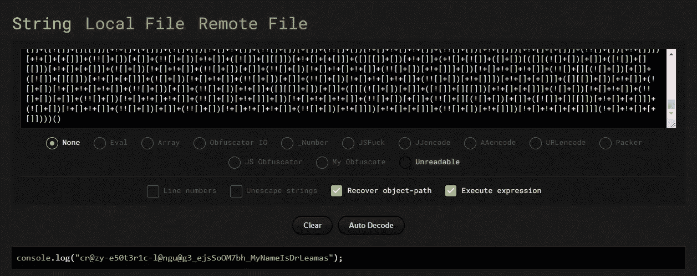

在挑战中，他们告诉我们将字符串放入“flag{}”

> **标志:**
> 
> **flag { Cr @ zy-e 50 t3r 1c-l @ ngu @ G3 _ ejs soom 7 BH _ MyNameIsDrLeamas }**

# 4.Attack.log

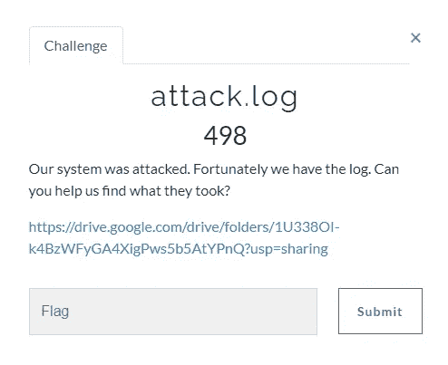

我们收到了一份 pcap 文件。

我做的第一件事是导出所有文件。(导出 HTTP 对象列表)

如我们所见，我们有 3 个文件。一个“Linux-virus”文件和两个 HTML 文件

所以我在 linux-virus 文件上尝试了字符串。

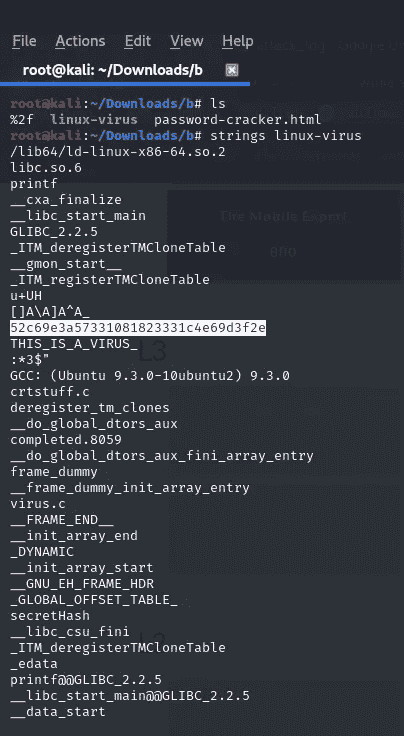

在上图中，你可以看到我突出显示了一些哈希值，

乍一看，在字符串中看到哈希值很奇怪。所以我试着通过 CRACKSTATION 破解这个哈希值。我是对的，它是哈希值，得到值“999999”

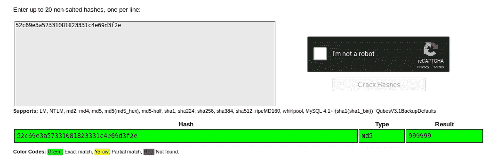

所以现在我打开 HTML 文件，试图找到“999999”

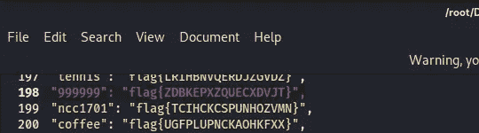

我在 HTML 文件上找到了“999999 ”,并提交了一个标志值。

> **Flag:Flag { ZDBKEPXZQUECXDVJT }**

# 5.风险规避

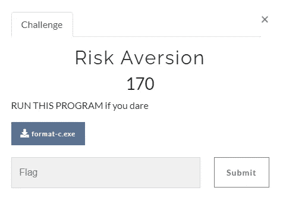

我们得到了一个 exe 文件。

所以我做的第一件事是在 exe 上执行“文件”命令

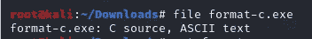

所以我们可以看到它不是 exe 文件，而是 ASCII 文本文件。

接下来我做的是“cat 格式-c.exe”

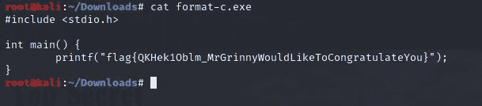

> **Flag:Flag { qkhek 1 oblm _ mrgrinnywoulketoconsgratulateyu }**

# 6.交易员的策略 1

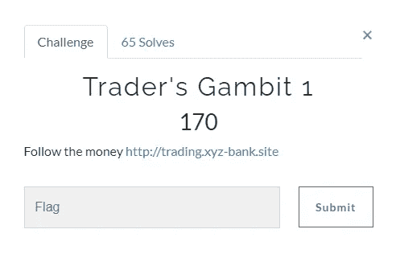

交易员的策略 1

所以首先我访问了这个网站

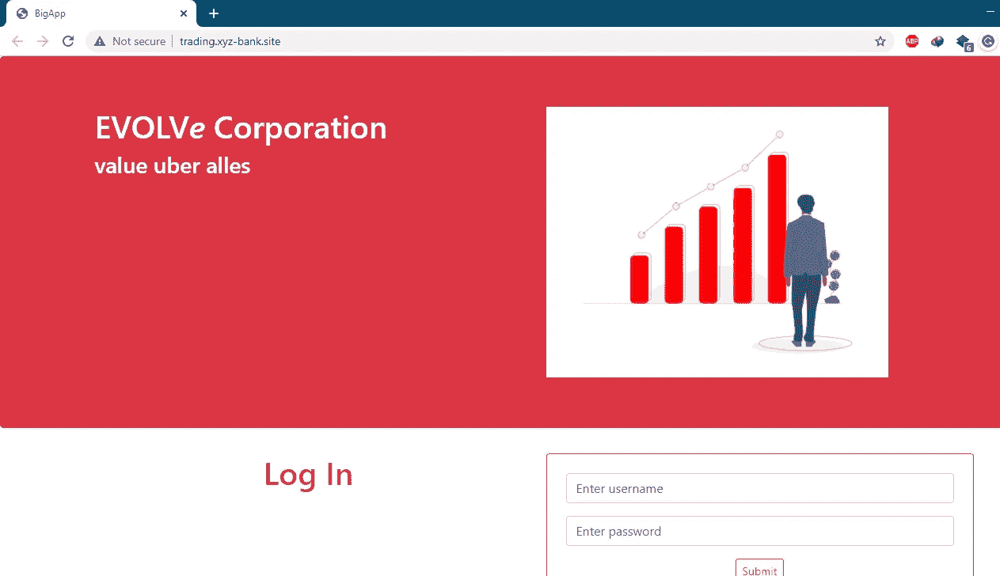

银行.网站

所以看了不同的东西“源代码”，“javascript 文件”，“css”等。

然后我想让我试试不同的网址，比如“/admin，/login，/robots.txt”。

过了一会儿，我试了试“/flags”，得到了 2 个 flags。

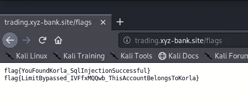

旗帜

所以第一面旗是为了这次挑战。

> **Flag:Flag { YouFoundKorla _ SqlInjectionSuccessful }**

# 7.交易者的策略 2

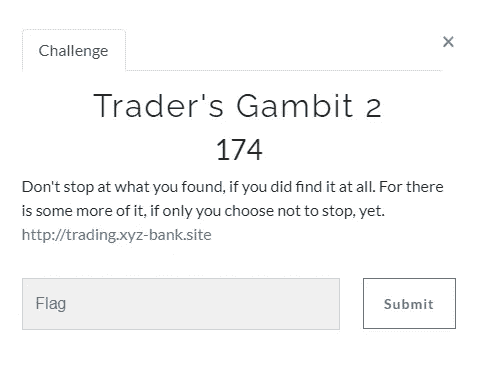

所以当我看到这个网址时，它是同一个网址，所以在之前的挑战中我们发现了两个标志，所以第二个标志是这个挑战的标志。

> **flag:flag { limit bypassed _ IVFfxMQQwb _ thiaccountbelongstokorla }**

感谢您的阅读。

您可以在下面的链接中找到所有资源。

[https://github . com/Raj 1997/CTF-向上写/tree/master/Winja_CTF](https://github.com/raj1997/CTF-Write-up/tree/master/Winja_CTF/)