# Wireshark 101 演练(Tryhackme)

> 原文：<https://infosecwriteups.com/wireshark-101-walkthrough-tryhackme-4d9f7d4264b0?source=collection_archive---------0----------------------->

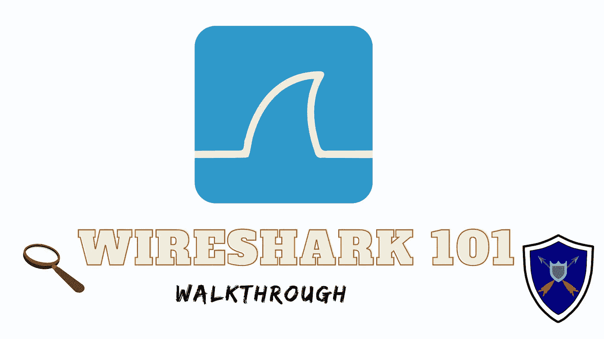

## Q1)数据包 6 的操作码是什么？

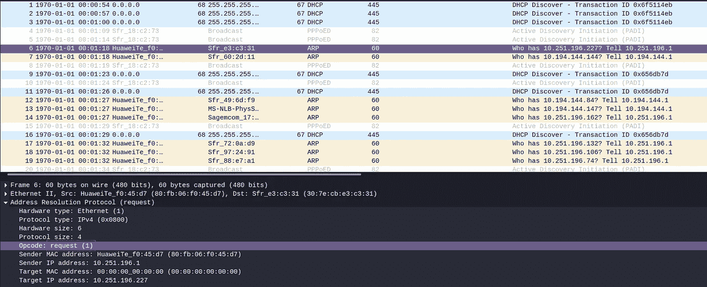

> **答:请求(1)**

## Q2)数据包 19 的源 MAC 地址是什么？

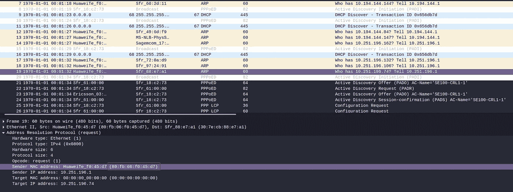

**ANS : 80:fb:06:f0:45:d7**

## Q3)哪 4 个数据包是回复数据包？

> 提示:对选择操作码 2 数据包使用 arp.opcode==2 过滤器

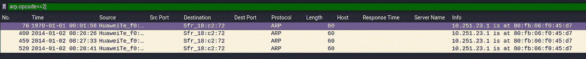

**答案:76400459520**

## Q4)80:FB:06:F0:45:D7 是什么 IP 地址？

提示:使用 arp.dst.proto_ipv4

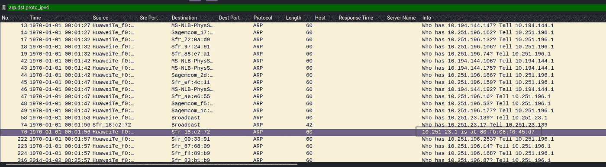

**答复:10.251.23.1**

## Q5)数据包 4 的类型是什么？

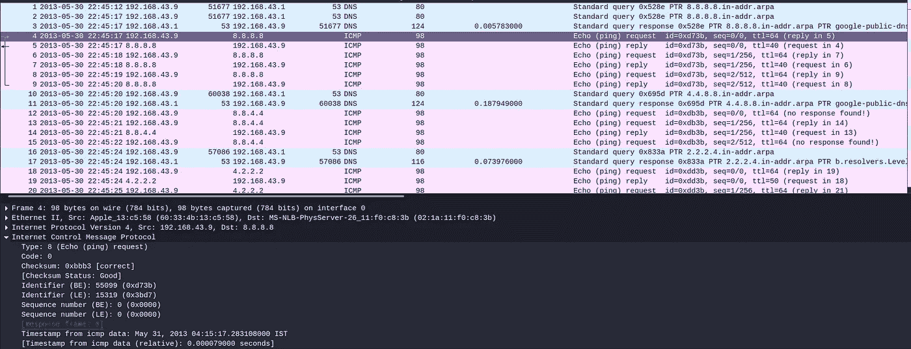

**答案:8**

## Q6)数据包 5 的类型是什么？

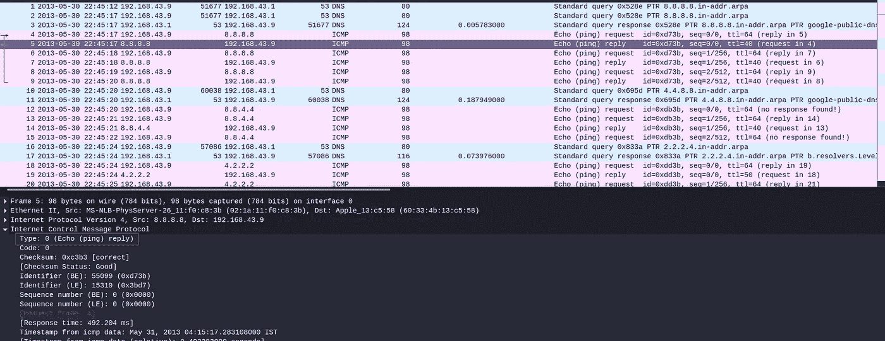

**答:0**

## Q7)数据包 12 的时间戳是多少，仅包括年月日？

*注意:Wireshark 根据您设备的时区来计算时间，如果您的答案是错误的，请多试一天。*

**答:2013 年 5 月 30 日**

## Q8)数据包 18 的完整数据字符串是什么？

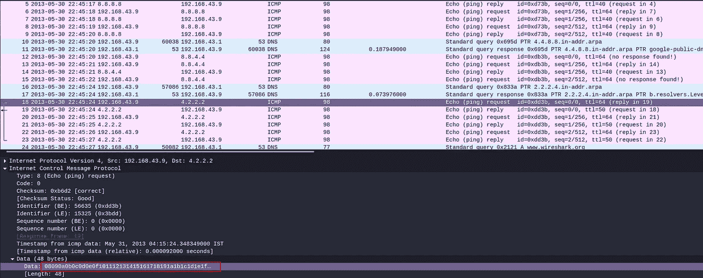

**ANS:08090 a 0 b 0 c 0d 0 e 0 f 101112131415161718191 a1 B1 C1 D1 E1 f 202122232425262728292 a2 B2 C2 D2 e 2f 3031323334353637**

## Q9)数据包 1 中查询的是什么？

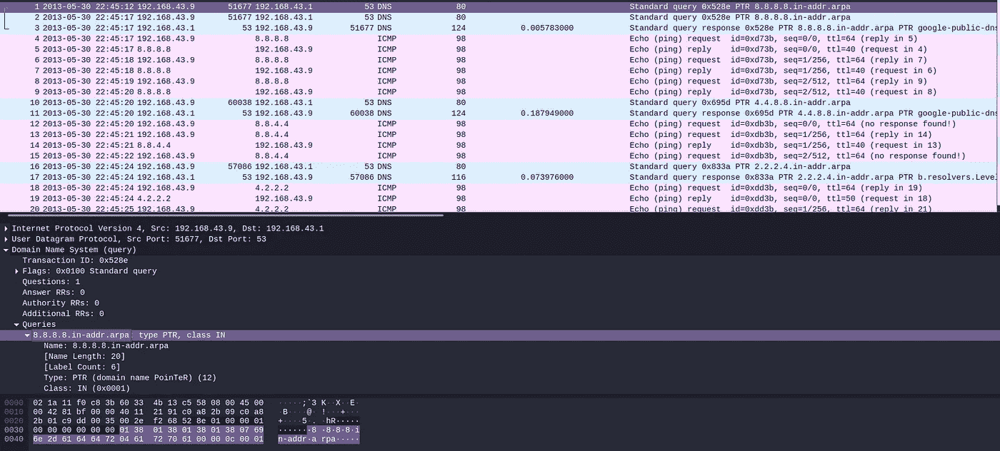

**ANS:8 . 8 . 8 . 8 . in-addr . arpa**

## Q10)数据包 26 中查询的是哪个站点？

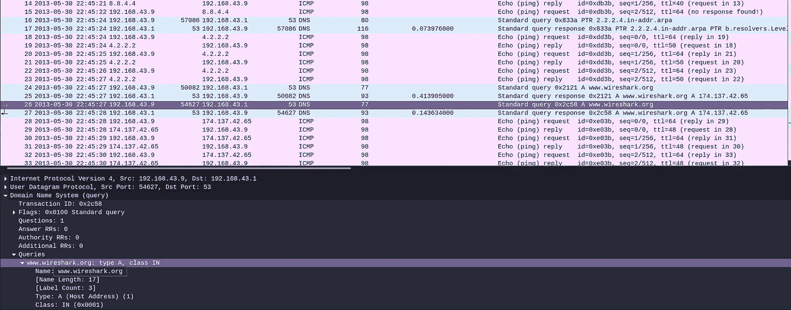

**答:www.wireshark.org**

## Q11)数据包 26 的交易 ID 是什么？

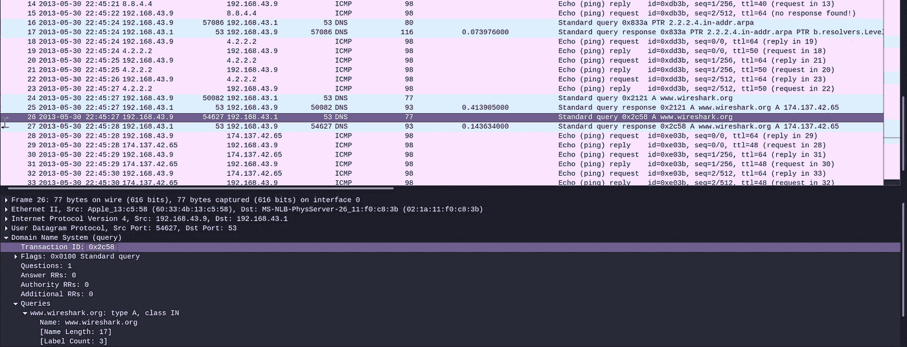

**答案:0x2c58**

## Q12)来自域名系统的数据包占多大比例？

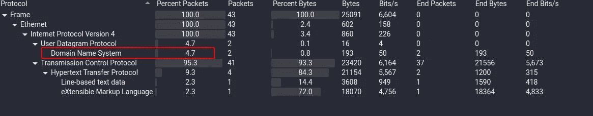

**答:4.7**

## Q13)哪个端点以. 237 结尾？

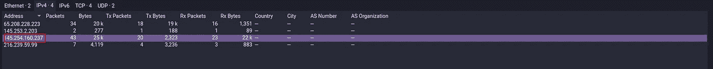

**答:145.254.160.237**

## Q14)数据包 4 中列出的用户代理是什么？

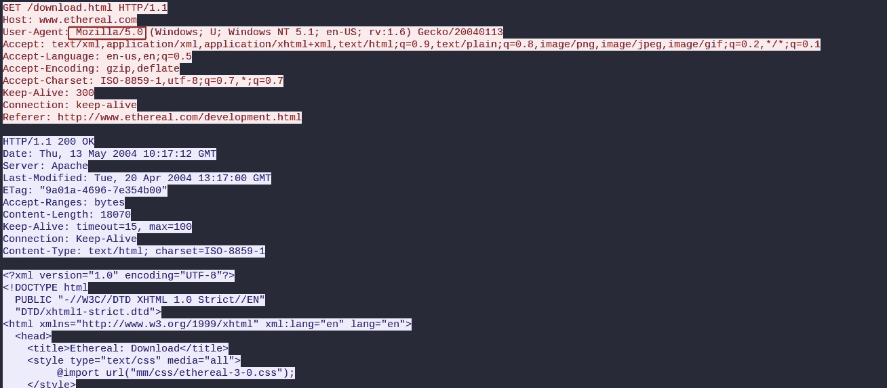

**ANS:Mozilla/5.0(Windows；u；Windows NT 5.1en-US；rv:1.6)壁虎/20040113**

## Q15)查看数据流，数据包 18 的完整请求 URI 是什么？

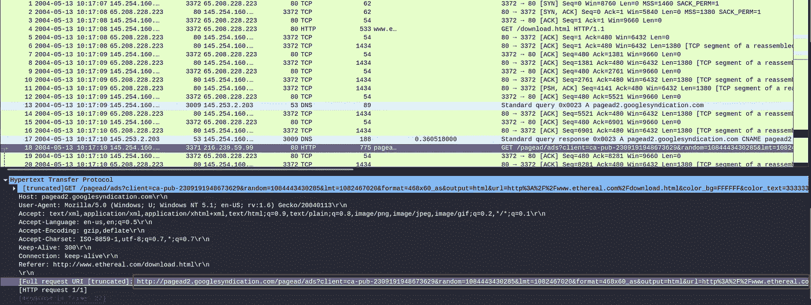

答案:http://pagead2.googlesyndication.com/pagead/ads?client = ca-pub-2309191948673629&random = 1084443430285&LMT = 1082467020&format = 468 X60 _ as&output = html&URL = http % 3A % 2F % 2fwww . ethereal . com % 2f download . html&color _ BG = ffff&color _ color

## Q16)数据包 38 中请求的域名是什么？

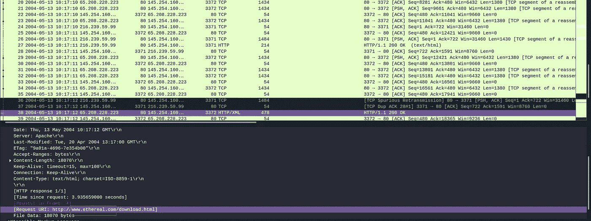

**答:www.ethereal.com**

## Q17)查看数据流，数据包 38 的完整请求 URI 是什么？

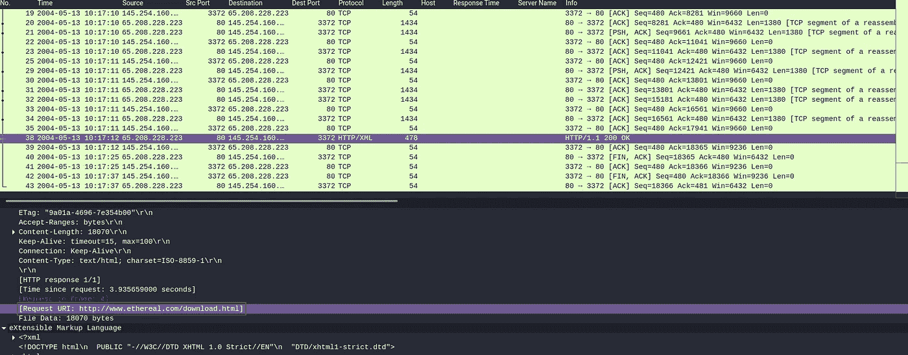

> 答:http://www.ethereal.com/download.html

在我们开始 https 分析之前。我们需要给 Wireshark 添加私钥。因为如果我们试图解密 https 通信。我们必须知道私钥。https 加密使用公钥和私钥进行加密。它为用户提供了更多的保护，并有助于防止其他攻击

转到 wireshark ->编辑->首选项->协议-> TLS

并将这些值放入 RSA 密钥列表部分

IP 地址:127.0.0.1

端口:开始 _tls

协议:http

密钥文件:RSA 密钥位置

## Q18)查看数据流，数据包 31 的完整请求 URI 是什么？

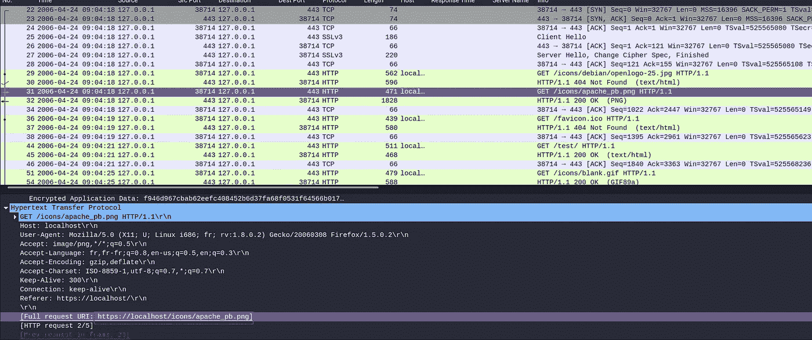

> ANS:https://localhost/icons/Apache _ Pb . png

## Q19)查看数据流，数据包 50 的完整请求 URI 是多少？

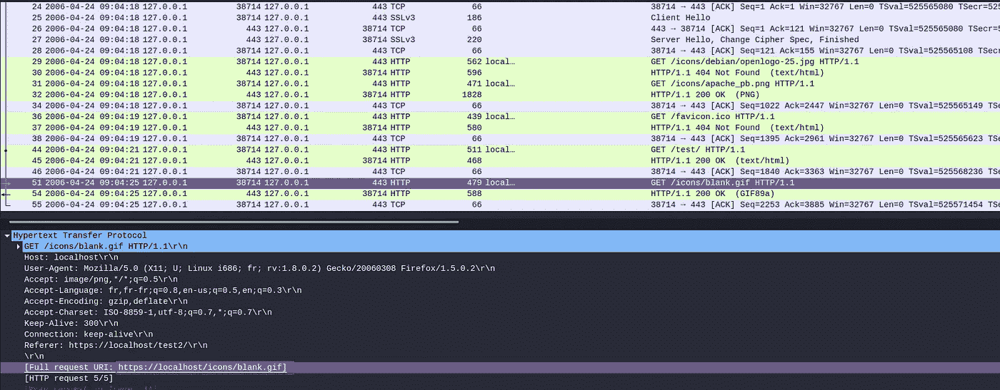

**ANS:https://localhost/icons/back . gif**

## 问题 20)数据包 50 中列出的用户代理是什么？

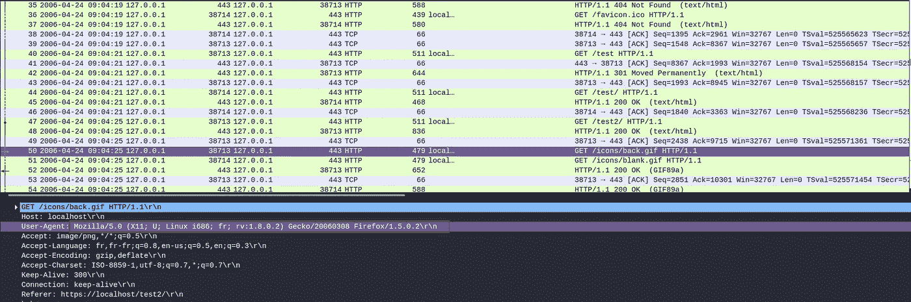

**ANS:Mozilla/5.0(X11；u；Linux i686fr；RV:1 . 8 . 0 . 2)Gecko/2006 03 08 Firefox/1 . 5 . 0 . 2 \ r \ n**

引用链接

 [## Wireshark 显示过滤器参考:地址解析协议

### 显示过滤器参考:地址解析协议

显示过滤器参考:地址解析协议 www.wireshark](https://www.wireshark.org/docs/dfref/a/arp.html)  [## ARP 中毒:它是什么&如何防止 ARP 欺骗攻击

### ARP 中毒是一种网络攻击，它滥用广泛使用的地址解析协议(ARP)中的弱点来…

www.varonis.com](https://www.varonis.com/blog/arp-poisoning/) 

[https://www . cloud flare . com/learning/DDOS/glossary/internet-control-message-protocol-icmp/](https://www.cloudflare.com/learning/ddos/glossary/internet-control-message-protocol-icmp/)