# Wireshark:基础——TryHackMe

> 原文：<https://infosecwriteups.com/wireshark-the-basics-tryhackme-57e50c7d9c4f?source=collection_archive---------0----------------------->


Wireshark:基础编写和演练

# 任务 1 —简介

1.  哪个文件是用来**模拟**截图的？

```
Ans: http1.pcapng
```

2.哪个文件是用来**回答**问题的？

```
Ans: Exercise.pcapng
```

# 任务 2 —总体概述

1.  阅读**【捕获文件注释】**。国旗是什么？


您可以通过单击左下角的捕获文件属性来查看注释

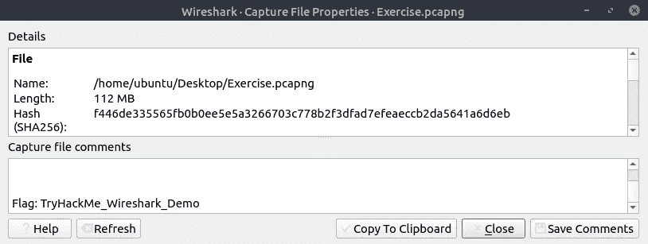

```
Ans: TryHackMe_Wireshark_Demo
```

2.包的总数是多少？


在底部，你可以看到包的数量

```
Ans: 58620
```

3.捕获文件的 **SHA256 hash** 值是多少？

哈希值在捕获文件属性中也可用


```
Ans:f446de335565fb0b0ee5e5a3266703c778b2f3dfad7efeaeccb2da5641a6d6eb
```

# 任务 3 —数据包解析

1.  **查看包号 38。**HTTP 协议下用的是哪种标记语言？

通过滚动搜索数据包编号 38

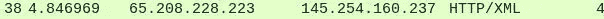

```
Ans: Extensible Markup Language
```

2.包裹的到达日期是什么时候？(回答格式:月/日/年)

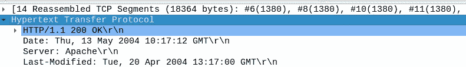

```
Ans: 05/13/2004
```

3.TTL 值是多少？

你可以在互联网协议部分找到 TTL


```
Ans: 47
```

4.TCP 有效负载的大小是多少？

你可以在 TCP 部分找到 TCP 有效负载的大小

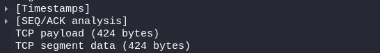

```
Ans: 424
```

5.电子标签值是多少？

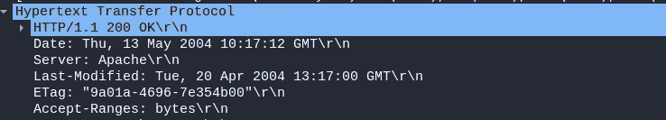

```
Ans: 9a01a-4696-7e354b00
```

# 任务 4 —数据包导航

1.  在数据包详细信息中搜索**“r4w”字符串**。艺术家 1 的名字是什么？

通过 **Ctrl+F** 或 **Edit > Find Packet** 搜索字符串


```
Ans: r4w8173
```

2.**转到数据包 12** 并阅读注释。答案是什么？

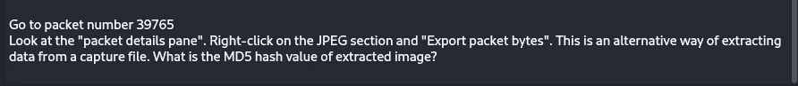

然后从图像中找到 [MD5 哈希值](https://www.conversion-tool.com/md5/)

```
Ans: 911cd574a42865a956ccde2d04495ebf
```

3.还有一个**”。txt"** 文件里面的捕获文件。找到文件并阅读它；外星人的名字是什么？

搜索**。txt 使用 Ctrl+f**

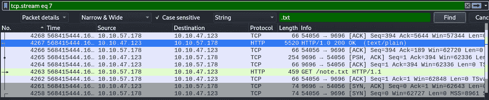

你可以找到 HTTP 数据包

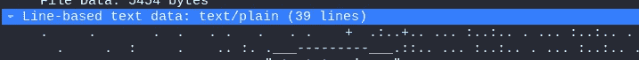

将数据包导出为字节


```
Ans: Packetmaster
```

# 任务 5

1.  **转到 4 号数据包。右键点击“超文本传输协议”,将其作为过滤器使用。现在，看看过滤器窗格。什么是过滤查询？**

```
Ans: Http
```

2.显示的数据包数量是多少？


```
Ans: 1089
```

3.**转到数据包编号 33790** 并跟随流。艺人总数是多少？

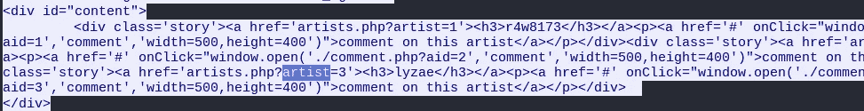

这里我们可以看到艺术家有 3 个 id

```
Ans: 3
```

4.第二个艺术家的名字是什么？

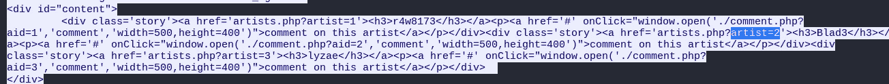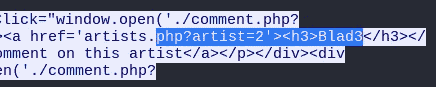

```
Ans: Blad3
```

感谢您的阅读！！！

黑客快乐！！！

## 来自 Infosec 的报道:Infosec 每天都有很多内容，很难跟上。[加入我们的每周简讯](https://weekly.infosecwriteups.com/)以 5 篇文章、4 个线程、3 个视频、2 个 GitHub Repos 和工具以及 1 个工作提醒的形式免费获取所有最新的 Infosec 趋势！