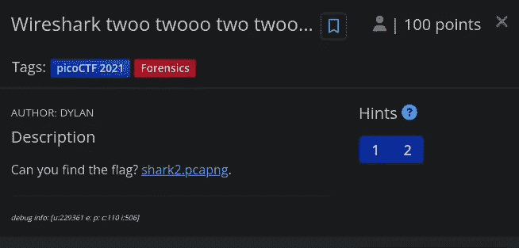
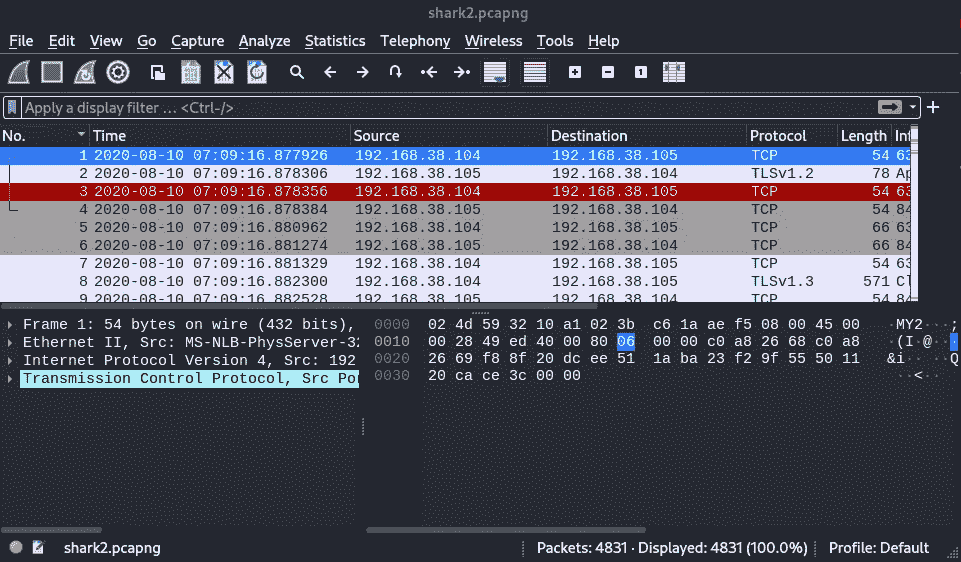
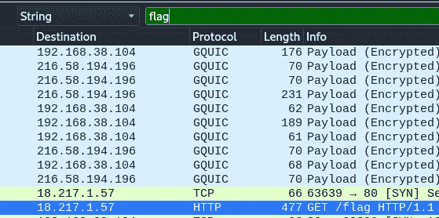
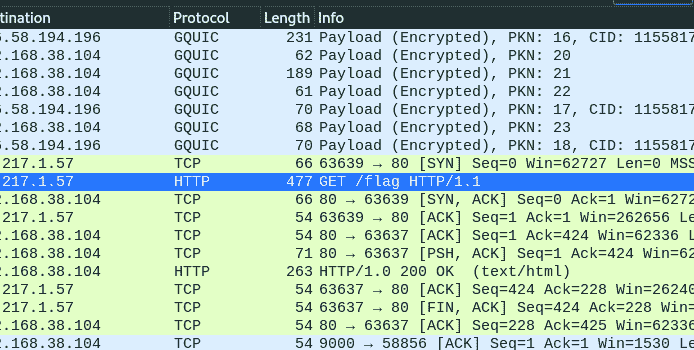
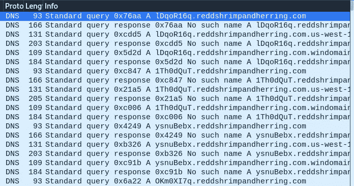
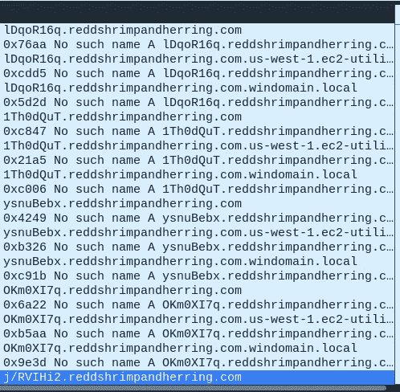
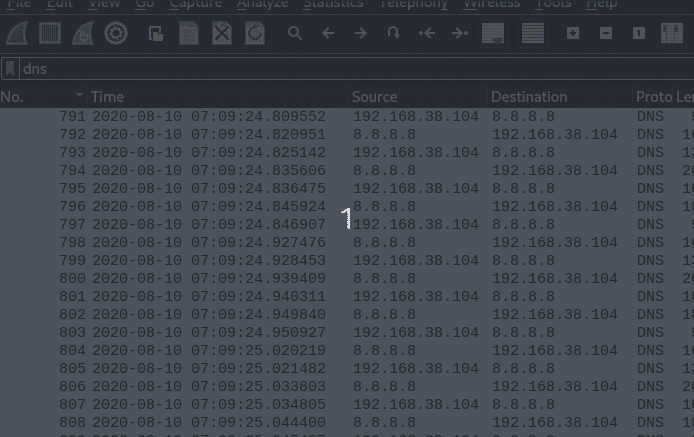
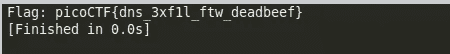

# wireshark twoo-Forensics | PicoCTF 报道| 100 分

> 原文：<https://infosecwriteups.com/wireshark-twoo-forensics-picoctf-write-up-100-points-bb3dbc9e14ec?source=collection_archive---------2----------------------->

## Wireshark twoo twoo (100 分)— PicoCTF 法医挑战报道| Karthikeyan Nagaraj



## 描述:

你能找到旗子吗？ [shark2.pcapng](https://mercury.picoctf.net/static/7b8e53329b34946177a9b5f2860a0292/shark2.pcapng) 。

## 使用的工具— Wireshark

## 任务文件:

[https://mercury . picoctf . net/static/7b8e 53329 b 34946177 a9 b5 f 2860 a 0292/shark 2 . pcapng](https://mercury.picoctf.net/static/7b8e53329b34946177a9b5f2860a0292/shark2.pcapng)

## 分析

1.  在 Wireshark 中打开`shark2.pcapng`任务文件



让我们找找任何可疑的包裹

2.搜索字符串，如 flag，txt，pico，因为它是 CTF 或任何其他相关词类似于我们期望找到的



3.通过搜索单词`flag`，我们发现了一个 HTTP 请求，其中有一个对`/flag`的`GET`请求



4.右键单击并跟随 HTTP 流。

```
GET /flag HTTP/1.1
Host: 18.217.1.57
Connection: keep-alive
Upgrade-Insecure-Requests: 1
User-Agent: Mozilla/5.0 (Windows NT 10.0; Win64; x64) AppleWebKit/537.36 (KHTML, like Gecko) Chrome/84.0.4147.105 Safari/537.36
Accept: text/html,application/xhtml+xml,application/xml;q=0.9,image/webp,image/apng,*/*;q=0.8,application/signed-exchange;v=b3;q=0.9
Accept-Encoding: gzip, deflate
Accept-Language: en-US,en;q=0.9

HTTP/1.0 200 OK
Content-Type: text/html; charset=utf-8
Content-Length: 73
Server: Werkzeug/1.0.1 Python/3.6.9
Date: Mon, 10 Aug 2020 01:39:19 GMT

picoCTF{bfe48e8500c454d647c55a4471985e776a07b26cba64526713f43758599aa98b 
```

在底部，你可以看到一个类似旗帜的字符串，但不幸的是，这不是旗帜。让我们寻找 DNS 请求。

5.在 Wireshark 中应用 dns 过滤器



在这里，我们可以看到在域`reddshrimpandherring.com`前面有一些随机的 base64 编码字符串前缀，所以让我们尝试解码所有内容
，为了做到这一点，我们需要将捕获文件导出为 csv 格式，以便用 python 进行进一步分析

6.点击`file → Export packet dissections`导出截图



7.下面的 python 代码将读取导出的`csv`文件中的行，并首先对字符串`“Standard query .+ A (.+)”`执行`regular expression search`以过滤掉域，因为它有一个字符串“标准查询”

8.然后，base64 编码部分从域中分离出来到达 `b64_portion`

9.然后`b64_portion`被解码并存储到`b64_decoded`

10.并且进一步通过 Utf-8 编码方案对其进行解码，并将其存储到`ascii_portion`中，然后基于如果`val(ascii_portion)`和如果`current ascii_portion not equals to the end value of result (pre value)`满足以下条件，将其添加到结果变量中

如果给定字符串中的字母为
1，则`val()`方法返回`True`。不是字母表和
2。不是一个数字和
3。不是“{”和
4。不是" } "和
5。不是" _"
否则`False`

```
import re
import base64

result = ''

def val(s):
    for c in s:
        if not c.isalpha() and not c.isnumeric() and not c == '{' and not c == '}' and not c == '_':
            return False
    return True

# Make sure to write the Actual name of csv you used to save.
# Here I saved my csv file as capture.csv

with open('capture.csv', 'r') as f:
    line = f.readline()
    while line:
        if 'Standard query' in line:
            m = re.search(r"Standard query .+ A (.+)", line)
            b64_portion = m[1].split('.')[0]
            b64_decoded = base64.b64decode(b64_portion)

            try:
                ascii_portion = b64_decoded.decode('utf-8')

            except:
                pass

            else:
                if val(ascii_portion) and not result.endswith(ascii_portion):
                    result += ascii_portion

        line = f.readline()

print('Flag:', result)
```

**输出:**



```
Ans: picoCTF{dns_3xf1l_ftw_deadbeef}
```

请随时通过 [LinkedIn](https://www.linkedin.com/in/karthikeyan-nagaraj) :)提问

[](https://buymeacoffee.com/cyberw1ng)

感谢您的阅读！！

捕捉快乐~

```
Author: Karthikeyan Nagaraj
```

ctf，forensics，wireshark，捕获旗帜，挑战，报道，旗帜，karthikeyan nagaraj，cyberw1ng

## 来自 Infosec 的报道:Infosec 每天都有很多内容，很难跟上。[加入我们的每周简讯](https://weekly.infosecwriteups.com/)以 5 篇文章、4 个线程、3 个视频、2 个 GitHub Repos 和工具以及 1 个工作提醒的形式免费获取所有最新的 Infosec 趋势！