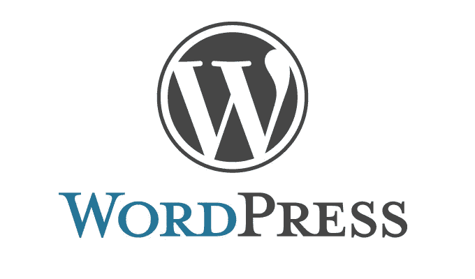
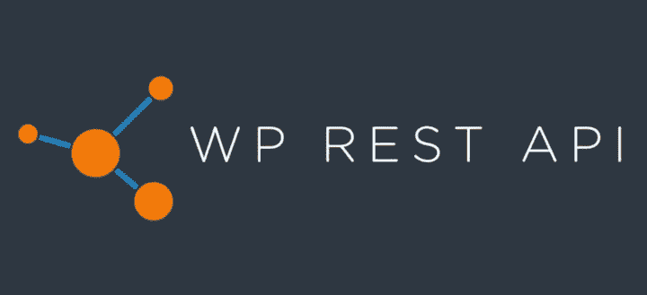
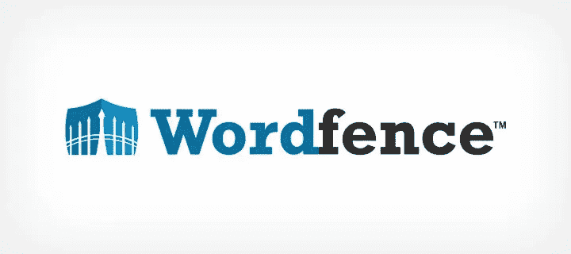

# WordPress 安全

> 原文：<https://infosecwriteups.com/wordpress-security-c8ea1891bd51?source=collection_archive---------2----------------------->

[来源](https://blog.malwarebytes.com/malwarebytes-news/2021/10/multiple-vulnerabilities-in-popular-wordpress-plugin-wp-fastest-cache/)

最初是一个博客平台，现已成为许多初创公司、公司、有影响力的人和博客作者的救星。WordPress 为超过 43%的网站提供支持，这相当于 6400 万个网站。每天有 661 个新的 WordPress 网站上线，有 50，000 个插件可以满足不同的需求，它已经发展成为一个强大的网站建设者和一个强大的内容管理平台(CMS)。

但是在我们进入 WordPress 安全之前，它是如何发展得如此之快，每个季度都有新的和更新的版本出现？

首先，它是免费的、开源的，其次，是可定制的。从开发人员的角度来看，您不必担心授权问题，因为有 6 种不同的现成用户角色可供您使用。

现在我们已经有了基本的知识，让我们来讨论一些安全措施，你可以在安装 WordPress 的新版本时加强你的安全性。

1.  **去掉默认用户名和常用密码。**

我们都犯了这个错误。“admin”是互联网上最常见、最常用的用户名。我需要什么来强行进入你的账户？只有用户名和密码。如果知道用户名，攻击者就完成了一半的工作。他们现在只需要暴力破解密码。但有时，这也不是障碍。许多管理员在网上很容易找到的密码列表的顶部使用普通密码。

除了网站之外，默认或常用的登录和密码适用于配置为与您的站点配合使用的数据库。此外，确保公众无法接触到它。

因此，建议您选择包含大小写字母、数字和其他特殊字符的密码短语或密码。也删除管理员的用户名，或施加速率限制。通过实现双因素身份认证，可以在蛋糕上加一颗樱桃。

**2。过时的核心软件和插件。**

[来源](https://wedevs.com/blog/91466/must-have-free-wordpress-plugins/)

WordPress 是互联网上最常用的 CMS，是黑客寻找 WordPress 引擎安全漏洞的绝佳目标。为了解决这些问题，WordPress 开发者每个季度都会发布更新。建议安装更新，因为 WordPress 不会自动为您安装更新。WordPress 依靠主题和插件来改善网站的整体外观。这些插件和主题也代表了一种担忧，因为一些插件可能包含漏洞，使得 WordPress 的安装被黑客攻击。因此，应该有必要定期更新插件。

**3。授权问题**

WordPress 为不同的工作描述提供了 6 个默认的用户角色。在核心 WordPress 应用程序中可能没有授权问题，但是你有责任不要给用户任何超出需要的权限。

例如，一个作者的工作职责仅仅是向网站发布内容，他偶尔会被授予管理员权限。

因此，我们保护了访问权。

**4。禁用 wp-json api**

[来源](https://149611589.v2.pressablecdn.com/wp-content/uploads/2015/04/wp-rest-api.jpg)

WP-Json 是 WordPress 附带的一个 json API，默认启用，显示所有注册用户的信息(用户名，个人资料图片，名字等)和网站本身。如果启用，它将有助于枚举用户。

安装 WordPress 后，有必要禁用此功能，因为它可能会泄露敏感的用户信息，从而导致暴力攻击和对您的安装的其他操作。有几个插件可以用来完全阻止这个功能，但是为了防止用户信息泄露和保证你的网站安全，建议你禁用 wp-json 功能。

**5。Xmlrpc.php 已启用。**

XML-RPC 是 WordPress 的一个特性，它允许你在手机上执行各种功能，比如发布博客，从智能手机连接到你的网站，集成引用通告和 pingbacks，等等。

然而，另一方面，这也可能被攻击者利用来暴力破解密码并发起分布式拒绝服务攻击，使您最喜爱的网站陷入瘫痪。作为使用 xmlrpc 文件进行强力攻击的结果，在端点上没有速率限制，允许强力攻击快速完成，因此总是建议禁用 XMLRPC 文件中的 pingbacks。

**6。目录列表已启用。**

Wp-content 是 WordPress 存储所有文件、插件和其他上传内容的目录。为了防止公众访问该目录，适当地定义该目录上的权限至关重要，以便禁止公众访问该目录。

包含敏感数据和文件的一些核心目录有:

*   WP-内容/
*   WP-包括/

如果用户访问这些网页，您应该确保用户得到 403(禁止)错误。这些可能会从网站上泄露一些私人或敏感的图像。

**7。文字围栏**

[来源](https://www.isitwp.com/wordpress-plugins/wordfence-security/)

WordPress 端点防火墙，如 Wordfence，可以被应用程序所有者用来保护他们的 WordPress 应用程序免受恶意软件和其他威胁。所有这些功能，以及它自己的恶意软件签名数据库、有害的 IP 信誉、创建更安全的登录、IP 阻止和双因素认证保护，都是为了保护 WordPress 应用程序不被入侵。

**结论**

WordPress 是一个展示你的产品、展示你的才华和推销你的商品的绝佳平台。但是，在某些情况下，某些功能会变成漏洞，从而给您的网站和业务带来重大安全威胁。因此，您必须密切关注这些安全漏洞，并尽快修复它们。

## 来自 Infosec 的报道:Infosec 每天都有很多内容，很难跟上。[加入我们的每周简讯](https://weekly.infosecwriteups.com/)以 5 篇文章、4 个线程、3 个视频、2 个 GitHub Repos 和工具以及 1 个工作提醒的形式免费获取所有最新的 Infosec 趋势！