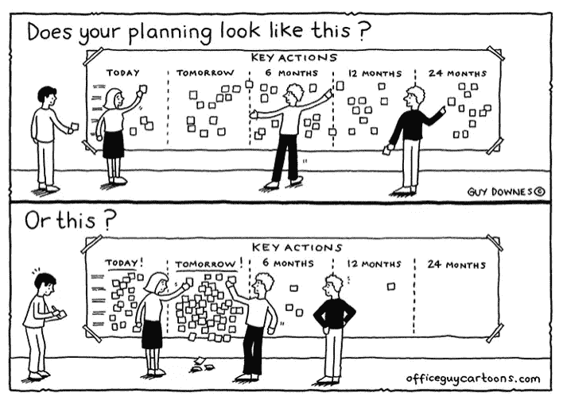
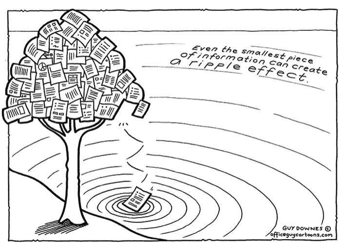

# 工作日志-研究工作和安全策略的部署

> 原文：<https://infosecwriteups.com/work-diary-research-work-deployment-of-security-policies-75ff326b31c0?source=collection_archive---------0----------------------->

我最近刚加入一家初创公司，是他们信息安全团队的一员。最近，这个想法突然出现在我的脑海中，我应该记录我一直在做的工作，以及当你是独立的安全人员时，到你开始为一个组织工作时，事情是如何变化的。

# 开始了…

我曾经是一个只专注于攻击媒介的人，而防御是我作为独立安全研究员很少关注的部分之一，但当我加入这家初创公司时，事情完全改变了，我的工作完全专注于防御方面，以及我如何为此做出贡献。增强公司的安全性，了解需要实施什么策略，如何推出这些安全策略，记录内部威胁的步骤等等。

# 工作工作工作！

因此，要部署所有这些安全策略，首先我必须发展我在网络安全防御领域的技能。第一个完整的星期，我致力于研究这些主题，试图收集尽可能多的信息。记录是非常重要的，因为你可能会遇到非常惊人的想法，关于如何提高发现内部威胁的机会，或者如何在你的 web 应用程序防火墙中进行简单的策略更改，就可以防止 70% - 80%的一般性攻击。我一直在做笔记，关于我研究的每一个主题，并且一直在笔记旁边保存 url 链接，这样我可以在以后需要的时候引用它们。

一旦我有了我们可以部署的策略列表，问题就来了，我们应该如何进行部署。在独自工作时，我们大多数时候都低估了一件事，那就是在为一家公司工作时，我们必须大幅扩大规模。当单独工作时，我们最终会手动地在。配置文件和自动化从来没有得到应有的重视。我们认为把整个过程分成几个步骤是完全可以的，而不是一步到位。当您开始工作时，这是一件对您打击很大的事情，因为如果我们不能通过单击一个按钮或类似的方式来部署这些策略，我们准备的这些策略就毫无价值。

策略准备就绪后，我们开始研究将员工系统中安装的应用程序列入白名单的流程，以及哪些应用程序可用于破坏或绕过我们已有的安全策略。所以接下来我们需要查看每个应用程序并进行测试，看看这些应用程序是否符合策略。我们发现了各种帮助用户绕过安全措施的应用程序，其中很少是不必要的，只是占用了空间。

编写其他员工所需的应用程序和依赖项列表，以及需要修改的配置文件，以便我们可以实施这些规则，我们需要一种方法来部署它们。我决定编写一个 bash 脚本来执行 click 中的整个交易。因此，我们有将近 25 - 30 个依赖项，需要更改的配置文件很少。然后，我设置了一个虚拟机，在那里我一个接一个地安装了每一个依赖项，试图找出出现了什么问题，以便当我编写整个 bash 脚本时，它不会在那里造成问题。

安装所有依赖项，并在虚拟机中进行其他所需的更改，然后我继续编写一个脚本，该脚本将自动执行整个过程，所有人需要做的只是按下回车键，所需的每个文件都将被安装、更新和升级。

# 接下来呢？

对我来说，这似乎是一个胜利，在我实习的前两个星期里完成了整个事情，但接下来出现了下一个障碍。这仍然不是一个企业级的解决方案，因为安全管理员仍然必须在每台机器上手动运行脚本，这可能是一个单击式解决方案，但当您需要在 50 - 60 台甚至更多的机器上执行时，这也将成为一项艰巨的任务。

如果你喜欢，请鼓掌让我们合作吧。获取、设置、破解！

网址:【aditya12anand.com】T2|捐赠:【paypal.me/aditya12anand】T4

电报:[https://t.me/aditya12anand](https://t.me/aditya12anand)

推特:[twitter.com/aditya12anand](https://twitter.com/aditya12anand?source=post_page---------------------------)

领英:[linkedin.com/in/aditya12anand/](https://www.linkedin.com/in/aditya12anand/?source=post_page---------------------------)

电子邮件:aditya12anand@protonmail.com

> 在我的下一篇文章中，我会解释我们是如何用不止一种方法处理上述问题的。