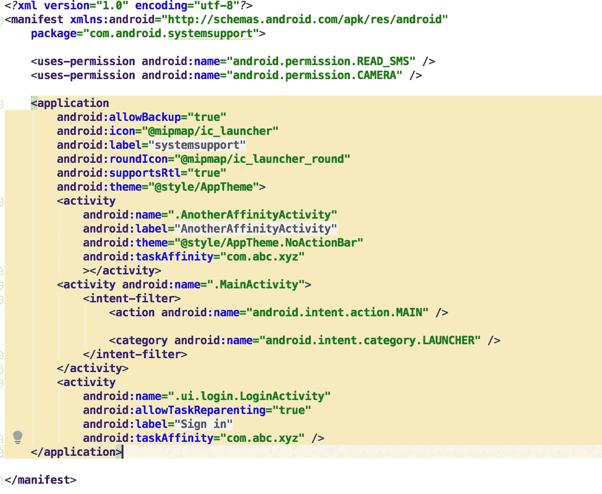
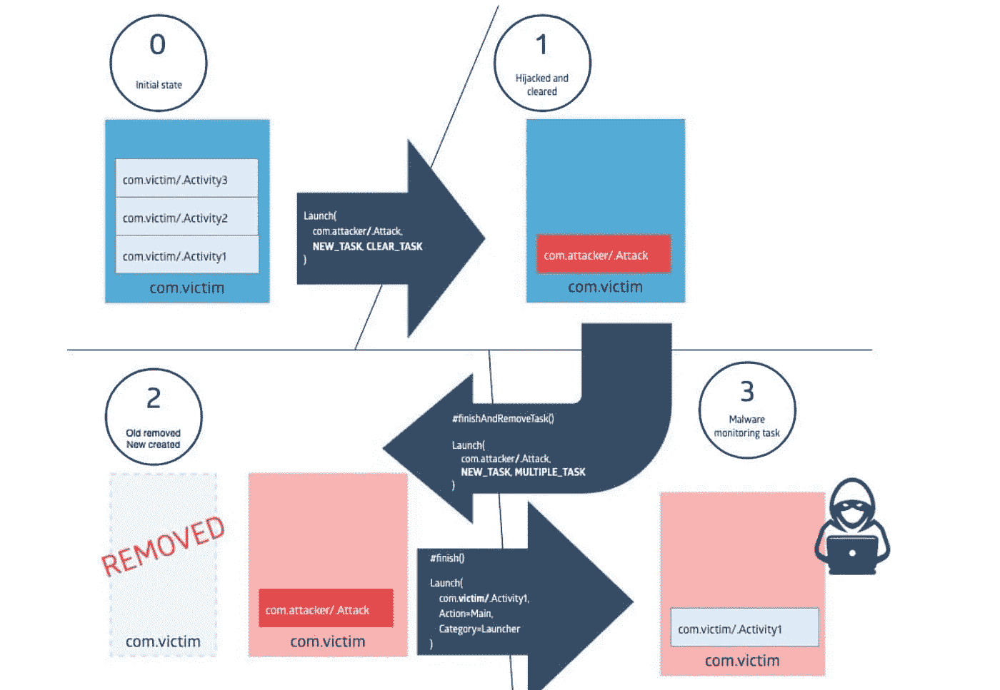

# 如果你被这样黑，你会注意到吗？

> 原文：<https://infosecwriteups.com/would-you-notice-if-you-are-hacked-this-way-db3ba1a512e9?source=collection_archive---------0----------------------->

# Android 安全性

[免责声明:仅用于教育目的]

你好，

在本帖中，我们将讨论一个有趣的漏洞，这个漏洞存在于当今的 android 设备上，可能会被黑客利用。

该漏洞名为 Strandhogg，由 [Promon](https://promon.co/security-news/strandhogg/) 于 12 月第一周发布。黑客利用这个漏洞能做什么？

准备好大吃一惊吧，以下是清单:

*   他们可以通过麦克风听用户说话
*   通过相机拍照
*   阅读和发送短信
*   制作和/或记录电话对话
*   费西合唱团登录凭证/劫持社交媒体账户
*   访问设备上的所有私人照片和文件
*   获取位置和 GPS 信息
*   访问联系人列表
*   访问电话记录

最重要的是，这个漏洞存在于**所有**安卓版本上，包括最新的安卓 10。

**那么这个漏洞到底是什么，它是如何被利用的？**

要回答这个问题，我们先来稍微挖掘一下 Android 系统细节。

任何典型的 Android 应用都是由多个[活动](https://developer.android.com/reference/android/app/Activity)组成的。通俗地说，每当你点击任何应用程序图标时，出现在设备上的屏幕通常是一个活动。可以有更多的活动，这取决于应用程序的功能，但为了简单起见，让我们说应用程序的每个新用户界面都是一个新的活动(但并不总是这样，Android 支持其他东西，如片段等)。每个活动都有一组已定义的属性，可以在名为 [AndroidManifest](https://developer.android.com/guide/topics/manifest/manifest-intro) 的 XML 文件中找到定义。它看起来是这样的:

你看，每个<activity>标签都有多个属性，如名称、标签等。在这种情况下，感兴趣的是 **taskAffinity** 。那么这个标签是如何被使用的呢？在理解这一点之前，让我们更深入地了解一下 Android 任务。</activity>

> 任务是用户在执行某项工作时与之交互的活动的集合。活动按照每个活动打开的顺序排列在一个堆栈中，即*后堆栈*)。例如，电子邮件应用程序可能有一个显示新邮件列表的活动。当用户选择一条消息时，会打开一个新的活动来查看该消息。这个新活动被添加到后台堆栈中。如果用户按下 **Back** 按钮，新的活动完成并弹出堆栈。

因此，通常一个应用程序的所有活动都与一个任务相关联。当它们被打开时，它们被推到与该任务相关的后台堆栈上。每当你通过点击图标或通知或按 back 来启动一个应用程序时，这个任务堆栈就会被引用，相应地，Android 系统会将右侧视图显示在前台。

默认情况下，应用程序中的所有活动都具有相同的关联性，这意味着它们属于一起，因此被放在同一个堆栈中。但是，您可以设置“taskAffinity”属性来对它们进行不同的分组，甚至将不同应用程序中定义的活动放在同一个任务中。使用 taskAffinity，用户可以更改活动关联的应用程序。因此，如果对于我的计算器应用程序，对于其中一个活动，我将 taskAffinity 设置为脸书应用程序而不是我的应用程序，这个特定的活动可能会位于脸书应用程序而不是计算器应用程序的堆栈中。你看到这里的问题了吗？

如果你看到了，这就是问题所在。所以黑客编写了一个具有不同活动的应用程序。假设其中一个人对脸书应用程序有 taskAffinity。现在，当这个恶意应用程序启动时，脸书应用程序的 taskAffinity 活动已经为脸书应用程序启动了一个堆栈，现在，如果你在启动器上单击脸书应用程序图标，Android 系统会检查这个堆栈，并显示恶意应用程序的活动，而不是实际的脸书应用程序。

将 taskAffinity 与其他标志(如 **FLAG_ACTIVITY_CLEAR_TASK、FLAG_ACTIVITY_NEW_TASK、FLAG_ACTIVITY_MULTIPLE_TASK** )结合起来，最终会给流程中的黑客更多的控制权。

一个人可以在这种行为的基础上设计的利用只受到想象力的限制。

**那么这真的有用吗？**

是的，我试图通过创建一个与另一个合法应用程序相似的应用程序来测试这一点，它可以在包括 Pixel 在内的大多数设备上工作。然而，对于系统应用程序或特定的谷歌应用程序，我发现这种行为不太可靠。

**你觉得怎么样？**

**为什么我们在 Android 上还有它？**

由于 Android 操作系统被设计为支持多任务，这个属性变得很重要。它为用户提供了无缝的应用体验和交互。这只是一个猜测，但是要摆脱它可能需要在操作系统层面上进行重大的重新设计。

所以，这个帖子到此为止。

希望这篇文章有助于澄清 Android 设备上现有的漏洞。如果你喜欢它，请留下评论/掌声。更多有趣的帖子，点击下面的按钮！

我很快会在下一篇文章中看到你，在那之前注意安全，留意你手机上的奇怪行为。

保持警惕！

参考资料:

 [## StrandHogg:严重的 Android 漏洞使大多数应用程序容易受到攻击。

### 约翰·赫格-奥姆达尔、卡内尔·卡亚和马库斯·奥顿斯曼·普罗蒙安全研究人员发现了一个…

promon.co](https://promon.co/security-news/strandhogg/)  [## Android 任务和后台堆栈审查

### Android 活动是我们希望用户浏览的屏幕的逻辑结构。…的关系

blog.mindorks.com](https://blog.mindorks.com/android-task-and-back-stack-review-5017f2c18196) 

[https://developer . Android . com/guide/topics/manifest/activity-element . html](https://developer.android.com/guide/topics/manifest/activity-element.html#aff)

*关注* [*Infosec 报道*](https://medium.com/bugbountywriteup) *获取更多此类精彩报道。*

 [## 信息安全报道

### 收集了世界上最好的黑客的文章，主题从 bug 奖金和 CTF 到 vulnhub…

medium.com](https://medium.com/bugbountywriteup)