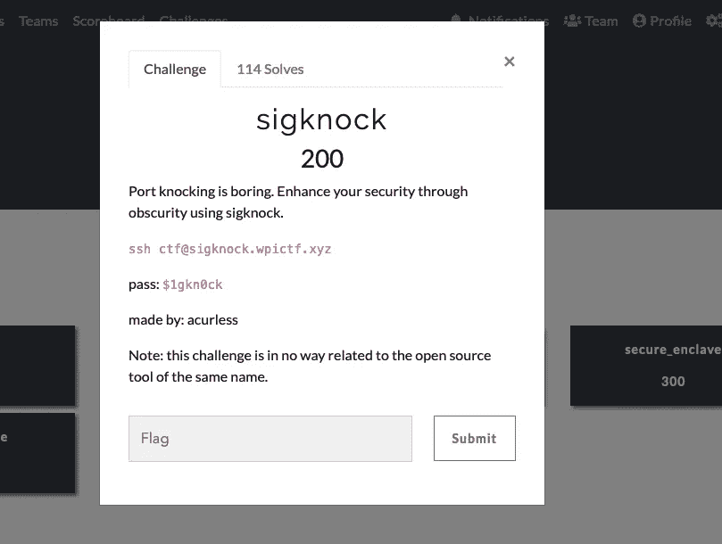
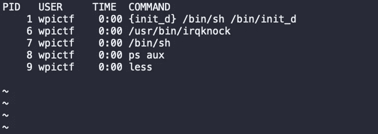
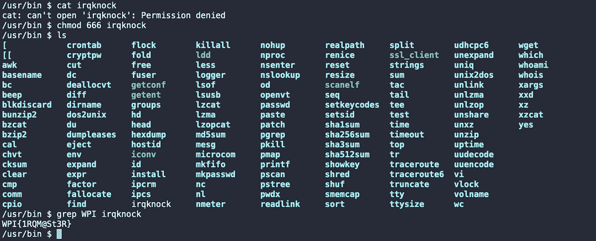

# WPICTF 2020 为 sigknock 撰写的文章

> 原文：<https://infosecwriteups.com/wpictf-2020-writeup-for-sigknock-b3d6d7d8b702?source=collection_archive---------0----------------------->

各位信息安全爱好者好。这是我在 Medium 上的第一篇文章，我将定期发布关于 Infosec、CTFs、Bugbounties 的文章，以及我在这个名为 **LIFE 的疯狂旅程中经历的最好和最糟糕的经历。**

Sigknock 是 200 分的挑战。挑战的凭证已经给出，问题陈述是“**敲港口很无聊。使用 sigknock** 通过隐藏来增强您的安全性。

信号敲门

# 迎接挑战

在我用给定的凭证进行了一次 **ssh** 登录后，我得到了一个如你所料的空白终端。然后我在目录间换了换，看能不能找到点什么，但是命苦:(。你不能指望一个 200 分的挑战赛有一个 flag.txt 文件可以直接访问

思考了一会儿后，我有了一个想法，检查正在运行的进程，看看是否能找到一些有趣的东西。

> 我使用了***PS aux | less****命令来检查进程，有一个文件看起来很可疑，它是/usr/bin/irqknock*

**

*ps 辅助|较少输出*

*我导航到 ***/usr/bin*** 目录。我检查了是否可以使用 ***cat*** 来查看文件中的内容，但是我似乎没有读取该文件的适当权限。*

> *当您无法访问文件时，请使用您可以使用的工具来访问该文件*

*我使用了[***chmod***](https://www.howtogeek.com/437958/how-to-use-the-chmod-command-on-linux/)来改变权限，我可以读取文件了。执行一个 ***cat*** 命令导致文件用大量垃圾和无用信息填充终端。*

*然后我使用 grep 命令获得我需要的信息。标志格式为 **WPI{1ns3rt_h3r3}。***

> *grep WPI irqknock*

*我用上面的命令得到了旗子和 Wola！旗帜突然出现了*

**

*grep WPI irqknock 输出*

*Sigknock 是一个有趣的挑战。CTF 还有其他一些巨大的挑战，这些挑战很难克服，也很耗时，这就是为什么 CTF 更有趣*

*希望你喜欢这篇文章，我期待着写更多这样的文章。请鼓掌并在评论中留下你的建议/赞赏/批评*

*和平！*

*请通过以下方式联系我*

***推特:**[**https://twitter.com/izhar9999**](https://twitter.com/izhar9999)*

***电邮:izharsia2000@gmail.com***

**关注* [*Infosec 报道*](https://medium.com/bugbountywriteup) *获取更多此类精彩报道。**

* [## 信息安全报道

### 收集了世界上最好的黑客的文章，主题从 bug 奖金和 CTF 到 vulnhub…

medium.com](https://medium.com/bugbountywriteup)*