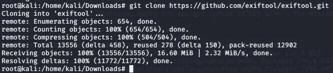
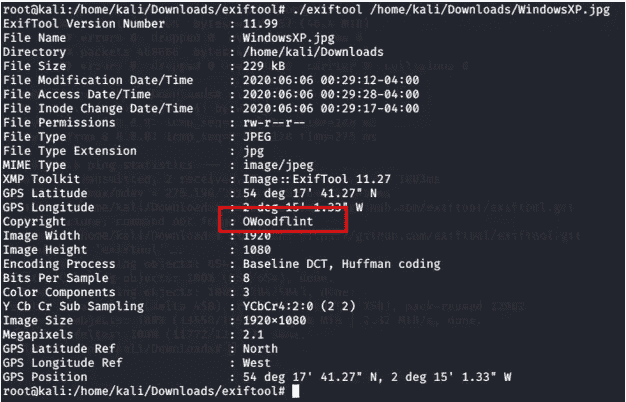
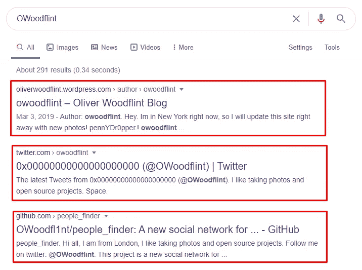
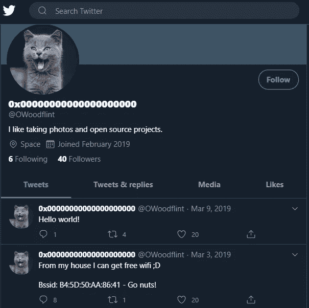
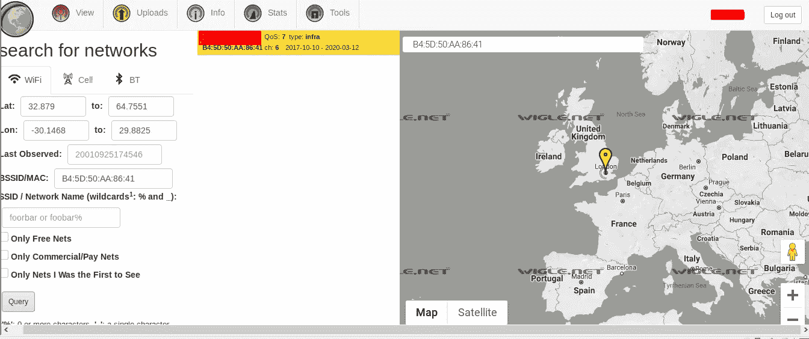
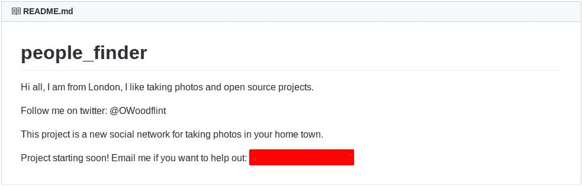
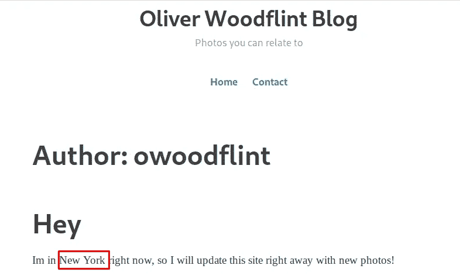
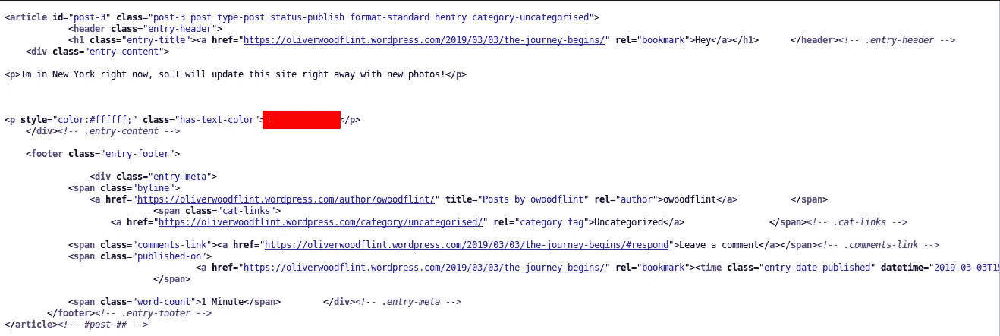

# 详细报道 01- TryHackMe- ohSINT

> 原文：<https://infosecwriteups.com/write-up-01-tryhackme-ohsint-bce3b46b0de1?source=collection_archive---------2----------------------->

TryHackMe-Room : ohSINT

想知道您在互联网上共享的数据如何被用来提取您的敏感信息吗？作为概念验证，我们将解决 TryHackMe 平台上可用的房间 [Ohsint](https://tryhackme.com/room/ohsint) 。该房间总共包含 7 项任务，我们将逐一介绍。所以让我们开始吧！！！

页（page 的缩写）s:我已经做了一些不可读的答案，所以你们不要只是复制粘贴来得到正确的答案，而是鼓励你们自己尝试解决

# **信息收集**

在我们开始任务 1 之前，我们应该下载一张图片，我们意识到这是一张 Windows XP 桌面的图标图片

Windows XP 桌面壁纸

在我们下载这个之后，我们需要得到更多关于这个图像的信息。我们将要用来提取图像元数据的工具是 **ExifTool** 。我们需要先下载并安装它，我打算用 **Github** 安装它。

用于从图像中提取元数据的 ExifTool

安装后，我们将运行它。我们得到关于图像的以下信息

元数据的提取

通过对以上信息的分析，我们知道这张图片的主人是 OWoodflint。现在我们在 google 上搜索这个用户，以便提取更多的信息。我们找到以下与作者相关的链接。我们需要逐一探索。如果我们查看任务，我们需要找到作者使用的头像。

搜索从图像的元数据中提取的关于作者的信息

# **任务 1**

让我们先来探讨一下博客。浏览博客，我们还没有发现任何有用的东西。所以我们转到用户的 Twitter 账户，在这里我们找到了第一个问题的答案

OWoodflint Twitter 帐户

# **任务二**

接下来，我们需要找到用户的位置。因此，通过研究他的社交媒体账户，即 twitter，我们得知他共享了 BSSID，该 BSSID 实际上描述了 WAP(无线接入点)的 MAC 地址。那么我们该如何利用这些信息呢？？我们将使用[wigle.net](https://wigle.net/)，用于收集您周围所有热点或 WAP 的信息。我们使用 BSSID 来收集关于用户的更多信息。为了获得准确的结果，请记住在 wiggle.net 上做一个帐户。现在我们得到了任务 2 的答案。

搜索威格尔的 BSSID

# **任务三**

我们知道用户的位置，进一步探索，我们还通过参考他在 Twitter 帐户上共享的 BSSID 来了解他所关联的 SSID。这给了我们任务 3 的答案。

# 任务 4 和 5

接下来，我们需要找到用户的电子邮件地址，让我们检查一下与用户相关的 Github 链接。我们从 Github 链接获得用户的电子邮件，如下所示。这回答了我们任务 4 和 5 的问题

# **任务 6**

现在我们需要再次访问他的博客，它回答了我们对任务 6 的问题，如下所示

用户博客帖子

# **任务 7**

在这个任务中，我们需要找出用户的密码。所以我们做了一点研究，我们看到了用户的社交资料和 Github 链接，它们没有给我们任何关于用户密码的信息。所以我们又去了博客，在博客网站上花了一些时间后，我们检查了源代码，发现了一些描述密码的模式。就像严肃的 OWoodFlint 一样，你需要找一个更好的地方来存放你的密码。这就完成了我们的任务 7，房间也完成了

# **结论**

在完成上述任务后，我们得出结论，即使是一条很小的信息也能揭示一个人的许多细节及其在互联网上的行踪。我们应该小心我们在互联网上公开分享的内容。

# **关于我**

我是一名网络安全爱好者，正在攻读信息安全硕士学位，并试图进入全职网络安全职业生涯。