# 向上写 02- TryHackMe-基本测试

> 原文：<https://infosecwriteups.com/write-up-02-tryhackme-basic-pentesting-797dbd0721df?source=collection_archive---------0----------------------->

# 介绍

这篇文章是关于 TryHackMe 平台上的[基础测试室](https://tryhackme.com/room/basicpentestingjt)的。我将详细解释解决挑战/任务所涉及的程序。

# 学习成果

通过解决与此房间相关的任务/挑战，我们将了解如何扫描主机以获取服务和打开的端口。此外，我们将寻找 web 服务器上的不同目录，为了访问主机，我们将破解密码和哈希。当我们开始解决这些任务时，更多的学习成果就会显现出来。所以让我们开始吧！！！

# 任务 1 和 2

连接到 OpenVPN 并部署机器。我们需要找到在主机上运行的服务，为此我们将在主机上运行 Nmap。通过扫描，我们得出结论，web 服务正在端口 80 上运行，与该服务相关的版本是 Apache httpd 2.4.18。除此之外，还有一个 SMB Samba 服务运行在端口 139 上。这些服务可能是我们感兴趣的领域。

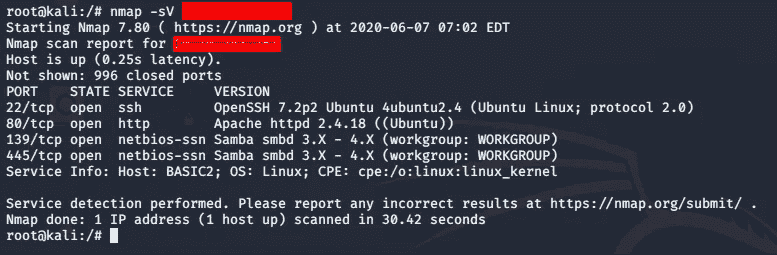

对主机进行 Nmap 扫描

# **任务三**

我们需要找到网络服务器上的隐藏目录。让我们在 web 浏览器上访问主机的 IP 地址。如下所示，没有获得任何信息

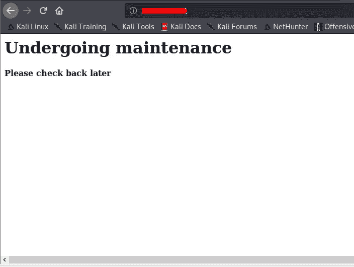

我们需要找到隐藏的目录，为此，我们将使用一个名为 [**gobuster**](https://tools.kali.org/web-applications/gobuster) 的工具来寻找隐藏的目录和暴力目录。在参数中，我们将定义服务器的 IP 地址，并提供一个如下所示的世界列表。一旦这个过程完成，我们会找到一个隐藏的目录。所有其他目录都不可访问，我们可以通过查看状态代码来确认这一点。

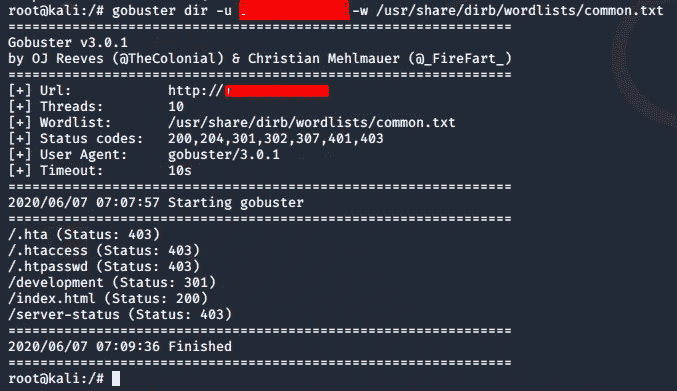

现在我们需要访问隐藏目录来查找更多信息

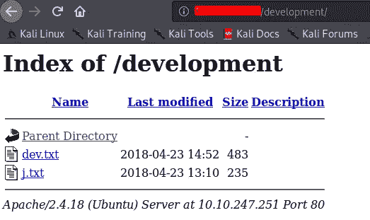

使用网络浏览器访问隐藏目录

在隐藏目录中有两个文本文件，让我们看看是否能找到一些信息。

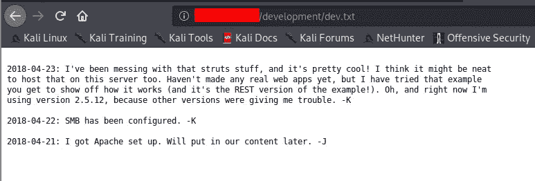

开发. txt

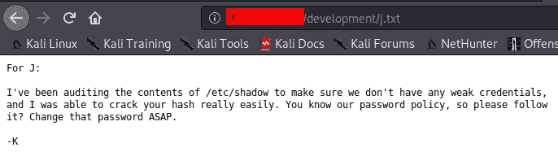

j.txt

通过查看 dev.txt，我们找到了正在运行的 **apache webserver** 和 **SMB** 服务的版本。我试图找到针对 HTTP 服务的漏洞，但没有结果。观察 j.txt，我们知道我们可以尝试破解用户的散列，因为密码可能很弱，他们的散列也是如此。

# **任务 4 -7**

再考虑一下我们的 Nmap 扫描，我们用[**enum 4 Linux**](https://tools.kali.org/information-gathering/enum4linux)**依次列举 samba。**

****enum4linux -a <机器 IP>****

**使用这个工具，我们有两个用户。请注意，这可能需要一些时间，因为要对系统上的所有 uid 进行枚举。**

**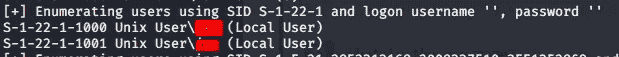**

**Samba 枚举**

**现在我们需要知道找到的用户的密码。所以我将使用 **hydra** 使用字典强行破解用户密码。记住，主机也运行 ssh，所以我们将尝试暴力破解用户的 ssh 登录**

**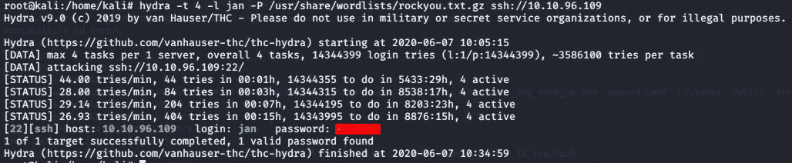**

**九头蛇代表暴力**

**现在让我们使用凭证通过 ssh 登录**

**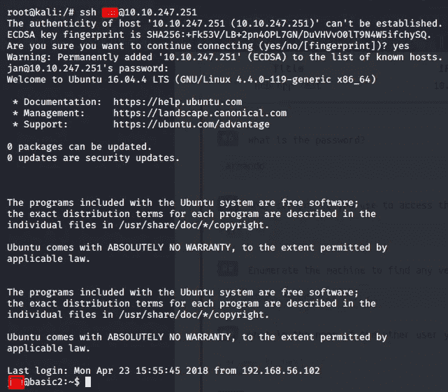**

**SSH 用户@ip**

# **任务 8–11**

**现在我们需要找到任何载体来提升我们的特权。在主机上查找文件。我们在用户 Jan 上找不到任何东西**

**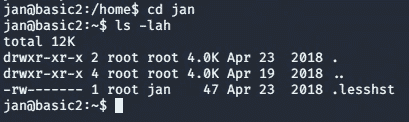**

**让我们检查一下另一个用户。经过适当的查找，我们找到了另一个用户的公钥。公钥包含哈希，复制哈希密钥**

**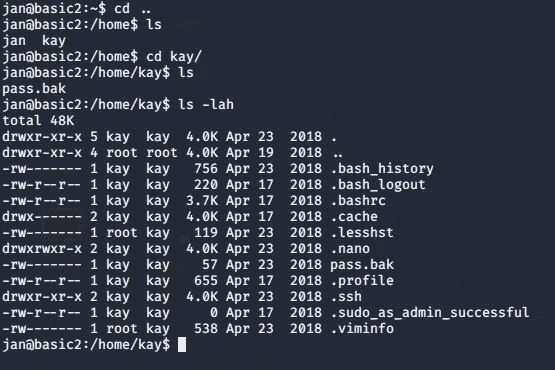**

**用户 Kay 文件**

**导航到。ssh 文件夹，在那里我们可以找到用户的私钥**

**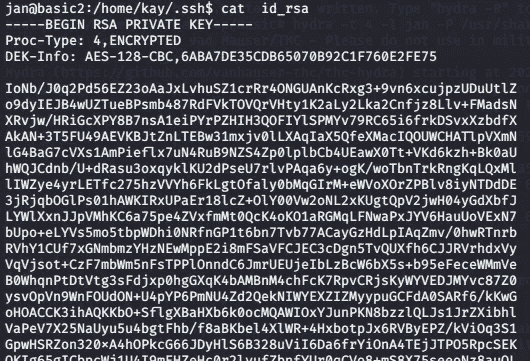**

**用户 Kay 的密钥**

**在这之后，我们需要复制密钥并使用**约翰**来破解散列。但是首先，我们需要将这个密钥文件转换成如下所示的散列格式**

**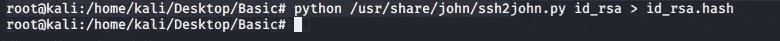**

**一旦我们完成了这个，我们现在将使用约翰破解散列使用单词列表 **rockyou.txt****

**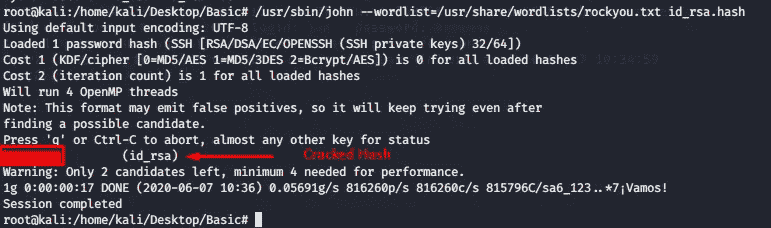**

**现在我们有了用户 kay 的破解哈希。请记住，这不是 ssh 用户的密码，而是我们在通过 ssh 连接到 **Jan** 的 **kay** 用户目录中找到的私钥的破解散列。因此，我们需要通过 **Jan** 用户应用破解的哈希，如下所示**

**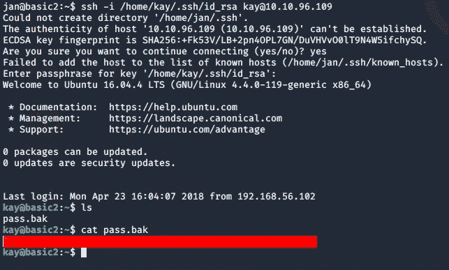**

**至此，我们的挑战/任务已经完成。**

# ****结论****

**解决这一挑战使我们能够对如何扫描我们的目标机器并在其上寻找漏洞有一个总体的想法。一旦我们试图获得访问权或提升我们的特权，我们也开始了解破解密码和散列。也就是说，试着先自己完成房间，如果你遇到困难，请随时查阅演练。黑客快乐:)！！**

# **关于我**

**我是一名网络安全爱好者，正在攻读信息安全硕士学位，并试图进入全职网络安全职业生涯。**