# 特写 03-TryHackMe-简单的 CTF

> 原文：<https://infosecwriteups.com/write-up-03-tryhackme-simple-ctf-e02495e74def?source=collection_archive---------3----------------------->

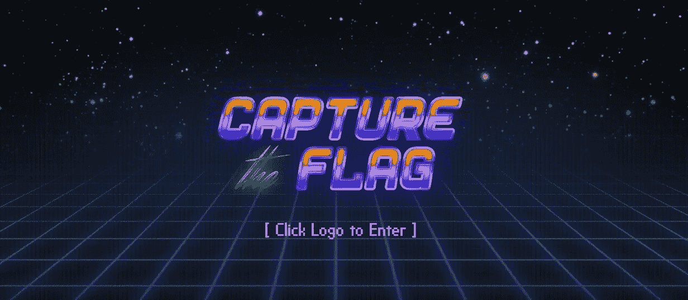

初级 CTF

# 介绍

这篇文章是关于 TryHackMe 平台上的一个简单的 CTF 挑战。这是一个初级水平的 CTF。对于所有初学者和想了解 CTF 的人来说，这个房间对你们来说是完美的。我们将解决并完成所有给定的任务/挑战。所以让我们开始吧！！！

页（page 的缩写）s:我强烈建议你们，伙计们，首先试着自己解决这些挑战，如果你们遇到了困难，可以过来看看这个演练

# 任务 1

任务 1.1- 1.2:首先部署机器。我们需要对机器运行 Nmap 扫描，以便知道哪些端口是打开的，哪些服务在这些端口上运行。我将使用积极的 Nmap 扫描

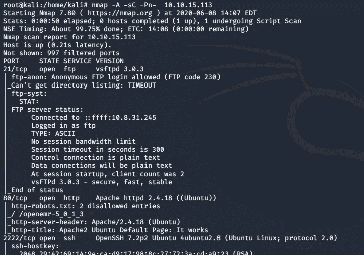

通过分析上面的 Nmap 扫描，我们现在知道了主机上运行的端口数量及其相关服务。因此，我们有 2 个服务在端口 1000 下运行，ssh 服务在更高的端口上运行。

# 任务 3

我们看到我们有一个匿名的 ftp 登录，让我们尝试登录，看看我们是否能找到什么。

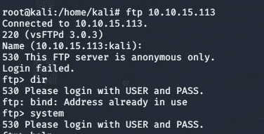

匿名 FTP 登录

似乎我们没有从 FTP 登录中得到任何信息。让我们继续，通过 web 浏览器访问机器 IP，因为我们的 Nmap 扫描显示在端口 80 上运行着 web 服务

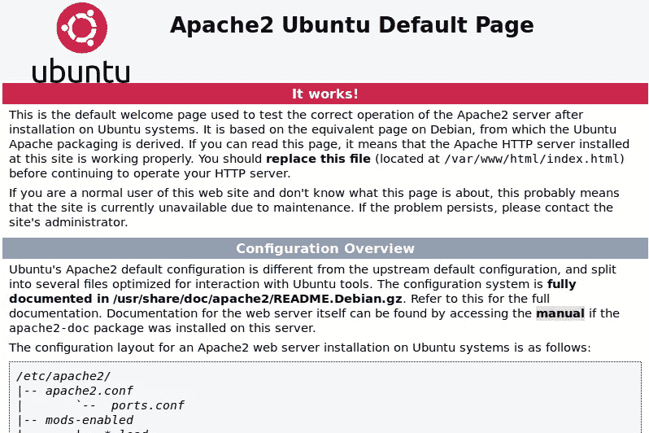

在网络浏览器上访问网络服务

似乎我们只看到一个 apache web 服务器在主机上运行，所以我们需要深入挖掘，找出任何其他隐藏的目录。为此，让我们使用 go buster，它通过执行字典攻击并检查得到的响应来查找隐藏的目录。点火**去巴斯特**并检查结果

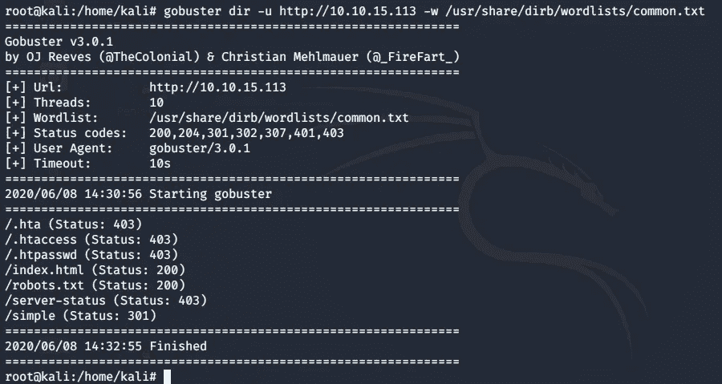

Gobuster 查找隐藏目录

现在让我们探索一下我们发现的隐藏目录。让我们看看 robots.txt，因为它可能会给我们一些信息

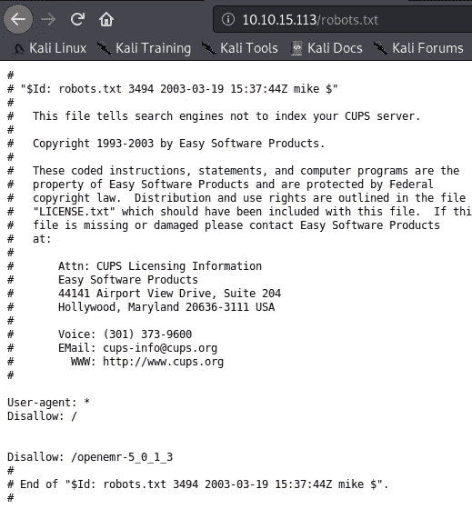

robots.txt

看来 **robot.txt** 没有给我们任何东西。还有一个更有趣的目录名为 simple，它也有一个有效的 web 响应代码。让我们查一下这个目录

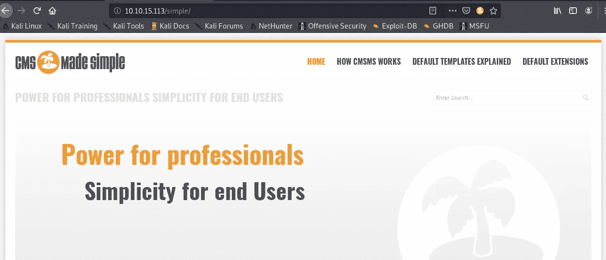

CMS 变得简单

通过访问这个简单的目录，我们知道有一个内容管理系统(CMS)。让我们找到更多关于这个 cms 的信息。我将使用 [**searchsploit**](https://www.exploit-db.com/searchsploit) 来检查我是否发现了针对此服务的任何漏洞

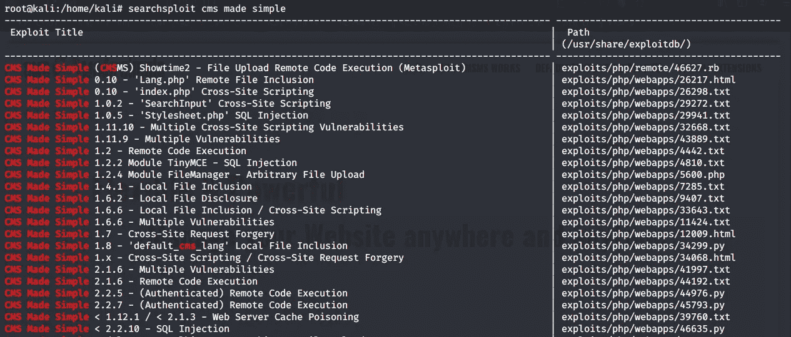

Searchsploit

查看 **searchsploit** 结果，我们发现了大量的漏洞。挑战中问的问题是 **CVE 号**。因此，我对 cms 服务进行了更多的搜索，偶然发现了**漏洞利用数据库**，它向我显示了与该漏洞相关的 **CVE 号**，同样，当我将结果与 **searchsploit** 数据进行比较时，我决定选择 SQL 注入漏洞

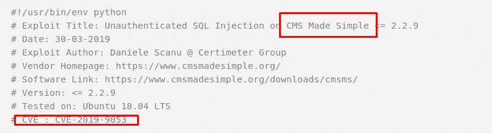

# 任务 4

该应用程序易受 SQL 漏洞的攻击

# 任务 5 和 6

现在让我们利用漏洞，看看我们是否能找到用户名和密码。所以我将使用我通过 **searchsploit** 发现的漏洞。导航到漏洞文件系统并使用如下所示的参数。等待一会儿，你会得到用户名和密码

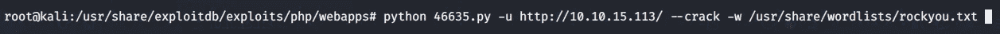

上面的漏洞会给我们用户名和密码。我没有包括截图，因为我鼓励你自己去找，这样你就可以努力尝试，这是最终目标，直到你找到所需的结果。现在我们有了用户名和密码，记住我们的 Nmap 扫描结果也指向了运行在端口 **2222** 上的 **ssh** 服务，所以让我们尝试使用端口 2222 上的 ssh 登录机器

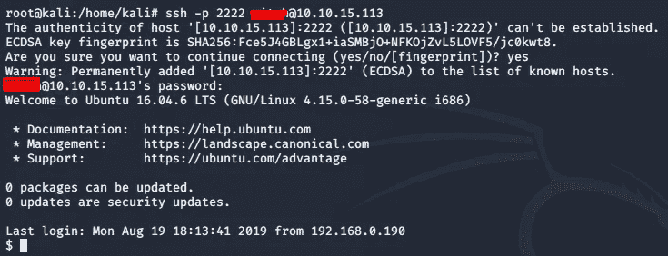

ssh 成功

# 任务 7

在这个任务中，我们必须找到用户标志。因此，让我们列出内容，我们发现我们的用户标志如下所示

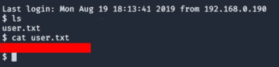

用户标志 1

# 任务 8

除了 mitch，我们还有另一个用户。我试图切换到另一个用户，但没有得到认证

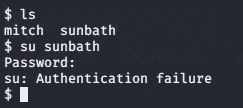

# 任务 9

让我们找到一种方法来提升我们的特权。让我们看看米奇的能力。所以我们知道用户 Mitch 可以运行 vim。我们可以使用 vim 来提升我们的特权。

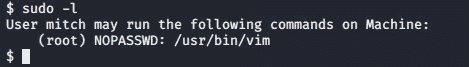

# 任务 10

让我们通过 bash shell 运行 vim 来提升我们的特权。

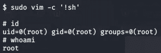

特权升级

现在我们可以导航到根目录并找到我们的最终标志

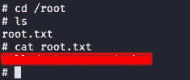

在这个挑战中，我们了解了 CTF 是什么样的，以及如何找到隐藏的旗帜。有多种方法可以利用系统中的漏洞获得对系统的访问权限并提升权限。我希望你喜欢这个演示。坚持练习和分享。黑客快乐:)

# 关于我

我是一名网络安全爱好者，正在攻读信息安全硕士学位，并试图进入全职网络安全职业生涯。