# 向上写 04- TryHackMe- Blue

> 原文：<https://infosecwriteups.com/write-up-04-tryhackme-blue-e3e58268ca22?source=collection_archive---------0----------------------->

## 学习利用系统级漏洞并获得目标机器的根权限

## 利用系统级漏洞

操作系统漏洞非常普遍，而且普遍存在，尤其是微软视窗系统。这些漏洞被以不同的方式利用，使得试图闯入系统的对手能够获得系统级的访问权限。本文将讨论这样一个漏洞。作为概念验证，我将利用微软 Windows 中一个非常著名的漏洞，名为永恒之蓝。我要开发的机器在 [**TryHackMe**](https://tryhackme.com/room/blue) 平台上有售。所以，废话少说，让我们开始吧

## 目标

利用一个非常流行的 Microsoft Windows 漏洞获得系统级访问权限并提升权限。

## 学习成果

利用考虑中的主机将使观众能够:

1.  通过多种方式获得受损系统的外壳
2.  迁移进程 id 以获得更高特权的进程
3.  破解哈希以获得对系统上不同用户帐户的访问权限，从而导致获得对系统上不同标志的访问权限

## 1.侦察阶段

让我们首先收集关于折衷制度的信息。用于收集开放端口和服务相关信息的最常用工具是 Nmap。因此，让我们使用 Nmap 扫描我们的主机，并设置以下标志。

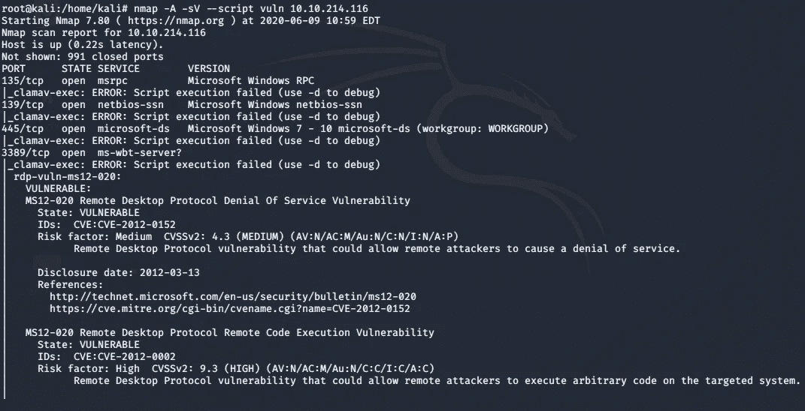

好了，我们得到了开放端口的数量以及针对这些端口运行的服务。**这回答了我们的任务 2** 。这些信息有助于识别服务级别漏洞。请注意，我们还包括脚本 vuln，它充当漏洞扫描器，告诉我们它发现的漏洞。在我们的例子中，它的[**MS17–010**](https://docs.microsoft.com/en-us/security-updates/SecurityBulletins/2017/ms17-010)也称为 [**永恒之蓝**](https://en.wikipedia.org/wiki/EternalBlue#cite_note-microsoft.com-20) ，这个漏洞被标记为危险级别为严重，因此我们将利用这个漏洞。**这给了我们任务 3** 的答案

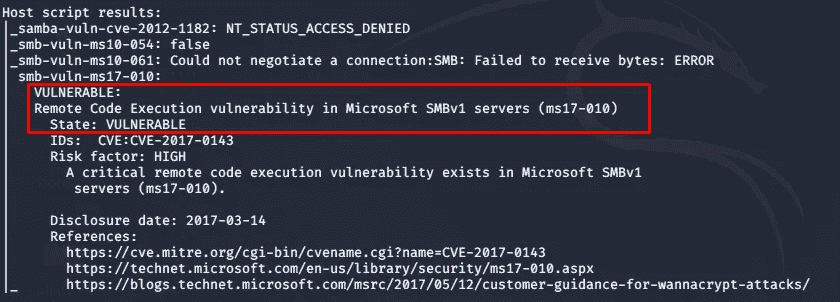

易受永恒之蓝攻击的系统

## 2.获得访问权限

现在我们知道了漏洞，是时候利用它了。对于漏洞利用，我们将使用 Metasploit，它包含大量可以针对目标系统运行的漏洞利用和 post 漏洞利用。因此，通过在终端中键入 msfconsole 来启动 Metasploit，并搜索与永恒之蓝(MS17–010)相对应的漏洞

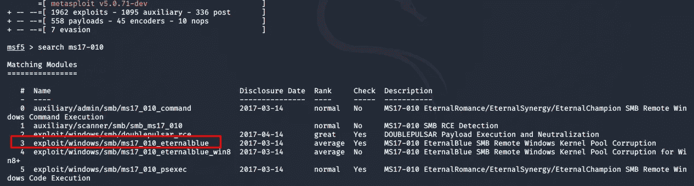

现在我们知道了要使用哪个漏洞，让我们运行这个漏洞。键入 show options 以了解运行漏洞攻击所需的先决条件参数，如下所示。一旦设置了漏洞和参数，运行如下所示的漏洞

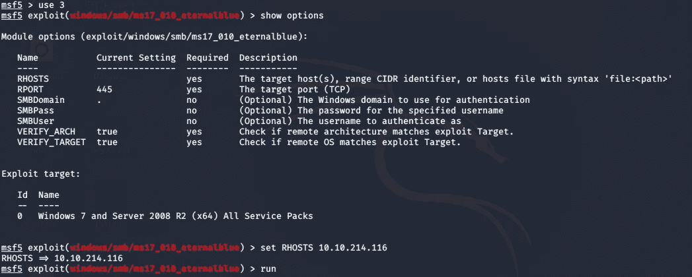

运行漏洞利用后，我们看到我们已经获得了目标机器的外壳

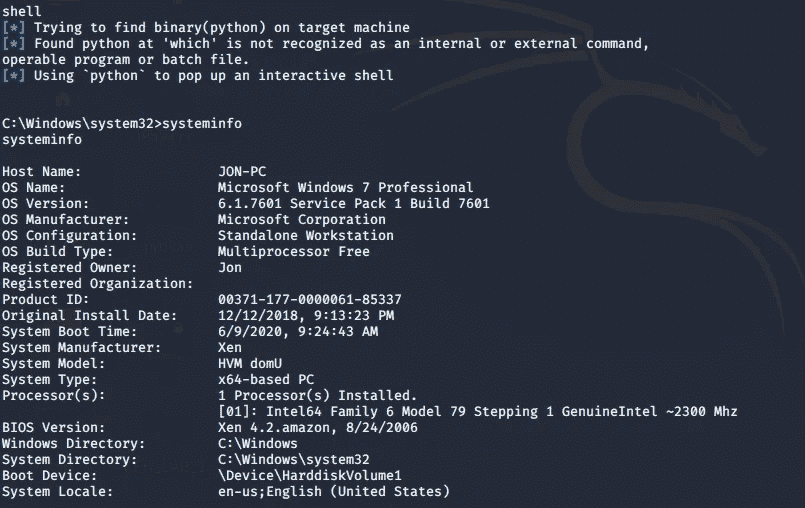

目标系统外壳访问

我们得到了获得访问权阶段的所有答案

## 3.升级(剥削后)

获得一个 shell 是不够的，我们必须提升我们的权限，以便在系统上执行管理员级别的操作。首先，我们需要将我们的 shell 升级到 meterpreter，因为与普通 shell 相比，它提供了很多功能。为此，我们需要在 Metasploit 中搜索 **POST** exploit。

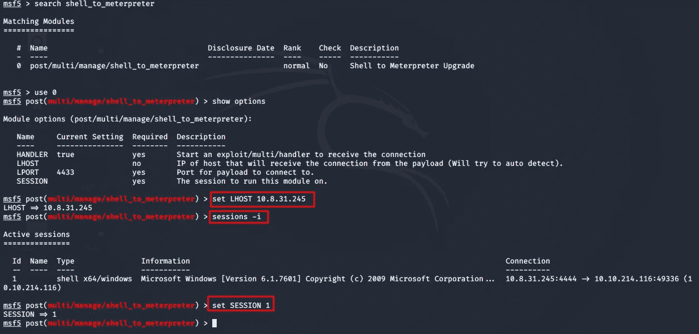

因此，在搜索之后，我们得到了要转换成 meterpreter 的 shell 的 POST 模块。这回答了我们在本部分的**任务 1 问题**。我们需要设置我们的帖子要利用的会话，您可以通过键入 **sessions -l，**列出所有活动的会话，现在通过键入 **SET SESSION #** 选择会话。这回答了我们在本节的任务 2 问题。您也需要设置本地主机，因此键入 **Set LHOST < Ip 地址>** 。一旦所有参数都设置好了，现在让**运行**post exploit

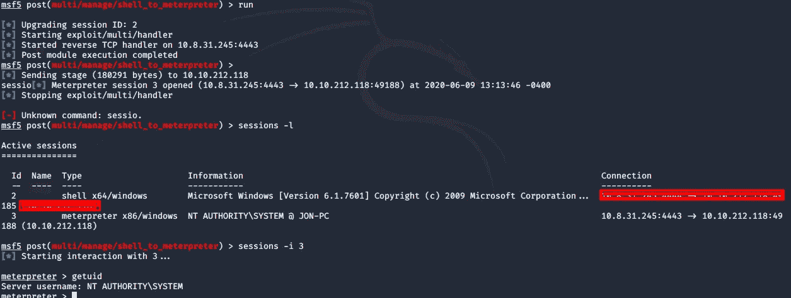

后期开发

现在我们已经有了我们的 meterpreter 会话，我们可以通过运行 **getsystem** 命令来验证系统信息

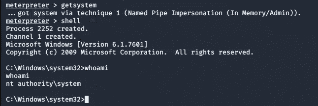

运行 **ps** 命令检查系统上正在运行的所有进程。注意，放下 **PID** 或 **PPID** 其用户是 NT Authority\SYSTEM。有很多进程作为 NT Authority 运行，所以我记下了**spoolsv.exe。**

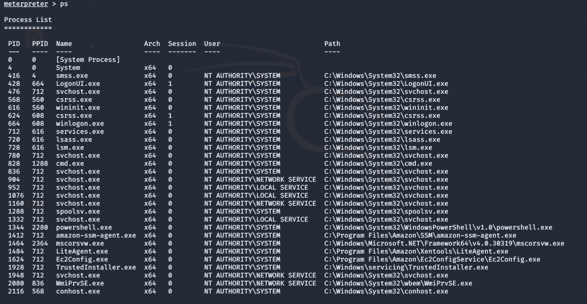

现在让我们迁移到 PPID 来控制更高特权的进程。这回答了本节中的所有任务问题

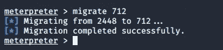

迁移成功

## 4.破裂

现在，我们已经通过迁移更高特权的进程完全访问了 NT 授权系统。是时候破解一些使用用户凭证登录的密码了。使用**散列转储**从 SAM 数据库中转储所有散列。由此，我们得到了非默认用户的名字 **(Task1)**

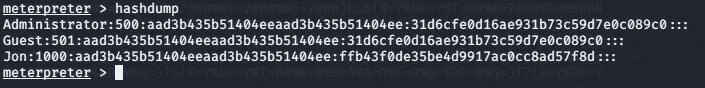

转储哈希值

现在我们需要破解非默认用户的哈希来获取密码。为此，我使用了名为 [**的在线工具。**](https://crackstation.net/)

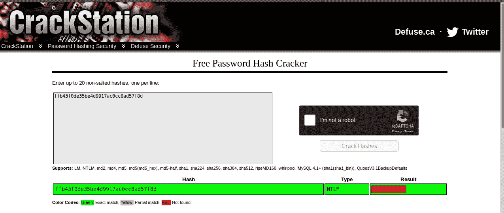

使用 NTLM 部分成功破解

这就回答了本节任务 2 的问题

## 5.查找标志

现在我们已经完成了前一部分的所有任务，是时候找到标志了。**标志**是遍布系统的隐藏检查点。让我们跟着提示，试着找到它们。根据提示，我找到了第一面旗帜

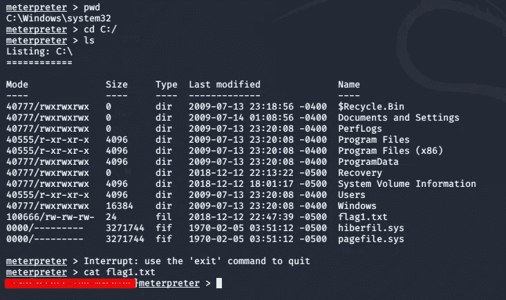

找到标志

要找到第二个标志，请查找用于存储 windows 密码的文件夹。你应该通过简单的谷歌搜索找到位置。导航到该文件夹，您会发现 flag2

要找出最后一面旗子，你得聪明点。因此，我所做的是搜索以标志开始的文件名，从结果出来，我能够导航到该特定文件夹，并获得我的最后一个标志。如果您无法访问如下所示的目录，请在目录和文件名前使用 **\\** ，这将解决无法访问的问题。

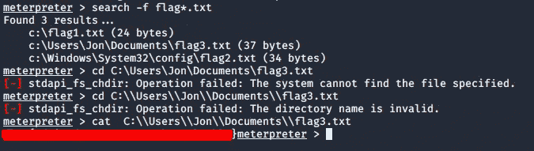

找到最终标志

## 结束语

永恒之蓝漏洞非常著名，许多系统都是利用这个漏洞被入侵的。微软发布了修复程序，为不同的操作系统修补这些漏洞。由此，我们得出结论，使用这样的漏洞系统可能会受到损害，并且对手可以以他喜欢的任何方式使用它。因此，建议始终使用最新版本、修复程序和补丁来更新您的软件和 windows，以降低受到此类漏洞危害的风险

# 关于我

[我](https://medium.com/@anon_7)是一名网络安全爱好者，正在攻读信息安全硕士学位，并试图进入全职网络安全职业。