# 详细报道 05 -TryHackMe-ICE

> 原文：<https://infosecwriteups.com/write-up-05-tryhackme-ice-1791d5d26597?source=collection_archive---------1----------------------->

## 学习利用易受攻击的媒体服务器并获得根用户访问权限

## 利用基于操作系统的漏洞

在我之前的 [**文章**](https://medium.com/bugbountywriteup/write-up-04-tryhackme-blue-e3e58268ca22) 中，我们讨论了如何利用基于操作系统的漏洞，并通过使用不同的工具和利用后方法提升权限来获得完全的系统访问权限。[**冰**](https://tryhackme.com/room/ice) 是[**蓝**](https://tryhackme.com/room/blue) 室在 [**TryHackMe**](https://tryhackme.com/) 平台上的续作。在本演练中，我们将利用一个安全性很差的媒体服务器，并找到一种方法来获得对 windows 计算机的完全访问权限。

## 目标:

1.  扫描机器以找出打开的端口和针对它们运行的服务
2.  找到可被利用来获取访问权限的漏洞
3.  通过破解哈希来收集额外的凭据
4.  使用 post 漏洞提升权限

## 学习成果

1.  了解黑客周期
2.  使用 OS-INT 进行侦察和信息收集
3.  使用不同的方法和漏洞来危害系统
4.  获得不同的工具，如 **Nmap** 、 **Metasploit** 、 **Mimikatz** 等，以扫描、利用和收集针对系统的凭证

## 入门指南

## [任务 1]连接

首先，我们需要使用 OpenVPN 连接到 TryHackMe 网络。这个过程非常简单，你只需要下载配置并在终端上使用 **OpenVPN** 命令运行它。完成后，在终端上使用 **if config** 命令验证您是否在 TryHackMe 的网络上，您应该会看到一个名为“tun0”或“tun1”的接口以及一个分配给它的 IP。祝贺您，您现在已经连接到 TryHackMe 网络。

## 侦察

开始任何 pen 测试或利用的第一个也是最重要的任务是收集关于目标的情报，也称为**侦察**或**信息收集**阶段。在当前场景中，我们确实有一个可利用的系统，因此我们需要扫描该系统。部署机器，并使用 Nmap 开始扫描过程，如下所示

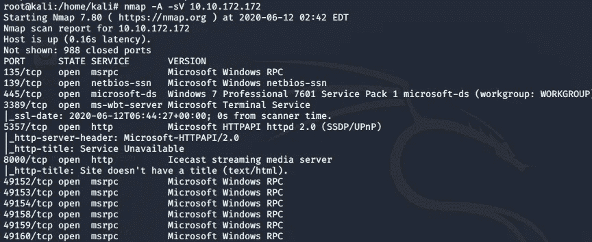

目标主机的 Nmap 扫描

扫描后，我们可以识别出用于 **RDP** 的端口 **3389** 是打开的。端口 **8000** 上运行的服务是**冰播流媒体服务器**。Nmap 识别的主机名是 **DARK-PC** ，如下所示

目标主机名

这回答了我们关于**【任务 2】**的所有问题

## [任务 3]获得访问权限

既然我们已经确定了在目标机器上运行的服务。让我们深入了解正在运行的服务和应用程序。Icecast 媒体服务器似乎很有趣。我们获得以下关于 CVE 上市的信息

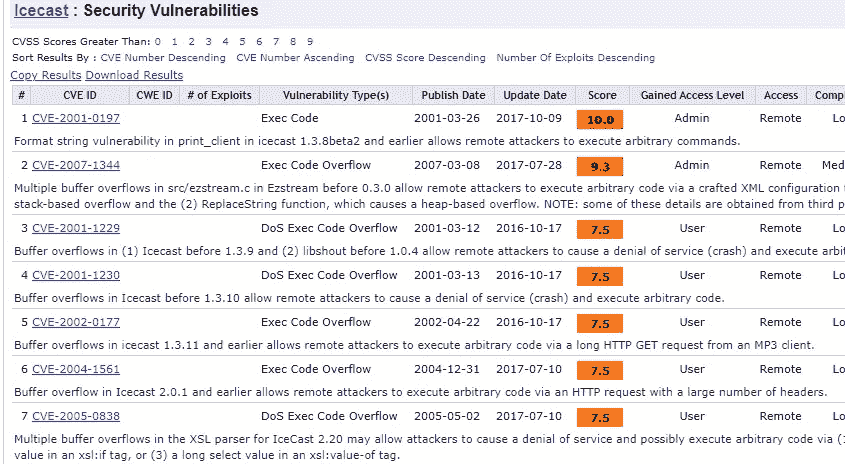

CVE 上市

该任务要求我们找到一个得分为 7.5 的漏洞。作为提示，我们知道该漏洞是在 2004 年发现的，这有助于我们确定 CVE 的号码和名称。这回答了我们对**子任务 1** 和 **2 的问题。**接下来的步骤将回答剩余的问题。现在我们知道这个漏洞让我们可以使用 **Metasploit** 来搜索和利用它。设置所需的参数，我们就可以利用如下所示的漏洞了

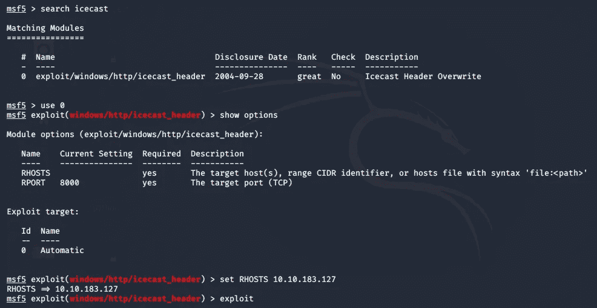

Metasploit

如上所示，我们搜索了在 **CVE 列表**中发现的漏洞。设置远程主机的 IP，并使用 **exploit** 命令运行漏洞攻击

## 任务 4[上报]

我们一运行这个漏洞就得到一个 **Meterpreter** 会话，如下所示

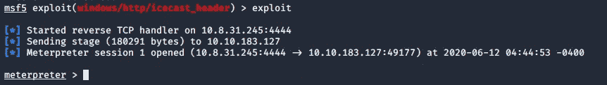

行动中的剥削

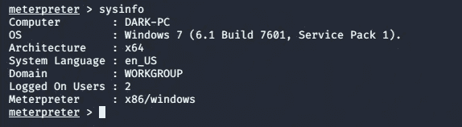

目标机器外壳弹出

我们现在能够回答子任务**1–4**中提出的问题。让我们对体系结构做更多的侦察，检查系统的当前体系结构是否存在漏洞。为此，我们运行 post exploit 模块**post/multi/recon/local _ exploit _ suggester。**

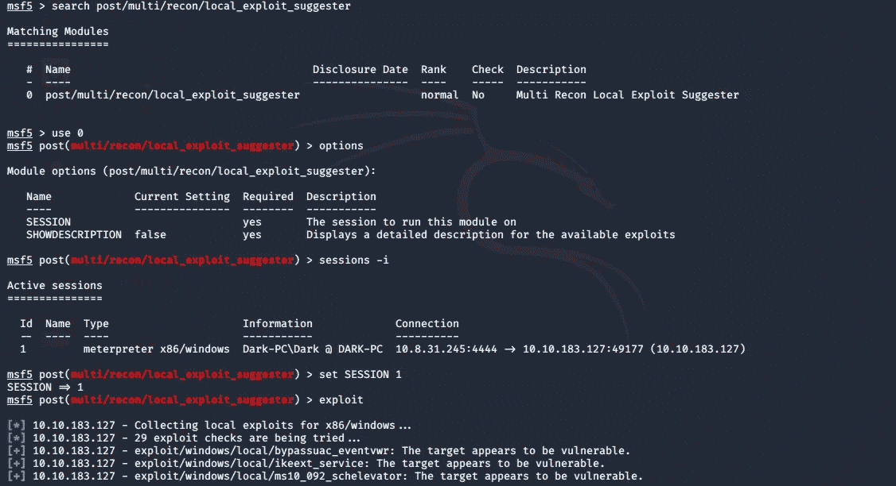

后期利用模块

我们选择发现的第一个漏洞，即**漏洞/windows/local/bypassuac _ eventvwr。**使用 ctrl+z 后台会话并利用此漏洞。按照前面的任务设置所需的参数。您可以使用**选项**命令检查所需的参数。

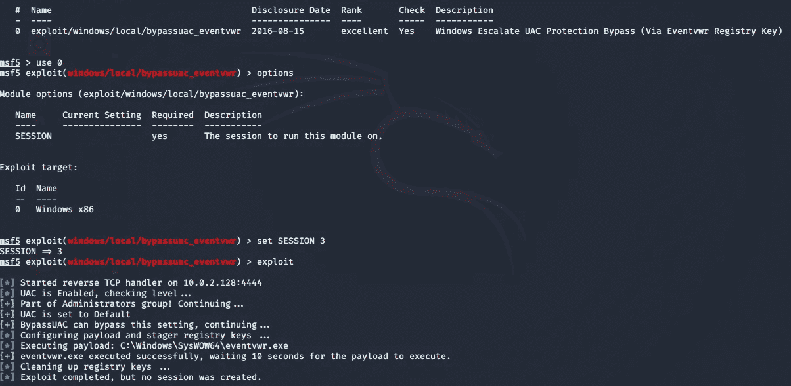

在 Metasploit 上运行漏洞利用

如上所述，我们的利用是不成功的，让我们看看我们是否遗漏了什么。使用 options 命令，我们知道我们的 **Localhost** IP 是错误的，所以设置正确的 localhost IP，如图所示

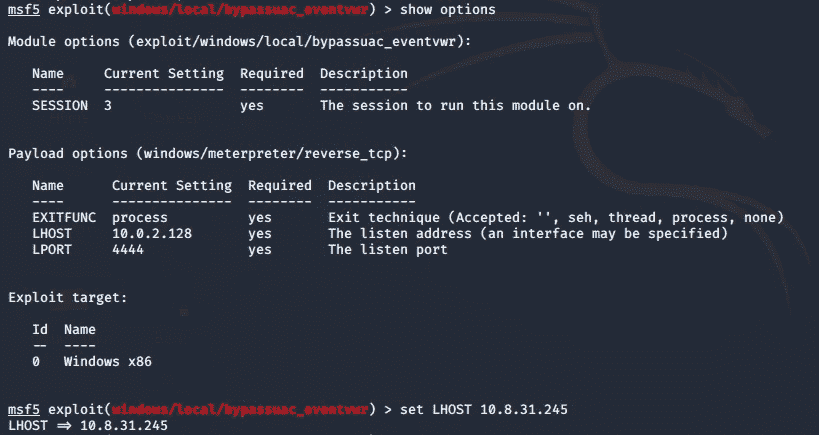

设置本地主机的正确 IP

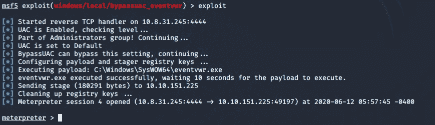

利用成功

一旦利用成功，如上所示，我们可以在此之后回答该任务的最后一个问题。我们可以使用 **getprivs** 命令来验证我们已经提升了我们的特权。至此，我们回答了本节的所有问题。

我鼓励你自己完成这些任务，这样你就会明白这里正在做什么，这就是为什么我没有为每项任务做具体的标题，尽管你可以非常清楚地知道任务中要求什么。

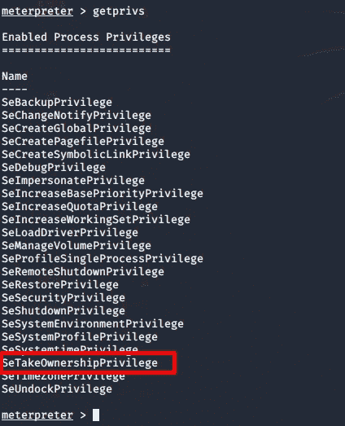

文件的所有权

## [任务 5 ]抢劫

在这一节中，我们将使用一种叫做 **Mimikatz** 的工具来收集额外的密码并破解存储在系统中的散列。在继续之前，我们需要确保我们的进程也具有提升的访问权限，以便与本地安全授权子系统服务( **LSASS** )进行交互，这是 windows 上的一种身份验证机制。使用 **ps** 命令检查哪些进程由 **NT/Authority 系统**运行

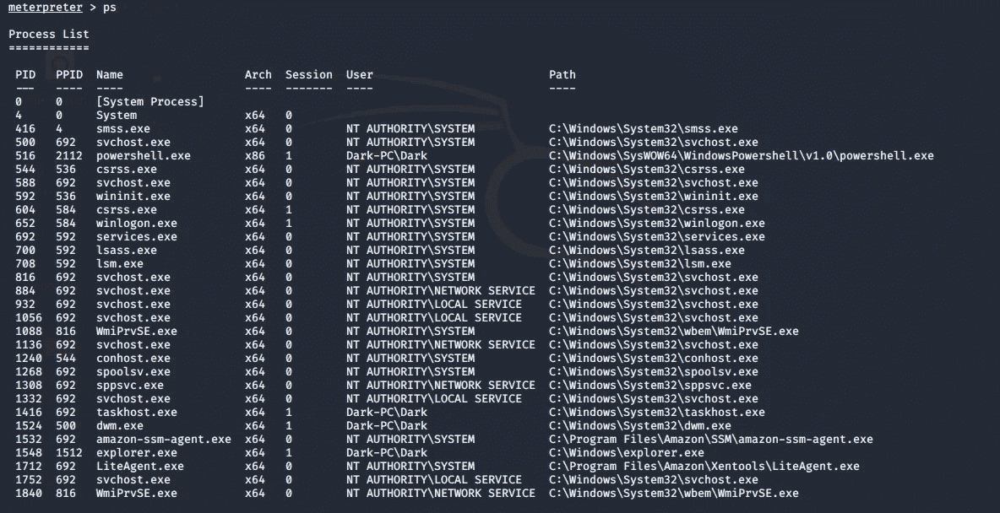

过程列表

我们需要在 NT Authority\SYSTEM 的过程中，因为这将迁移到**spoolsv.exe**这是**打印机假脱机**服务。这回答了**子任务 2** 的问题

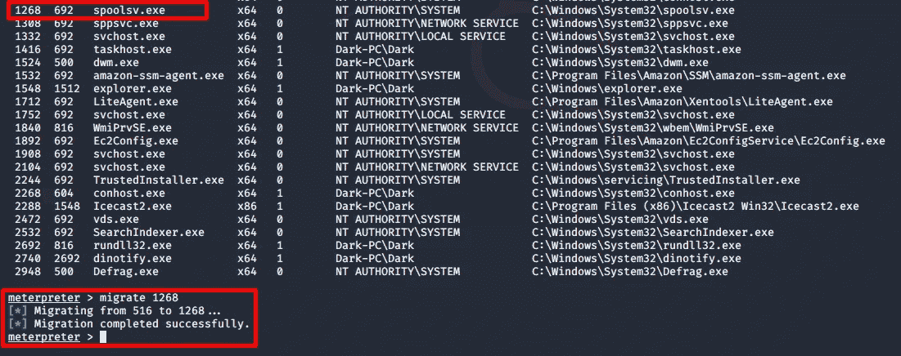

迁移到 spoolsv.exe

为了确认我们已经正确地迁移到系统，在 shell 中键入 **getuid** 命令。这回答了我们对本节**子任务 4** 的问题

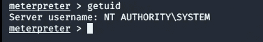

成功迁移

现在我们将使用 **Mimikatz** 又名 **kiwi** (现代版 Mimikatz)来转储所有密码。要运行 kiwi type **加载 kiwi** ，它将成功加载，并给出以下状态

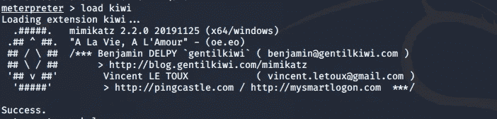

这里需要注意的一点是，我们将在 Meterpreter 的帮助部分看到与 kiwi 模块相关的附加命令

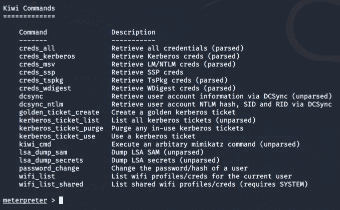

猕猴桃帮助

键入命令 **creds_all** 来检索所有凭证，如下所示

kiwi 被用于密码转储和检索

这回答了我们对**子任务 7 和 8** 的问题

## [任务 6]后期开发

本节将重新介绍 Meterpreter 和 Mimikatz。本节中的所有问题都可以通过使用 Meterpreter 中的 help 命令来回答。该部分提出了与哈希转储、屏幕共享、麦克风共享、时间戳等相关的问题。我将推荐你们自行探索这一部分，以获得关于 **Metasploit** 和 **Mimikatz 的特性的更多理解。**

## [任务 7]额外学分

有时我们没有在每次执行 pen-test 时提供 Metasploit，大多数时候我们需要手工开发而不是使用 Metasploit。因此，我们可以在[漏洞利用数据库](https://www.exploit-db.com/)上搜索漏洞利用，使用那里可用的漏洞利用，并使用手动漏洞利用技术来利用系统。

在与当前场景的目标机器进行交互后，我们开始了解黑客攻击所涉及的阶段、漏洞是如何被利用的、我们使用什么技术在系统级别提升我们的权限，以及我们如何使用工具在系统上检索密码。

我已尝试在本演练中尽可能详细地介绍，以便你们不仅能够解决任务中的挑战，还能了解接管系统(如当前场景)时所涉及的不同工具和程序

我强烈建议你先自己解决这些挑战，如果你遇到了困难，这个演示可以作为参考。

不断学习，不断分享，快乐黑客；)

# 关于我

我是一名网络安全爱好者，正在攻读信息安全硕士学位，并试图进入全职网络安全职业生涯。您可以点击[这里](https://medium.com/@anon_7)了解更多的报道和演练