# 详细报道 06-TryHackMe-Vulnversity

> 原文：<https://infosecwriteups.com/write-up-06-tryhackme-vulnversity-9b5f8e365be8?source=collection_archive---------0----------------------->

# 绕过上传限制并获得 Root 权限

演练穿过 TryHackMe 平台上提供的房间“**”。在我之前的演练中，我们讨论了操作系统中的漏洞以及在系统上运行的不同服务中发现的漏洞。在这个房间里，我们将绕过网络服务器上的上传限制，通过它，我们将获得我们的 shell 并提升我们的权限以获得所需的结果。**

# **先决条件**

**我建议你应该有以下的基本知识，这不是必须的，但它会帮助你更有效地解决问题**

1.  **Nmap**
2.  **目录破坏**
3.  **Burpsuit**
4.  **Linux 文件系统、权限、SETUIDs、环境变量等**

# **目标**

1.  **收集关于目标机器的信息**
2.  **找出网络服务器上隐藏的目录**
3.  **获取 web 服务器的外壳**
4.  **提升权限**

# **学习成果**

1.  **了解扫描主机的 Nmap 标志**
2.  **使用 Go-buster 查找 web 服务器上的隐藏目录**
3.  **学习绕过网络服务器上的上传限制来获得外壳**
4.  **学习 Linux 升级权限**

****又及:我建议你们，伙计们，自己去试试这个房间，如果你们被困住了，就用这篇文章做参考。在某些任务中，你需要在谷歌上搜索你的问题。我不会明确标记子任务，但你会在每个主任务**中找到子任务的所有答案**

# **入门指南**

## **[任务 1 ]-部署机器**

**首先，我们需要使用 **OpenVPN** 连接到 **TryHackMe** 网络。这个过程非常简单，你只需要下载配置并在终端上使用 **OpenVPN** 命令运行它。完成后，在终端上使用 **ifconfig** 命令验证您是否在 TryHackMe 的网络上，您应该会看到一个名为“tun0”或“tun1”的接口和一个分配给它的 IP。祝贺您，您现在已经连接到 TryHackMe 网络。**

## **[任务 2 ]-侦察**

**首先，我们需要通过使用如下所示的 **Nmap** 扫描来收集关于目标机器的信息。使用 Nmap 时，某些开关会相应地获取信息，例如**-**开关执行主动扫描。通过查阅 **Nmap** 的手册，您可以找到关于其他交换机功能的更多信息**

**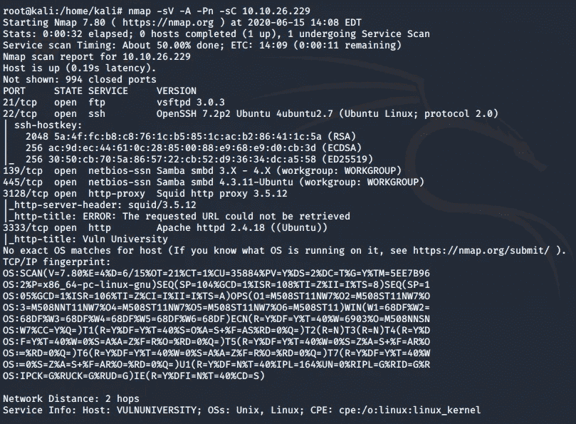**

**从上面的扫描中，我们得到了开放端口的数量。除此之外，我们还会发现每个开放端口上运行的服务和服务版本。使用 **-o** 标志 Nmap 给我们目标机器的操作系统，如下所示。如果我们使用 **-n** 标志，它将不会解析 DNS (IP 到主机名)。**

**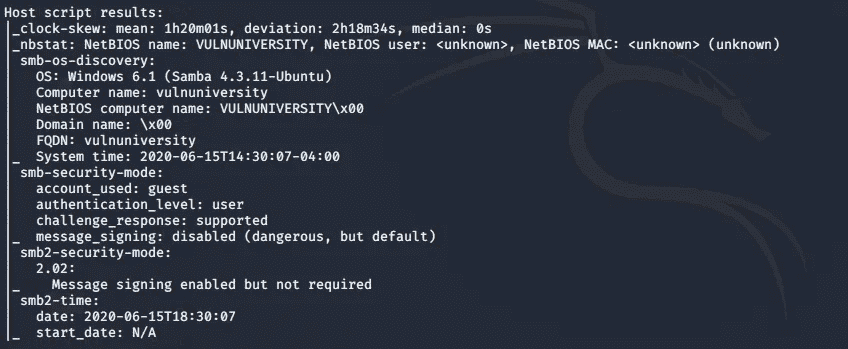**

## **[任务 3 ]-使用 Gobuster 定位目录**

**现在我们已经有了关于端口和端口上运行的服务的信息。让我们尝试探索运行在端口 **3333** 上的 **HTTP** 服务。当我们使用目标机器的 IP 和端口 3333 访问它时，下面的页面打开。探索它并不能提供太多信息**

****

**Vulnversity 网站**

**现在我们将使用 go buster 找到隐藏的目录。你可以在这里了解更多关于 gobuster [的信息，或者你可以使用 man gobuster 来了解它使用的开关。遵循下面的语法，查找隐藏的目录，并使用如下所示的常用单词列表](https://tools.kali.org/web-applications/gobuster)**

**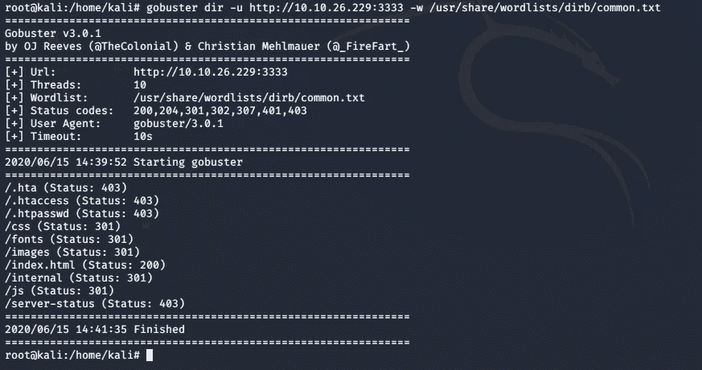**

**用于目录破坏的 Gobuster**

**输出结果显示了可用的隐藏目录，其中大多数目录是正常的，并且可以在大多数网页上找到。 **/internal** 看起来很有趣，所以当访问时，它显示了一个有上传选项的页面。你和我想的一样吗？如果你猜对了，事情会变得非常有趣。**

**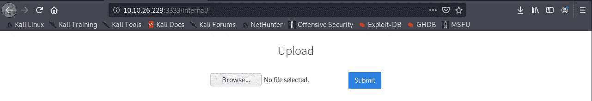**

**已访问隐藏目录**

## **[任务 4 ]危害 Web 服务器**

**我将尝试上传不同扩展名类型的文件，看看是否能上传。我试着上传。巴新和。jpeg 但是失败了。**

****

**不允许扩展**

**我使用了 [**wapalyzer**](https://www.wappalyzer.com/) 并且发现这个网站是建立在 PHP 之上的，所以这是可以理解的。php 是不允许的，因为如果允许与网站相同的扩展名，对手可能会使文件可执行并获得对 web 服务器的外壳访问。**

**现在要知道 web 服务器上允许哪个扩展，以便我们可以得到一个 shell，启动 **Burp Suite** 。请记住在 web 浏览器上配置代理，以便 Burp Suite 可以通过此代理拦截流量。**

**如下图所示设置攻击目标**

**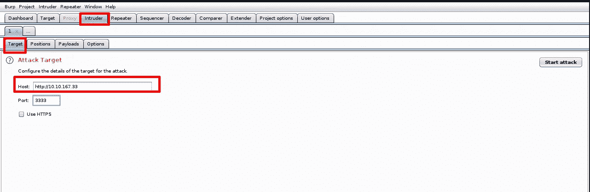**

**设置攻击目标和端口**

**现在，在 web 服务器的上传页面上上传任何扩展文件，以便在 HTTP 历史中捕获请求，如下所示。不要忘记打开**拦截器****

**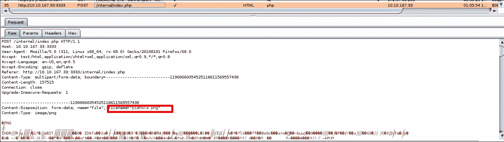**

**将此请求发送给**入侵者**，并标记扩展字段。我们将对该字段进行模糊处理，以找出哪个扩展名容易被绕过**

**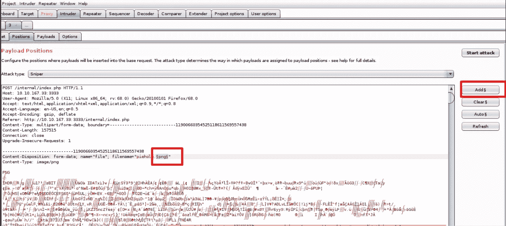**

**干扰者**

**在有效载荷选项中，我们将上传会被模糊化的扩展。不要忘记取消选择**编码**选项，因为保持启用不会给你正确的结果**

**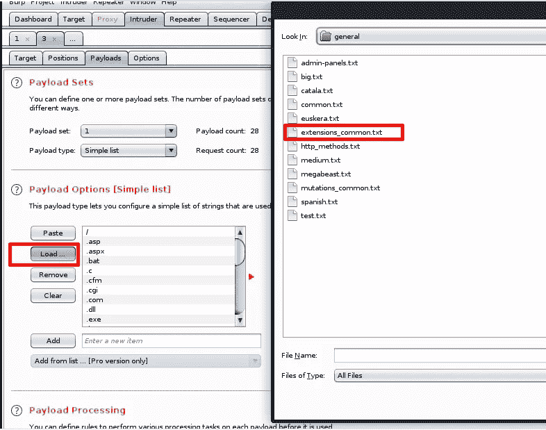**

**引信有效载荷的选择**

**现在导航到选项添加 grep 匹配，即当上传错误的扩展文件时显示的输出消息**

**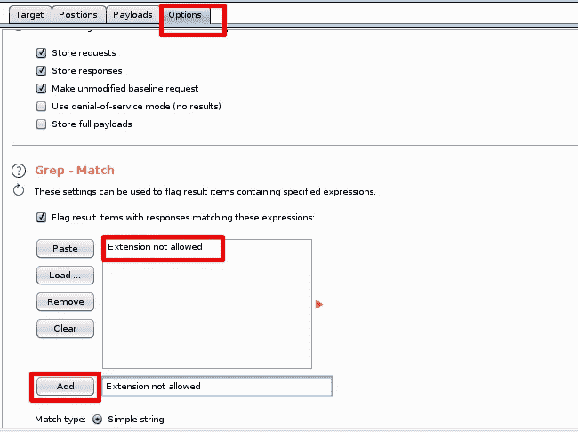**

**现在点击攻击，这将开始模糊过程。如下图所示，我们看到。web 服务器上允许 phtml 扩展名。我们可以通过两种方式来确认这一点，一种是长度，另一种是网页对 raw 选项卡中这个扩展的响应。**

**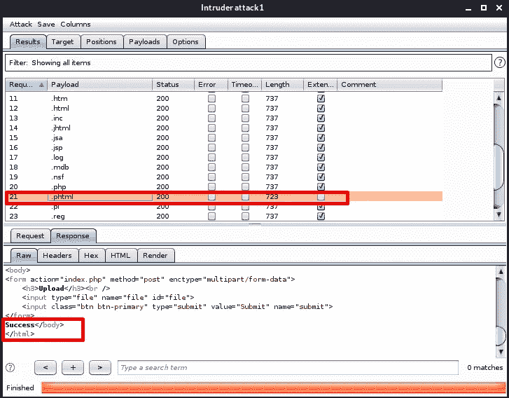**

**既然我们知道 [**。phtml** 允许扩展名为 T5。是时候上传 PHP 外壳了。要上传的 PHP shell 可以在这里](https://file.org/extension/phtml) 找到 [**。通过添加您的计算机的本地 IP 地址来编辑脚本，该地址可以通过在终端中键入 cmd 命令来找到。需要将针对 **tun0** 或 **tun1** 的 IP 复制并添加到脚本中。在上传脚本之前，让我们使用 Net-cat 监听端口 1234 上的传入连接，如下所示。**](https://github.com/pentestmonkey/php-reverse-shell/blob/master/php-reverse-shell.php)**

**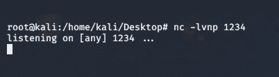**

**netcat 侦听端口 1234**

**在服务器内部网页上传 PHP 脚本，我们会看到脚本已经上传成功**

**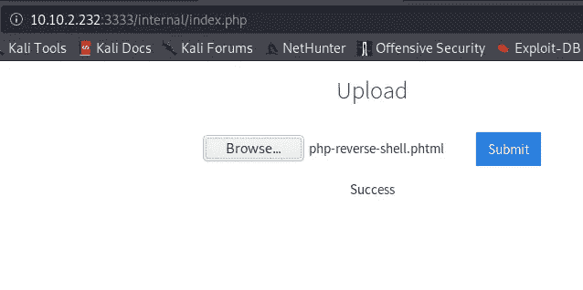**

**上传了。phtml 脚本**

**导航到**http://<IP>:3333/internal/uploads/PHP-reverse-shell . phtml .**一旦我们导航到这个 URL，我们将得到一个反向 shell，如下所示**

**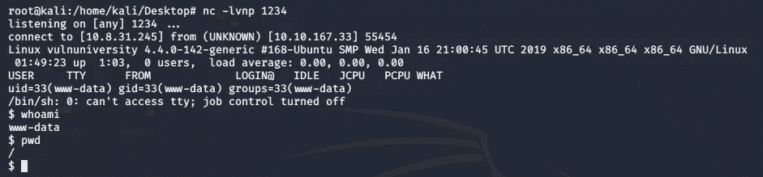**

**反向外壳访问**

**现在我们需要找到管理服务器的用户。导航到 **etc/passwd** 文件，我们知道只有一个用户拥有 bash 访问权限，因此基于这一假设，我们开始了解如下所示的**

**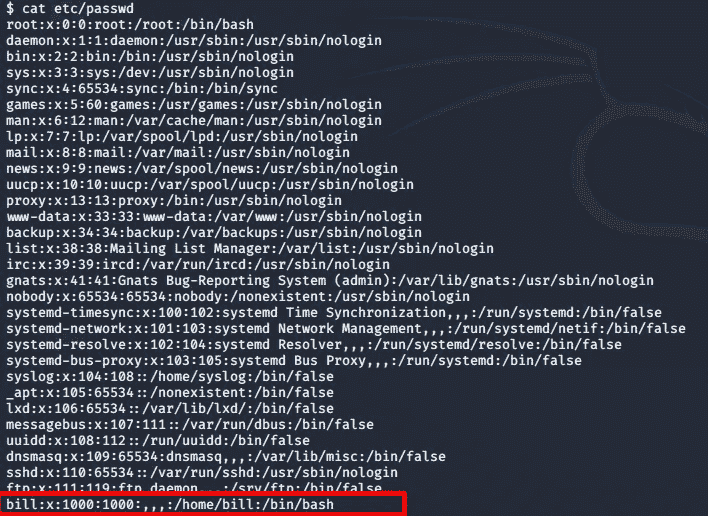**

**etc/passwd 文件**

**导航到用户目录，我们得到用户标志**

**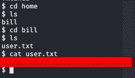**

**用户标志**

## **[任务 5]权限提升**

**现在我们有了 shell 访问权限，我们需要将我们的权限提升到 root。这一节相当棘手，希望你了解 [**setuid**](https://en.wikipedia.org/wiki/Setuid) 函数和 Linux 权限之类的东西。关于这个函数已经有一些理论解释了。如果我们看到我们用户的当前权限，我们没有 root 权限**

**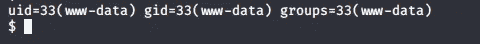**

**使用**find/-user root-perm-4000-exec ls-ldb { } \列出所有 suid 文件；****

**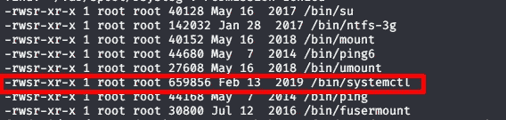**

**systemctl 在所有启用了 setuid 的文件中脱颖而出，因为在 systemctl 上启用 setuid 是不正常的。我很好奇，在不同的主机上运行了相同的命令，发现它们都没有启用 setuid 的 systemctl，因此基于这个 **/bin/systemctl** 很突出。gtfobin 是一个很好的地方，在这里 [**gtfobin**](https://gtfobins.github.io/gtfobins/systemctl/) 是一个很好的地方，在这里你可以找到帮助权限提升绕过本地安全策略的 Unix 二进制文件**

**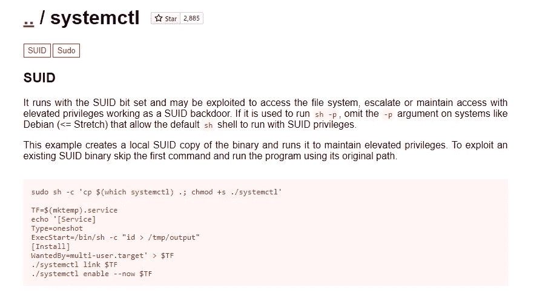**

**现在我们需要设置一个环境变量。我修改了上面的脚本，有点像我更喜欢特权用户的痛击，所以我编辑了它，如下所示。为了把所有的事情都做好，您可能希望对 Linux 文件系统和 setuid 有一个大致的了解。**

**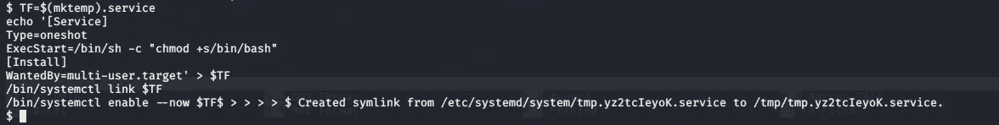**

**在这一步之后，启用创建的环境变量并运行它。我们一执行这个命令，就获得了 root 权限和 root 标志，如下所示。现在 **euid** 和 **egid** 是根。**

**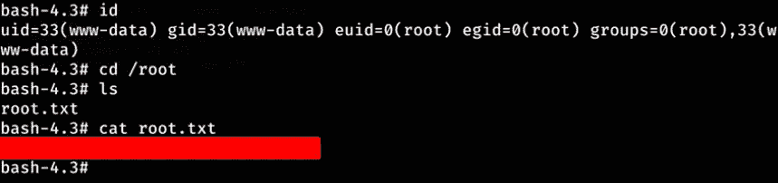**

**随着最后一项任务的成功执行，我们将结束本次演练。我知道最后一部分让人不知所措，但是不要担心，我很快就会写关于 Linux 特权升级的文章，这会消除你所有的疑虑。现在我们知道了如何绕过 web 服务器上的上传限制，并利用它来获得 web 服务器的外壳。**

**我希望您喜欢这个演示，如果您有任何意见或建议，请在下面的意见/回复框中告诉我**

# **关于我**

**我是一名网络安全爱好者，正在攻读信息安全硕士学位，并试图进入全职网络安全职业生涯。您可以点击这里阅读更多文章和演练**

****