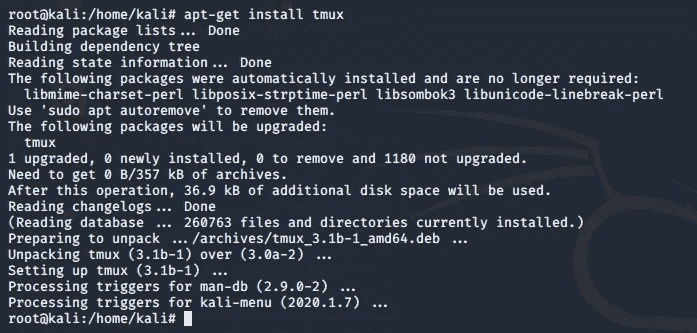
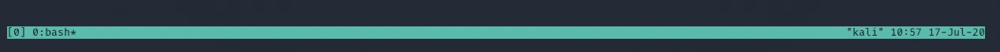
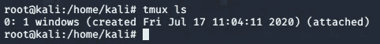
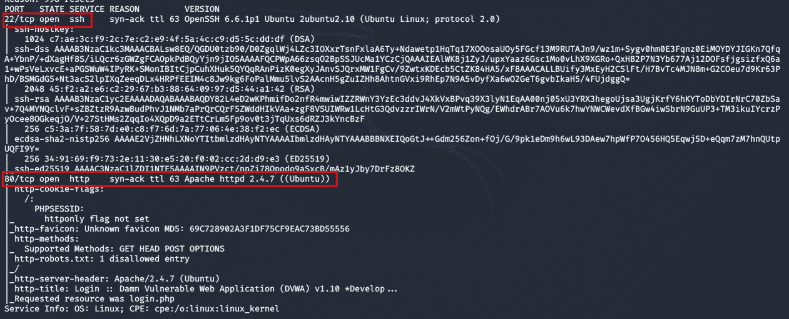
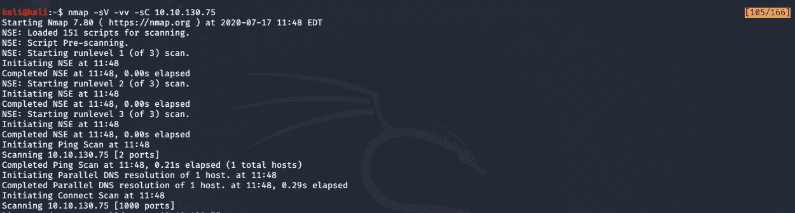
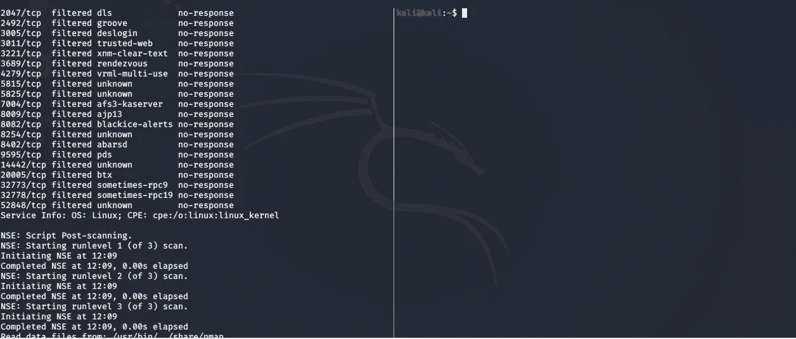
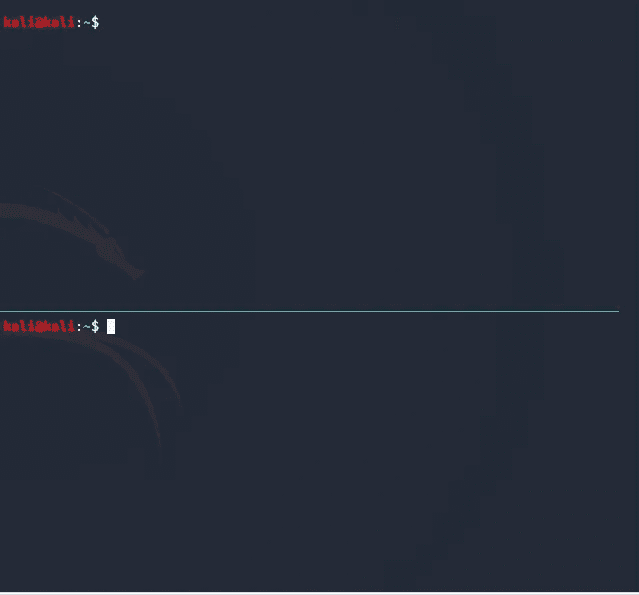

# 报道 08-特里哈克姆-TMUX

> 原文：<https://infosecwriteups.com/write-up-08-tryhackme-tmux-1aa190fe2a76?source=collection_archive---------3----------------------->

学习使用和互动 TMUX 一个伟大的 Linux 工具，管理您的终端窗口

Tmux(终端多路复用器)是一个方便的工具，允许你在一个终端窗口中打开多个窗口。它还允许跟踪会话/窗口终端，并通过来回切换不同的会话号/名称来管理它们。您可以随时终止会话。如果您使用多个终端窗口，并且希望在一个窗口中看到您的所有工作，Tmux 是一个很好的工具。这篇文章基于 TryHackMe 上的 TMUX 房间，讲述了使用 TMUX 进行多终端窗口管理和跟踪时可以使用的一些快捷方式

你可以使用****的小抄来解决房间内的挑战。起初，你可能会不知所措，但是不要担心，通过练习，你一定会掌握这些快捷方式****

# **目标**

**熟悉 TMUX 及其快捷方式，以便在不同的终端窗口中导航，创建新的会话窗口，从窗口中退出等**

# **学习成果**

1.  **学习使用 TMUX 创建新会话**
2.  **附加和分离会话**
3.  **创建窗口并在其中导航**
4.  **了解不同的按键绑定等**

# **任务**

## **任务 1**

**首先，我们需要在我们的操作系统上安装 TMUX。你可以把它安装在任何你想安装的 Linux 发行版上。我通常在 Kali Linux 上工作，所以我会安装它。**

****

**使用 apt-get 安装 tmux**

## **任务 2**

**现在我们已经安装了 tmux，让我们启动它。该命令非常简单，您很可能在备忘单中找到该命令。一旦你在终端中写下 **tmux** 并按下回车键，你会注意到在你的终端底部有一个蓝色的条，如图所示。**

****

## **任务 3–10**

****任务 3 至 10** 与命令相关。您可以参考备忘单，直到您不用查看任何参考资料就能熟练使用这些命令**

**所有 tmux 命令都以键盘按钮开始，即**控制**。您会看到每次使用快捷键时都按下了 ctrl 键。另一个需要和 ctrl 一起使用的键是“ **b** ”。你必须注意，这些键应该作为我们在接下来的挑战中要经历的其他快捷键的前缀，每次都要按下。**

**当我们想要分离一个会话，就像我们在使用 **tmux** 之前创建的会话一样，我们只需按下 **ctrl+b D** ，这将退出当前的 tmux 会话，并给出一个小提示，提示 tmux 已经退出。**

**如果我们想列出所有的 tmux 会话，我们可以使用 **tmux ls** 来查看所有的会话，如下所示**

****

**这里，会话名称由左侧的数字表示。如果我们使用名称创建一个 tmux 会话，也可能有一个会话名称，如果没有，那么默认情况下它会被分配一个编号。为了与特定的会话进行交互，我们将使用 **tmux a -t 0(会话名称)****

**为了在这个会话中创建一个新窗口，我们将使用 **ctrl + b C****

**现在我们已经有了很多与会话和窗口的交互，让我们使用它并填充一些信息**

## **任务 11**

**让我们使用如下所示的标志，用 Nmap 扫描目标机器**

********

## **任务 12**

**正如我们从上面的输出中看到的，有很多信息要存储，它不适合放在一个屏幕中，为此我们将使用 **ctrl + [** 。这样做将允许我们使用箭头键滚动屏幕。请注意右上角突出显示的部分，其中显示的数字表示您可以上下滚动。**

****

## **任务 13–15**

**如果我们想去页面的顶部，我们可以使用 **g** 和 **ctrl +** 的组合，tmux 中的每个快捷方式都使用这种组合。同样，如果我们想导航到底部，我们按下 **G.** 以离开**复制模式**，我们只需按下 **q****

## ****任务 16****

**如果我正在处理多个窗口，并希望拆分窗口，以便一次可以打开较少的窗口终端，该怎么办？在这种情况下，我会使用 **ctrl + b %** 来垂直分割屏幕，如下所示**

****

**ctrl + %垂直分割屏幕**

**如果我想水平分割屏幕，我会使用 **"** 和基本组合**

****

**ctrl +"水平分割屏幕**

## **任务 18–23**

**让我们来玩一下这些窗口，所以为了在这些分屏之间导航，使用 **ctrl +箭头键**。为了调整这些屏幕的大小，按住组合键和箭头键。为了在 t 之后杀死一个我们不再需要的窗格，我们将结合组合键使用 **X** 。使用**退出**以终止会话。**

**为了获得任务中要求的名为 neat 的会话，使用 **tmux new -s neat。****

# **结论**

**随着最后一项任务的完成，我们对这个房间的演练到此结束。当你使用多个窗口，并且想要跟踪你的会话，尤其是终端窗口时，Tmux 是一个非常方便的工具，它允许容易地访问你的终端窗口，并且允许你更有效地工作，而不需要通过多个终端窗口制造麻烦。**

**我希望你喜欢通读我的文章。如果你喜欢我的文章，并且想要更多这样的东西，请跟我来，为它鼓掌。你也可以在 Patreon 的这里支持我。**

# **关于我**

**我是一名网络安全爱好者，正在攻读信息安全硕士学位，并试图进入全职网络安全职业生涯。你可以点击这里阅读更多的文章和演练**