# 特写 09- TryHackMe- Kenobi

> 原文：<https://infosecwriteups.com/write-up-09-tryhackme-kenobi-afc2dccd40a2?source=collection_archive---------1----------------------->

## 学习利用和接管基于 Linux 的易受攻击的机器

克诺比上 TryHackMe

# 介绍

本演练穿过 TryhackMe 上的房间“ [**【克诺比】**](https://tryhackme.com/room/kenobi) ”。克诺比或 [**欧比万·克诺比**](https://assets1.ignimgs.com/2017/03/02/kenobi-1280-1488494010895_1280w.jpg) 是这个房间里提到的一个著名的《星球大战》角色。我们将尝试通过利用我们发现的漏洞来获得对目标机器的 root 访问权限。机器上有隐藏的标志，我们在执行任务时必须找到它们

# 目标

1.  共享的 Samba 的枚举
2.  FTP 服务器软件易受攻击版本的利用
3.  通过路径变量操作获得机器的超级用户访问权限

# 入门指南

## [任务 1]部署易受攻击的机器

让我们使用 OpenVPN 连接到 TryHackMe 网络。通过在终端中键入“ **ifconfig** ”来验证您的 IP 地址，您应该会看到 **tun0** 或 **tun1** 接口以及分配给它的 IP

## 扫描

扫描目标机器上打开的端口和服务。为此，我们将使用如下所示的 **Nmap**

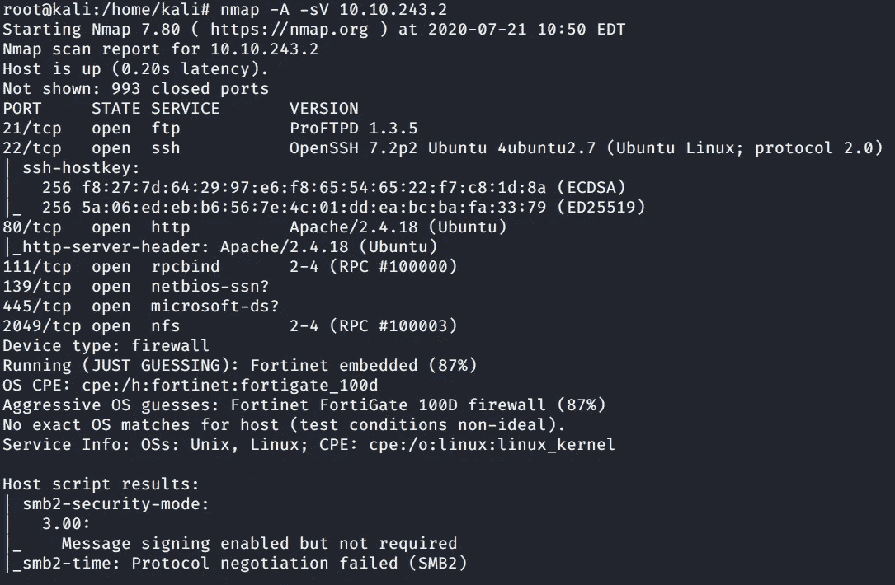

目标机器的 Nmap 扫描

如 Nmap 扫描所示，总共有 7 个端口**打开**

## [任务 2]枚举共享的 Samba

在我们继续前进之前，让我们检查一下是否在**端口 80** 上发现了什么。对于，在 web 浏览器上导航到目标机器 IP。从下面可以看出，没有发现什么有趣的东西

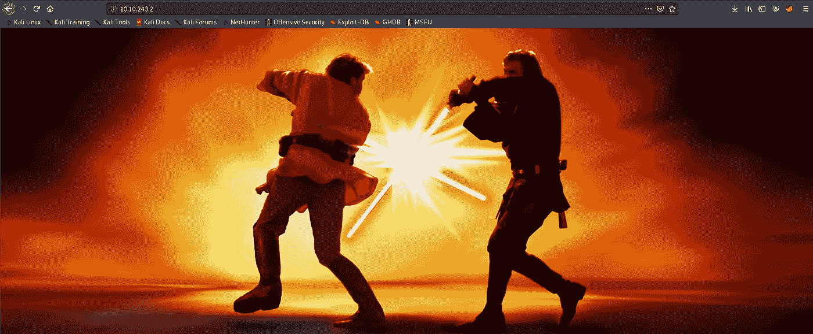

星球大战角色

让我们也检查隐藏的目录。为此，我们可以使用 **go-buster** ，如下图所示。 **-w 标志**用于指定常用目录名的字表， **-s 标志**用于定义状态码，即 **200** ，这是成功 HTTP 请求的标准响应。

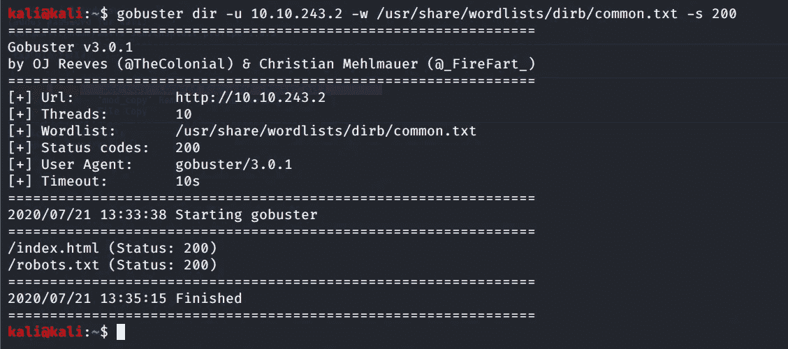

使用 go buster 强制隐藏目录

我们从上面的结果中发现了两个隐藏的目录。Index.html 没有给出任何东西，而 robots.txt 给出了一个隐藏的路径。

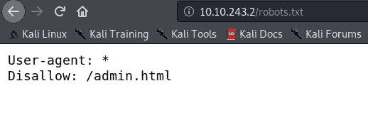

robots.txt 路径

我们也没有从 admin.html 得到任何东西。

现在关于我们的 Nmap 扫描，我们看到端口 **139** 和 **145** 打开，它们是 SMB(服务消息块)的标准端口。这里我们需要枚举文件共享的 samba。Samba 为 windows、Linux、UNIX 等各种平台提供打印和文件服务。我们可以使用各种工具来枚举 SMB 共享。为了验证概念，我将使用两种工具来实现相同的目标。

因此，首先我们使用 enum4linux，如果我们想枚举 SMB 上的共享，它工作得很好。如下所示——一个标志枚举了与 SMB 相关的所有信息

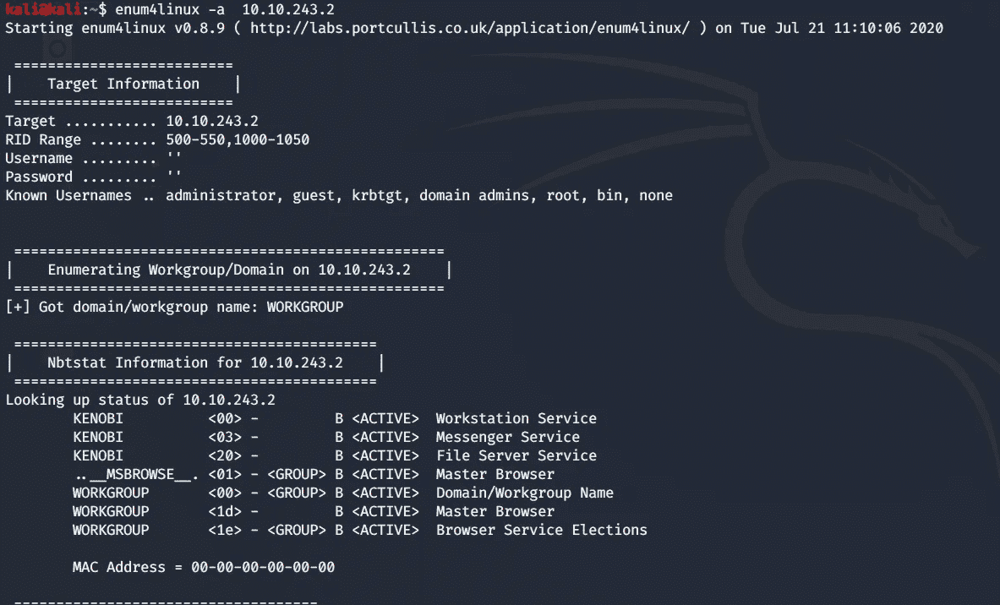

enum 4 Linux Samba 共享枚举工具

正如我们从以下信息中看到的，共有 3 个文件共享，即打印、匿名和 IPC

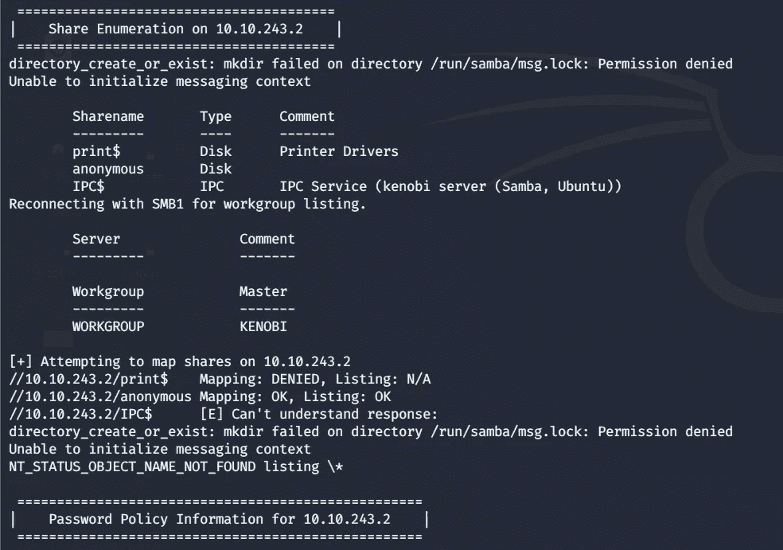

枚举的文件共享

使用 Nmap 内置脚本也可以达到同样的效果

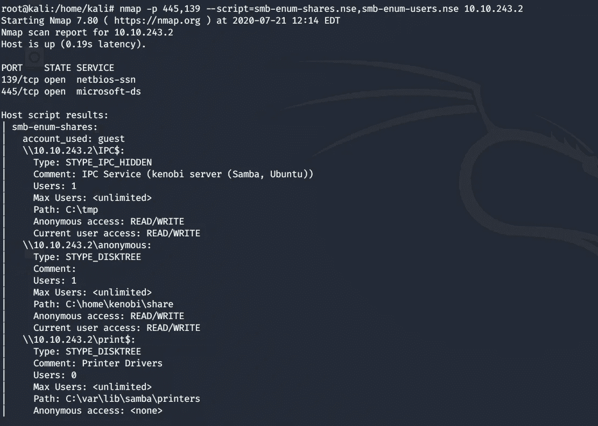

用于 SMB 枚举的 Nmap 内置脚本

让我们访问一个文件共享，看看是否能找到一些有趣的东西

访问目标计算机上的文件共享

因此，我们访问了匿名文件共享，并取得了成功。

它没有要求密码，我们可以进入文件共享。每当你像这样访问一个文件共享时，寻找任何将来可能使用的文件，现在，我们看到一个 log.txt 文件。我们可以使用 **smbget** 将文件传输到我们的主机上

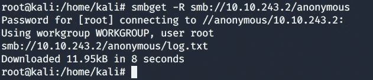

将文件从目标计算机复制到本地主机

让我们查看一下 log.txt 文件，看看是否能找到一些有趣的东西。我们开始了解 FTP 端口和其他信息，包括目标机器的 SSH 密钥

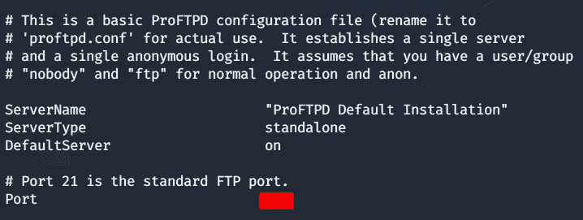

log.txt

再次参考我们的 Nmap 扫描，有另一个打开的端口，即 111，它用于 RPC(远程过程调用)。在我们的例子中，RPC 端口 111 用于网络文件系统。让我们使用 Nmap 脚本引擎对此进行列举，如下所示

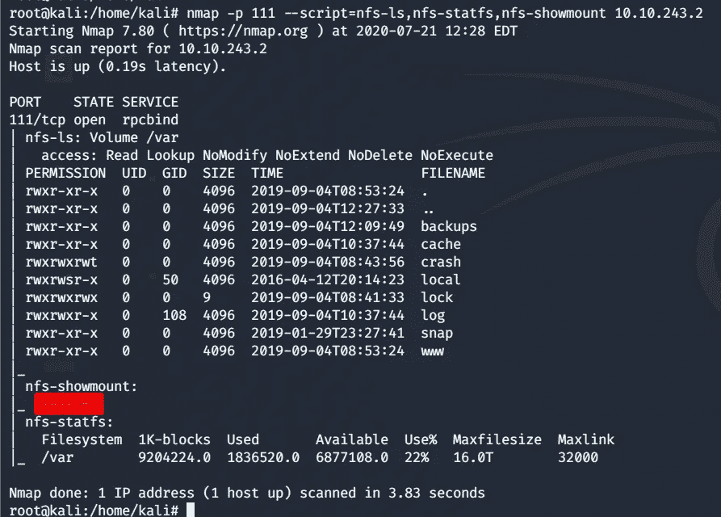

RPC 的枚举

从上面的扫描中，我们看到只有一个文件挂载可用于接下来的步骤

## [任务 3]通过 Proftpd 获得初始访问权限

在前面的任务中，我们已经收集了足够的信息并枚举了文件共享，现在是时候访问我们的目标机器了。我们需要回到我们的 Nmap 扫描，搜索针对 FTP 端口的漏洞，即运行 ProFtpd(一个免费的开源 FTP 服务器。该服务器的版本已过时，可被利用。我们将使用 [**searchsploit**](https://www.exploit-db.com/searchsploit) 针对这个版本的 proftpd 进行潜在的攻击

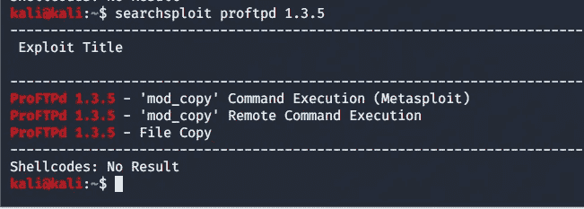

正如我们所看到的，有三个漏洞可以用来对付这个版本。 [**mod_copy 模块**](http://www.proftpd.org/docs/contrib/mod_copy.html) 中有一些命令可以为我们所用，比如**站点 CPFR** 和**站点 CPTO。**使用可以查看这些命令的用法

让我们使用 [**Netcat**](https://nmap.org/ncat/) 来通过 TCP 或 UDP 在网络上进行读写，以在端口 21 上连接到目标机器

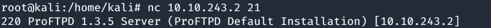

使用 Netcat 连接到端口 21 上的目标 IP

现在我们已经成功连接，使用站点 CPFR 和站点 CPTO 命令将我们的目标机器私钥复制到我们的"/ **var/tmp** "目录，就像我们之前在 NFS 上看到的挂载目录 var 一样

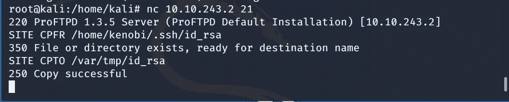

将目标计算机私有 SSH 密钥复制到/var/tmp 目录

是时候将 **"/var/tmp"** 目录挂载到我们的本地机器上了，这样我们就可以使用私有密钥，并使用刚刚复制的私有密钥通过 ssh 访问目标机器

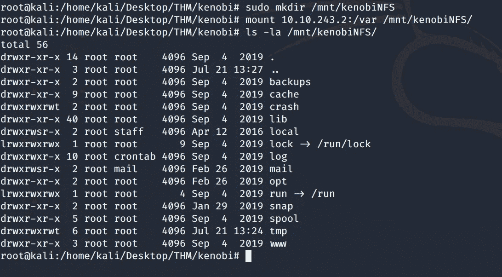

将/var/tmp 安装到主机上

成功挂载后，让我们复制私有 ssh 密钥，如下所示。更改文件 id_rsa 的权限。

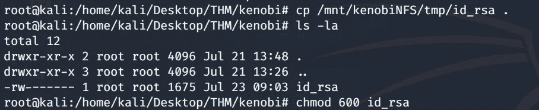

复制私钥

现在使用私钥让 ssh 进入我们的目标机器

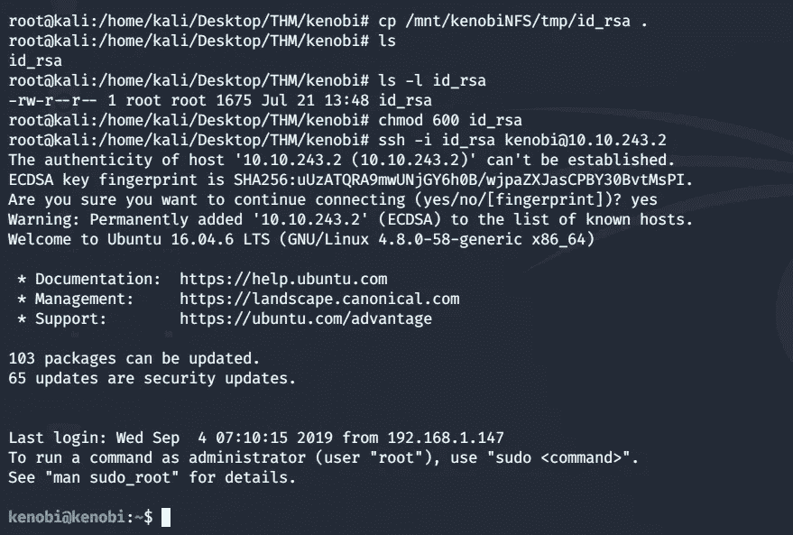

到目标机器的 SSH

我们的 SSH 成功了，我们已经可以访问我们的目标克诺比机器。现在我们必须寻找这台机器上隐藏的旗帜

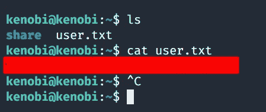

找到用户标志

## [任务 4]通过路径变量操作进行权限提升

我们需要提升我们的权限以获得根用户访问权限。为此，我们将使用 SUID 位。那么 SUIDs 位是什么呢？？它们是针对用户和组定义的一组权限。设置这些位允许文件按照用户的权限执行

要找出设置了 SUID 位的文件，请使用如下所示的命令

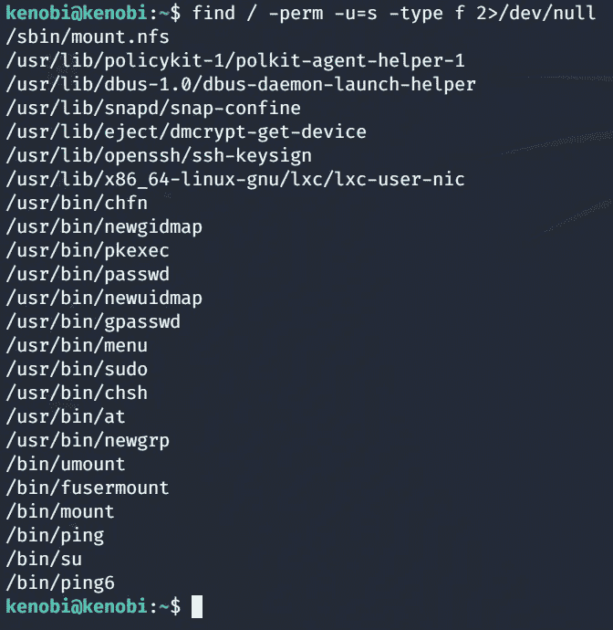

查找设置了 SUID 位的文件

在以上文件中 **/usr/bin/menu** 最为突出。让我们运行这个二进制程序

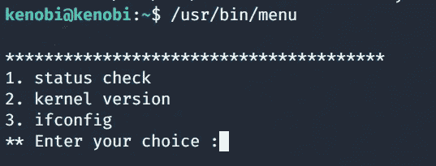

执行二进制文件

通过运行这个二进制文件，我们看到了三个选项。逐个输入每个选项，显示输出，这不是很有趣。使用 strings 命令，我们可以在二进制文件中查找人类可读的字符串，如下所示。从下图中，我们推断 curl 是以完整路径运行的，所以我们可以做的是操纵路径来获得 root，因为这个命令已经以 root 身份运行了

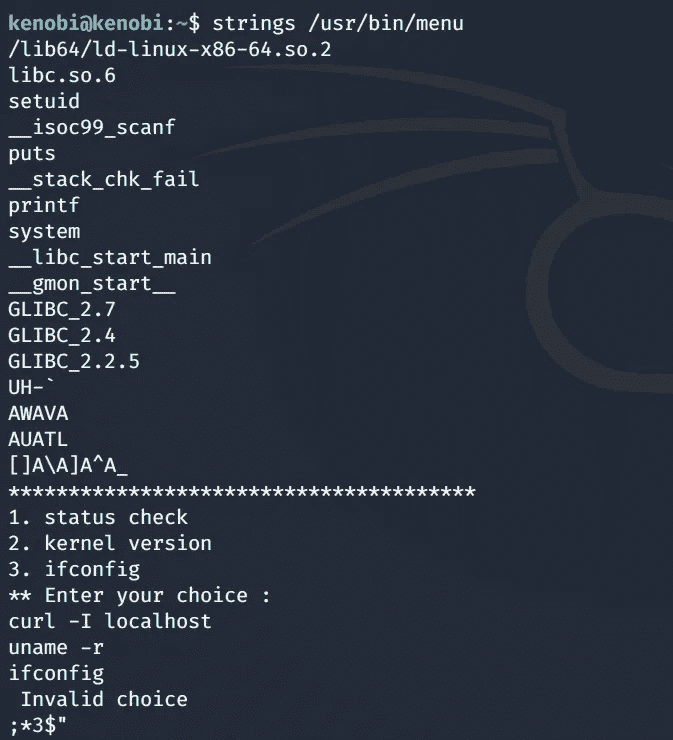

在二进制上寻找人类可读的字符串

因此，利用这一点，我们复制/bin/sh shell 并将其调用到 curl，更改文件的权限，并将路径导出到我们之前看到的菜单文件目录

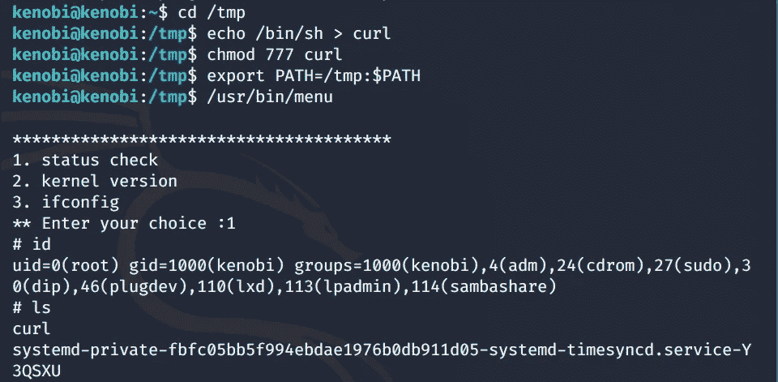

通过利用 SUIDs 操纵文件路径进行根访问

现在，当我们再次运行前面的二进制文件时，我们获得了 root 访问权限，如上所示。

最后，我们应该在当前用户的根目录中找到我们的用户标志，如下所示

根标志

随着我们最后的旗帜被发现，这结束了我们的演练，我希望你喜欢它。欢迎您的建议和意见。如果你喜欢这个内容，请鼓掌并与他人分享。你可以在这里支持我

# 关于我

我是一名网络安全爱好者，正在攻读信息安全硕士学位，并试图进入全职网络安全职业生涯。您可以点击这里阅读更多文章和演练