# 10 篇文章- TryHackMe- Linux 挑战第 1 部分

> 原文：<https://infosecwriteups.com/write-up-10-tryhackme-linux-challenges-74408715ece4?source=collection_archive---------2----------------------->

这篇文章使用 Linux 操作系统中的不同命令、服务和工具在 Linux 机器上查找标志

## 查找隐藏标志

TryHackMe 平台上的房间 [**Linux 挑战**](https://tryhackme.com/room/linuxctf) 非常适合你重温 Linux 技能。我会一步一步地检查整个房间，在我们的路上，我们会发现隐藏在整个系统中的旗帜，这将导致系统地完成每个任务。如果您已经熟悉 Linux 命令和服务，请查看**[**了解如何利用和接管基于 Linux 的易受攻击的机器**](https://medium.com/infosec-beacon/write-up-09-tryhackme-kenobi-afc2dccd40a2)**

******附:我建议你们，伙计们，试着自己解决这些挑战，如果你在某个地方陷入困境，你随时可以回到这里******

## ****目标****

1.  ****学会使用查找、定位、ls、grep、tar 等命令****
2.  ****了解 Cron 作业、MOTDs，定位系统中隐藏的目录和文件****
3.  ****学习使用私钥 SSH 到不同的用户帐户****
4.  ****了解系统文件、路径、变量和文件权限****
5.  ****学习通过 GUI 等使用 SCP 和远程桌面传输文件****

## ****任务 1 Linux 挑战简介****

****首先，我们需要连接到 TryHackMe 网络来访问我们的目标机器。为此，我们可以连接到 OpenVPN 或使用浏览器内的机器访问(可供订阅用户使用)。如果我们需要通过 SSH 手动登录，我们可以使用以下凭证****

****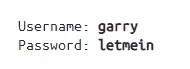****

****目标计算机的 SSH 信用凭证****

****让 ssh 使用上面的凭证到目标机器。使用 **ls** 列出用户 Garry 主目录的所有文件，如下所示****

****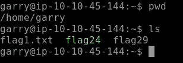****

## ****[任务 2]基础知识****

****本节涵盖了 Linux 的基础知识。我们需要寻找隐藏的标志，我们可能需要切换到另一个用户帐户为我们的目标。我们需要找到 **10 面旗帜**来完成这一部分的挑战****

****让我们使用如下所示的 cat 命令找出我们的第一个标志****

****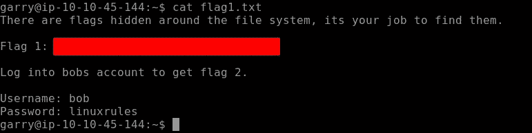****

****标志 1(用户 Garry 的主目录)****

****我们必须登录 bobs 帐户才能找到我们的**标志 2******

****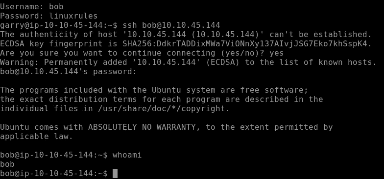****

****SSH Bob 帐户****

****切换到 bobs 帐户后，使用 cat 输出 F **lag 2** ，如下所示****

****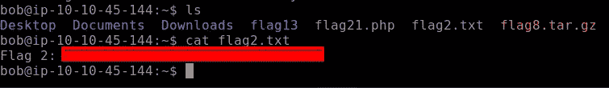****

****标志 2****

******标志 3** 隐藏在当前用户的 **bash 历史**中。我们不知道隐藏的 bash 历史文件的确切位置，所以我们可以使用 **locate** 命令并找到 **flag 3** ，如下所示****

****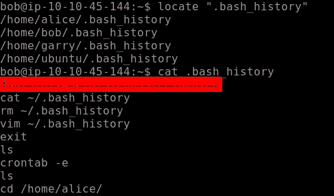****

****标志 3****

****我们的**旗 4** 位于 crontab。 **Crontab** 是用于按指定时间表运行的命令列表。Crontab 与 **cronjobs** 相关，其目的是在指定的时间表或时间执行指定的指令或命令。 **crontab -e** 允许编辑 crontab 条目****

********

****编辑 crontab 条目****

****浏览 crontab 的条目，我们找到了我们的**标志 4******

****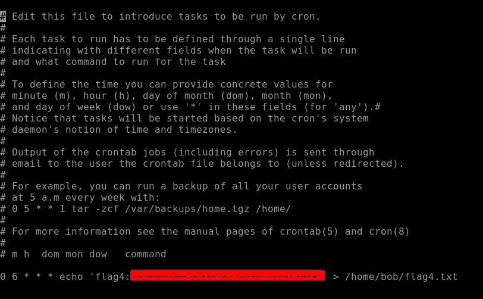****

****在 crontab 条目中找到标志 4****

****转到下一面旗帜，即 5 号旗帜。让我们使用 grep 命令，它在查找任何文件、目录或文件内容时非常方便。grep -r 'flag5 '将递归搜索内容 flag5。如下图所示，我们找到了通往旗帜 5 的路径****

****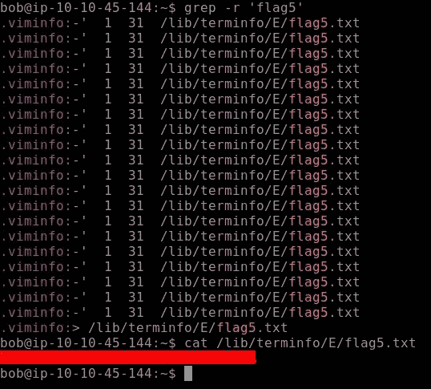****

****标志 5****

****我们同样会找到旗帜 6。这个任务给了我们一个提示，标志中包含字母' **c9** '。首先，使用**定位**命令定位标志 6 目录。当我们输出文件时，文本太多，所以这里 **grep** 开始起作用。****

****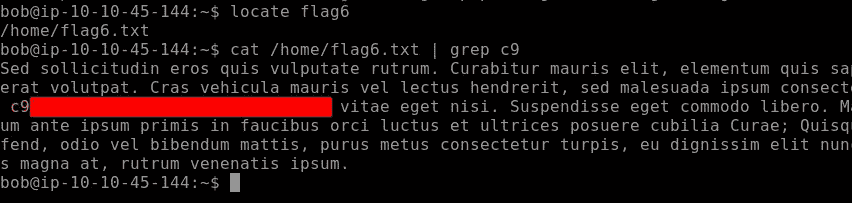****

****标志 6****

****继续我们的下一面旗帜。这个挑战提示我们去寻找发现过程的路径。e 将使用 **ps** 命令，该命令用于列出系统中所有活动的进程。我们用 **ps** 命令设置的**标志**允许我们以列表格式列出活动连接。****

****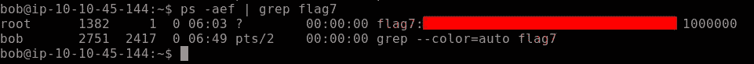****

****旗帜 7****

******标志 8** 可以在用户 bob 的主目录中找到。该文件需要解压缩以输出**标志 8** 的内容****

****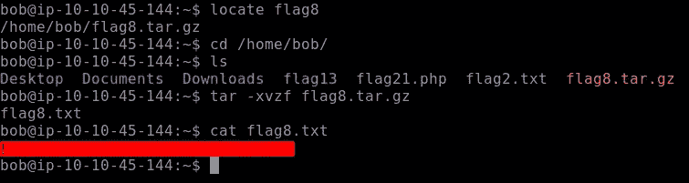****

****标志 8****

****挑战提示我们在主机文件中寻找我们的**标志 9。******

****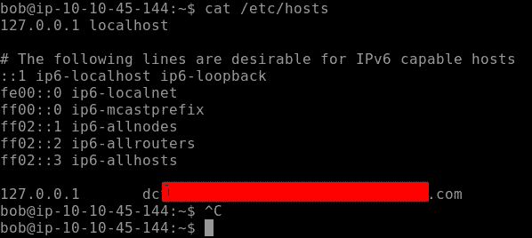****

****标志 9****

****对于我们的最终标志，即**标志 10** ，我们需要查看所有用户的目录，主要是存储在该文件中的密码散列，如果您已经熟悉 Linux 文件系统和目录，您可能已经猜到了。没错，就是我们要查看的 **etc/passwd** 文件。分析文件，我们得到最终的**标志 10******

****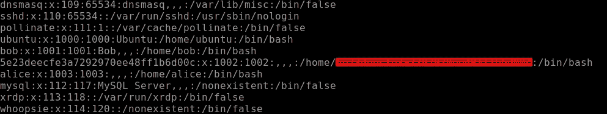****

****标志 10****

****我们有这个任务的最后一面旗帜来完成这个挑战****

## ****[任务 3] Linux 功能****

****转到下一个挑战任务，我们将在这里使用更多的 Linux 命令。让我们运行一下**标记 11** ，看看它会显示什么。正如输出所说，我们必须查看创建别名的位置。巴什尔是值得一看的地方，如下图所示，我们有自己的国旗****

****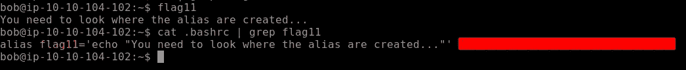****

****旗帜 11****

******标志 12** 可在 motd(每日消息)目录中找到。因此，导航到如下所示的目录。检查头文件，我们有我们的标志 12。****

****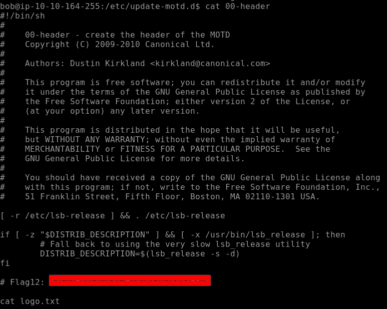****

****旗帜 12****

****对于下一个标志，我们导航到**标志 13** 目录。该目录中包含两个脚本。正如挑战所说的使用 **diff** 命令，diff 命令逐行比较内容并产生输出。这样做我们得到了我们的**旗帜 13******

****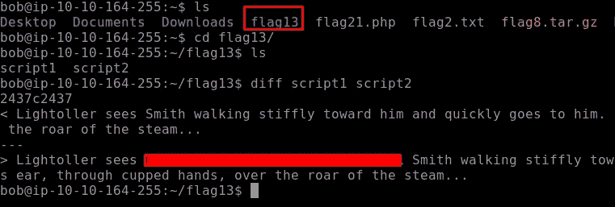****

****移动到下一个标志，即**标志 14** 。我们可以找到存储日志的标志，导航到 var/log 目录，如下所示。可以看到我们的 Flag14 被命名为 **flagtourteen.txt** ，里面有很多文字，你会在最后找到旗帜。为了简单起见，我使用了 **grep 3** 作为我的标志，其中包含数字 3。您可以跳过这个命令，因为它不是必需的****

****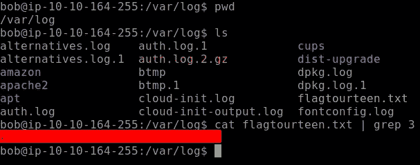****

****日志目录中的标志 14****

******Flag15** 可以在存储系统信息的地方找到，也可以在发布目录中找到。导航到这个目录，我们发现我们的标志 15。****

****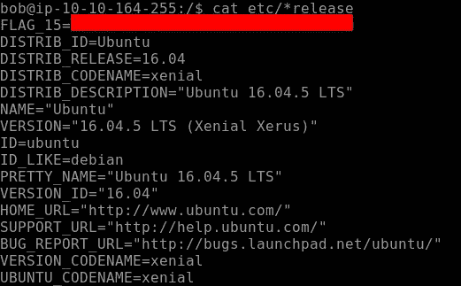****

****旗帜 15****

****继续下一面旗帜，即 16 号旗帜。它隐藏在文件系统的一个挂载中，通常位于介质目录中。让我们导航到这个目录。似乎有更多的目录，每个目录都有一个前缀“Flag16is ”,如下所示。****

****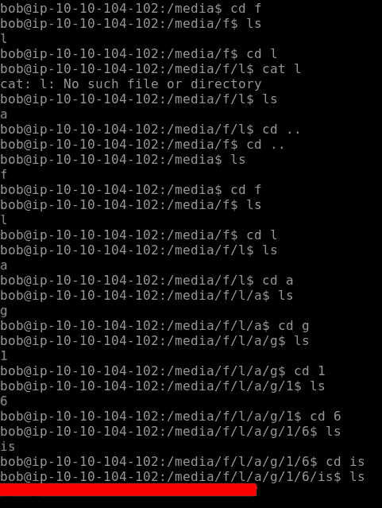****

****旗帜 16****

****爱丽丝的账户上发现了标记 17。所以让 ssh 进入 Alice 的帐户，她的密码是“TryHackMe123”。使用 **ls** 列出目录中的所有文件，在这里我们可以找到我们的标志，如下所示****

****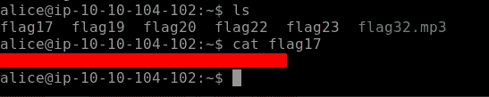****

****爱丽丝帐户:标志 17****

****继续我们的下一个隐藏标志，即 **Flag18，**它是隐藏的，所以我们使用 ls -la 列出所有隐藏的文件和目录。使用 **cat** 输出隐藏标志的结果****

****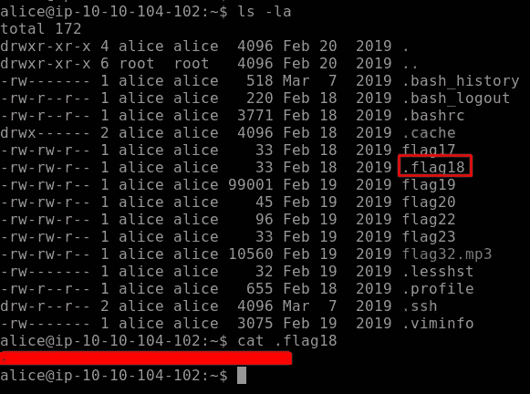****

****隐藏旗帜:旗帜 18****

****本部分的最后一个标志是 flag19。我们必须找到 2435 线，它将显示我们的标志 19。我们需要读取文件的特定行，因此我们将使用 sed。 **-n** 标志用于抑制不匹配的文本，而标志 **p** 用于打印匹配的行。****

****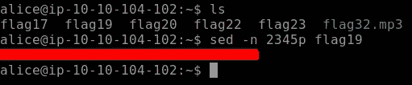****

****旗帜 19****

****至此，我们的**任务 3** 即 Linux 功能结束。[浏览此处](https://medium.com/bugbountywriteup/write-up-10-tryhackme-linux-challenges-part-2-d0e487ce932d)进入 Linux 挑战的第二部分****

****我希望你喜欢这个演示。在这台机器上练习这些命令，并尝试巩固您的知识。直到那时快乐的黑客；)****

# ****关于我****

****我是一名网络安全爱好者，正在攻读信息安全硕士学位，并试图进入全职网络安全职业生涯。你可以点击查看更多的文章和演练****