# 10 篇文章- TryHackMe- Linux 挑战第 2 部分

> 原文：<https://infosecwriteups.com/write-up-10-tryhackme-linux-challenges-part-2-d0e487ce932d?source=collection_archive---------0----------------------->

这篇文章是 Linux 挑战赛的 **P** [**art1**](https://medium.com/bugbountywriteup/write-up-10-tryhackme-linux-challenges-74408715ece4) 的延续

TryHackMe: Linux 挑战

所以从我们上一部分离开的地方继续。如果你觉得理解有困难，你可以在这里查看[**part 1**](https://medium.com/bugbountywriteup/write-up-10-tryhackme-linux-challenges-74408715ece4)

## [任务 4]数据表示、字符串和权限

这一节将主要关注数据在 Linux 系统上是如何表示的。除此之外，不要忘记使用搜索技巧，因为有些任务可能需要使用谷歌或任何其他参考资料进行独立研究。

我们在爱丽丝目录中找到了我们的 **Flag20** 。当我们捕捉输出时，我们发现内容是使用 base64 编码的，我们需要解码它。如下所示，我们可以通过查看字符集[A-Z，A-Z，0–9，+ /]来识别某个字符串是否是用 base64 编码的。因此，让我们解码字符串以获得我们的标志。使用以下命令解码 **cat flag20 | base64 —解码**

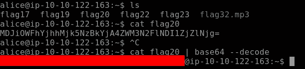

解码字符串以找出标志 20

继续我们的下一个**标志 21。**这个标志是一个 PHP 文件，通过使用 **less** 命令，我们找到了我们的标志，如下所示。**少**基本上一次输出一页文件的内容，类似于**多**但功能更多

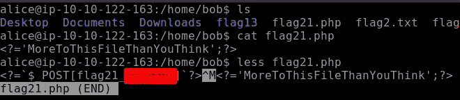

旗帜 21

当我们输出我们的 **Flag22，**的内容时，输出是十六进制格式。我们需要将它转换成如下所示的 ASCII 码。 **xxd** 创建文件的十六进制转储，并将十六进制转储转换回其原始二进制

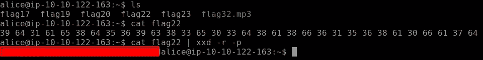

旗帜 22

通过颠倒在 Flag23 内容中找到的字符串的顺序，很容易找到 Flag23 ,如下所示

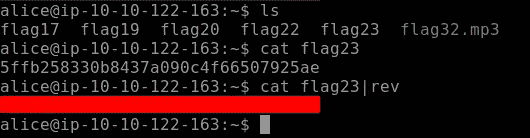

反向字符串

**Flag24** 是一个 c 程序文件。我们将使用命令**字符串**，以便显示人类可读的字符串

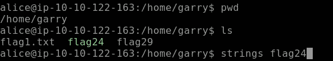

用于人类可读输出的字符串命令

在我们使用字符串命令之后，我们得到了我们的 **Flag24** ，如下所示

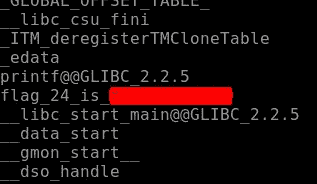

标志 24

根据任务挑战**标志 25** 不存在，因此我们将转到下一个，即**标志 26。**

定位 flag26 有点困难，因为我们需要找到一个 32 个字符长、以 4bceb 开头的字符串。因此，这里我们将结合使用 find 命令和 grep，如下所示。

标志 26

继续我们的下一个**标志 27。Flag27** 由 root 用户拥有，因此我们需要知道是否允许 Alice 执行某些命令来提取 Flag27 的输出。所以这里我们使用 Sudo -l，它会告诉我用户 Alice 可以执行哪些命令，如下所示。因此，运行 root 用户 Alice 允许的命令，我们得到我们的 F **lag27**

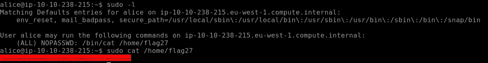

旗帜 27

接下来，我们需要找到可以使用 uname 命令获得的内核版本，如下所示。uname 用于显示系统版本、操作系统等信息。 **-r** 标志显示内核版本，如下所示

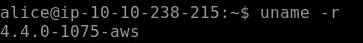

内核发布信息

我们需要删除文件和行中的所有空格，用逗号将它们分开，以获得我们的最终标志，即该部分的 Flag29。如下图所示， **tr** 用于翻译或删除字符，在我们的例子中是空格

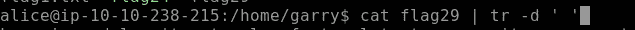

使用 tr 删除空格

一旦空格被删除，我们可以得到我们的**标志 29** ，如下图所示

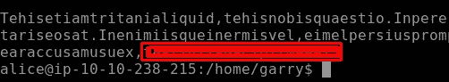

旗帜 29

## [任务 5] SQL、FTP、组和 RDP

这项任务的挑战包括通过寻找标志，下载和传输文件到您的本地系统玩数据库。所以让我们开始吧

我们需要为当前任务找到第一个标志，即标志 30。我们需要查找本地主机上运行的任何服务。命令 curl 在这里会派上用场。curl 是一个工具，用于使用不同的支持协议向服务器传输数据或从服务器传输数据。在当前场景中使用 curl，我们可以找到我们的旗帜

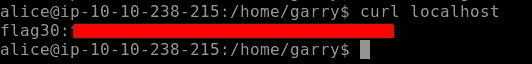

旗帜 31

为了找到我们的 Flag31，我们需要登录数据库。数据库的凭据已经给定。登录数据库，使用命令**显示数据库；**它将列出整个数据库，在这里我们找到了 **Flag31**

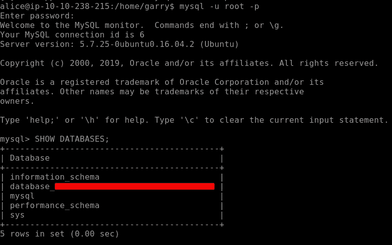

数据库中的标志 31

数据库中隐藏着一个奖金标志。为此，我们导航到前面找到的数据库。在该数据库下有一个名为 **flag** 的表格，让我们访问它来找到我们的奖金标志，如下所示

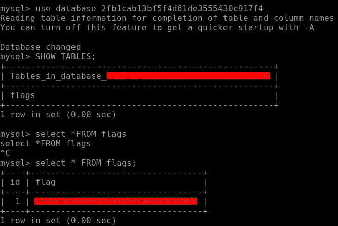

数据库中的奖金标志

下一个标志是一个 mp3 文件，需要下载到我们的本地系统，看看里面有什么。我们可以使用 SCP(安全拷贝)或 Filezilla 下载。我更喜欢用 SCP。你可以通过谷歌搜索找到 SCP 的语法

我们通过导航到获得我们的**标志 33** 。存储个人路径的配置文件，如下所示

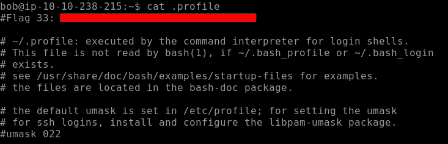

旗帜 33

让我们切换到鲍勃的帐户，使用 **env** 或 **printenv** 输出环境变量，这将打印所有的环境变量，如下所示。我们在这里找到了我们的旗帜

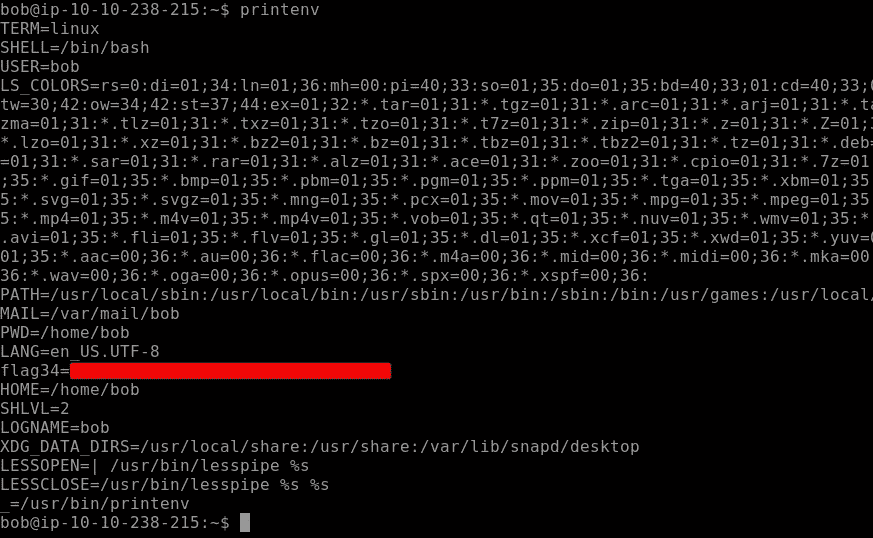

在环境变量中找到 Flag34

我们需要查看在系统上创建所有组的位置。使用 **getent group** 命令来实现这一点，请注意，我将 grep 与该命令结合使用，以便获得特定的结果。我们发现我们的标志 35 如下所示

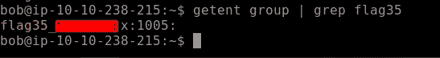

标志 35

这一部分的最后一个标志与前面的命令相关。在这个具有挑战性的任务中，我们需要找到**黑客组织**中的用户。通过这个，我们将得到我们最后的旗帜。我们使用与显示系统上所有组相同的命令，并导航到特定用户以找到我们的 Flag36，如下所示

标志 36

## 结束语

我们的 Linux 挑战到此结束。这个挑战包含了系统管理员、道德黑客、Pentesters 等经常使用的 Linux 命令。如果你想学习更多关于 Linux 命令、工具、服务和文件系统的知识，请加入 [**学习 Linux**](https://tryhackme.com/room/zthlinux)Room on**TryHackMe**。

我希望你喜欢这篇文章。如果你在寻找更多的练习，并对你刚刚学到的 Linux 技能感到舒适，那么就跳进 [**Kenobi**](https://tryhackme.com/room/kenobi) 吧，这也是一个基于 Linux 的易受攻击的盒子，可以在 TryHackMe 平台上找到，在那里你可以测试你的技能。你可以在这里跟随 [**克诺比写/走**](https://medium.com/infosec-beacon/write-up-09-tryhackme-kenobi-afc2dccd40a2) ，直到那时继续练习快乐黑客；)

# 关于我

我是一名网络安全爱好者，正在攻读信息安全硕士学位，并试图进入全职网络安全职业生涯。您可以点击这里阅读更多文章和演练