# 书面陈述 11-常见的 Linux 权限提升

> 原文：<https://infosecwriteups.com/write-up-11-common-linux-privilege-escalation-92528853b616?source=collection_archive---------0----------------------->

这个初学者友好的演练基于 TryHackMe 平台房间" [**普通 Linux 权限提升**](https://tryhackme.com/room/commonlinuxprivesc) "

在我之前的 [**文章**](https://medium.com/bugbountywriteup/write-up-10-tryhackme-linux-challenges-74408715ece4) 中，我们学习了一些 Linux 命令、Linux 文件系统、文件权限、工具和服务。我们还利用了一台 [**易受攻击的 Linux 机器**](https://medium.com/bugbountywriteup/write-up-09-tryhackme-kenobi-afc2dccd40a2) 使用了不同的涉及权限提升的技术。

## 常见的 Linux 权限提升

在本演练中，我们将深入探讨一些常见的 Linux 权限提升和技术，它们将在渗透测试或玩[**【CTF】(捕捉旗帜)**](https://medium.com/bugbountywriteup/write-up-03-tryhackme-simple-ctf-e02495e74def) 挑战时派上用场。

## 先决条件

虽然房间里有每个主题的详细解释，但预先的知识会让你更容易、更清楚地理解这些概念

1.  了解 SSH，列出、复制和写入文件
2.  对 Linux 文件系统、文件权限等有基本的了解

我会鼓励你们自己去探索挑战，自己去完成任务，如果你遇到了困难，可以参考这篇文章。即使你不能进入这个房间，这个演练也是学习 Linux 特权提升中使用的一些技术的好方法

## 【任务 1】[入门](https://medium.com/@anon_7/getting-started-with-tryhackme-52f2cc7eb9aa)

让我们从通过 OpenVPN 连接到 THM 的网络开始。根据终端上的接口 tun0 或 tun1 验证您的 IP 地址

## [任务 2]了解权限提升

在我们着手解决任务之前，让我们了解什么是权限提升。它在系统级别上从较低的权限向较高的权限前进。通常，某些路径或文件的漏洞或权限会导致权限提升。权限提升允许执行某些命令，而如果用户权限较低，这些命令是不可能执行的。权限提升允许破解密码、绕过访问控制、更改配置等

在即将到来的挑战中，我们将尝试使用不同的技术来提升我们的特权

**【任务 3】权限提升方向**

有两种类型的权限提升**水平**和**垂直。**在**横向升级**中，你从一个用户转移到另一个用户。在这种情况下，两个用户都是普通用户，而在**垂直**方法中，我们将我们的权限从普通用户提升到**管理员**

## [任务 4]枚举

为了有效的枚举和节省时间，我们将讨论一个有用的工具。 [**LinEnum**](https://www.linkedin.com/pulse/linenum-linux-enumeration-privilege-escalation-tool-prawez/) 是执行普通权限提升的脚本。你可以在这里 **得到这个 [**剧本。**有两种方法可以在目标机器上获得这个脚本。](https://github.com/rebootuser/LinEnum/blob/master/LinEnum.sh)**

**方法一**

只需从上面提供的链接中复制并粘贴原始脚本，并将其保存在您的目标机器上

**方法二**

运行一个简单的 **python HTTP** 服务器，将文件从本地机器传输到目标机器。在你的目标机器上使用 **wget** 从本地机器获取文件，如下图所示

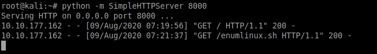

在本地机器上运行简单的 HTTP 服务器

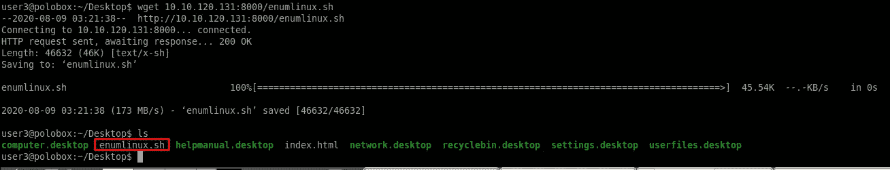

使用 wget 将所需文件从本地机器提取到目标机器

**LinEnum** 输出重要信息，如内核信息、SUID 信息、读/写敏感文件和 crontab 信息。一旦运行该工具来提取特定信息，您将会对它有更多的了解。

现在让我们使用凭证**user 3:password**ssh 到目标机器，如下所示

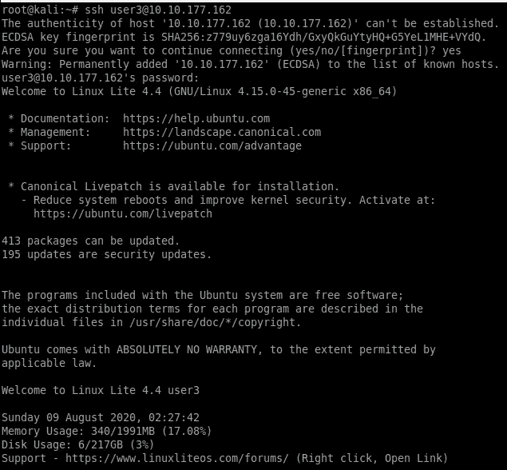

通过 User3 到目标机器

我们需要找出我们刚刚登录的机器的主机名。使用命令**主机名**了解机器的名称

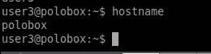

主机名

接下来，我们需要找出系统中有多少用户[x]。我们可以通过检查我们的 etc/passwd 文件来发现这一点，该文件包含当前系统上所有可用用户密码的散列。

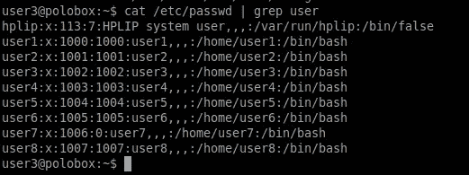

当前可用用户[x]

要知道当前的 shell 数量，导航到，**etc/shell**路径，并使用如下所示的 **cat** 命令输出内容

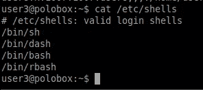

etc/shell 中可用的 shell

让我们在 crontab 中找出计划每 5 分钟运行一次的 bash 脚本。为此，我们需要在/etc/crontab 路径下输出文件。

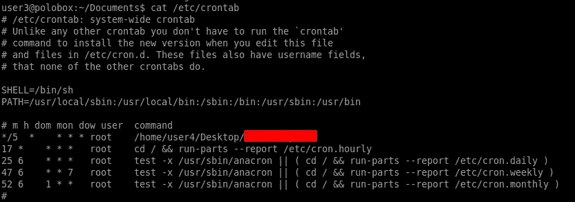

crontab 文件中存在的 CronJobs

如果您运行了 **LinEnum** ，您可能会发现哪些关键文件的权限发生了变化，因为哪些用户可能会对其拥有权限。

其读/写权限被更改的关键文件

至此，我们结束了我们的**任务 4。**记住列举的结果，因为我们接下来的任务将会用到这些信息

## [任务 5]滥用 SUID/GUID 文件

提升我们特权的另一种方式是滥用 SUID/GUID 文件。这些是授予用户执行特定命令或执行特定管理级别配置/操作的特殊权限。该权限可能会被利用，并导致权限的纵向提升。文件有一定权限，如读(r)、写(w)和执行(x)。SUID 由文件旁边的符号表示，该符号表示授予了用户特殊权限。您可以在房间中了解有关 SUID/GUID 权限的更多信息

我们需要知道**用户 3** 目录中拥有这种权限的文件。使用以下命令实现目标

> **find/-perm-u = s-type F2>2>/dev/null**

下面我们来分析一下这个命令

**查找** —用于查找文件

**/ —** 将搜索整个文件系统

**-perm** —根据权限进行搜索

**-u=s** —设置文件的权限模式

**-键入 f**-将仅搜索文件

**2 > /dev/null —** 将忽略错误

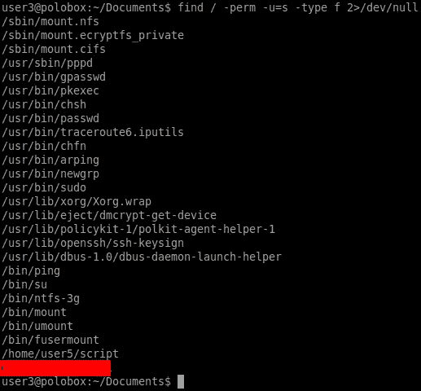

查找设置了 SUID 位的文件

我们需要执行在上一步中设置了 SUID 位的文件。让我们执行以获得 root 访问权限，如下所示

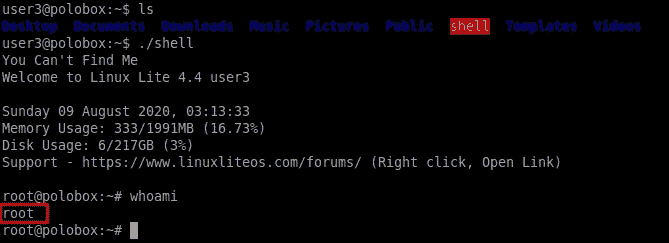

获得 Root 访问权限

我们的任务 5 到此结束

## [任务 6]利用可写/etc/passwd

使用 **LinEnum** 我们发现 **user7** 拥有对/etc/passwd 文件的可写权限，这意味着用户可以对文件进行更改。passwd 文件包含在系统上创建的用户的密码哈希。

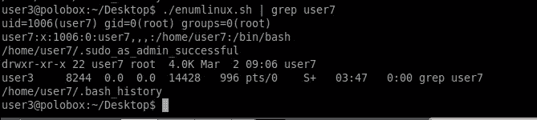

用户 7 拥有对 etc/passwd 的写权限

etc/passwd 包含如下所示的内容

> **用户:x:0:0:root:/root:/bin/bash**

所有字段由一个**冒号(；)**。第三个字段指示用户 ID。这里 **0** 表示**根用户**。

接下来，我们需要使用密码“**密码**”切换到**用户 7**

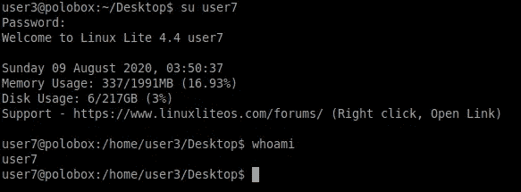

SSH 用户 7

我们正在执行的上报类型是纵向的，因为一个普通用户被用来获得根用户访问权限。

我们需要添加一个新用户，并给它 root 访问权限。为此，我们需要为创建的密码生成一个散列，以便它满足密码要求。为了创建散列，我们将使用 OpenSSL 库，它有广泛的用途，包括创建散列。

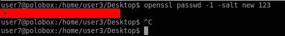

哈希创建

使用刚刚在 **etc/passwd** 文件末尾创建的散列添加一个新用户。我们可以看到一个名为“ **new** 的用户是用 root 权限创建的

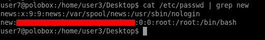

新用户创建

让我们使用之前设置的密码切换到我们的**新**用户。当我们切换到新用户时，我们会得到超级用户的提示，如下所示

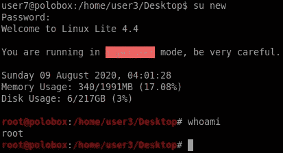

SSH 新用户

我们的**任务 6** 到此结束。

## [任务 7]转义 Vi 编辑器

要检查当前用户可以执行哪些命令，我们可以使用命令 **sudo -l 来**了解这一点。我们也可以通过 LinEnum 找到它，如下所示

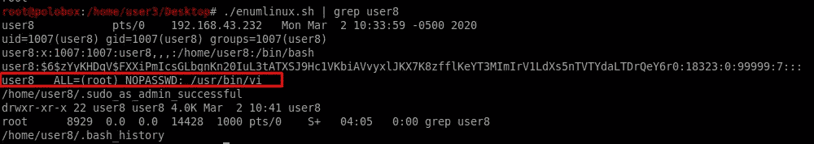

让我们首先切换到用户 8，如下所示

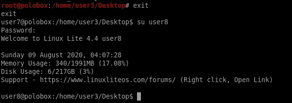

SSH 到用户 8

现在我们有了 user8 的 SSH，让我们看看 user8 可以执行哪些命令。我们知道 user8 可以使用 root 权限执行 vi 编辑器。

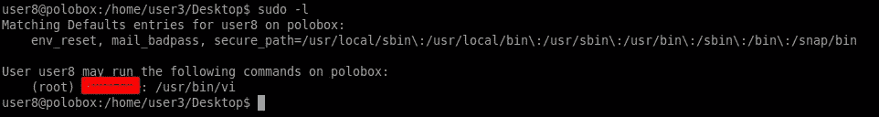

User8 执行 vi 编辑器的权限

我们需要做的就是运行 vi 编辑器，并在编辑器中输入以下命令来获得 root 访问权限。

> **:！sh**

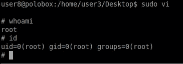

根访问

## [任务 8]利用 Crontab

在这个挑战中，我们尝试使用 cronjob 提升我们的权限。Cronjobs 是系统管理员使用的自动化脚本。Cronjobs 在用户指定的时间和日期执行命令。

我们需要将用户切换到用户 4

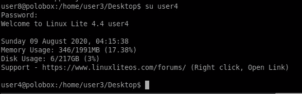

SSH 到用户 4

如前所述，我们在 crontab 中有一个 cronjob，它每 5 分钟运行一次。如果我们有一个可以成为 cronjob 的一部分的有效负载，并且当它执行时，我们将有一个根 shell，那会怎么样呢？

对于 POC，我们需要使用 **msfvenom 制作一个有效载荷。-p** 标志用于有效载荷，即一个**反向 netcat shell** ，带有我们的**本地主机 IP** 和**端口 8888**

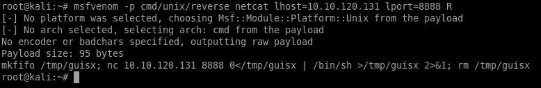

使用 msfvenom 创建有效负载

导航到**自动脚本**所在的目录。我们需要复制我们刚刚使用 msfvenom 创建的有效载荷

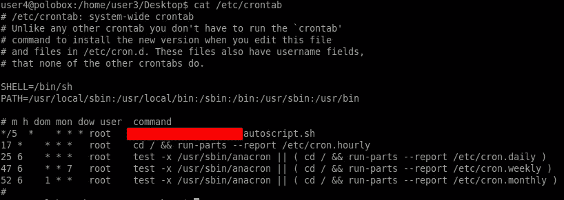

autoscript.sh 目录

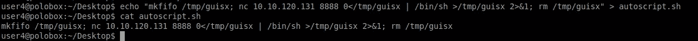

将有效负载复制到 autoscript.sh 脚本中

一旦完成，使用 **nc -lvp 8888** 监听进入的连接。我们得等 5 分钟让克隆人工作。五分钟过去后，我们得到了一个反向的外壳。请注意，我们得到了如下所示的根外壳

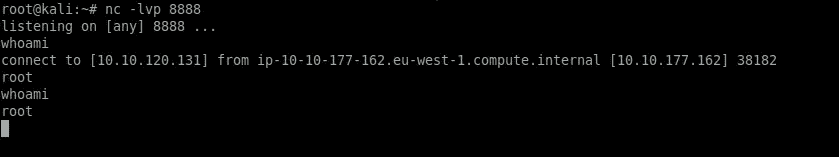

反向根壳

## [任务 9]利用路径变量

在我们的最后一个任务中，我们将利用 **PATH** 变量来获得对目标机器的根访问。PATH 是一个包含可执行文件的环境变量。

我们将编辑我们选择的路径变量，并指示它运行特定的命令。为此，我们需要切换到 user5 并运行脚本命令。一旦我们运行这个命令，我们就会知道脚本列出了当前目录中的所有文档，这与命令 **ls 是一样的。**

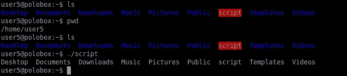

执行脚本

让我们切换到 tmp 目录，创建一个在 ls 命令执行时运行的可执行文件。如下所示，我们制作了一个 bash 可执行外壳，并赋予了它可执行的权限

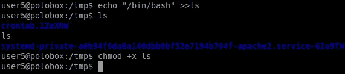

现在我们需要改变路径变量，如下所示。只要我们运行 ls 命令，它就会将我们带到根 shell。

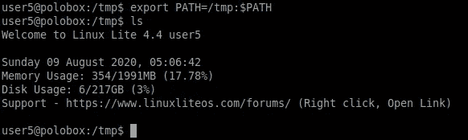

至此，我们的最终任务结束。我注意到，在与 Linux 机器交互时，有许多方法可以提升您的权限。上面已经解释的方法/技术通常用于权限提升。

我希望你喜欢这篇文章。请记住练习您在本演练中学到的工具和技术，以巩固您的知识。直到那时快乐的黑客；)

# 关于我

我是一名网络安全爱好者，正在攻读信息安全硕士学位，并试图进入全职网络安全职业生涯。你可以点击这里阅读更多的文章和演练